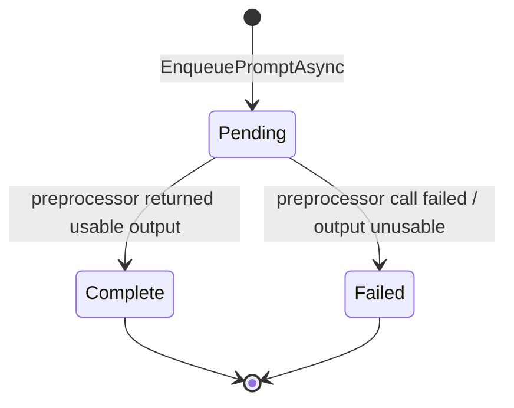
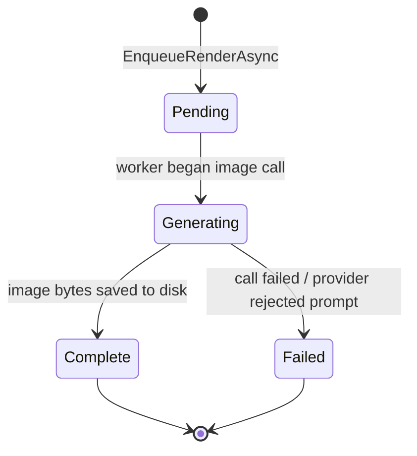

# Data Model: Scene Image Generator

**Branch**: `001-scene-image-generator`  
**Date**: 2026-08-19

---

## Modified Entities

### AppFunction (enum) — DreamGenClone.Domain/ModelManager/AppFunction.cs

Append two new values at the end of the existing enum. Enum values are persisted as the string name via `AppFunction.ToString()` (not as integers), matching the existing convention.

| Existing values | (unchanged) RolePlayGeneration … RolePlayEncounterDetection |
|---|---|
| **NEW** | **`RolePlaySceneImagePreprocessor`** — text LLM that drafts/refines the editable image prompt from scene context |
| **NEW** | **`RolePlaySceneImage`** — image generation model that renders the prompt into an image |

**Change**: Append the two members. No existing value changes.

---

### Provider (class) — DreamGenClone.Domain/ModelManager/Provider.cs

Three new additive properties. Defaults preserve existing-row behavior (non-image, standard path, unknown policy).

| Property | Type | SQLite Column | Default | Notes |
|---|---|---|---|---|
| **`ImageCapability`** | `ImageProviderCapability` (int) | `ImageCapability INTEGER NOT NULL DEFAULT 0` | `None` | Does this provider expose an image-generation endpoint? |
| **`ImageGenerationPath`** | `string` | `ImageGenerationPath TEXT NOT NULL DEFAULT '/v1/images/generations'` | `"/v1/images/generations"` | Path appended to `BaseUrl` for image calls |
| **`ContentPolicy`** | `ImageContentPolicy` (int) | `ContentPolicy INTEGER NOT NULL DEFAULT 0` | `Unknown` | Adult-content policy; `Unknown` fails fast at resolution |

No existing properties change.

---

### RegisteredModel (class) — DreamGenClone.Domain/ModelManager/RegisteredModel.cs

Two new additive properties.

| Property | Type | SQLite Column | Default | Notes |
|---|---|---|---|---|
| **`ModelKind`** | `ModelKind` (int) | `ModelKind INTEGER NOT NULL DEFAULT 0` | `Text` | Text vs. image model; gates the function-default dropdown filter |
| **`ImageSizeSupported`** | `string?` | `ImageSizeSupported TEXT NULL` | `null` | Free-text informational (e.g. `"1024x1024"`) |

No existing properties change.

---

### WorkspaceSettingsState (class) — DreamGenClone.Web/Domain/RolePlay/WorkspaceSettingsState.cs

Four new additive properties (session image defaults). Persisted with the session.

| Property | Type | Default | Notes |
|---|---|---|---|
| **`ImageGenerationEnabled`** | `bool` | `true` | Master on/off; hides the workspace "Generate image" trigger when false |
| **`ImageStyleSuffix`** | `string?` | `null` | Free-text style cue (e.g. `"cinematic lighting, 35mm"`) seeding the studio |
| **`ImageSize`** | `string` | `"1024x1024"` | Default image size |
| **`AllowExplicitImage`** | `bool` | `false` | Honored only when the resolved provider policy is adult-allowed |

---

## New Entities

### ImageProviderCapability (enum) — DreamGenClone.Domain/ModelManager/ImageProviderCapability.cs

| Value | Name | Meaning |
|---|---|---|
| 0 | `None` | Text chat only (default for existing LM Studio / OpenRouter rows) |
| 1 | `TextAndImage` | Hosts both chat and image models (e.g. Together AI) |
| 2 | `ImageOnly` | Dedicated image endpoint/provider |

### ImageContentPolicy (enum) — DreamGenClone.Domain/ModelManager/ImageContentPolicy.cs

| Value | Name | Meaning |
|---|---|---|
| 0 | `Unknown` | Not configured — image resolution fails fast with guidance |
| 1 | `SfwFiltered` | Provider filters/blocks adult content (e.g. default cloud tier) |
| 2 | `AdultAllowed` | Provider allows adult content (e.g. adult-approved account) |
| 3 | `AdultAllowedConfigurable` | Provider permits adult via account/flag — surfaced in UI for confirmation |

### ModelKind (enum) — DreamGenClone.Domain/ModelManager/ModelKind.cs

| Value | Name | Meaning |
|---|---|---|
| 0 | `Text` | Text completion model (default) |
| 1 | `Image` | Image generation model |

### ResolvedImageModel (record) — DreamGenClone.Domain/ModelManager/ResolvedImageModel.cs

Immutable value object mirroring `ResolvedModel` but for image calls.

| Property | Type | Notes |
|---|---|---|
| `ProviderBaseUrl` | `string` | From `Provider.BaseUrl` |
| `ImageGenerationPath` | `string` | From `Provider.ImageGenerationPath` |
| `ProviderTimeoutSeconds` | `int` | From `Provider.TimeoutSeconds` |
| `ApiKeyEncrypted` | `string?` | From `Provider.ApiKeyEncrypted` (DPAPI-encrypted) |
| `ModelIdentifier` | `string` | From `RegisteredModel.ModelIdentifier` |
| `ContentPolicy` | `ImageContentPolicy` | From `Provider.ContentPolicy` |
| `ProviderName` | `string` | From `Provider.Name` |
| `IsSessionOverride` | `bool` | True when a session override was used |

### SceneImagePromptStatus (enum) — DreamGenClone.Domain/RolePlay/SceneImagePromptRecord.cs

| Value | Name | Meaning |
|---|---|---|
| 0 | `Pending` | Job enqueued, preprocessor not yet run |
| 1 | `Complete` | Preprocessor returned a usable prompt |
| 2 | `Failed` | Preprocessor call failed or returned unusable output |

### SceneImagePromptRecord (class) — DreamGenClone.Domain/RolePlay/SceneImagePromptRecord.cs

The editable prompt draft for an interaction.

| Property | Type | SQLite Column | Notes |
|---|---|---|---|
| `Id` | `string` | `TEXT PRIMARY KEY` | GUID |
| `SessionId` | `string` | `TEXT NOT NULL` | FK-ish to session |
| `InteractionId` | `string` | `TEXT NOT NULL` | The interaction this prompt depicts |
| `SettingsJson` | `string` | `TEXT NOT NULL` | Snapshot of `SceneImageStudioSettings` used |
| `InputExcerpt` | `string` | `TEXT NOT NULL` | Passage pulled from the interaction |
| `OutputPrompt` | `string` | `TEXT NOT NULL` | Editable image prompt from the preprocessor |
| `Status` | `SceneImagePromptStatus` (int) | `INTEGER NOT NULL` | Pending/Complete/Failed |
| `ModelIdentifier` | `string?` | `TEXT NULL` | Preprocessor model used |
| `ErrorMessage` | `string?` | `TEXT NULL` | Set when `Failed` |
| `CreatedUtc` | `DateTime` | `TEXT NOT NULL` | ISO-8601 |
| `UpdatedUtc` | `DateTime` | `TEXT NOT NULL` | ISO-8601 |

### SceneImageStatus (enum) — DreamGenClone.Domain/RolePlay/SceneImageRecord.cs

| Value | Name | Meaning |
|---|---|---|
| 0 | `Pending` | Job enqueued, image model not yet called |
| 1 | `Generating` | Worker has started the image call |
| 2 | `Complete` | Image bytes saved to disk |
| 3 | `Failed` | Image call failed or provider rejected the prompt |

### SceneImageRecord (class) — DreamGenClone.Domain/RolePlay/SceneImageRecord.cs

A rendered image for an interaction.

| Property | Type | SQLite Column | Notes |
|---|---|---|---|
| `Id` | `string` | `TEXT PRIMARY KEY` | GUID |
| `SessionId` | `string` | `TEXT NOT NULL` | FK-ish to session |
| `InteractionId` | `string` | `TEXT NOT NULL` | The interaction this image illustrates |
| `PromptRecordId` | `string` | `TEXT NOT NULL` | FK to `SceneImagePrompts.Id` |
| `PromptSnapshot` | `string` | `TEXT NOT NULL` | Exact prompt text sent to the image model |
| `Status` | `SceneImageStatus` (int) | `INTEGER NOT NULL` | Pending/Generating/Complete/Failed |
| `FileRelativePath` | `string?` | `TEXT NULL` | Relative path under scene-image root (`{sessionId}/{imageId}.png`) |
| `ModelIdentifier` | `string?` | `TEXT NULL` | Image model used |
| `ProviderName` | `string?` | `TEXT NULL` | Provider used |
| `ContentPolicy` | `ImageContentPolicy` (int) | `INTEGER NOT NULL` | Policy at generation time |
| `ImageSize` | `string?` | `TEXT NULL` | Size used (e.g. `"1024x1024"`) |
| `Style` | `string?` | `TEXT NULL` | Style used (e.g. `"realistic"`) |
| `ErrorMessage` | `string?` | `TEXT NULL` | Set when `Failed` |
| `RegenerateOfId` | `string?` | `TEXT NULL` | Parent image id when this is a regenerate |
| `CreatedUtc` | `DateTime` | `TEXT NOT NULL` | ISO-8601 |
| `StartedUtc` | `DateTime?` | `TEXT NULL` | When the worker began the image call |
| `CompletedUtc` | `DateTime?` | `TEXT NULL` | When the image was saved |
| `UpdatedUtc` | `DateTime` | `TEXT NOT NULL` | ISO-8601 |

---

## New DTOs — DreamGenClone.Application/RolePlay/Models/ (or DreamGenClone.Web/Application/RolePlay/Models/)

### SceneImageStudioSettings

| Property | Type | Default | Notes |
|---|---|---|---|
| `Style` | `string` | `"realistic"` | realistic / cinematic / anime / cartoon / painterly / sketch / … |
| `ImageSize` | `string` | `"1024x1024"` | Provider-agnostic size string |
| `AspectRatio` | `string?` | `null` | Optional aspect override |
| `AllowExplicitImage` | `bool` | `false` | Honored only when provider policy is adult-allowed |

### ScenePromptRequest

| Property | Type | Notes |
|---|---|---|
| `SessionId` | `string` | Required |
| `InteractionId` | `string` | Required |
| `Settings` | `SceneImageStudioSettings` | Required |
| `ExcerptOverride` | `string?` | Optional user-selected passage |

### SceneRenderRequest

| Property | Type | Notes |
|---|---|---|
| `SessionId` | `string` | Required |
| `InteractionId` | `string` | Required |
| `PromptRecordId` | `string` | Required |
| `Prompt` | `string` | Final (possibly edited) prompt text |
| `ImageSize` | `string?` | Optional override |
| `RegenerateOfId` | `string?` | Parent image id when regenerating |

---

## SQLite Schema Changes

### Providers table — ALTER TABLE (existing databases)

```sql
ALTER TABLE Providers ADD COLUMN ImageCapability INTEGER NOT NULL DEFAULT 0;
ALTER TABLE Providers ADD COLUMN ImageGenerationPath TEXT NOT NULL DEFAULT '/v1/images/generations';
ALTER TABLE Providers ADD COLUMN ContentPolicy INTEGER NOT NULL DEFAULT 0;
```

Applied via the existing guarded column-existence migration pattern in `SqlitePersistence.cs` (using `pragma_table_info`). Existing rows inherit the defaults (non-image, standard path, unknown policy) — which is correct: existing chat providers are not image-capable until the user explicitly sets it.

### RegisteredModels table — ALTER TABLE (existing databases)

```sql
ALTER TABLE RegisteredModels ADD COLUMN ModelKind INTEGER NOT NULL DEFAULT 0;
ALTER TABLE RegisteredModels ADD COLUMN ImageSizeSupported TEXT NULL;
```

Existing rows default to `ModelKind = Text` (correct — all current models are text models).

### Providers / RegisteredModels — CREATE TABLE (fresh installs)

Update the existing `CREATE TABLE IF NOT EXISTS` statements to include the new columns with the same defaults.

### SceneImagePrompts table — NEW

```sql
CREATE TABLE IF NOT EXISTS SceneImagePrompts (
    Id               TEXT PRIMARY KEY,
    SessionId        TEXT NOT NULL,
    InteractionId    TEXT NOT NULL,
    SettingsJson     TEXT NOT NULL,
    InputExcerpt     TEXT NOT NULL,
    OutputPrompt     TEXT NOT NULL,
    Status           INTEGER NOT NULL,
    ModelIdentifier  TEXT NULL,
    ErrorMessage     TEXT NULL,
    CreatedUtc       TEXT NOT NULL,
    UpdatedUtc       TEXT NOT NULL
);
CREATE INDEX IF NOT EXISTS IX_SceneImagePrompts_SessionInteraction
    ON SceneImagePrompts(SessionId, InteractionId);
```

### SceneImages table — NEW

```sql
CREATE TABLE IF NOT EXISTS SceneImages (
    Id               TEXT PRIMARY KEY,
    SessionId        TEXT NOT NULL,
    InteractionId    TEXT NOT NULL,
    PromptRecordId   TEXT NOT NULL,
    PromptSnapshot   TEXT NOT NULL,
    Status           INTEGER NOT NULL,
    FileRelativePath TEXT NULL,
    ModelIdentifier  TEXT NULL,
    ProviderName     TEXT NULL,
    ContentPolicy    INTEGER NOT NULL,
    ImageSize        TEXT NULL,
    Style            TEXT NULL,
    ErrorMessage     TEXT NULL,
    RegenerateOfId   TEXT NULL,
    CreatedUtc       TEXT NOT NULL,
    StartedUtc       TEXT NULL,
    CompletedUtc     TEXT NULL,
    UpdatedUtc       TEXT NOT NULL
);
CREATE INDEX IF NOT EXISTS IX_SceneImages_Session ON SceneImages(SessionId);
CREATE INDEX IF NOT EXISTS IX_SceneImages_Interaction ON SceneImages(SessionId, InteractionId);
```

No foreign-key constraints are declared (the repo uses logical FKs, not enforced FKs — consistent with existing tables). `PromptRecordId` is a logical FK to `SceneImagePrompts.Id`.

---

## Validation Rules

| Field | Rule |
|---|---|
| `Provider.ContentPolicy` | Must not be `Unknown` for any provider used to render images — `ResolveImageModelAsync` fails fast with guidance. |
| `RegisteredModel.ModelKind` | Must be `Image` for any model assigned to `RolePlaySceneImage` — `ResolveImageModelAsync` fails fast. |
| `Provider.ImageCapability` | Must not be `None` for any provider used to render images — `ResolveImageModelAsync` fails fast. |
| `SceneImageStudioSettings.Style` | Non-empty string; preset values validated at the UI layer (free-text allowed). |
| `SceneImageStudioSettings.ImageSize` | Non-empty string matching a provider-supported size (informational check; the provider is the final authority). |
| `SceneImagePromptRecord.OutputPrompt` | Must be non-empty and ≤ ~2000 chars after parsing; otherwise the record is `Failed` with an explicit error (never silently empty). |
| `SceneImageRecord.PromptSnapshot` | Must be non-empty (the exact text sent to the image model). |
| `SceneImageRecord.FileRelativePath` | Required when `Status == Complete`; must be null otherwise. |
| `SceneImageRecord.ErrorMessage` | Required when `Status == Failed`; must be null otherwise. |

---

## State Transitions

### SceneImagePromptRecord.Status



### SceneImageRecord.Status



Both transitions are driven by the background job handlers and stamp `UpdatedUtc` (and `StartedUtc`/`CompletedUtc` for images). Transitions are monotonic forward — no record moves from `Complete`/`Failed` back to `Pending`/`Generating`. A regenerate creates a **new** `SceneImageRecord` with `RegenerateOfId` pointing at the parent; the parent's status is never mutated.
