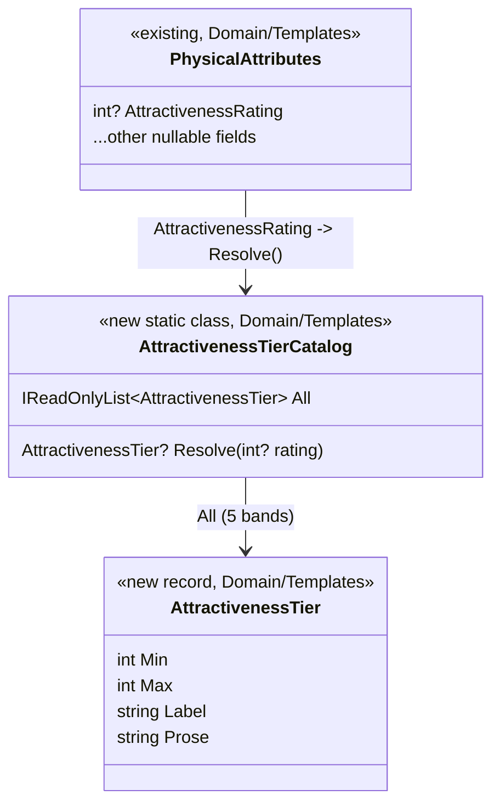

# Data Model: Attractiveness Tier Catalog

**Branch**: `079-attractiveness-tier-catalog` | **Date**: 2026-08-12
**Status**: Phase 1 output. Static code-defined catalog — no persisted store, no migration.

## Overview

The feature introduces two new Domain-layer types and reuses one existing field. There is **no database change**: `AttractivenessRating` already persists as `int?` inside the `PhysicalAttributes` JSON payload (FR-011 explicit SQLite exception — static, code-defined catalog with no runtime-persisted data).

## Entities

### 1. `AttractivenessTier` (new — `DreamGenClone.Domain.Templates`)

A single rating band. Positional record (matches `SeductionArchetype`/`BehavioralDimension` catalog style).

| Field | Type | Rules |
|-------|------|-------|
| `Min` | `int` | Band lower bound; within 1–10; `Min <= Max`. |
| `Max` | `int` | Band upper bound; within 1–10. |
| `Label` | `string` | One of exactly: `Striking`, `Attractive`, `Average`, `Plain`, `Repelling`. Non-empty. |
| `Prose` | `string` | Effect-based, gender-neutral prose. **Must contain ≥1 physical descriptor AND ≥1 behavioral-cue sentence** (how others react). |

The five instances (ordered low→high, non-overlapping, union = 1–10):

| Min | Max | Label | Prose shape |
|-----|-----|-------|-------------|
| 9 | 10 | Striking | Standout features / magnetic symmetry + turns heads, people flustered/nervous, attention follows them, presence felt before they speak |
| 7 | 8 | Attractive | Genuinely good-looking, well-kept + lingering looks, easy smiles, people warmer/more attentive |
| 5 | 6 | Average | Unremarkable, ordinary features + blends in, no particular attention, neutral interactions |
| 3 | 4 | Plain | Forgettable, somewhat off-putting + no notice, neutral-to-negative presence |
| 1 | 2 | Repelling | Strikingly unattractive, neglected/unappealing + people avoid eye contact, presence works against them |

Full draft prose: see `contracts/contracts.md` (Contract 2).

### 2. `AttractivenessTierCatalog` (new — `DreamGenClone.Domain.Templates`)

Static, code-defined reference catalog (analogous to `PhysicalAttributesCatalog`; resolve pattern analogous to `BehavioralDimensionCatalog.ResolveTierText`).

| Member | Signature | Contract |
|--------|-----------|----------|
| `All` | `static readonly IReadOnlyList<AttractivenessTier>` | Exactly 5 bands, ordered low→high, non-overlapping, covering 1–10. Fixed at compile time. |
| `Resolve` | `static AttractivenessTier? Resolve(int? rating)` | `null` → `null`. Rating outside 1–10 → `null`. Otherwise the unique band where `Min <= rating <= Max`. Deterministic; no side effects. |

Resolve mapping table (automated test — SC-001):

| Rating | Band |
|--------|------|
| 10, 9 | Striking |
| 8, 7 | Attractive |
| 6, 5 | Average |
| 4, 3 | Plain |
| 2, 1 | Repelling |
| `null`, 0, 11, negative | `null` (no tier → line omitted) |

### 3. `PhysicalAttributes.AttractivenessRating` (existing — `DreamGenClone.Domain.Templates`)

`int?` (1–10), already persisted. **Unchanged.** The feature reads it; the catalog maps it; the formatter renders it. No new storage.

## Validation rules (enforced by automated tests)

1. **Band count & coverage**: exactly 5 bands; `Min`/`Max` within 1–10; ranges non-overlapping; union covers 1–10 with no gaps.
2. **Label contract**: labels are exactly the five canonical labels, unique and non-empty.
3. **Prose contract** (SC-002): every `Prose` contains at least one physical descriptor and at least one behavioral-cue sentence. Implemented as keyword/pattern assertions per band (see `contracts/contracts.md` §Prose cue lexicon) so the test is robust to prose wording changes.
4. **Resolve contract**: all 10 ratings map to the correct band; boundary ratings (1, 3, 5, 7, 9) map exactly; adjacent bands don't bleed (6 vs 7, 8 vs 9); `null` and out-of-range (0, 11, negative) return `null`.
5. **Determinism**: `Resolve` is pure — identical input yields identical output; no stat/cache/global state.

## State transitions

**N/A.** The catalog is stateless. It is a pure lookup, not a state machine. No willingness/stats/gate formulas are touched (FR-009).

## Formatter rendering (integration contract)

`PhysicalAttributesFormatter.FormatBlock(attrs, gender)` — the only consumer change:

- Rating resolves to a tier → append `Attractiveness: n/10 — <Label>: <prose>` as the attractiveness entry in the `Appearance — ...` block (field order unchanged; prose is additive after `n/10`).
- Rating `null` or out-of-range → attractiveness entry omitted (block renders as today for all other fields).
- No fallback/substitute prose anywhere in the formatter (FR-006).
- Applies identically to persona, Husband, Wife, OtherMan, NPC — all genders (FR-007/FR-008) via the single existing formatter path (4 call sites: `CharacterDataSlot`, `RolePlayContinuationService`, `InteractionRetryService`; all already pass `(attrs, gender)`).
