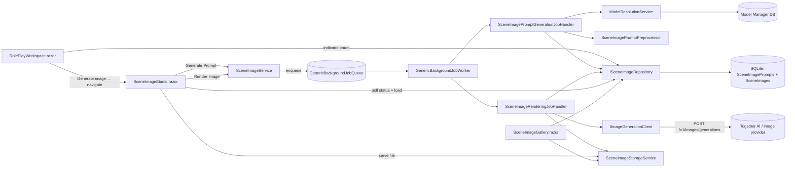

# B-032 — Scene Image Generator Engine

**State:** `new` (design draft — pending approval to move to `designed`)
**Priority:** low
**Scope:** large
**Plan author:** Copilot session 2026-08-19 (refined 2026-08-22)
**Backlog ref:** `specs/Planning/backlog.md` → B-032

---

## 1. Overview

An engine that generates images for roleplay scenes. The user selects a narrative interaction in
the RP workspace, clicks **Generate image**, and a dedicated **Image Studio** screen opens. The
studio runs a **two-stage pipeline**:

1. **Pre-processor stage** — a text LLM (function `RolePlaySceneImagePreprocessor`) consumes the
   selected interaction, the scene's overall atmosphere (setting, time of day, phase, characters,
   resolved intensity), and the user's image settings (style, size, explicitness). It **pulls the
   exact part of the interaction to depict** and produces an **editable image prompt**.
2. **Render stage** — the image model (function `RolePlaySceneImage`) receives the (editable)
   prompt and returns an image, which is saved to disk and persisted.

The studio supports **iterative refinement**: edit the prompt, change style/size, or ask the
pre-processor to refine, then render again — each rendered image is saved. Reopening the studio
shows the interaction's saved images. Interactions that have images show an **indicator** in the
workspace, and a **fully separate per-session gallery viewer** lists all generated images.

**Phase 1 = all plumbing + a POC** to validate NSFW behavior, image quality, and the basic flow
with a real image-capable provider. Later phases build out iteration polish, and eventually
**character likeness** from photos/reference images associated with character profiles (D9).

This document is the design + analysis for B-032: current-state analysis, agreed decisions, domain
model, implementation phases, and blast radius.

---

## 2. Decisions (planning sessions, 2026-08-19)

| # | Topic | Decision |
|---|---|---|
| D1 | Provider integration | **Extend the existing Model Manager.** Image capability on providers/models, two new `AppFunction`s (`RolePlaySceneImagePreprocessor` = text LLM, `RolePlaySceneImage` = image model), and an OpenAI-compatible `/v1/images/generations` client. No standalone image config; no hardcoded image model. |
| D2 | Trigger model | **Manual only.** The user selects an interaction → "Generate image" → the Image Studio opens. No auto-generation after turns. All model calls are **queued** via the existing background-job infrastructure so the UI never blocks and in-flight work is deduplicated. |
| D3 | Studio screen | **Dedicated page** at its own route (`/roleplay/studio/{sessionId}/{interactionId}`) with a back link to the workspace. Reopening it shows that interaction's saved images. |
| D4 | Pre-processor in POC | **Two-model pipeline wired in Phase 1.** The pre-processor LLM builds/optimizes the image prompt (separate function/model from the image renderer). |
| D5 | Generate flow | **Two explicit buttons** on the studio: **"Generate Prompt"** (pre-processor) then **"Render Image"** (image model), with the generated prompt in an **editable** box between the stages. |
| D6 | Display | Inline **indicator** on interactions that have images, plus a **fully separate per-session gallery viewer**. (No inline thumbnails in the story stream in v1 — the studio and gallery are the viewing surfaces.) |
| D7 | Gallery scope | **Per-session gallery** page (`/roleplay/gallery/{sessionId}`) listing all of that session's images, grouped by interaction. |
| D8 | NSFW content | **First-class content policy** on the image provider/model (SFW-filtered vs adult-allowed), read from configuration — never assumed. Documented cloud-provider NSFW filtering risk; configurable per provider; deterministic SFW clamping. |
| D9 | Future — character likeness | Eventually render characters with likeness from **reference photos/images associated with character profiles** (builds on `TemplateImageEditor` + `PhysicalAttributes`). Out of scope for Phase 1; roadmap item. |

---

## 3. Goals & Non-Goals

### Goals (Phase 1 = plumbing + POC)
- Full plumbing: Model Manager image support (both functions), storage, persistence, background
  jobs, the Image Studio page, the interaction indicator, and the per-session gallery.
- Working two-stage manual pipeline: pre-processor LLM → editable image prompt → image model →
  saved image shown in the studio.
- **Validate NSFW behavior, image quality, and the basic flow** against a real image-capable
  provider (and a filtered provider for the clamp path).
- Keep the RP engine's core generation path (`RolePlayContinuationService`, `RolePlayPromptComposer`,
  prompt slots) **untouched** — image generation is additive.

### Non-Goals (Phase 1 / v1)
- No automatic/background generation after turns (D2).
- No image editing, inpainting, or controlnet.
- No character-likeness / reference-image rendering yet (D9, later phase).
- No cross-session gallery (v1 gallery is per-session).
- No advanced iteration UX beyond: edit prompt / change settings / regenerate / refine with AI.

---

## 4. Current-State Analysis

### 4.1 What exists (reusable)
- **Model Manager** (`specs/004-model-manager`): `Provider` / `RegisteredModel` /
  `FunctionModelDefaults` tables; `AppFunction` enum; `ModelResolutionService`; unified
  OpenAI-compatible `CompletionClient` (`/v1/chat/completions`); per-provider timeout; DPAPI
  API-key encryption; fail-fast "no model configured". Providers: LM Studio, Together AI,
  OpenRouter.
  - **Gap:** chat-completions only. No `/v1/images/generations`, no image-model concept, no
    content-policy concept. `AppFunction` has no image function and no image-preprocessor function.
- **Background job infrastructure**: `GenericBackgroundJobQueue` (`Channel` + dedupe key),
  `IBackgroundJobHandler`, `GenericBackgroundJobWorker`, `BackgroundJobTypes`, and 4 existing
  handlers (semantic analysis, encounter summary, location detection, steer generation).
  Registered in `Program.cs` (`AddScoped<IBackgroundJobHandler, …>` + `AddHostedService`).
  - **Reuse:** new `SceneImagePromptGenerationJobHandler` and `SceneImageRenderingJobHandler`
    follow this exact pattern.
- **File storage pattern**: `TemplateImageStorageService` (`PersistenceOptions.TemplateImageRoot`,
  `SaveAsync` / `OpenReadAsync`). Mirrored for scene images.
- **Scene context** available for prompt construction:
  - `RolePlaySession` (`Web/Domain/RolePlay`): persona, characters, `SelectedIntensityProfileId`,
    `LastResolvedIntensityLabel`, `ContinuationOverride`, etc.
  - `AdaptiveScenarioState` (`Domain/RolePlay`): `CurrentPhase` (NarrativePhase),
    `CurrentSceneLocation`, `CurrentTimeOfDay`, `CharacterLocations`, `CharacterStatProfileV2`
    snapshots (name/role/physical attrs), `CharacterRoles` map.
  - `RolePlayInteraction`: actor name, content, `NarrativePhaseAtCreation`, `WasInSexScene`,
    `EncounterNumberAtCreation`.
  - `IntensityLevel` (`Domain/StoryAnalysis`): Intro → Hardcore (6 tiers) — the explicitness knob.
  - `NarrativePhase`: Opening, BuildUp, Committed, Approaching, Climax, Reset — the mood knob.
- **Workspace UI**: `.rw-story` renders `rw-interaction` blocks; toolbar per interaction; polling
  infra exists (`StartSubmissionPollingAsync`, semantic-status polling); `WorkspaceSettingsState`
  is the natural home for session image settings.

### 4.2 What's missing (to build)
1. Image capability in the Model Manager (provider + image model + image-preprocessor function +
   client + two resolution paths).
2. Scene image storage + persistence (prompt records + image records + repository).
3. Pre-processor LLM prompt builder (scene context + settings → editable image prompt).
4. Two background job handlers (prompt generation, image rendering) + manual-trigger service.
5. Image Studio page (dedicated route), interaction indicator, and per-session gallery page.
6. Tests for each of the above.

### 4.3 Development-mode hosted GPU decision (2026-08-22)

The developer has an RTX 4090 but does not want to run the image stack locally or keep a GPU
running continuously. The selected development approach is a temporary hosted GPU instance,
preferably a 24 GB-class GPU, running a private ComfyUI deployment. The instance is started only
for image experiments and shut down when idle.

The existing hosted text model remains responsible for scene understanding, beat extraction, and
the first image prompt. The hosted GPU is responsible for visual synthesis and optional refinement.
This avoids putting the existing 14B-class text workload on the 4090-class image GPU.

The current TogetherAI image path remains available for general-image comparison, but it is not
the expected primary backend for reliable explicit anatomy. The ComfyUI path must be selected only
for a provider/model/workflow explicitly configured as adult-allowed by the operator. No provider
or platform may be treated as unrestricted based only on its model name.

---

## 5. Architecture Overview



Data flow for one studio session:
1. Workspace: user clicks **Generate image** on an interaction → navigates to the studio
   (`/roleplay/studio/{sessionId}/{interactionId}`).
2. Studio — **"Generate Prompt"**: `SceneImageService.EnqueuePromptAsync` validates session + config
   (fail-fast), creates a `SceneImagePromptRecord` (`Pending`), enqueues a `SceneImagePromptGeneration`
   job. The worker runs the pre-processor text model and writes the editable `OutputPrompt` to the
   record. The UI polls and shows the prompt in an editable textarea.
3. Studio — **"Render Image"**: `SceneImageService.EnqueueRenderAsync` creates a `SceneImageRecord`
   (`Pending`) referencing the prompt record, enqueues a `SceneImageRendering` job. The worker
   resolves the image model (fail-fast), sends the prompt snapshot to the image model, saves the
   bytes via `SceneImageStorageService`, and marks the record `Complete`/`Failed`. The UI polls and
   shows the image in the results strip.
4. **Iteration**: edit the prompt / change style+size / "Refine prompt" → generate again. Each render
   is saved as a new image record.
5. **Indicator**: workspace shows an image icon + count on interactions that have images.
6. **Gallery**: `/roleplay/gallery/{sessionId}` lists all session images grouped by interaction.

---

## 6. Domain Model — New Types

All new files in `DreamGenClone.Domain/`.

### 6.1 Model Manager additions (`DreamGenClone.Domain/ModelManager/`)

```csharp
public enum ImageProviderCapability
{
    None = 0,        // text chat only (default for LM Studio / OpenRouter as-is)
    TextAndImage = 1,// e.g. Together AI — hosts both chat and image models
    ImageOnly = 2    // dedicated image endpoint/provider
}

public enum ImageContentPolicy
{
    Unknown = 0,            // not configured — generation fails fast with guidance
    SfwFiltered = 1,        // provider filters/blocks adult content (e.g. default cloud tier)
    AdultAllowed = 2,       // provider allows adult content (e.g. adult-approved account)
    AdultAllowedConfigurable = 3 // provider permits adult via account/flag — surfaced in UI
}

public enum ModelKind
{
    Text = 0,
    Image = 1
}
```

Extend existing types (additive, nullable where possible to avoid breaking existing rows):

- `Provider` (Domain + `Providers` table):
  - `ImageCapability ImageCapability` (int, default `None`)
  - `string ImageGenerationPath` (default `"/v1/images/generations"`)
  - `ImageContentPolicy ContentPolicy` (int, default `Unknown`)
- `RegisteredModel` (Domain + `RegisteredModels` table):
  - `ModelKind ModelKind` (int, default `Text`)
  - `string? ImageSizeSupported` (free text, e.g. `"1024x1024"` — informational)
- `AppFunction`: add `RolePlaySceneImagePreprocessor` and `RolePlaySceneImage`.
- New record `ResolvedImageModel` (mirrors `ResolvedModel`):
  ```csharp
  public sealed record ResolvedImageModel(
      string ProviderBaseUrl,
      string ImageGenerationPath,
      int ProviderTimeoutSeconds,
      string? ApiKeyEncrypted,
      string ModelIdentifier,
      ImageContentPolicy ContentPolicy,
      string ProviderName,
      bool IsSessionOverride);
  ```
- The pre-processor is a **text** model and reuses the existing `ResolvedModel` (function
  `RolePlaySceneImagePreprocessor`, standard temperature/top-p/max-tokens defaults).

### 6.2 Scene image pipeline (`DreamGenClone.Domain/RolePlay/`)

```csharp
public enum SceneImagePromptStatus
{
    Pending = 0,
    Complete = 1,
    Failed = 2
}

public sealed class SceneImagePromptRecord
{
    public string Id { get; set; } = Guid.NewGuid().ToString();
    public string SessionId { get; set; } = string.Empty;
    public string InteractionId { get; set; } = string.Empty;

    /// <summary>Snapshot of the studio settings used to build this prompt (style/size/explicitness).</summary>
    public string SettingsJson { get; set; } = "{}";

    /// <summary>The passage pulled from the interaction that this prompt depicts.</summary>
    public string InputExcerpt { get; set; } = string.Empty;

    /// <summary>The editable image prompt produced by the pre-processor.</summary>
    public string OutputPrompt { get; set; } = string.Empty;

    public SceneImagePromptStatus Status { get; set; } = SceneImagePromptStatus.Pending;
    public string? ModelIdentifier { get; set; }
    public string? ErrorMessage { get; set; }
    public DateTime CreatedUtc { get; set; } = DateTime.UtcNow;
    public DateTime UpdatedUtc { get; set; } = DateTime.UtcNow;
}

public enum SceneImageStatus
{
    Pending = 0,
    Generating = 1,
    Complete = 2,
    Failed = 3
}

public sealed class SceneImageRecord
{
    public string Id { get; set; } = Guid.NewGuid().ToString();
    public string SessionId { get; set; } = string.Empty;
    public string InteractionId { get; set; } = string.Empty;

    /// <summary>FK to the prompt record whose prompt was rendered.</summary>
    public string PromptRecordId { get; set; } = string.Empty;

    /// <summary>Exact prompt text sent to the image model (regenerate/audit).</summary>
    public string PromptSnapshot { get; set; } = string.Empty;

    public SceneImageStatus Status { get; set; } = SceneImageStatus.Pending;

    /// <summary>Relative path under the scene-image root, e.g. "{sessionId}/{imageId}.png".</summary>
    public string? FileRelativePath { get; set; }

    public string? ModelIdentifier { get; set; }
    public string? ProviderName { get; set; }
    public ImageContentPolicy ContentPolicy { get; set; } = ImageContentPolicy.Unknown;
    public string? ImageSize { get; set; }
    public string? Style { get; set; }
    public string? ErrorMessage { get; set; }

    /// <summary>Parent image id when this record is a regenerate of another.</summary>
    public string? RegenerateOfId { get; set; }

    public DateTime CreatedUtc { get; set; } = DateTime.UtcNow;
    public DateTime? StartedUtc { get; set; }
    public DateTime? CompletedUtc { get; set; }
    public DateTime UpdatedUtc { get; set; } = DateTime.UtcNow;
}
```

Request/result DTOs (Web layer, `DreamGenClone.Web/Application/RolePlay/Models/`):

```csharp
public sealed class SceneImageStudioSettings
{
    public string Style { get; set; } = "realistic";   // realistic | cinematic | anime | cartoon | ...
    public string ImageSize { get; set; } = "1024x1024";
    public string? AspectRatio { get; set; }
    public bool AllowExplicitImage { get; set; }
}

public sealed class ScenePromptRequest
{
    public string SessionId { get; set; } = string.Empty;
    public string InteractionId { get; set; } = string.Empty;
    public SceneImageStudioSettings Settings { get; set; } = new();
    public string? ExcerptOverride { get; set; }   // user-selected passage (optional)
}

public sealed class SceneRenderRequest
{
    public string SessionId { get; set; } = string.Empty;
    public string InteractionId { get; set; } = string.Empty;
    public string PromptRecordId { get; set; } = string.Empty;
    public string Prompt { get; set; } = string.Empty;   // final (possibly edited) prompt
    public string? ImageSize { get; set; }
    public string? RegenerateOfId { get; set; }
}
```

---

## 7. Model Manager Extension (D1)

### 7.1 Schema migration (`SqlitePersistence.cs`)
Additive `ALTER TABLE`/`CREATE TABLE` migration (guarded `PRAGMA`-style existence checks
consistent with existing migration code):
- `Providers`: add `ImageCapability INTEGER NOT NULL DEFAULT 0`,
  `ImageGenerationPath TEXT NOT NULL DEFAULT '/v1/images/generations'`,
  `ContentPolicy INTEGER NOT NULL DEFAULT 0`.
- `RegisteredModels`: add `ModelKind INTEGER NOT NULL DEFAULT 0`,
  `ImageSizeSupported TEXT NULL`.
- `FunctionModelDefaults`: no schema change (function names are just the two new `AppFunction`
  values).

### 7.2 Repositories (`Infrastructure/ModelManager/`)
- `ProviderRepository` / `RegisteredModelRepository`: include the new columns in read/write
  mapping. Keep the existing "no fallback" semantics — new columns persist real configured values.

### 7.3 Resolution (`Web/Application/ModelManager/ModelResolutionService.cs`)
Add two methods:
```csharp
// Pre-processor (text): reuse existing resolution path for RolePlaySceneImagePreprocessor.
Task<ResolvedModel> ResolveImagePromptModelAsync(
    string? sessionOverrideId = null, CancellationToken ct = default);

// Renderer (image): new path with capability + policy checks.
Task<ResolvedImageModel> ResolveImageModelAsync(
    string? sessionOverrideId = null, CancellationToken ct = default);
```
`ResolveImageModelAsync` behavior (no-fallback, fail-fast):
1. Resolve `FunctionModelDefault` for `RolePlaySceneImage`. If none → throw
   `ModelResolutionException("No image model configured for RolePlaySceneImage. Add an image
   model + function default in the Model Manager.")`.
2. Load the model + provider. If `RegisteredModel.ModelKind != Image` OR
   `Provider.ImageCapability == None` → throw with an explicit "model/provider not image-capable"
   diagnostic (naming the model/provider).
3. If `Provider.ContentPolicy == Unknown` → throw "Image content policy not configured for
   provider X" (forces an explicit adult/SFW choice — no silent default).
4. Return `ResolvedImageModel`.
`ResolveImagePromptModelAsync` fails fast when no preprocessor function default is configured.

### 7.4 Image client (`Infrastructure/Models/ImageGenerationClient.cs` + interface)
New `IImageGenerationClient` mirroring `CompletionClient`:
- `Task<byte[]?> GenerateAsync(ResolvedImageModel model, string prompt, string? size, CancellationToken ct)`.
- OpenAI-compatible `POST {BaseUrl}{ImageGenerationPath}` with `Authorization: Bearer {key}`
  for cloud providers (no auth for local).
- Payload: `{ model, prompt, n=1, size, response_format="b64_json", steps }` (steps via Together AI;
  optional).
- Response: read `data[0].b64_json` → `Convert.FromBase64String`.
- Error mapping mirrors `CompletionClient`: 401 → invalid key, 429 → rate limit, 5xx → server
  error. Also surface provider policy/filter rejections (e.g. NSFW-rejected) as user-facing errors.
- Registered in `Program.cs` as singleton next to `CompletionClient`.

### 7.5 Model Manager UI (`ModelManager.razor`)
- Provider editor: show `ImageCapability`, `ImageGenerationPath`, `ContentPolicy` fields
  (with labels + explanation of the adult-content policy meaning).
- Model editor: show `ModelKind` (Text/Image) and `ImageSizeSupported`.
- Function Defaults grid: add `RolePlaySceneImagePreprocessor` (text models) and
  `RolePlaySceneImage` (image-kind models only) rows; the image row filters to **Image** models.
- A "no image model configured" callout so the gap is visible.

---

## 8. The Pre-Processor — Two-Stage Prompt Construction

### 8.1 Pre-processor LLM call (D4)
New `DreamGenClone.Web/Application/RolePlay/SceneImagePromptPreprocessor.cs`
(`ISceneImagePromptPreprocessor` + impl). It composes a **system + user** prompt for the
pre-processor text model and parses the model's output into an image prompt string.

Inputs (all from persisted session state — no guessing):
| Input | Source |
|---|---|
| Interaction text + selected passage | `ScenePromptRequest.ExcerptOverride` or `RolePlayInteraction.Content` |
| Surrounding atmosphere (setting/time) | `AdaptiveScenarioState.CurrentSceneLocation`, `CurrentTimeOfDay` |
| Narrative phase mood | `AdaptiveScenarioState.CurrentPhase` |
| Characters present + roles | `CharacterRoles` + `CharacterStatProfileV2` snapshots |
| Physical attributes / persona | `PhysicalAttributes` on persona / character snapshots |
| Resolved intensity | `RolePlaySession.LastResolvedIntensityLabel` → `IntensityLevel` |
| In-encounter flag | `RolePlayInteraction.WasInSexScene` / `EncounterNumberAtCreation` |
| Studio settings | `SceneImageStudioSettings` (style, size, aspect, explicitness) |
| Content policy | resolved provider `ImageContentPolicy` |

The pre-processor is instructed to:
1. **Pull the exact part of the interaction** to depict — pick the salient beat/pose/moment (or
   honor `ExcerptOverride`).
2. Merge atmosphere + characters + intensity into a dense, image-model-ready prompt.
3. Honor the style, size/aspect, and explicitness controls.
4. Clamp to SFW when the resolved policy is `SfwFiltered` (see §8.3) — never emit explicit clauses
   for filtered providers.

### 8.2 Editable prompt + explicit settings (D5)
- The `OutputPrompt` is written to the `SceneImagePromptRecord` and shown in an **editable textarea**
  on the studio. The user can edit it freely before rendering.
- Style/size/explicitness remain as structured settings (applied by the pre-processor and
  persisted in `SettingsJson`); edits to the settings re-run the pre-processor.

### 8.3 Intensity → explicitness mapping + content-policy clamp
`IntensityLevel` → clause:
- Intro/Emotional → `"tender, non-explicit emotional closeness"`
- SuggestivePg12 → `"suggestive but non-explicit; mild romantic tension"`
- SensualMature → `"sensual, mature, implied intimacy (no explicit nudity)"`
- Explicit → `"explicit adult scene, nudity"`
- Hardcore → `"explicit hardcore adult scene"`
Only **adult-allowed** policy providers ever receive Explicit/Hardcore clauses. If
`ContentPolicy == SfwFiltered`, the pre-processor is told to produce a safe-for-work equivalent and
the builder appends `"keep fully clothed / non-explicit"` (deterministic clamp, logged — not a
silent skip).

### 8.4 Refine helper (iteration)
A **"Refine prompt"** action issues another pre-processor call with a user-chosen instruction
(e.g. "more atmospheric", "tighter framing", "change mood to tense"), producing an updated prompt
in the editable box. Same function/model, different instruction framing. This is the "help from
another model" iteration path.

### 8.5 Truncation / limits
- Cap the interaction excerpt (~1200 chars input to the pre-processor; ~800 chars image-prompt
  guidance) and the number of described characters (4 max). Reuse `PromptTextTruncation` if suitable.

### 8.6 Debug visibility
Write `RolePlayDebugEventRecord` events (`SceneImagePromptSent`, `SceneImageResponseReceived`)
with full prompts + resolved policy so the two-stage pipeline is inspectable via the existing debug
pipeline.

---

## 9. Scheduling / Queuing (D2, D5)

New files in `DreamGenClone.Web/Application/RolePlay/`:
- `SceneImageService.cs` / `ISceneImageService.cs` — public surface:
  - `Task<SceneImagePromptRecord> EnqueuePromptAsync(ScenePromptRequest req, CancellationToken ct)`.
  - `Task<SceneImageRecord> EnqueueRenderAsync(SceneRenderRequest req, CancellationToken ct)`.
  - `Task<SceneImagePromptRecord?> GetPromptAsync(string sessionId, string promptId, CancellationToken ct)`.
  - `Task<SceneImagePromptRecord?> GetLatestPromptAsync(string sessionId, string interactionId, CancellationToken ct)`.
  - `Task<IReadOnlyList<SceneImageRecord>> ListImagesByInteractionAsync(string sessionId, string interactionId, CancellationToken ct)`.
  - `Task<IReadOnlyList<SceneImageRecord>> ListImagesBySessionAsync(string sessionId, CancellationToken ct)`.
  - `Task<Dictionary<string,int>> CountImagesByInteractionAsync(string sessionId, CancellationToken ct)` (for the indicator).
  - `Task DeleteImageAsync(string sessionId, string imageId, CancellationToken ct)` (removes file too).
- `SceneImagePromptGenerationJobPayload.cs` — `{ SessionId, InteractionId, PromptRecordId }`.
- `SceneImageRenderingJobPayload.cs` — `{ SessionId, InteractionId, ImageRecordId }`.
- `SceneImagePromptGenerationJobHandler.cs : IBackgroundJobHandler`:
  - `JobType => BackgroundJobTypes.SceneImagePromptGeneration` (new const).
  - Loads session, marks prompt record `Complete`/`Failed`, resolves the **pre-processor** text model
    (fail-fast), calls it via the existing completion path, writes `OutputPrompt`.
- `SceneImageRenderingJobHandler.cs : IBackgroundJobHandler`:
  - `JobType => BackgroundJobTypes.SceneImageRendering` (new const).
  - Marks image record `Generating`, resolves the **image** model (fail-fast), sends the prompt
    snapshot to `IImageGenerationClient`, saves bytes via `SceneImageStorageService`, marks
    `Complete`/`Failed` (writes `ErrorMessage`, never silently skips).
- `Program.cs`:
  - `AddScoped<IBackgroundJobHandler, SceneImagePromptGenerationJobHandler>()`
  - `AddScoped<IBackgroundJobHandler, SceneImageRenderingJobHandler>()`
  - `AddSingleton<ISceneImageStorageService, SceneImageStorageService>()`
  - `AddSingleton<ISceneImageRepository, SceneImageRepository>()`
  - `AddSingleton<IImageGenerationClient, ImageGenerationClient>()`
  - `AddSingleton<ISceneImageService, SceneImageService>()`
  - `UseStaticFiles` addition for `/scene-images` → scene-image root.

Dedupe: enqueue with `dedupeKey = $"{jobType}:{recordId}"` so double-clicks can't spawn duplicate
in-flight work. Each render is a fresh image record (regenerate = new record, `RegenerateOfId`
points at the parent).

---

## 10. Storage & Serving

### 10.1 Storage service
New `Infrastructure/Storage/SceneImageStorageService.cs` (+ interface), mirroring
`TemplateImageStorageService`:
- `Task<string> SaveAsync(string sessionId, string fileName, Stream content, CancellationToken ct)`
  → returns relative path `"{sessionId}/{imageId}.png"`.
- `Task<Stream> OpenReadAsync(string relativePath, CancellationToken ct)`.
- Root from `PersistenceOptions.SceneImageRoot` (new option, default
  `Path.Combine("data", "scene-images")`) so runtime images live under `data/` (git-ignored, stays
  out of the snapshot model).

### 10.2 Serving
In `Program.cs`, add a `UseStaticFiles` with `FileProvider = new PhysicalFileProvider(sceneImageRoot)`
and `RequestPath = "/scene-images"`. The UI references images as
`/scene-images/{sessionId}/{imageId}.png`. This keeps generated runtime images out of `wwwroot`.

---

## 11. Persistence

### 11.1 Tables
`SqlitePersistence.cs` migration — two new tables:

```sql
CREATE TABLE IF NOT EXISTS SceneImagePrompts (
    Id               TEXT PRIMARY KEY,
    SessionId        TEXT NOT NULL,
    InteractionId    TEXT NOT NULL,
    SettingsJson     TEXT NOT NULL,
    InputExcerpt     TEXT NOT NULL,
    OutputPrompt     TEXT NOT NULL,
    Status           INTEGER NOT NULL,
    ModelIdentifier  TEXT NULL,
    ErrorMessage     TEXT NULL,
    CreatedUtc       TEXT NOT NULL,
    UpdatedUtc       TEXT NOT NULL
);
CREATE INDEX IF NOT EXISTS IX_SceneImagePrompts_SessionInteraction
    ON SceneImagePrompts(SessionId, InteractionId);

CREATE TABLE IF NOT EXISTS SceneImages (
    Id               TEXT PRIMARY KEY,
    SessionId        TEXT NOT NULL,
    InteractionId    TEXT NOT NULL,
    PromptRecordId   TEXT NOT NULL,
    PromptSnapshot   TEXT NOT NULL,
    Status           INTEGER NOT NULL,
    FileRelativePath TEXT NULL,
    ModelIdentifier  TEXT NULL,
    ProviderName     TEXT NULL,
    ContentPolicy    INTEGER NOT NULL,
    ImageSize        TEXT NULL,
    Style            TEXT NULL,
    ErrorMessage     TEXT NULL,
    RegenerateOfId   TEXT NULL,
    CreatedUtc       TEXT NOT NULL,
    StartedUtc       TEXT NULL,
    CompletedUtc     TEXT NULL,
    UpdatedUtc       TEXT NOT NULL
);
CREATE INDEX IF NOT EXISTS IX_SceneImages_Session ON SceneImages(SessionId);
CREATE INDEX IF NOT EXISTS IX_SceneImages_Interaction ON SceneImages(SessionId, InteractionId);
```

### 11.2 Repository
`Infrastructure/RolePlay/` or `Infrastructure/Persistence/`:
`ISceneImageRepository` + `SceneImageRepository` with prompt CRUD + image CRUD +
`CountImagesByInteractionAsync` (for the indicator). Follows existing repo patterns.

---

## 12. UI (D3, D5, D6, D7)

Work under the **Razor editing rules** (full-context reads, anti-hallucination, diff-only).

### 12.1 Trigger + indicator (`RolePlayWorkspace.razor`)
- Interaction toolbar: a **"Generate image"** button → `NavigateTo($"/roleplay/studio/{sessionId}/{interaction.Id}")`.
- **Indicator**: an image icon + count badge rendered in the interaction header for any interaction
  with ≥1 image. Loaded via `CountImagesByInteractionAsync` on session load and refreshed by the
  existing polling loop.

### 12.2 Image Studio page (`SceneImageStudio.razor`)
New route `/roleplay/studio/{sessionId}/{interactionId}`:
- Header: back link to `/roleplay/workspace/{sessionId}`, session title, link to the gallery.
- **Source panel**: the interaction content with the **pulled passage** highlighted; the user can
  select a custom passage (`ExcerptOverride`) before generating a prompt.
- **Context summary**: resolved intensity, phase, setting/time, characters present (read-only,
  transparency for the prompt).
- **Settings**: style dropdown (realistic, cinematic, anime, cartoon, painterly, sketch, …),
  image size, aspect ratio, explicitness toggle (policy-aware — disabled/hidden when the provider
  is SFW-filtered).
- **Prompt stage**: "Generate Prompt" button → pre-processor job → editable `OutputPrompt` textarea
  with a "Refine prompt" input (instruction + button) for AI-assisted tweaks.
- **Render stage**: "Render Image" button → image job → result shown in a **results strip** of all
  saved images for this interaction (click → full-size/lightbox; per-image regenerate + delete).
- Status: Pending/Generating shown as spinners; Failed shows `ErrorMessage` inline; polling refresh.

### 12.3 Gallery page (`SceneImageGallery.razor`)
New route `/roleplay/gallery/{sessionId}`:
- Grid of all session images **grouped by interaction** (each group shows the interaction excerpt).
- Click an image → lightbox; "Open in studio" → the studio for that interaction.
- Linked from the workspace header and the studio page.

### 12.4 Session image settings (persisted, UI-backed — repo rule)
Add to `WorkspaceSettingsState` (`Web/Domain/RolePlay/WorkspaceSettingsState.cs`):
- `bool ImageGenerationEnabled` (default true; master on/off — hides the studio trigger).
- `string ImageStyleSuffix` (free text, e.g. `"cinematic lighting, realistic, 35mm"`).
- `string ImageSize` (e.g. `"1024x1024"`).
- `bool AllowExplicitImage` (honored only when the provider's `ContentPolicy` is adult-allowed;
  otherwise the pre-processor clamps — see §8.3).
Studio settings default from these; edits on the studio persist per-request (in `SettingsJson`).

---

## 13. Error Handling & No-Fallback Compliance

Per the repo's hard rules (fail fast, no hidden defaults, UI-backed config):

| Scenario | Behavior |
|---|---|
| No `RolePlaySceneImage` function default | `ModelResolutionException` with Model Manager guidance — inline error on the studio. |
| No `RolePlaySceneImagePreprocessor` function default | Fail fast with Model Manager guidance (prompt stage blocked until configured). |
| Model/provider not image-capable | Explicit diagnostic naming the model/provider. |
| Provider `ContentPolicy == Unknown` | Fail generation until configured — no silent SFW assumption. |
| Adult-explicit requested but policy is `SfwFiltered` | Pre-processor clamps to SFW (logged) — never silently skipped, never auto-escalates. |
| Image model call fails (401/429/5xx/policy-reject) | Record `Failed` + `ErrorMessage`; user-facing message; no fallback to another model. |
| Pre-processor call fails or returns unusable output | Prompt record `Failed` + `ErrorMessage`; user can retry or fall back to a manual prompt. |
| Session/interaction missing | Fail fast before enqueue. |

---

## 14. Open Decisions (to confirm before `designed`)

1. **Studio layout:** single-scroll (source → context → settings → prompt → result stacked) vs a
   two-pane workbench (context/settings + prompt left, result right). (Proposed: single-scroll for
   the Phase-1 POC; two-pane later.)
2. **Style presets:** which ship in v1 (realistic, cinematic, anime, cartoon, painterly, sketch)?
   Preset dropdown + free text (proposed) vs free text only.
3. **Image sizes:** presets (512² / 768² / 1024²)? Keep provider-agnostic string default.
4. **Steps / params:** expose `steps` per provider or keep internal defaults? (No-fallback favors a
   provider/model field; keep simple in v1.)
5. **Regenerate semantics:** new image record per render (proposed) vs overwrite-in-place.
6. **Prompt record versioning:** one editable prompt record per interaction (proposed) vs versioned
   prompt history.
7. **"Pulled passage":** auto-extracted by the pre-processor with user `ExcerptOverride` (proposed)
   vs user-selects-first.
8. **Debug events:** `SceneImagePromptSent` + `SceneImageResponseReceived` via
   `RolePlayDebugEventRecord` (proposed) — confirm.
9. **Character-likeness mechanism (roadmap):** reference-image APIs (img2img/controlnet) vs local
   character LoRA — decide during the roadmap phase, not Phase 1.

---

## 15. Implementation Phases

> Work begins only after this design is approved (state → `designed`), then a `tasks.md` breakdown
> is produced before implementation. Each phase ends green (build + tests).

### Phase 1 — Model Manager plumbing (D1, D8)
1. Domain: `ImageProviderCapability`, `ImageContentPolicy`, `ModelKind` enums; `AppFunction`
   + `RolePlaySceneImagePreprocessor` + `RolePlaySceneImage`; `ResolvedImageModel` record.
2. Extend `Provider` / `RegisteredModel` domain entities (+ nullable-safe new props).
3. `SqlitePersistence` migration (3 additive columns) + repository mapping updates.
4. `IImageGenerationClient` + `ImageGenerationClient` (b64, error mapping).
5. `ModelResolutionService`: `ResolveImagePromptModelAsync` + `ResolveImageModelAsync` (fail-fast).
6. `ModelManager.razor` UI fields + two function-default rows (image filter).
7. Tests: resolution fail-fast paths, client payload/parse, repo round-trip.

### Phase 2 — Storage + persistence
1. `PersistenceOptions.SceneImageRoot` + appsettings entry.
2. `SceneImageStorageService` (+ interface).
3. `SceneImagePrompts` + `SceneImages` tables + `ISceneImageRepository` + impl (incl. counts).
4. Static-file serving for `/scene-images`.
5. Tests: storage save/open, repo CRUD, status transitions.

### Phase 3 — Two-stage pipeline (D4, D5)
1. `SceneImagePromptPreprocessor` (LLM prompt builder + output parse + SFW clamp).
2. `SceneImageService` (prompt + render enqueue/list/get/delete/counts) + DTOs.
3. Two job payloads + `BackgroundJobTypes` consts + two handlers.
4. `Program.cs` DI registrations.
5. Debug events (`SceneImagePromptSent` / `SceneImageResponseReceived`).
6. Tests: preprocessor prompt/parse per phase/intensity/policy; handler happy + failure paths;
   dedupe.

### Phase 4 — POC UI (D3, D6, D7)
1. Workspace: "Generate image" trigger + image indicator on interactions.
2. `SceneImageStudio.razor` (dedicated route): source/context/settings, Generate Prompt → editable
   prompt, Render Image → results strip, refine helper.
3. `SceneImageGallery.razor` (per-session route) + lightbox.
4. Session image settings on `WorkspaceSettingsState`.
5. Polling refresh integration.
6. Playwright/E2E smoke: trigger → prompt → render → indicator → gallery.

### Phase 5 — POC validation (the point of Phase 1)
1. Full build (`DreamGenClone.sln`) + full test suite green.
2. **NSFW validation** against a real image-capable provider (e.g. Together FLUX) — record whether
   adult prompts are filtered, what the clamp produces, and the error path when rejected.
3. **Image quality validation** — a small sample of renders across styles/sizes; record quality
   findings and any prompt-shape improvements.
4. Manual walkthrough of the basics: generate, edit, regenerate, indicator, gallery, delete.
5. Write up findings; decide Phase 2 scope from results.

### Phase 6+ (roadmap — later)
- RunPod control-plane automation (approved decision, 2026-08-22):
  - Use the official RunPod MCP server (`npx @runpod/mcp-server@latest`) to list, create, inspect,
    stop, and terminate Pods, endpoints, templates, and network volumes from the agent.
  - Prefer the hosted connection mode (`https://mcp.getrunpod.io/`) with "Sign in with Runpod"
    OAuth so no API key is stored on disk; otherwise run locally with a `RUNPOD_API_KEY`.
  - Gate destructive tools (terminate Pod, delete network volume) behind an explicit user confirm
    and an explicit budget/cleanup objective; never let automation cost spend silently.
  - Add a maintenance/automation section to the day-to-day plan listing the exact Pod, endpoint,
    network volume, cost, and shutdown commands used by the project.
  - Keep the MCP server and scripts for interactive control, not for direct application runtime
    image calls; DreamGenClone still calls ComfyUI over HTTP for images.
- Hosted-GPU image backend for development and adult-capable open-weight workflows:
  - ComfyUI API client and provider registration.
  - RunPod Pod with the official ComfyUI template, private access, and start/stop/idle-shutdown
    scripted instructions.
  - Private endpoint authentication and request timeout handling.
  - Persisted workflow JSON, checkpoint, seed, and render parameters for reproducibility.
  - Basic one-pass text-to-image workflow.
  - Optional masked inpainting workflow for difficult or missing image regions.
  - Optional pose/depth/control workflow for multi-character composition.
  - Optional upscaling workflow after composition is accepted.
  - Start/stop and idle-shutdown operating instructions for RunPod or equivalent GPU rental.
- Prompt and render separation:
  - Keep the current text LLM as the scene-to-visual-prompt stage.
  - Use concise composition-first positive prompts and a real negative conditioning input where the
    selected workflow supports it.
  - Use model-specific vocabulary; anatomical terms such as `penis`, `vulva`, and `external
    genital anatomy` are preferred for visual precision, but checkpoint-specific learned tags must
    be tested rather than assumed.
- Conditional multi-pass rendering:
  - Draft mode: one full-scene pass.
  - Refine mode: masked inpaint only when the user requests it or the first pass is unsuitable.
  - Finalize mode: optional upscale/detail pass after composition and anatomy are accepted.
- LoRA support after the base workflow is reproducible. A LoRA is a small adapter loaded alongside
  a compatible checkpoint to influence style, character identity, or another learned visual trait;
  it is not an explicit-content switch and must be licensed and tested independently.
- Iteration polish: lightbox gallery view, prompt history/versioning, two-pane studio, style
  presets expansion, per-session settings refinement.
- **Character likeness (D9):** reference photos/images on character profiles (reuse
  `TemplateImageEditor`/`PhysicalAttributes`) + provider mechanism decision (img2img/controlnet vs
  local LoRA).
- Optional: cross-session gallery, auto-generate option, image dedupe/cleanup.

---

## 16. Test Plan

- **Unit — resolution:** missing preprocessor default → fail; missing image default → fail;
  text-only image model → fail; `ContentPolicy == Unknown` → fail; happy path → correct
  `ResolvedImageModel` / `ResolvedModel`.
- **Unit — preprocessor:** prompt composition per phase/intensity/style; SFW clamp when policy is
  filtered + explicit requested; output parsing (clean prompt string, JSON fallback); truncation.
- **Unit — client:** request shape (path, auth header, body), b64 decode, HTTP error mapping,
  policy-reject mapping.
- **Unit — service/jobs:** enqueue creates Pending + dedupes; prompt handler → `Complete`/`Failed`;
  render handler → `Generating`→`Complete`/`Failed`; `Failed` persists `ErrorMessage`; delete
  removes file + row.
- **Unit — repository/storage:** CRUD + status transitions; save/open round-trip; per-interaction
  counts.
- **E2E (manual / Playwright):** trigger → studio → Generate Prompt (editable) → Render Image →
  image appears → workspace indicator → gallery lists it → regenerate → delete.

## 17. Execution Preparation Required

Before implementing the hosted-GPU phase, create a phase-specific implementation package rather
than beginning from this roadmap alone:

1. Confirm the selected hosting option, GPU class, ComfyUI image, persistence/volume choice, and
   monthly or per-session spending limit.
2. Produce step-by-step operator instructions covering instance creation, private access,
   ComfyUI installation, checkpoint/workflow installation, API exposure, start/stop, idle cleanup,
   and storage cleanup.
3. Produce an ordered `tasks.md` covering the provider adapter, workflow contract, prompt/negative
   prompt mapping, seed and parameter persistence, inpainting/control stages, tests, and end-to-end
   verification.
4. Confirm the exact checkpoint and its license before adding it to the workflow or repository
   documentation.
5. Implement one phase at a time; finish each phase with build, tests, and a real hosted-GPU smoke
   generation before adding the next control surface.

No hosted-GPU resources should be created by the implementation plan without explicit confirmation
of the target account, budget, and cleanup procedure.

---

## 18. Blast Radius / Files Touched

### New files
- `DreamGenClone.Domain/ModelManager/ImageProviderCapability.cs`, `ImageContentPolicy.cs`,
  `ModelKind.cs`, `ResolvedImageModel.cs`
- `DreamGenClone.Domain/RolePlay/SceneImagePromptRecord.cs`, `SceneImageRecord.cs` (+ status enums)
- `DreamGenClone.Infrastructure/Models/ImageGenerationClient.cs` (+ interface)
- `DreamGenClone.Infrastructure/Storage/SceneImageStorageService.cs` (+ interface)
- `DreamGenClone.Infrastructure/RolePlay/SceneImageRepository.cs` (+ interface)
- `DreamGenClone.Web/Application/RolePlay/SceneImageService.cs` (+ interface),
  `SceneImagePromptPreprocessor.cs` (+ interface),
  `SceneImagePromptGenerationJobHandler.cs`, `SceneImageRenderingJobHandler.cs`,
  `SceneImagePromptGenerationJobPayload.cs`, `SceneImageRenderingJobPayload.cs`,
  `Models/SceneImageStudioSettings.cs`, `Models/ScenePromptRequest.cs`,
  `Models/SceneRenderRequest.cs`
- Pages/components: `SceneImageStudio.razor`, `SceneImageGallery.razor`, `SceneImageLightbox.razor`
  (or inline in the pages)

### Modified files
- `DreamGenClone.Domain/ModelManager/AppFunction.cs` (2 enum members)
- `DreamGenClone.Domain/ModelManager/Provider.cs`, `RegisteredModel.cs` (new props)
- `DreamGenClone.Infrastructure/Persistence/SqlitePersistence.cs` (migration + repo mappings)
- `DreamGenClone.Infrastructure/ModelManager/ProviderRepository.cs`,
  `RegisteredModelRepository.cs`, `FunctionDefaultRepository.cs` (new columns)
- `DreamGenClone.Web/Application/ModelManager/ModelResolutionService.cs` (2 new resolve methods)
- `DreamGenClone.Web/Application/BackgroundJobs/BackgroundJobTypes.cs` (2 new consts)
- `DreamGenClone.Web/Program.cs` (DI + static files)
- `DreamGenClone.Web/Components/Pages/ModelManager.razor` (UI fields)
- `DreamGenClone.Web/Components/Pages/RolePlayWorkspace.razor` (trigger + indicator)
- `DreamGenClone.Web/Domain/RolePlay/WorkspaceSettingsState.cs` (image settings)
- `DreamGenClone.Infrastructure/Configuration/PersistenceOptions.cs` (+ `appsettings*.json`)
- Tests: `DreamGenClone.Tests/RolePlay/…` (new test files)

### Explicitly NOT modified (core RP engine path)
- `RolePlayEngineService.cs` generation flow, `RolePlayContinuationService.cs`, prompt slots,
  `RolePlayPromptComposer.cs` — image generation is additive and manual-only; no changes to the
  text-generation engine path. (The only engine-adjacent addition is new service/job files.)

---

## 19. Risks & Notes

- **NSFW provider filtering** is the #1 external risk (D8) and the **gating outcome of the Phase-1
  POC**. Mitigated by first-class content policy, deterministic SFW clamping, and surfacing
  policy-reject errors. The POC explicitly records what the chosen provider does with adult prompts.
- **Together AI** is the most likely v1 image provider (FLUX.1 via `/v1/images/generations`,
  OpenAI-compatible, already a supported `ProviderType`). Expect its default tier to be
  SFW-filtered — the POC will confirm and drive the policy/config choices. OpenRouter/LM Studio are
  text-only in practice; `ImageCapability` stays `None` until image support is proven.
- **Pre-processor quality** directly determines image quality — the POC validates prompt shape and
  will feed prompt-template improvements back into the pre-processor instructions.
- **DB size**: image files live on disk, not in the DB — the snapshot/DB-size model is preserved
  (only small metadata rows go into SQLite).
- **Privacy**: generated images are stored locally under `data/` (git-ignored); nothing is
  committed.
- **Character likeness (D9)** depends on provider reference-image support or local LoRA — a separate
  decision point in the roadmap phase.
