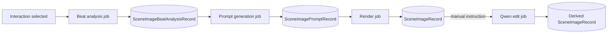
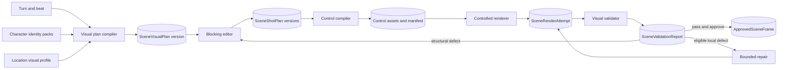

# B-032 Scene Image Generator - Implementation Handoff

**Status:** Architecture and implementation plan complete; Phase 2 is next
**Prepared:** 2026-08-24
**Scope:** Phase 0 through Phase 4
**Backlog:** `B-032`

## 1. Purpose

This is the controlling entry point for implementing the remaining B-032 work. It reconciles the
implemented application, the preserved generation proofs, and the detailed Phase 2-4 plans.
Implementers must read this file before a phase package.

The product target is not merely prompt-to-image generation. It is an auditable continuity
renderer that can preserve recurring characters, a detailed location, one frozen beat, and the
relationships between actors while producing multiple camera views and bounded repairs.

## 2. Authoritative Status

| Phase | State | Controlling result |
|---|---|---|
| 0 - Architecture and evidence | Complete | Prompt-only generation and exact-contact ControlNet/inpaint proofs established the limits of the baseline. |
| 1 - Prompt-to-image MVP | Implemented, manual acceptance open | Beat analysis, Pony and SDXL/Juggernaut generation, persistence, Studio/Gallery, and manual Qwen editing exist. T068 remains open. |
| 2 - Character identity | Planned, next | Add persisted identity packs and prove two-character assignment before deciding on LoRA training. |
| 3 - Location and multi-POV | Planned | Add location profiles, canonical visual plans, blocking, controls, and shot plans derived from one plan version. |
| 4 - Validation and repair | Planned | Add constraint reports, policy-driven bounded repair, approval, and continuity anchors. |

Do not infer status from older handoff files. This document and each phase's `tasks.md` control.

## 3. Implemented Baseline

### 3.1 Current pipeline

The active code path is:

1. `SceneImageService.EnqueueBeatAnalysisAsync` creates a pending analysis and queues
   `SceneImageBeatGeneration`.
2. `SceneImageBeatGenerationJobHandler` resolves the full turn, calls the configured text model,
   parses schema-v3 beats, and persists the result.
3. `SceneImageService.EnqueuePromptAsync` snapshots a selected beat and POV and queues prompt
   generation.
4. `SceneImagePromptGenerationJobHandler` resolves the configured prompt model and dispatches to
   the Pony or SDXL builder according to the configured render checkpoint family.
5. The user may edit the generated prompt before `EnqueueRenderAsync` creates a render record.
6. `SceneImageRenderingJobHandler` resolves exactly one configured image model, applies the
   content-policy clamp when required, renders, stores the file, and records provenance.
7. A completed image may be sent manually through `SceneImageEditingJobHandler`; Qwen remains a
   separate source-image editor resolved through `RolePlaySceneImageEditor`.

### 3.2 Existing ownership boundaries

| Boundary | Existing owner |
|---|---|
| Scene-image records and model-family classification | `DreamGenClone.Domain/RolePlay` |
| Model/provider resolved values | `DreamGenClone.Domain/ModelManager` |
| Repository, image-client, and storage abstractions | `DreamGenClone.Application/Abstractions` |
| SQLite and ComfyUI implementations | `DreamGenClone.Infrastructure` |
| Orchestration, compilers, handlers, and UI | `DreamGenClone.Web` |
| All automated coverage | `DreamGenClone.Tests/RolePlay` |

New work must preserve these boundaries. The remaining phases extend the scene-image subsystem;
they do not modify RP continuation, prompt slots, narrative gates, or phase transitions.

## 4. Evidence-Based Decisions

### D-032-01 - Prompt text is not geometry

Juggernaut prompt tests varied actor ownership, contact, cast count, and object placement across
seeds. A fixed seed reproduces one workflow; it does not create continuity. Structured visual
constraints and persisted controls are required for controlled modes.

### D-032-02 - OpenPose is macro guidance only

Three frozen OpenPose exact-contact gates scored `0/4`, `1/4`, and `0/4`. The control changed arm
placement causally but did not encode front/back contact, palm surface, or stable target binding.
OpenPose may be used for stance and limb direction, but it must never be represented as an exact
contact guarantee.

### D-032-03 - Built-in Juggernaut inpainting is not the semantic repair path

Three masked inpaint revisions scored `0/4` each. They preserved unmasked pixels but failed actor
ownership, chirality, hand surface, and topology. Do not resume prompt or mask-coordinate tuning
for that proof. Qwen is the selected semantic editor.

### D-032-04 - Qwen is an editor, not a render family

Qwen Image Edit 2511 passed the six covered non-explicit edits and is integrated through
`RolePlaySceneImageEditor`. It does not route through `SceneImageModelFamilyResolver`, and it does
not silently replace Pony or SDXL generation. Adult-content editing remains untested.

### D-032-05 - First identity proof uses a provider-neutral conditioning contract

The application will persist identity packs and compile a fully specified conditioning request.
The first host proof compares SDXL-compatible identity mechanisms before application integration.
IP-Adapter and PuLID support SDXL identity conditioning; InstantID is excluded from the first
multi-person slice because its official implementation states that multi-person is unsupported
and its face-model/checkpoint licensing is unsuitable as an assumed product default.

The proof must select and pin one mechanism, node revision, artifact hashes, and workflow. No
application code may guess a mechanism or fall back to prompt-only generation.

### D-032-06 - Multi-person identity requires regions

Each visible recurring actor has a region/mask assignment. Identity conditioning is compiled per
actor, and the rendered result is scored for both likeness and ownership. A scene that cannot
provide distinct actor regions fails compilation rather than blending references globally.

### D-032-07 - Three.js is the first blocking UI

Phase 3 uses a browser-side Three.js editor because its cameras, object transforms, skeletons,
depth materials, render targets, and JSON/glTF tooling match the Blazor application and support an
interactive local workflow. Persist engine-neutral transforms and semantic IDs, not opaque
Three.js object graphs. Blender headless export remains an optional later compiler if browser
control assets are insufficient; it is not a Phase 3 prerequisite.

### D-032-08 - Validation is advisory until Phase 4 acceptance proves automation

Phase 4 begins with persisted structured findings and user approval. Automatic repair is enabled
only for finding classes that pass their own bounded proof. A vision model cannot silently mark a
hard relationship as satisfied; low-confidence or conflicting findings require review.

## 5. Target Architecture

### 5.1 Source-of-truth hierarchy

1. Story evidence: turn, selected beat, scenario state, character and location metadata.
2. Approved reusable assets: identity pack and location profile versions.
3. `SceneVisualPlan`: camera-independent cast, wardrobe, relationships, anchors, and boundaries.
4. `SceneShotPlan`: one camera and visibility/crop projection of a visual plan version.
5. `SceneControlManifest`: exact controls, masks, adapters, workflow, and checksums.
6. `SceneRenderAttempt`: immutable execution provenance and image result.
7. `SceneValidationReport`: findings against the source plan and shot.
8. `ApprovedSceneFrame`: explicit user-approved continuity evidence.

Downstream artifacts never mutate an upstream approved version. A correction creates a new
version and records `SupersedesId`.

### 5.2 Modes

| Mode | Required input | Behavior |
|---|---|---|
| `PromptOnly` | Existing beat and prompt records | Existing Phase 1 path; no continuity guarantee. |
| `IdentityControlled` | Approved identity pack versions and regional assignment | Phase 2 path; fail if any visible controlled actor lacks required inputs. |
| `SceneControlled` | Approved visual plan, shot plan, controls, and identities | Phase 3 path; fail if the control manifest is incomplete or incompatible. |
| `Validated` | Complete render attempt and validation policy | Phase 4 path; always persists a report before approval or repair. |

There is no downgrade from a controlled mode to `PromptOnly`. Users may explicitly choose
`PromptOnly` as a new request, but the system must not substitute it after a controlled request
fails compilation.

## 6. Cross-Phase Contracts

### 6.1 Asset contract

Every external file record has:

- stable ID and owner scope;
- semantic type;
- relative path under the configured scene-image root;
- media type, width, and height where applicable;
- byte length and SHA-256;
- source/provenance and consent state;
- created timestamp and immutable version.

The repository stores metadata only. Bytes remain on disk and out of git, except explicitly
approved proof fixtures under this specification tree.

### 6.2 Configuration contract

All runtime behavior values are persisted and UI-backed: adapter artifact names, model family,
strengths, control weights, workflow version, validation model, confidence policy, repair limits,
and timeouts. Resolvers produce immutable resolved records. Missing or incompatible values throw
explicit diagnostics before a job record is submitted when possible.

### 6.3 Job contract

Each new asynchronous operation follows the existing pattern:

- create a persisted pending record;
- enqueue a payload containing stable IDs only;
- use dedupe key `{JobType}:{RecordId}`;
- reload all authoritative state in the scoped handler;
- move monotonically to complete or failed;
- persist a user-readable error and structured debug event;
- treat an already complete record as idempotent success.

### 6.4 Provenance contract

No controlled render is reproducible from a seed alone. Persist the checkpoint, workflow revision,
node and model artifact names, checksums, prompts, sampler values, adapters and strengths, control
asset IDs and checksums, source plan/shot versions, seed, content policy, and output checksum.

## 7. Delivery Order

### Gate A - Phase 1 acceptance hygiene

T068 may proceed independently, but claims of complete Phase 1 acceptance require all manual
rows to be recorded. Phase 2 automated work may begin because it uses separate records and jobs.

### Gate B - Phase 2 identity proof

1. Implement reference asset and identity-pack persistence/UI.
2. Freeze a two-character evaluation set.
3. Run provider-neutral host proofs for candidate SDXL identity conditioning.
4. Select and pin one mechanism.
5. Implement the controlled-render compiler/client path.
6. Pass the identity matrix and record the LoRA decision.

### Gate C - Phase 3 frozen-scene proof

1. Implement location profiles and visual-plan versioning.
2. Implement the Three.js blocking editor and shot-plan persistence.
3. Compile pose/depth/region controls and a manifest.
4. Render at least three cameras from one frozen plan.
5. Pass the multi-POV matrix without reinterpreting the plan per shot.

### Gate D - Phase 4 validation and repair

1. Persist validation policies and reports.
2. Add manual review and approval.
3. Prove each automatic repair class independently.
4. Enforce persisted attempt bounds.
5. Demonstrate continuity-anchor reuse without mutating source evidence.

## 8. Required Verification

After each implementation task group:

1. Run the narrow affected tests.
2. Run `dotnet build DreamGenClone.sln --no-restore`.
3. Run `dotnet test DreamGenClone.Tests/DreamGenClone.Tests.csproj --no-build`.
4. For UI work, run the app in Development from `DreamGenClone.Web` and execute the phase's manual
   matrix.
5. For ComfyUI changes, preserve a source-controlled workflow and manifest, run only frozen seeds,
   inspect the output images, and record exact host/node/model revisions without secrets.
6. Do not mark a task complete while any test fails.

## 9. Agent Start Checklist

- Read `.github/copilot-instructions.md` and all instruction files matching touched paths.
- Read this handoff, the target phase `README.md`, `research.md`, `spec.md`, `data-model.md`,
  `plan.md`, `contracts.md`, and `tasks.md`.
- Inspect `git status`; preserve unrelated user changes.
- Select the first unchecked task whose dependencies are complete.
- Before RP application code changes, present root cause/need, exact files, configuration source,
  and blast radius, then obtain explicit confirmation.
- Do not install host dependencies until the host inventory and change plan are documented and
  approved.
- Update the task checkbox and evidence note only after implementation and verification.

## 10. Document Map

| Need | Artifact |
|---|---|
| Existing proofs and architecture history | `phase-0-architecture-and-evidence/` |
| Implemented MVP and remaining T068 acceptance | `phase-1-prompt-to-image-mvp/` |
| Identity packs, conditioning proof, LoRA decision | `phase-2-character-identity/` |
| Locations, visual plans, blocking, multi-POV | `phase-3-location-and-multi-pov/` |
| Validation, bounded repair, approval, anchors | `phase-4-validation-and-repair/` |

When documents conflict, use this order: latest accepted proof evidence, this handoff, current
phase contracts and tasks, then older design/handoff notes.