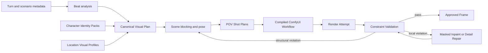

# Scene Image Continuity Rendering Architecture

**Status:** historical architecture and proof proposal; execution sequence superseded
**Created:** 2026-08-24  
**Owner:** Scene Image Generator (B-032)  
**Proof result:** OpenPose and Juggernaut inpainting exact-contact routes rejected

> **RE-OPENED 2026-08-25 (B-097):** Community + creator research
> (`specs/Planning/B-032-scene-image-generator/phase-0-architecture-and-evidence/juggernaut-nsfw-community-findings.md`)
> confirms position/anatomy failures are a geometry
> problem, not a prompt problem. **ControlNet OpenPose + Depth conditioning is re-opened as a
> required control in earlier phases** — Phase 1B one-pod runtime and Phase 2 identity. Mechanism:
> thibaud `controlnet-openpose-sdxl-1.0` + SDXL depth, DWPose preprocessor, weights 0.35–0.85,
> ADetailer hands/faces, CFG 5–7.5 for position adherence. This is **separate from** the rejected
> exact-contact route: do NOT resume prompt/keypoint/strength/mask-coordinate tuning for
> exact-contact inpainting correction. Sections 8–10 evidence is preserved as-is.

> **Superseded execution guidance:** The ControlNet-first target and delivery sequence in Sections
> 8-10 were executed and failed their gates. Preserve them as evidence; do not resume prompt,
> keypoint, strength, or mask-coordinate tuning for exact-contact correction. Start implementation
> with [`../IMPLEMENTATION-HANDOFF.md`](../IMPLEMENTATION-HANDOFF.md) and the complete Phase 2-4
> packages. Qwen Image Edit 2511 is the separate proven non-explicit semantic editor. Three.js is
> the selected first blocker, and the identity backend remains proof-gated.

## 1. Product Goal

Generate faithful images of one frozen story beat without relying on large random batches. The system must preserve:

- the same recognizable characters across renders;
- the beat's exact visible action and one-way contact relationships;
- clothing and important physical attributes;
- detailed, reusable locations and anchored scene objects;
- one canonical moment viewed from multiple cameras/POVs;
- an auditable path from beat facts to controls, render, validation, and repair.

"Faithful" means satisfying explicit visual constraints. It does not mean pixel-identical output, and it does not assume that a text-to-image model can guarantee geometry from prose alone.

## 2. Current Baseline And Verified Limitation

The shipped pipeline is:

1. Turn -> `SceneImageBeatAnalysisService` -> structured `SceneImageBeat`.
2. Beat + POV -> `SceneImageRenderBriefBuilder` -> authoritative text brief.
3. Text preprocessor -> editable Pony or SDXL prompt.
4. `ComfyUIImageClient` -> checkpoint-specific text-to-image workflow.
5. Persist prompt, settings, model, image, and debug event.

This is a valid prompt-to-image POC. It is not yet a continuity renderer.

Verified with Juggernaut XL Ragnarok on 2026-08-24:

- Direct text could produce the requested clothed, flirtatious touch for some seeds.
- Other seeds reversed the actor, added reciprocal touching, moved the hand, or invented a third person.
- Repeating and strengthening prose did not make the spatial relationship deterministic.
- Background-object instructions competed with the character action.

Conclusion: prompt changes can reduce ambiguity but cannot be the geometry-control architecture.

## 3. Important Terminology

| Term | Meaning in this system |
|---|---|
| Checkpoint | Base image model weights. Juggernaut XL Ragnarok is the current SDXL checkpoint. It supplies visual priors and style, not exact scene geometry. |
| Seed | Repeats stochastic noise for the same workflow. It is reproducibility, not character or scene continuity. |
| LoRA | Small trained adapter that teaches a checkpoint a recurring character, location, wardrobe, or style. Stronger long-term identity mechanism, but requires curated training data. |
| Reference conditioning | Supplies one or more images at inference time through IP-Adapter, PuLID, InstantID, or equivalent. Faster than LoRA; useful for an initial identity implementation. |
| ControlNet | Conditions generation with a spatial control image such as pose, depth, edges, or segmentation. This is the primary geometry mechanism. |
| OpenPose / DWPose | Skeleton/keypoint representation for body, face, and hands. Used to control pose and contact. |
| Depth map | Per-pixel distance representation. Used to preserve foreground/background placement and camera geometry. |
| Regional conditioning | Applies identity/prompt/control to a mask or region so multiple characters do not exchange attributes. |
| Inpainting | Regenerates only a masked region. Used for bounded repair after the overall composition is correct. |
| Detailer | Detects and repairs faces/hands after generation. It is post-processing, not the source of identity or pose. |
| Visual validator | Compares a render to the structured plan and reports specific violations. It does not replace spatial controls. |

## 4. Architecture

The canonical visual plan is camera-independent. Every POV shot is compiled from the same frozen plan; a POV is not an independent reinterpretation of the beat.

## 5. Required Components

### 5.1 Canonical Visual Plan

A persisted, versioned structure compiled from beat metadata and user corrections.

Minimum fields:

- beat and turn identifiers;
- exact visible cast and identity-pack references;
- wardrobe snapshot per character;
- scene location and location-profile reference;
- character blocking: left/right/center, depth layer, facing, stance;
- action relationships in subject-action-target form;
- contact constraints such as `Becky.rightPalm -> Dean.chest`;
- forbidden relationships such as `Dean.anyHand -/-> Becky`;
- object anchors such as `sheet attachedTo clothesline`, `clothesline background`;
- lighting, time, mood, and content boundary;
- version and user approval state.

The current `SceneImageBeatCharacter.Position`, `ActionOrObservation`, and `Sightline` strings remain useful source evidence, but they are not sufficient as render controls.

### 5.2 Character Identity Pack

Persisted per character profile:

- curated reference images with consent/provenance metadata;
- one approved canonical face portrait;
- one approved full-body reference;
- stable visual descriptor snapshot;
- optional wardrobe reference sets;
- inference adapter configuration;
- optional trained LoRA identifier, trigger token, base checkpoint family, and version.

Initial implementation: reference conditioning. Later implementation: SDXL character LoRA for principal recurring characters. Multiple-character shots require masks or regional conditioning to prevent identity bleed.

### 5.3 Location Visual Profile

Persisted per scenario location:

- approved reference images;
- canonical object list and spatial anchors;
- optional rough 3D layout or depth reference;
- lighting variants by time of day;
- optional environment LoRA identifier and version.

Text such as "white sheet on a clothesline" describes intent. A control map or location reference determines where it is.

### 5.4 Scene Blocking And Shot Plans

A lightweight blocking layer places mannequins and important objects once, then creates cameras.

Required outputs per shot:

- pose control image;
- depth control image;
- optional edge/segmentation control;
- character-region masks;
- camera metadata;
- crop/aspect ratio;
- positive and negative prompt fragments compiled from the visual plan.

Recommended long-term implementation: a small Three.js or Blender-backed scene/pose editor. The same scene produces omniscient and character-POV controls by moving the camera rather than regenerating scene interpretation.

### 5.5 Controlled ComfyUI Renderer

Keep Juggernaut XL Ragnarok as the first renderer while proving controls. Do not introduce another checkpoint until the control path is measured.

Candidate workflow capabilities, subject to the later proof decisions:

- SDXL OpenPose/DWPose for macro pose only, never exact-contact guarantees;
- SDXL Depth ControlNet;
- Juggernaut-recommended sampler settings already used by the app;
- optional identity reference conditioning after pose proof;
- regional masks for multiple identities;
- Qwen source-image editing for proven semantic repair classes;
- face/hand detail pass after composition approval.

All node/model dependencies must be explicit persisted configuration. Missing controls fail fast; no hidden text-only fallback is allowed for a shot marked `Controlled`.

### 5.6 Constraint Validator

Validation consumes the visual plan and render, then persists a structured report:

- character count and expected identities;
- wardrobe compliance;
- required and forbidden contact relationships;
- pose/facing/blocking;
- object presence and anchor placement;
- POV/camera compliance;
- image integrity and anatomy defects.

Validation may combine deterministic detectors with a configured vision model. Each finding needs a confidence and evidence description. Automatic retries must be bounded and targeted:

- local defect -> inpaint mask;
- identity defect -> identity conditioning/mask adjustment;
- structural defect -> return to blocking/control plan;
- no unbounded random-seed search.

## 6. Persisted Domain Draft

| Entity | Purpose |
|---|---|
| `CharacterImageIdentityPack` | References, adapter/LoRA metadata, canonical approved identity assets. |
| `LocationVisualProfile` | Reusable references, anchors, layout, and lighting variants for a location. |
| `SceneVisualPlan` | Camera-independent frozen beat and its visual constraints. |
| `SceneVisualActor` | Identity, wardrobe, blocking, pose, and visibility for one character. |
| `SceneVisualRelationship` | Required/forbidden action or contact edge between actors/body regions/objects. |
| `SceneShotPlan` | One POV camera plus compiled control assets and masks. |
| `SceneControlAsset` | Pose/depth/edge/mask file, type, dimensions, checksum, source, version. |
| `SceneRenderAttempt` | Workflow version, checkpoint, adapters, controls, prompt, seed, result. |
| `SceneValidationReport` | Constraint-level pass/fail/confidence/evidence and repair recommendation. |
| `ApprovedSceneFrame` | User-approved continuity anchor for the beat/POV and future renders. |

Image/control bytes stay on disk under the existing scene-image root pattern. SQLite stores metadata, relationships, versions, checksums, and relative paths.

## 7. Target Studio Workflow

1. Select a turn and beat.
2. Generate a canonical visual plan from existing metadata.
3. Review a constraint checklist, not only a prose prompt.
4. Resolve missing character/location visual assets.
5. Review or adjust scene blocking and required contacts.
6. Choose one or more POV cameras.
7. Preview pose/depth/mask controls for each shot.
8. Render controlled attempts.
9. Review validation findings per constraint.
10. Apply bounded targeted repair where appropriate.
11. Approve frames as continuity anchors.

The editable text prompt remains available as an expert control, but it is no longer the only representation of the scene.

## 8. Completed Proof: Controlled Clothed Touch

**Result:** Rejected. OpenPose revisions scored `0/4`, `1/4`, and `0/4`; Juggernaut masked
inpainting revisions scored `0/4` each. The complete ledger and decision are in
`controlnet-touch-proof.md`. The procedure below is historical and must not be rerun as the next
implementation step.

### Question

Can SDXL ControlNet make the already tested Juggernaut checkpoint preserve one asymmetric contact relation without seed hunting?

### Frozen visual requirement

- Exactly two fully clothed adults.
- Woman faces man.
- Woman's open right palm contacts the center of the man's shirt-covered chest.
- Woman's left arm remains down.
- Man's two hands remain down and do not touch the woman.
- Playful/flirtatious, non-explicit mood.
- No location-detail requirement in this proof.
- No identity-consistency requirement in this proof.

### Procedure

1. Inventory installed ComfyUI nodes and models on the current RunPod host.
2. Select an SDXL-compatible pose-control model based on what is actually available; record the exact model and checksum.
3. Author one pose control asset with body/hand keypoints for the frozen requirement.
4. Build a standalone API-format ComfyUI workflow using Juggernaut plus pose control.
5. Render exactly four predetermined seeds with an unchanged control asset and unchanged prompt.
6. Record each attempt, workflow JSON, prompt, negative, seed, and result image.

### Pass gate

All four renders must satisfy:

- correct touch direction and body target;
- no reciprocal touch;
- exactly two people;
- both fully clothed;
- no major limb/hand topology failure that obscures the action.

A failed gate does not trigger dozens of seeds. Adjust the control representation or control strength once, document the change, and rerun the four-seed gate. If pose keypoints cannot encode hand-to-chest contact reliably, evaluate depth/segmentation or a staged inpainting proof before app integration.

### Proof artifacts

Store under:

`artifacts/tmp/images/controlnet-touch-proof/`

Required durable report:

`specs/Planning/B-032-scene-image-generator/phase-0-architecture-and-evidence/controlnet-touch-proof.md`

The report must include host/pod identity, ComfyUI/node/model inventory, workflow path, control asset path, parameters, four results, gate decision, and next architecture decision. Never include API tokens or private keys.

## 9. Historical Delivery Phases

This sequence is superseded by `../IMPLEMENTATION-HANDOFF.md` and the phase task ledgers.

### Phase 0 - Architecture And Inventory

- Adopt this artifact as the Phase 2 baseline.
- Amend feature requirements and success criteria.
- Inventory the current ComfyUI host.
- Record exact node/model dependencies.

### Phase 1 - Pose-Control Vertical Slice

- Complete the four-seed touch proof.
- Add versioned workflow/control asset handling only after the proof passes.
- Add persisted visual-plan/contact types required by the slice.

### Phase 2 - Identity Vertical Slice

- Add reference-image identity packs for two characters.
- Prove identities remain assigned across at least two poses and two camera angles.
- Decide, from measured results, whether principal characters require LoRA training.

### Phase 3 - Location And Multi-POV

- Add location visual profiles and object anchors.
- Add shared scene blocking and camera-specific shot plans.
- Prove multiple POVs come from one frozen scene plan.

### Phase 4 - Validation And Repair

- Add structured visual validation.
- Add bounded local inpainting/detail repair.
- Persist approved continuity anchors and provenance.

## 10. Decisions And Non-Decisions

Decided:

- Prompt-only generation cannot meet the clarified continuity goal.
- The canonical visual plan is the source of truth; prompts are compiled artifacts.
- Multiple POVs share one frozen scene plan.
- Controls and identity inputs are persisted and auditable.
- Automatic rerendering is bounded; no unbounded seed search.
- Juggernaut remains the initial renderer for control proofs.

Resolved by the implementation handoff:

- Exact spatial-control artifacts remain proof-gated; OpenPose is macro pose only.
- Three.js is the first browser blocker; Blender is optional later.
- IP-Adapter and PuLID are frozen-proof candidates; InstantID is excluded from the first
    multi-person slice; one backend is pinned only after passing.
- Character LoRA training service and dataset workflow.
- Vision validator model.

These remain evidence-driven decisions. Agents must not silently select dependencies or bake hidden defaults into code.

## 11. Handoff Rules

Every agent or host handoff must report:

- current phase and last passed gate;
- exact pod/host and ComfyUI URL from ignored environment files, without secrets;
- installed checkpoint/control/adapter names and checksums;
- workflow JSON and control-asset paths;
- fixed seeds and parameter values;
- generated artifact paths;
- failures and the single next discriminating experiment;
- code/spec files changed and validation performed.

Start here on resume, then read:

1. `specs/Planning/B-032-scene-image-generator/phase-0-architecture-and-evidence/continuity-rendering-architecture.md`
2. `specs/Planning/B-032-scene-image-generator/phase-0-architecture-and-evidence/controlnet-touch-proof.md`
3. `specs/Planning/B-032-scene-image-generator/phase-0-architecture-and-evidence/RESUME-HANDOFF-pony-builder.md`
4. `.github/instructions/sdxl-juggernaut-prompting.instructions.md`
5. `.github/instructions/pony-v6-prompting.instructions.md`
