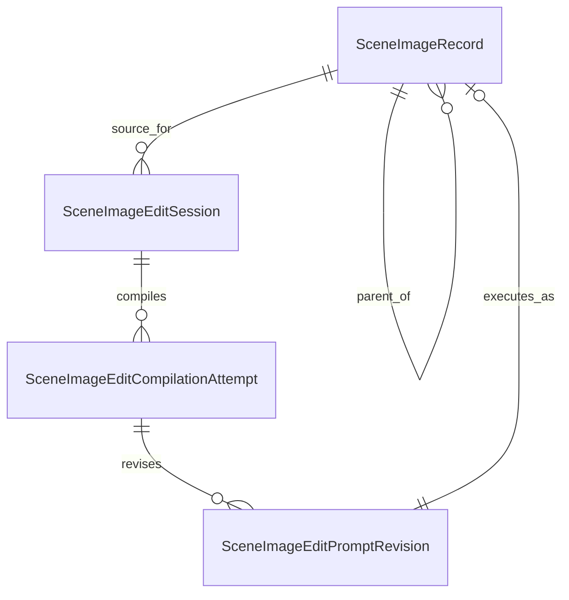

# Phase 1B Data Model - Vision-Aware Image Editing

## `SceneImageEditSession`

Fields: `Id`, `SourceImageId`, `SourceImageSha256`, `SessionId`, `InteractionId`, `Status`,
`CreatedUtc`, `UpdatedUtc`, optional `CompletedUtc`.

One workbench session is anchored to an immutable source checksum. Status is derived from attempts
and executions; it does not replace their state.

## `SceneImageEditCompilationAttempt`

Fields: `Id`, `EditSessionId`, `Ordinal`, `RawIntent`, optional `ClarificationContextJson`,
`SourceImageSha256`, `Status`, `ResolvedModelSnapshotJson`, `CompilerSchemaVersion`,
`SystemPromptVersion`, optional `RawModelResponse`, optional `ParsedResultJson`, optional `Error`,
`CreatedUtc`, optional `StartedUtc`, optional `CompletedUtc`.

States: `Pending -> Compiling -> Ready|ClarificationRequired|Invalid|Failed`.

Attempts are append-only. Unique index: `(EditSessionId, Ordinal)`. A new intent or clarification
creates a new attempt. Raw model response retention follows the configured debug/retention policy.

## `SceneImageEditCompilationResult`

Stored in `ParsedResultJson` and materialized as a typed DTO:

```json
{
  "schemaVersion": "1",
  "status": "ready",
  "sourceSummary": "Two adult women stand beside a table.",
  "targets": [
    {
      "key": "woman_left",
      "visibleLocator": "woman on the left wearing a red jacket",
      "region": { "x": 0.08, "y": 0.12, "width": 0.34, "height": 0.78 }
    }
  ],
  "requestedChanges": ["change the target from standing to kneeling"],
  "preserve": ["identity", "clothing", "other people", "background", "lighting", "camera"],
  "clarificationQuestion": null,
  "invalidReason": null,
  "compiledPrompt": "Change the woman on the left ..."
}
```

Regions are normalized and optional only when the target is not spatially localizable. `Ready`
requires at least one target, one change, preservation constraints, and `compiledPrompt`.
`ClarificationRequired` requires one concise question and no executable prompt. `Invalid` requires
an explicit reason and no executable prompt.

## `SceneImageEditPromptRevision`

Fields: `Id`, `CompilationAttemptId`, `Ordinal`, `Prompt`, `RevisionKind` (`CompilerOutput`,
`UserEdited`), `PromptSha256`, `CreatedUtc`.

The compiler output is revision zero. User edits append revisions. Execution references an exact
revision ID and hash.

## Existing `SceneImageRecord` Additions

Add nullable fields for edit rows:

- `EditSessionId`
- `EditCompilationAttemptId`
- `EditPromptRevisionId`
- `EditIntentSnapshot`
- `EditCompilerProvenanceJson`

`PromptSnapshot` remains the exact accepted prompt sent to Qwen. `SourceImageId` remains the parent
lineage link. Existing rows require no backfill.

## Model Manager Additions

- `AppFunction.RolePlaySceneImageEditPromptCompiler`
- Reserve `AppFunction.RolePlaySceneImageValidator` for Phase 4; do not invoke it in Phase 1B.
- `RegisteredModel.SupportsImageInput`
- Optional persisted image-input limits needed by the selected provider: maximum images, maximum
  source bytes, maximum dimension, accepted media types.

The exact compiler resolution snapshot includes provider/model IDs, endpoint, model identifier,
content policy, timeout, image limits, generation settings, and capability flags. Secrets are not
included.

## Relationships



## Invariants

- Source checksum must match before compilation and again before edit enqueue.
- Only the latest non-stale ready attempt can supply a prompt revision for execution.
- A revision belongs to exactly one attempt and cannot move between edit sessions.
- Failed, invalid, and clarification-required attempts cannot execute.
- An edit child never inherits approval or validation from its parent.
- Deleting a source or compilation record referenced by a child is rejected.