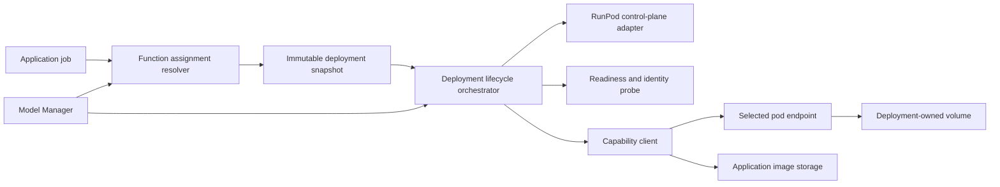
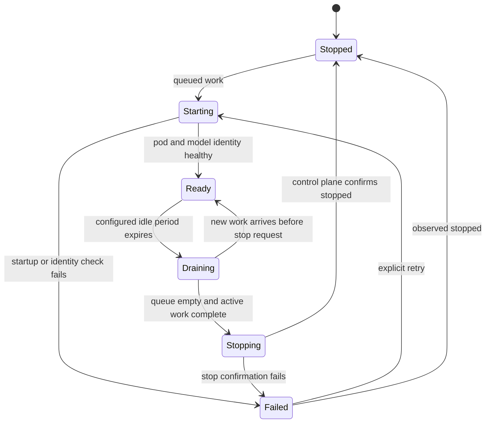

# Phase 1B Multi-Pod Capability Architecture and Migration Plan

**Decision date:** 2026-08-25
**Existing deployment:** The current combined pod is the source deployment for decomposition and is deprecated after migration
**Target deployment:** Independently managed pods organized by capability and model deployment

## Vision and Fixed Decisions

Move from repeatedly loading and unloading unrelated models on one GPU pod to independently managed
model deployments. The existing pod is the source deployment for the split. Its installed
capabilities are copied into separately provisioned, capability-specific pods, migrated one at a
time, and verified before the existing pod is deprecated and stopped. Termination of that deprecated
pod and deletion of its volume remain separate, explicitly authorized cleanup decisions.

The target organization is capability based:

- Juggernaut remains the main image-generation model but moves to a new dedicated pod.
- Pony or another image generator is evaluated on a new candidate image-generation pod.
- Qwen Image Edit and future editor models each use independent image-editor pods.
- Qwen VL and future multimodal models use independent image-vision pods.
- DWPose uses an explicit pose-extraction/conditioning deployment instead of being an implicit
  dependency hidden inside an unrelated model runtime.

Each pod runs one model or one tightly coupled runtime required to expose a single declared
capability. A new model is added as a new deployment, proved independently, and selected explicitly
through Model Manager. Production resolution still selects exactly one deployment per application
function; candidates are never automatic fallbacks.

The long-term system has four primary capability families: **Image Generation**, **Image Editing**,
**Image Vision**, and **Pose**. Each family can contain multiple independently deployed model pods.
An application workflow selects one deployment for each required capability. Optional capabilities
are omitted when not needed: for example, a generation workflow that does not require pose control
does not select or start DWPose. A Qwen Image Edit pod remains stopped unless an edit job selects it.

The following requirements are mandatory:

1. Keep the existing pod and volume intact only as the migration source while capabilities are
   migrated and validated.
2. Create a new pod and volume for each production replacement and every additional model
   deployment; do not install more candidate models into the existing pod.
3. Enable SSH over an exposed TCP port on every pod. Gateway-only or terminal-only SSH does not meet
   the automation requirement.
4. Configure each pod so the coding agent can inspect it over SSH and start or stop it through the
   RunPod control plane after the user supplies the required secret-backed credentials.
5. Store no API key, private SSH key, public host, or exposed TCP port in tracked files. Persist only
   secret references and logical deployment identity.
6. Prefer starting and stopping dedicated pods over loading and unloading unrelated models inside a
   shared GPU runtime.
7. Never terminate a pod or delete a volume through automatic lifecycle behavior. Termination and
   volume deletion remain separate destructive operations requiring explicit user authorization.
8. Deprecate and stop the existing combined pod only after every active capability has a proven new
   deployment, all function/workflow assignments have moved, and no queued or running work uses it.
9. Keep every model pod stopped when it has no selected queued or active work. A pod starts only in
   response to persisted work that explicitly resolves to that deployment, then drains and stops
   after its configured idle period. Running a model pod without selected work is not allowed.

## Decision Amendment

The user accepts the measured Qwen VL startup behavior for initial application implementation.
This explicitly supersedes the previously frozen 180-second same-pod transition threshold for the
initial one-pod deployment. The evidence is approximately 276 seconds from vLLM process start to
health, plus approximately 137 seconds of launcher preflight overhead measured on the FUSE-backed
volume. These measurements do not support inventing one exact replacement constant.

The configured transition timeout must cover the measured full launcher-to-health transition with
explicit operational margin. The timeout and margin are operator-selected, UI-backed, and persisted
through Model Manager/provider configuration. They are part of the immutable resolved configuration
snapshot for each job. Missing or invalid transition configuration fails before work is submitted;
application or coordinator code must not contain a default timeout, hidden extension, retry, or
alternate provider/model route.

P1B-007 is accepted by explicit user waiver of the old timing gate. The waiver accepts startup
latency, not compiler quality. The functional proof established endpoint/model identity, one-image
multimodal input, schema-valid output, a 2.444-second inference response, 5,403 MiB post-load free
VRAM, and passing storage floors. P1B-008 through P1B-010 remain open and independently control
corpus definition, execution, and quality acceptance.

Application infrastructure work in P1B-011 through P1B-035 is authorized to begin in parallel with
P1B-008 through P1B-010. Production enablement, application end-to-end acceptance, and Phase 1B exit
remain blocked until the compiler corpus and all acceptance tasks pass. This amendment changes task
ordering; it does not erase the quality dependency.

All other initial acceptance constraints remain unchanged:

- exactly one source image per compiler request;
- PNG, JPEG, or WebP, no more than 10 MiB and 1,048,576 pixels;
- one-image compiler inference response no more than 90 seconds;
- at least 4 GiB free VRAM after Qwen VL loads;
- at least 20 GiB free on the persistent workspace volume after artifacts/caches;
- at least 1 GiB free on the container root;
- zero hidden retries and zero fallback providers, models, or text-only paths.

## Active Initial Topology

Juggernaut, Qwen VL, and Qwen Image Edit remain installed on one RunPod pod and one persistent
volume. A configured coordinator schedules exclusive GPU residency, releases the previous model,
starts the requested service, waits for its configured health condition, and then allows the queued
job to run. This is the migration baseline, not the target operating model. During migration the
existing pod remains available until each replacement deployment has passed its gates. The target
does not assign any capability to this combined pod. After all assignments move, mark it deprecated,
stop it, preserve its pod and volume for the configured observation period, and remove it only under
separate explicit authorization.

The application addresses configured provider endpoints and model identifiers. It does not know
RunPod host names or ports, SSH details, `/workspace` paths, service process commands, or whether
models share a filesystem. SSH and loopback forwarding remain operator/development transport only.

## Topology-Independent Application Contract

The same application contracts must support both residency strategies:

- Provider and model records persist base endpoint, model identifier, capability, content policy,
  request/inference timeout, transition timeout and margin, health contract, media limits,
  concurrency limit, and lifecycle strategy identifier.
- Resolution returns exactly one complete immutable configuration snapshot. Missing endpoint,
  model, lifecycle strategy, health, timeout, limit, credential, or policy data fails explicitly.
- HTTP carries JSON metadata and binary or multipart image content. The application never passes a
  shared path and never assumes source/result bytes exist on the provider filesystem.
- Provider credentials and TLS/auth settings remain secret-backed; they are referenced by persisted
  provider configuration and are never written to provenance or debug logs.
- No provider/model failover list exists. An unavailable configured provider fails the attempt.

Model lifecycle and residency sit behind one configured lifecycle abstraction. The initial strategy
is `ScheduledSinglePod`: serialize GPU-heavy operations, transition the one pod, and wait for health.
The target strategy is `ManagedDedicatedPod`: start the selected pod, discover its current endpoint,
verify exact deployment identity, submit work, drain it, and stop it after its configured idle
period. This is the only target production lifecycle strategy. Strategy selection and every timeout,
health, queue, concurrency, and idle control are UI-backed persisted configuration. No strategy is
inferred from an endpoint or hidden default.

## Capability and Deployment Model

The architecture separates four concepts:

| Concept | Responsibility | Example |
|---|---|---|
| Application function | User-visible work selected by the application | `RolePlaySceneImage` |
| Capability | Protocol and behavior a deployment implements | Image generation |
| Registered model | Pinned model and inference settings | Juggernaut XL Ragnarok |
| Model deployment | Independently operated runtime serving that model | Dedicated Juggernaut pod |

An application function has one persisted active assignment to one model deployment. A capability
may have multiple deployments in different promotion states, allowing side-by-side proof without
embedding model names or RunPod details in application services.

### Capability Catalog

| Capability | Production target | Candidate examples | Boundary |
|---|---|---|---|
| Image generation | Juggernaut on a new dedicated pod | Pony, future SDXL/Flux models | Prompt/settings in; image and provenance out |
| Image editing | Qwen Image Edit 2511 on a new pod | Future Qwen revisions or other editors | Source plus instruction in; edited image out |
| Image vision/compiler | Qwen VL on a new pod | Other multimodal language models | Source plus intent in; structured result out |
| Pose extraction | DWPose on a new pod | Other pose/depth/edge preprocessors | Source in; control image and keypoints out |
| Image validation | None in Phase 1B | Future local vision validators | Source/result/constraints in; verdict out |

DWPose is a narrow pose-extraction/conditioning capability, not an image generator or general
vision-language model. Its output is persisted as an application-owned artifact and passed to a
generator through the same provider-neutral binary boundary.

### Planned Pod Inventory

| Deployment key | Pod treatment | Capability | Runtime | Initial role |
|---|---|---|---|---|
| `legacy-combined-current` | Keep during migration, then deprecate and stop | Generation, editing, vision, pose assets | Current mixed runtime | Migration source only |
| `image-gen-juggernaut-prod` | Create new pod and volume | Image generation | ComfyUI plus pinned Juggernaut | Production after proof |
| `image-gen-pony-poc` | Create new pod and volume | Image generation | ComfyUI plus pinned Pony | Candidate/POC |
| `image-edit-qwen-2511-prod` | Create new pod and volume | Image editing | Isolated ComfyUI plus Qwen Edit | Production after proof |
| `image-vision-qwen-vl-prod` | Create new pod and volume | Image vision/compiler | Pinned vLLM plus Qwen VL | Production after proof |
| `pose-dwpose-prod` | Create new pod and volume | Pose extraction | Pinned DWPose service | Production after proof |

Every future model creates another deployment and new pod, such as
`image-edit-<model>-poc`. It does not modify a production pod in place. Stable deployment keys are
stored in application configuration; RunPod pod IDs, template IDs, volume IDs, host names, and TCP
ports belong to deployment/runtime configuration and may change through explicit revisions.

### Existing Pod Decomposition

| Capability currently sharing the pod | New deployment | Cutover condition |
|---|---|---|
| Juggernaut image generation | `image-gen-juggernaut-prod` | Generation corpus, lifecycle, workflow, and application acceptance pass |
| Qwen Image Edit 2511 | `image-edit-qwen-2511-prod` | Edit corpus, source transport, provenance, lifecycle, and application acceptance pass |
| Qwen VL compiler/vision | `image-vision-qwen-vl-prod` | Compiler corpus, schema/refusal behavior, lifecycle, and application acceptance pass |
| DWPose and pose-control preprocessing assets, where present | `pose-dwpose-prod` | Pose/control artifact, lifecycle, and composed-generation acceptance pass |

Inventory the legacy pod before migration and record exact model files, custom nodes, runtime
revisions, workflows, ports, hashes, and volume paths. This inventory is the source manifest for
building new deployments; it is not permission to copy unknown or unused files into each pod.

## Workflow Composition and Pod Usage

Capability selection is explicit and persisted per workflow/configuration revision:

- **Image generation:** selects exactly one enabled image-generation deployment. Juggernaut is the
   production default; Pony and future generators are independently selectable candidates or later
   production replacements.
- **Image editing:** selects exactly one image-edit deployment only for edit work. If no edit job is
   queued, Qwen Image Edit remains stopped after its configured idle period.
- **Image vision:** selects exactly one vision deployment only for workflows that require image
   understanding, prompt compilation, or validation. It is not started for plain generation.
- **Pose:** selects exactly one pose deployment only when the chosen generation workflow enables a
   pose-control stage. If pose is disabled, DWPose is neither resolved nor started.

A composed request may therefore use one pod or several pods in sequence, but never by accidental
availability. For example, pose-guided generation resolves DWPose, persists its control artifact,
then resolves the selected image generator. Plain Juggernaut generation resolves only Juggernaut.
Source-image editing resolves the configured image-vision/compiler deployment when compilation is
required, then the configured image editor. Each completed stage can stop independently according
to its persisted idle policy.

### Pod Boundary

Each pod owns one declared capability, one pinned model or tightly coupled artifact set, one
versioned runtime/template, one persistent volume, one inference endpoint, one identity-bearing
readiness endpoint, one queue/concurrency boundary, and its own logs and cost attribution. ComfyUI,
required custom nodes, and one workflow's model artifacts may form one deployment. Unrelated models
must not share a pod merely to reduce pod count.

Every pod must expose SSH through a RunPod public TCP mapping. Provisioning is incomplete until an
agent can connect non-interactively with the configured key, run a read-only identity command, and
verify the expected pod/deployment manifest. The public host and port are runtime-discovered values
stored only in ignored local secret/environment configuration. SSH is for provisioning, diagnosis,
and repair; application inference never depends on SSH.

## Logical Architecture



The resolver freezes the persisted function assignment and complete deployment revision on the job
attempt. It never chooses whichever pod happens to be running. The orchestrator makes that exact
deployment ready. Model clients receive a ready endpoint and never call RunPod directly.

## Model Manager Organization

Model Manager exposes three related views:

1. **Functions:** one production assignment per `AppFunction`, plus explicit test assignments.
2. **Deployments:** model, provider protocol, pod/template/volume references, endpoint discovery,
   lifecycle policy, SSH TCP availability, health identity, limits, promotion state, and observed
   runtime state.
3. **Models:** reusable model metadata and inference/workflow settings independent of deployment.

Deployment promotion states are `Draft`, `Proof`, `Candidate`, `Production`, and `Retired`.
Promotion controls assignment eligibility, not automatic routing. Production functions require one
enabled `Production` deployment. Test tools may explicitly select `Proof` or `Candidate` deployments.

Keep existing `Provider` and `RegisteredModel` records as protocol and model definitions. Add these
first-class deployment records rather than encoding lifecycle data in a model identifier or URL:

| Record | Required information |
|---|---|
| `ModelDeployment` | Key, capability, provider, model, promotion state, enabled flag, existing/new pod designation |
| `ModelDeploymentRevision` | Template, runtime, artifact, workflow, protocol, readiness identity, limits, immutable hash |
| `PodLifecycleConfiguration` | Strategy, pod and volume references, startup/idle/minimum-uptime/drain settings, credential references |
| `FunctionDeploymentAssignment` | `AppFunction`, deployment revision, production/test purpose, configuration revision |
| `DeploymentRuntimeObservation` | Pod state, discovered endpoints, SSH TCP availability, timestamps, health identity, sanitized failure |

## Managed Pod Lifecycle

`ManagedDedicatedPod` replaces model swapping with pod-level power management:



For each job the orchestrator:

1. Resolves exactly one deployment revision and persists the immutable snapshot.
2. Acquires a per-deployment lease; concurrent jobs join its bounded queue instead of issuing
   duplicate start requests.
3. Reads actual state through the RunPod adapter and starts the selected pod once when required.
4. Discovers current inference and SSH TCP endpoints instead of assuming a previous host or port.
5. Waits within the configured startup envelope and proves deployment key, model, artifact/runtime
   revision, capability, and protocol. SSH TCP is validated during provisioning and after endpoint
   changes, not used as the application health protocol.
6. Runs the request through the capability client and stores output in application-owned storage.
7. Stops only after the queue and active count are zero, the configured idle/minimum-uptime policy
   permits it, draining completes, and the control plane confirms the stopped state.

All startup, idle, minimum-uptime, drain, request, health-poll, and concurrency values are required,
UI-backed configuration. Starting and stopping are idempotent and agent-operable. Missing values or
credentials fail before control-plane action. No lifecycle failure selects another deployment.

Stopping preserves the pod and volume. `Terminate` and volume deletion are not lifecycle states and
must never be invoked by the orchestrator. They require a separate explicit user-authorized tool
operation.

## Configuration and Data Model Requirements

Before separation, Model Manager and persisted configuration must represent:

- stable deployment key, provider ID, endpoint discovery mode, and current discovered endpoint;
- exact model/workflow identifier and immutable artifact/runtime revision metadata;
- lifecycle strategy, readiness endpoint, readiness success contract, transition timeout, explicit
   margin, request timeout, idle timeout, minimum uptime, and shutdown/drain policy;
- maximum image count, media types, bytes, pixels/dimensions, and response size;
- maximum active requests and queue capacity per deployment;
- RunPod control-plane credential reference, inference credential reference, SSH key reference,
   server identity/TLS policy, and allowed network boundary;
- pod ID, template ID, volume ID, exposed SSH TCP port configuration, and expected deployment
   manifest identity;
- per-function assignment for generation, editing, vision/compiler, pose extraction, and validation
   with exactly one active production deployment where that function is enabled;
- immutable resolved provider/model/deployment/lifecycle snapshot and timing measurements per attempt.

Configuration migration must be additive. Existing one-pod records remain valid and continue to use
`ScheduledSinglePod` until explicit cutovers change persisted assignments. New deployment records
may be created and tested offline, but they must not become an alternate active resolution path.
Candidate tests select a deployment ID explicitly; they never temporarily overwrite production
provider or function-default records.

## Endpoint and Security Model

Dedicated endpoints use private networking where available, HTTPS with validated server identity,
and independent least-privilege credentials. Bindings must not expose unauthenticated model APIs to
the public internet. Secrets stay in the existing secret-protection mechanism or deployment secret
store; configuration stores only secret references. Logs redact authorization headers, signed URLs,
base64/data URLs, and image bytes.

Health endpoints may disclose service state and configured model identity but no credentials or
source data. Operator SSH access is outside the application contract and cannot be required for a
normal request, health check, lifecycle decision, or image transfer. Nevertheless, every pod must
have an exposed TCP SSH route for agent provisioning and diagnosis. The agent's RunPod control-plane
access must be able to start and stop every configured pod; its SSH access must be able to inspect
each started pod. These are deployment acceptance requirements, not inference transport.

## Persistent Storage and Image Transport

Each pod receives a separately sized persistent volume containing only its pinned runtime,
artifacts, bounded caches, and operational logs. Provisioning records artifact sizes and hashes,
volume capacity, high-water mark, and minimum free-space floor. Cleanup is exact-path and
manifest-driven; wildcard or pressure-triggered deletion is forbidden.

The application reads source bytes from application-owned image storage and sends them over HTTP.
Providers return image bytes or a time-bounded authenticated object reference that the application
immediately materializes into application-owned storage and verifies by media type, length,
dimensions, and checksum. Cross-pod local paths, shared mounts, and provider-returned permanent
filesystem paths are invalid contracts.

## Lifecycle, Health, Queue, and Concurrency

`ScheduledSinglePod` admits one GPU-heavy transition/operation at a time. It drains the current
service, performs one configured transition, checks released VRAM, starts the requested service,
waits within the persisted transition envelope, proves expected model identity, and admits work.
A transition failure fails the attempt without a hidden retry.

`ManagedDedicatedPod` starts a selected pod only on queued demand and stops it after configured idle,
minimum-uptime, and drain conditions. It verifies readiness and exact identity; an unhealthy
endpoint fails the attempt. Deployment queues enforce persisted capacity and concurrency, expose
backpressure, and never reroute overflow to another deployment. No timer, schedule, health poll,
application startup, or operator dashboard view may start a pod without selected queued work.

Job dedupe and monotonic application state remain provider-neutral. Cancellation must distinguish
queued, submitted, and provider-running work. A timeout records whether transition, upload,
inference, download, or persistence failed. Operators perform explicit retries as new recorded
attempts.

## Observability

Record provider ID, model/workflow revision, lifecycle strategy, attempt and correlation IDs,
queue wait, transition/preflight/start-to-health timings, upload bytes/time, inference time,
download bytes/time, GPU/volume headroom, status, and sanitized error category. Dashboards and
alerts cover readiness, queue depth/age, transition latency, inference latency, error/refusal rate,
GPU memory, disk free space, restart count, and cost-active time per pod. Binary image data,
credentials, and private endpoint details do not enter application debug metadata.

## Migration Phases

### Phase A - Contracts and Model Manager

1. Add deployment, deployment revision, lifecycle configuration, assignment, and runtime
   observation records.
2. Extend resolution so each image-related `AppFunction` resolves exactly one deployment revision
   and persists an immutable snapshot.
3. Validate capability compatibility so a generator cannot be assigned as an editor, vision model,
   pose extractor, or validator.
4. Add Model Manager deployment, assignment, promotion, lifecycle, and observed-state UI. Every
   behavior-affecting value must be persisted and UI-backed.
5. Keep the current pod and `ScheduledSinglePod` behavior active while these contracts are built.

### Phase B - RunPod Control Plane and Agent Access

1. Add a RunPod adapter with list/status, start, stop, and endpoint discovery operations. Do not
   include terminate or volume-delete operations in the application lifecycle interface.
2. Load RunPod credentials and SSH private-key paths from ignored local configuration or protected
   secret references; never persist secret material in deployment records or logs.
3. Implement `ManagedDedicatedPod` with per-deployment leases, bounded queues, state reconciliation,
   readiness identity verification, drain, and stop confirmation.
4. Make start and stop idempotent so the agent and application can recover after interruption
   without issuing conflicting control-plane actions.
5. Add offline tests with a fake RunPod adapter before allowing live lifecycle actions.

### Phase C - New Pod Provisioning Standard

For every new model deployment:

1. Create a new RunPod pod and a new independently sized persistent volume. Do not clone artifacts
   into the existing pod.
2. Use a versioned template/manifest that pins container image, GPU requirements, volume mount,
   exposed inference port, exposed SSH TCP port, environment, startup command, and health contract.
3. Install only the declared model/runtime and its tightly coupled dependencies.
4. Record model artifact hashes, runtime and workflow revisions, volume size/floor, and expected
   readiness identity.
5. Start the pod through the same control-plane adapter the agent will use operationally.
6. Discover the public SSH host/port, connect non-interactively through exposed TCP, and verify the
   deployment manifest, model files, process, GPU, storage, and endpoint from the agent.
7. Stop the pod through the control-plane adapter, confirm the stopped state, start it again, and
   repeat SSH and inference health checks to prove persistence and endpoint rediscovery.
8. Record startup, model-ready, first-result, stop, GPU, storage, and cost evidence.

Suggested repository organization:

```text
helpers/runpod/deployments/
   legacy-combined-current/
      inventory.json
      verify.ps1
  image-gen-juggernaut/
    deployment.json
      provision.ps1
    verify.ps1
  image-gen-pony/
    deployment.json
    provision.ps1
    verify.ps1
  image-edit-qwen-2511/
    deployment.json
    provision.ps1
    verify.ps1
  image-vision-qwen-vl/
    deployment.json
    provision.ps1
    verify.ps1
  pose-dwpose/
    deployment.json
    provision.ps1
    verify.ps1
```

Shared automation consumes deployment manifests. It must not duplicate pod IDs, host names, ports,
or model paths across scripts. The existing pod gets an inventory/verification manifest, not a
creation script. Every target production or candidate deployment gets its own creation manifest.

### Phase D - Baseline Capability Pods

1. Inventory and register the existing pod as `legacy-combined-current`; do not modify it while it
   is the active migration source.
2. Create and prove new `image-gen-juggernaut-prod`, `image-edit-qwen-2511-prod`,
   `image-vision-qwen-vl-prod`, and `pose-dwpose-prod` pods. Each gets a new pod and volume.
3. Replay each capability's frozen functional and quality corpus through provider-neutral HTTP
   binary transport, then run composed workflows such as vision-to-edit and pose-to-generation.
4. Exercise queue saturation, cancellation, bad credentials, unhealthy identity, volume pressure,
   control-plane failure, and application restart during start/stop transitions.
5. Confirm the agent can start, SSH into, inspect, and stop every pod independently.
6. Confirm unused capability pods stop after their configured idle period and are not started by
   workflows that do not select them.

### Phase E - Candidate Model Workflow

1. Create `image-gen-pony-poc` as a new pod without changing the selected Juggernaut deployment.
2. Run the frozen generation corpus by explicitly selecting the Pony candidate deployment.
3. Compare quality, content-policy behavior, latency, cold start, cost, and failure rates.
4. Promote only through a new persisted assignment revision after human approval. Promotion changes
   the assignment; it does not rename, mutate, or delete either deployment.
5. Repeat for future image generators, editors, vision models, and preprocessors.

### Phase F - Production Cutover

1. Cut over one capability at a time, beginning with a proven dedicated deployment. Do not move the
   next capability while the previous cutover has unresolved failures.
2. Assign image generation to `image-gen-juggernaut-prod` after its generation and lifecycle gates
   pass.
3. Drain shared Qwen work on the existing pod, then assign image editing and image vision to their
   dedicated deployments after their independent gates pass.
4. Make DWPose available as an optional pose assignment after its dedicated pod and composed
   pose-to-generation workflow pass. Workflows with pose disabled must not resolve this assignment.
5. Validate every assignment, lifecycle policy, control-plane and SSH credential reference, health
   identity, endpoint discovery rule, and limit.
6. Run application end-to-end acceptance and observe the agreed stabilization period.
7. Mark `legacy-combined-current` deprecated, prevent new assignments, drain remaining work, and
   stop it after no function or workflow depends on it.
8. Preserve the stopped legacy pod and volume through the configured rollback observation period.
   Termination and volume deletion require a later explicit user decision.

## Forward-Only Rollback

Rollback means a new persisted deployment/configuration revision and forward operational changes.
Never erase accepted records or introduce hidden runtime failover. During cutover, if a dedicated
deployment fails, pause that function and preserve diagnostics. An authorized operator may create a
new assignment revision that explicitly restores a previously proven deployment after revalidating
its pod, artifacts, security, capacity, health, SSH TCP access, and agent lifecycle control. This is
a visible planned deployment change, not automatic fallback.

## Separation Acceptance Checks

- The existing pod has a complete inventory, is registered as `legacy-combined-current`, and remains
   intact until all replacement deployments and cutovers pass.
- Juggernaut, Qwen Image Edit, Qwen VL, and DWPose each use a newly created independent pod and
   volume; none remains assigned to the existing pod after cutover.
- Every pod exposes SSH over TCP and passes a non-interactive agent connection/identity check after
  both initial creation and a stop/start cycle.
- The agent can list, start, observe, and stop every pod independently through the RunPod control
  plane without access to terminate or delete operations in normal lifecycle automation.
- All dedicated deployments pass exact artifact/runtime identity and private security checks.
- The compiler retains exactly-one-image/media/size limits, no-more-than-90-second inference,
  corpus quality gates, and refusal behavior.
- Each provider passes its frozen functional and quality corpus through HTTP binary transport.
- Per-pod persistent storage remains above its configured floor during worst-case staging and logs.
- Queue limits, backpressure, cancellation, timeout attribution, and zero-hidden-retry behavior pass.
- Resolution proves exactly one active deployment revision per function and no fallback route.
- Plain generation does not start DWPose, image-edit, or image-vision pods unless its persisted
   workflow explicitly selects those capabilities.
- Qwen Image Edit, Qwen VL, DWPose, and inactive image-generator candidates stop after their
   configured idle periods and restart only when explicitly selected work arrives.
- Multiple image-generation deployments can coexist, but each production or test request resolves
   exactly one explicitly assigned generator.
- Application provenance contains no host paths and remains complete across topology changes.
- Observability and alerting identify endpoint, queue, GPU, storage, restart, and cost failures.
- Full application tests, browser acceptance, and end-to-end image workflows pass after cutover.

## Cost and Operational Risks

Multiple pods increase persistent-volume cost, template maintenance, secrets, network transfer, and
independent failure modes. Starting on demand lowers idle GPU cost but adds GPU allocation,
container, volume, model-load, and endpoint-discovery latency. GPU capacity may be unavailable when
a stopped pod is started. These are visible failures, not reasons to substitute another model.

Mitigations are measured startup envelopes, explicit idle policies, bounded queues,
cost/uptime telemetry, independent volume budgets, pinned provisioning, private authenticated
inference endpoints, exposed TCP SSH restricted by key and network policy, and scheduled review.
Latency-sensitive workflows must expose and accept measured queue plus cold-start latency; they do
not keep pods running without work. Cost pressure never authorizes fallback, shared paths, hidden
lifecycle policy, or reduced acceptance gates.

## Conditions to Deprecate the Existing Pod

Deprecate and stop `legacy-combined-current` only when:

1. Dedicated Juggernaut, Qwen VL, Qwen Image Edit, and DWPose deployments
   have passed functional, quality, security, capacity, queue, failure, and end-to-end acceptance.
2. Production functions each resolve exactly one deployment revision with an explicit lifecycle.
3. No inference path requires cross-pod files, loopback forwarding, or shared coordinator commands.
4. The stabilization observation period has passed with accepted availability, latency, quality,
   storage, and cost evidence.
5. Every pod has verified exposed-TCP SSH and agent start/stop access documented in its deployment
   evidence.
6. Monitoring confirms no traffic, active work, queued work, function assignment, workflow stage,
   or operator process depends on the existing pod.
7. The legacy deployment is marked deprecated and made ineligible for new assignments before its
   stop operation is issued.

Deprecation stops the existing pod but preserves it and its volume during the rollback observation
period. Termination and volume deletion are later cleanup operations requiring explicit user
authorization; they are never consequences of deprecation or normal lifecycle automation.

## Evidence

- [`proofs/qwen-vl-provision-attempt-2026-08-25.md`](proofs/qwen-vl-provision-attempt-2026-08-25.md)
- [`proofs/one-pod-runtime-thresholds-2026-08-25.md`](proofs/one-pod-runtime-thresholds-2026-08-25.md)
- [`proofs/qwen-vl-candidate-manifest-2026-08-25.md`](proofs/qwen-vl-candidate-manifest-2026-08-25.md)