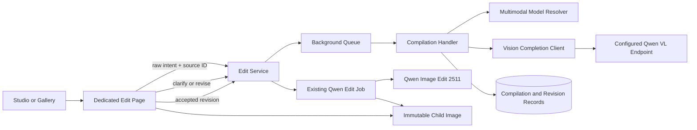

# Phase 1B Implementation Plan - Vision-Aware Image Editing

## Summary

Insert a vision-grounded compilation stage before the existing Qwen edit job and move editing to a
dedicated workbench. Build the reusable multimodal transport once, but keep prompt compilation and
future result validation as separate functions and records. Update the one-pod development host by
removing Pony from the POC and provisioning a pinned Qwen VL service alongside the retained
Juggernaut and Qwen Image Edit capabilities.

## Architecture

## Change Surface

### Domain

- Add edit-session, compilation-attempt, status, result, target-region, and prompt-revision types
  under `DreamGenClone.Domain/RolePlay`.
- Add multimodal capability fields and compiler/validator `AppFunction` values under Model Manager.
- Extend edit image provenance additively; preserve existing public semantics.

### Application

- Add multimodal completion and edit-compilation abstractions.
- Add request/result DTOs with strict validation.
- Keep binary image streams out of persisted job payloads.

### Infrastructure

- Extend SQLite schema, repository queries, indexes, and referential delete guards.
- Implement one OpenAI-compatible multimodal client for the selected vLLM contract.
- Extend safe image storage reads without exposing arbitrary filesystem paths.

### Web Application

- Add strict multimodal model resolution.
- Add Qwen edit compiler prompt builder/parser based on the official edit guidance and accepted
  local proof language.
- Add compilation job type, payload, handler, orchestration, and debug events.
- Tighten `SceneImageService.EnqueueEditAsync` so an accepted compilation revision is mandatory.
- Reserve the validator function/configuration boundary without implementing Phase 4 validation.

### UI

- Add `SceneImageEditor.razor` and scoped CSS after reading the full Razor instructions/context.
- Add edit navigation from Studio and gallery; remove or retire the inline raw-pass-through action.
- Provide source preview, raw request, preparation state, grounded summary, clarification flow,
  advanced compiled prompt, execution action, source/result comparison, and lineage history.
- Use stable responsive dimensions and do not place cards inside cards.

### RunPod

- Enforce one pod and one persistent volume for Juggernaut, Qwen Edit, and Qwen VL. Separate
  runtimes are dependency/process isolation on that pod, not separate pods.
- Add pinned vision runtime provision/start/stop/health scripts and artifact manifest.
- Add a capacity/inventory script that reports persistent disk and GPU memory without deleting.
- Add an exact-path Pony retirement script requiring expected path, size, hash, and explicit model
  name confirmation; no wildcard deletion.
- Prove and persist either simultaneous model residency or explicit same-pod load/unload scheduling.
- Keep the retained Juggernaut and Qwen editor artifacts unchanged unless verification finds a
  concrete defect.

### Tests

- Schema/parser and prompt-builder tests, including malformed and ambiguity cases.
- Resolver capability/no-fallback tests.
- Multimodal request JSON tests ensuring image and schema are sent and binary data is not logged.
- Repository/migration/staleness/revision/delete-guard tests.
- Service and handler state/idempotency/failure tests.
- Existing Qwen edit tests updated to require accepted compilation provenance.
- Razor diagnostics, browser workflow checks, and frozen host/application proof.

## Delivery Slices

1. **Host inventory and proof manifest:** measure disk/VRAM, freeze candidate, verify Pony impact.
2. **Vision runtime proof:** provision pinned Qwen VL on the same pod, then test schema output and
  the frozen corpus outside the application.
3. **Persistence and contracts:** additive schema, records, strict parser, repository invariants.
4. **Multimodal infrastructure:** capability/config UI, resolver, client, health diagnostics.
5. **Compilation pipeline:** builder, job, debug events, staleness and clarification orchestration.
6. **Dedicated editor:** full workbench, advanced prompt revision, comparison and lineage.
7. **Qwen enforcement:** remove raw pass-through and require exact accepted revision provenance.
8. **Pod migration:** remove Pony configuration and its verified checkpoint, install/finalize Qwen
  VL on the same pod, and prove all three retained capabilities plus capacity evidence.
9. **Acceptance:** frozen corpus, existing six edit intents through app, manual browser matrix, build
   and full test suite.

Each implementation slice receives focused executable validation immediately after its first edit,
then solution build and full tests before being marked complete.

## Pod Sequencing Decision

Pony is no longer part of the POC. Record its artifact and configuration impact before deleting it,
then use the reclaimed space for the vision model on the same pod. The authorized migration order
is:

1. stop/empty queues;
2. inventory and hash;
3. disable Pony as a deployed Model Manager option;
4. remove only the verified checkpoint;
5. verify reclaimed bytes;
6. provision and hash the vision artifact/runtime;
7. execute health/corpus/capacity checks;
8. verify Juggernaut, Qwen Edit, and Qwen VL from the same pod;
9. record endpoint configuration and whether same-pod GPU model unload/switching is required.

If Qwen VL provisioning fails after Pony deletion, preserve the failure evidence and repair the
Qwen VL deployment forward. Do not reinstall Pony as part of this phase and do not create a second
pod or silently reroute requests.

## Blast Radius

The change touches shared model invocation, Model Manager, SQLite, background jobs, scene-image
editing, and two Razor navigation surfaces. The RP continuation/prompt engine remains untouched.
Existing generated images and manual edit rows remain readable; new edits require compilation.

The highest product risk is confident but incorrect visual grounding. The control is strict
ambiguity output, frozen labeled evaluation, visible review, and no automatic approval. The
highest operational risk is losing a working host artifact on a full volume; the control is exact
inventory/hash verification, no wildcard deletion, pinned reprovisioning, and measured free-space
gates before every download.

## Rollout

Enable the dedicated editor only after a compiler model/configuration is complete and its corpus is
accepted. Existing historical edit records remain displayable. New raw edit enqueue requests fail
with migration guidance rather than bypassing compilation. Phase 2 may start after this phase's
exit gate; Phase 4 reuses the multimodal transport but implements a separate validator contract.