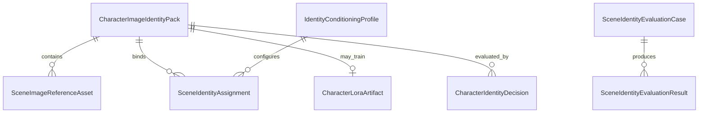

# Phase 2 Data Model - Character Identity

## Entities

### `CharacterImageIdentityPack`

| Field | Type | Rule |
|---|---|---|
| `Id` | string | Primary key. |
| `CharacterProfileId` | string | Required owner. |
| `Version` | int | Positive and unique per character. |
| `Status` | enum | `Draft`, `Approved`, `Superseded`. |
| `DescriptorSnapshotJson` | string | Stable visual descriptor at approval. |
| `CanonicalFaceAssetId` | string? | Required for approval. |
| `SupersedesId` | string? | Previous pack version. |
| `CreatedUtc`, `ApprovedUtc` | timestamp | Approval time required when approved. |

### `SceneImageReferenceAsset`

Fields: `Id`, `IdentityPackId`, `AssetKind` (`Face`, `FullBody`, `Wardrobe`),
`FileRelativePath`, `MediaType`, `Width`, `Height`, `ByteLength`, `Sha256`, `SourceLabel`,
`ConsentState` (`Unknown`, `Confirmed`, `NotApplicable`), `IsApproved`, `CreatedUtc`.

`Unknown` consent cannot be approved. A referenced file is immutable; replacement creates a new
asset. Paths use the existing scene-image storage safety rules.

### `IdentityConditioningProfile`

Persist as Model Manager image-model settings or a dedicated table if the existing registered
model cannot express multiple named profiles. Fields: `Id`, `Name`, `Mechanism`, `CheckpointFamily`,
`WorkflowRevision`, `NodeRevision`, `FaceAdapterArtifact`, `ImageEncoderArtifact`, optional
`AdditionalArtifactJson`, `IdentityStrength`, `StructureStrength`, `SupportsRegionalMasks`,
`Enabled`, `CreatedUtc`, `UpdatedUtc`.

No field has a runtime default. Resolver validation supplies range rules but never substitutes a
value.

### `SceneIdentityAssignment`

| Field | Purpose |
|---|---|
| `Id` | Stable assignment ID. |
| `ImageRecordId` or `RenderAttemptId` | Controlled output owner. |
| `ActorKey` | Stable actor identity in the beat/plan. |
| `IdentityPackId` | Exact approved version. |
| `RegionAssetId` | Exact mask/region file. |
| `ConditioningProfileId` | Exact resolved profile. |
| `StrengthSnapshotJson` | Immutable submitted values. |

### `SceneIdentityEvaluationCase` and `SceneIdentityEvaluationResult`

Cases persist matrix coordinates: character pair, pose key, view key, seed, prompt/control hashes,
and expected constraints. Results reference an output and store each scored dimension as
`Pass`, `Fail`, or `NotScored`, plus notes and reviewer timestamp.

### `CharacterLoraArtifact`

Created only when the LoRA decision is `Required`: `Id`, `IdentityPackId`, `CheckpointFamily`,
`TriggerToken`, `FileRelativePath`, `Sha256`, `TrainingManifestJson`, `DefaultStrength`, `Status`,
and timestamps. `DefaultStrength` is configuration metadata selected by the user, not a hardcoded
runtime fallback.

### `CharacterIdentityDecision`

Fields: `Id`, `IdentityPackId`, `EvaluationRunId`, `Decision` (`NotRequired`, `Required`,
`Deferred`), `Rationale`, `CreatedUtc`.

## Relationships

## State Rules

- Draft packs may change metadata and membership.
- Approval freezes the version and requires one approved canonical face.
- Superseding creates a new draft; old records remain readable.
- Evaluation cases become immutable once a run starts.
- Render attempts move `Pending -> Generating -> Complete|Failed` only.

## Migration Strategy

Use additive `CREATE TABLE IF NOT EXISTS` statements and guarded column additions in
`SqlitePersistence`. Add indexes for `CharacterProfileId`, pack/status, evaluation run, and render
attempt. Do not write synthetic packs for existing characters. Existing prompt-only data remains
valid with no controlled assignment rows.
