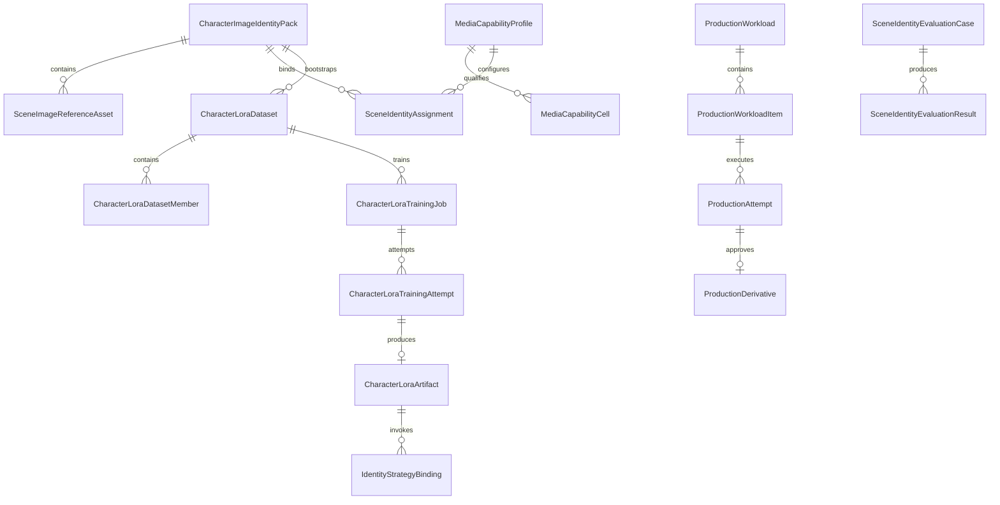

# Phase 2 Data Model - Character Identity

## Entities

### `CharacterImageIdentityPack`

| Field | Type | Rule |
|---|---|---|
| `Id` | string | Primary key. |
| `CharacterProfileId` | string | Required owner. |
| `Version` | int | Positive and unique per character. |
| `Status` | enum | `Draft`, `Approved`, `Superseded`. |
| `DescriptorSnapshotJson` | string | Stable visual descriptor at approval. |
| `CanonicalFaceAssetId` | string? | Required for approval. |
| `SupersedesId` | string? | Previous pack version. |
| `CreatedUtc`, `ApprovedUtc` | timestamp | Approval time required when approved. |

### `SceneImageReferenceAsset`

Fields: `Id`, `IdentityPackId`, `AssetKind` (`Face`, `FullBody`, `Wardrobe`),
`FaceView` (`Front`, `ThreeQuarterLeft`, `ThreeQuarterRight`, `ProfileLeft`, `ProfileRight`;
required for Face assets, null for other kinds),
`FileRelativePath`, `MediaType`, `Width`, `Height`, `ByteLength`, `Sha256`, `SourceLabel`,
`ConsentState` (`Unknown`, `Confirmed`, `NotApplicable`), `IsApproved`, `CreatedUtc`.

`Unknown` consent cannot be approved. A referenced file is immutable; replacement creates a new
asset. Paths use the existing scene-image storage safety rules. A pack may hold multiple classified
face references. A compiler may use only the exact ordered reference layout permitted by its
qualified capability cell; it never guesses a reference from target angle.

### `CharacterBodyProfileVersion` and `CharacterWardrobeLookVersion`

Immutable-on-approval aggregates owned by `CharacterProfileId`. Body versions reference approved
full-body/silhouette/proportion assets. Wardrobe versions reference approved garment/detail/color
assets and structured coverage facts. Attempts bind exact versions; supersession never rewrites
lineage.

### `MediaCapabilityProfile`

Fields include `Id`, `ProviderKey`, `ModelId`, `ModelVersion`, `Operation`, `CompilerId`,
`CompilerVersion`, `WorkflowRevision`, `NodeRevision`, `ArtifactManifestJson`,
`SettingsSchemaJson`, `ReferenceLayoutJson`, `ControlLayoutJson`, `ContentPolicyKey`, `Enabled`,
and timestamps. `MediaCapabilityCell` records actor count, angles, crop, pose/composition class,
operation, reference/control tuple, qualification state, evidence run, and gate result.

No field has a runtime default. Resolver validation supplies range rules but never substitutes a
value.

### `ProductionIntentSnapshot` and `CompiledMediaRequest`

The intent snapshot stores resolved B-100 IDs/versions plus typed character, composition, camera,
style, preservation/change, and policy facts. The compiled record stores exact compiler/profile,
canonical provider request JSON, ordered reference bindings, content hash, and validation result.
Neither stores secrets.

### `ProductionWorkload` and `ProductionWorkloadItem`

The workload is the durable user submission aggregate: session, status, goal, policy, cost/readiness
snapshot, creation/submission timestamps, and item counts. Items bind one intent, selected profile,
variation count, dependency/group key, state, and current-attempt pointer. Items exist before any
provider call.

### `ProductionAttempt` and `ProductionDerivative`

Attempts are append-only executions with attempt number/type, exact request snapshot, provider ID,
state, timing/cost, output/checksum, errors, review result, and supersession relation. A derivative is
an immutable approved asset linked to exactly one successful attempt and all source lineage.

### `SceneIdentityAssignment`

| Field | Purpose |
|---|---|
| `Id` | Stable assignment ID. |
| `ImageRecordId` or `RenderAttemptId` | Controlled output owner. |
| `ActorKey` | Stable actor identity in the beat/plan. |
| `IdentityPackId` | Exact approved version. |
| `RegionAssetId` | Exact mask/region file. |
| `ConditioningProfileId` | Exact resolved profile. |
| `StrengthSnapshotJson` | Immutable submitted values. |

### `SceneIdentityEvaluationCase` and `SceneIdentityEvaluationResult`

Cases persist matrix coordinates: character pair, pose key, view key, seed, prompt/control hashes,
and expected constraints. Results reference an output and store each scored dimension as
`Pass`, `Fail`, or `NotScored`, plus notes and reviewer timestamp.

### `CharacterLoraDataset`

Versioned aggregate owned by one character: `Id`, `CharacterProfileId`, `IdentityPackId`, `Version`,
`Status` (`Draft`, `Frozen`, `Superseded`), `TriggerToken`, `TargetModelFamily`, `CoveragePlanJson`,
`CurationPolicyJson`, `ManifestSha256`, `SupersedesId`, `CreatedUtc`, `FrozenUtc`, and `FrozenBy`.

The initial draft records the approved canonical synthetic identity seed and its generation
attempt. Freezing computes a manifest hash over ordered membership, captions, roles, splits,
asset checksums, and policy/coverage dispositions. Frozen datasets never change.

### `CharacterLoraDatasetMember`

Fields: `Id`, `DatasetId`, `Ordinal`, `SceneAssetId`, `AssetSha256`, `Role` (`IdentitySeed`,
`Training`, `Validation`), `Split` (`Train`, `Validation`), `Caption`, `CaptionRevision`,
`CoverageJson`, `GenerationAttemptId`, `CurationStatus`, `CurationFindingsJson`, `ReviewedBy`, and
`ReviewedUtc`. A member uses the shared asset catalog; it does not introduce another byte store.

### `CharacterLoraTrainingJob` and `CharacterLoraTrainingAttempt`

The job binds one frozen dataset to one exact configured recipe and target base:
`Id`, `DatasetId`, `BaseModelId`, `BaseModelVersion`, `BaseModelSha256`, `TrainerId`,
`TrainerVersion`, `RecipeJson`, `EnvironmentManifestJson`, `Status`, and timestamps. Attempts are
append-only and store provider/worker ID, attempt number, seed, status history, logs/samples/
checkpoint manifests, timing, failure diagnostics, and output metadata. Provider IDs are persisted
before polling; recovery never silently resubmits.

### `CharacterLoraArtifact`

Versioned training output: `Id`, `CharacterProfileId`, `DatasetId`, `TrainingAttemptId`, `Version`,
`BaseModelId`, `BaseModelVersion`, `BaseModelSha256`, `TriggerToken`, `FileRelativePath`, `Sha256`,
`TrainingManifestJson`, `Status` (`Candidate`, `Qualified`, `Rejected`, `Superseded`), and timestamps.
Inference strengths belong to exact qualified capability cells, not an artifact-wide default.

### `IdentityStrategyBinding`

Immutable request binding with `StrategyKind` (`ReferenceConditioning`, `Lora`, `Combined`), ordered
reference bindings where applicable, exact LoRA artifact IDs/checksums and strengths where
applicable, and the exact qualified capability profile/cell. Required fields depend on the strategy;
missing or extra fields fail compilation.

## Relationships

## State Rules

- Draft packs may change metadata and membership.
- Approval freezes the version and requires one approved canonical face.
- Superseding creates a new draft; old records remain readable.
- Evaluation cases become immutable once a run starts.
- Workloads move `Draft -> Ready -> Submitted -> Running -> Reviewable -> Completed|Failed|Cancelled`.
- Items move `Draft -> Ready -> Queued -> Submitted -> Running -> Reviewable -> Approved|Rejected|Failed|Cancelled`.
- Attempts move `Created -> Submitted -> Running -> Succeeded|Failed|Cancelled|Expired` and never
    transition backward. Review/approval is separate from transport success.
- Capability cells move `Draft -> Proving -> Qualified|Rejected|Retired`; only `Qualified` dispatches.
- LoRA datasets move `Draft -> Frozen -> Superseded`; only `Frozen` datasets may train.
- LoRA training jobs move `Draft -> Ready -> Queued -> Running -> Succeeded|Failed|Cancelled`.
- LoRA attempts are append-only; retry creates another attempt and never overwrites prior evidence.
- LoRA artifacts move `Candidate -> Qualified|Rejected -> Superseded`; only exact qualified
    artifact/profile/cell combinations may compile.

## Clean-Baseline Strategy

Create the production tables/schema and stamp newly created sessions with the required production
schema generation. Do not backfill, synthesize, dual-write, or adapt prior session/image rows.
Opening an older session for production fails with create-new-session guidance. Historical proof
fixtures remain readable outside the runtime compatibility contract.
