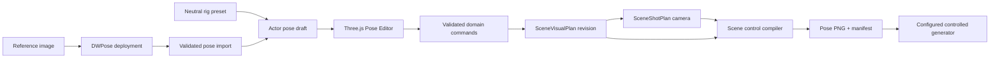

# Pose Editor Design and Build Plan

**Status:** Designed for Phase 3 implementation
**Parent:** B-032 Scene Image Generator, Phase 3 Location and Multi-POV
**Primary tasks:** P3-014 through P3-024

## Purpose

Build a visual pose-authoring mode in Scene Image Studio so a user can initialize an actor from an
image or neutral rig, move hands, feet, knees, head, pelvis, and torso, rotate the actor in depth,
review the result from the active camera, and save a versioned pose control for generation.

DWPose is an optional input adapter. It extracts a two-dimensional pose draft from a reference
image. The editable source of truth is a constrained three-dimensional humanoid rig persisted in
engine-neutral application data. The compiled output is a camera-specific pose image and manifest
that a configured generation workflow may consume.

## Product Boundary

### Included

- Start from a neutral standing, neutral seated, or DWPose-extracted draft.
- Edit one or more adult actor rigs in the shared scene.
- Move actor roots and rotate actors in three dimensions.
- Drag end effectors for hands, feet, head/look target, and pelvis.
- Adjust elbows, knees, shoulders, hips, chest, and head directly when IK needs correction.
- Apply explicit hand targets such as head, shoulder, chest anchor, hip, prop, or free space.
- Preview camera, skeleton, depth ordering, actor ownership, and control-image output.
- Undo/redo and save as a new immutable visual-plan version.
- Compile deterministic pose controls for each frozen shot.
- Preserve semantic relationship intent separately from skeleton geometry.

### Excluded

- General-purpose character modeling, animation timelines, cloth simulation, or mesh sculpting.
- Automatic inference of exact three-dimensional depth from DWPose keypoints.
- A claim that OpenPose/DWPose guarantees hand contact, anatomy, identity, or semantic ownership.
- Silent correction, alternate controls, or prompt-only fallback when required pose data is invalid.
- Editing an approved visual plan in place.

## User Experience

### Entry Points

Scene Image Studio exposes **Pose** as an explicit mode for a draft visual plan. The user chooses:

1. **Neutral pose**: add a standard constrained humanoid rig.
2. **Extract from image**: select an existing scene image or upload a reference, run DWPose, and
   review the imported draft before it changes the editable plan.
3. **Duplicate actor pose**: copy another compatible actor pose without copying identity,
   wardrobe, position, or semantic relationships.

An approved plan opens read-only. **Create revision** produces a new draft before editing.

### Desktop Layout

- A full-height, unframed Three.js viewport is the primary surface.
- A compact left actor list controls selection, visibility, and lock state.
- A compact right inspector contains transform mode, joint constraints, hand/foot targets,
  numeric values, and reset actions.
- A bottom shot strip selects the active camera and toggles rendered skeleton, depth, actor-region,
  and source-image overlays.
- The top toolbar uses icons with tooltips for select, translate, rotate, IK target, undo, redo,
  frame selection, and camera view. Text buttons are reserved for **Extract pose**, **Preview
  control**, **Save revision**, and **Discard draft**.

The viewport, side rails, toolbar, and shot strip use stable constrained dimensions so selection
labels and tool states cannot shift the layout. Panels are not nested cards.

### Mobile Layout

Mobile supports the complete workflow without requiring precise freehand dragging:

- the viewport remains the main surface;
- actor and inspector surfaces open as bottom sheets;
- selecting a joint exposes axis steppers, rotation sliders, target presets, reset, and mirror;
- one-finger orbit and explicit move/rotate modes prevent gesture ambiguity;
- camera and control preview remain available before save.

Desktop is the preferred precision workflow, but mobile is not review-only.

### Editing Examples

| User intent | Editor operation | Persisted result |
|---|---|---|
| Place her right hand on her head | Select right hand, choose the actor's head anchor, drag or offset the target, then inspect elbow and wrist | Right-arm IK target, joint rotations, head-target relationship intent |
| Turn him sideways | Rotate the actor root around world Y; optionally counter-rotate head/look target | Root quaternion plus local joint quaternions |
| Bend one leg | Move the foot target and knee pole target; optionally lock the other foot | Foot/knee targets and constrained hip/knee/ankle rotations |
| Put both feet on the floor | Enable foot locks and move the pelvis/root | Grounded target constraints plus root transform |
| Reach for a prop | Target the hand to a stable object anchor and set contact intent | IK target plus typed actor-object relationship |

## Interaction Model

### Selection and Manipulation

Selection is by stable `ActorKey` and `JointKey`, never a Three.js UUID. Color and outline indicate
the selected actor; joint handles use familiar body-side labels and accessible tooltips.

The editor has four mutually exclusive manipulation modes:

1. **Select**: inspect actor, joint, target, or prop.
2. **Move**: translate actor roots, props, and free IK targets.
3. **Rotate**: rotate actor roots or individual constrained joints.
4. **Target**: attach an end effector to a semantic anchor or create a free target.

Every drag emits one command when committed, not one persistence write per pointer event. Escape
cancels the active drag. Undo/redo operates on validated domain commands.

### Inverse Kinematics

Use `CCDIKSolver` from the repository-pinned Three.js examples rather than implementing an
unverified solver. The first slice uses CCD IK chains for arms and legs with explicit per-joint
limits and pole targets:

- arm: clavicle/shoulder -> upper arm -> forearm -> wrist/hand;
- leg: pelvis/hip -> thigh -> shin -> ankle/foot;
- look: chest/head orientation toward an explicit target;
- pelvis/root: user controlled, with optional foot locks.

IK is an editing aid. Solved local joint quaternions are validated and persisted; solver-internal
state is not. The editor allows direct elbow/knee correction after a solve. Joint limits prevent
obvious hyperextension but do not claim medical or anatomical validation.

### Semantic Targets

Rig and object anchors have stable semantic keys such as `head.center`, `shoulder.left`,
`chest.center`, `hip.right`, and `prop:<ObjectKey>:grip`. Attaching a hand creates both:

- a geometric IK target; and
- a typed relationship intent owned by the visual plan.

The relationship remains visible and separately reviewable because a projected skeleton cannot
prove contact, front/back surface, or ownership in the generated image.

### Constraints and Warnings

The editor blocks save for non-finite transforms, unknown keys, invalid quaternion normalization,
negative scale, missing required joints, or an IK chain that cannot be serialized. It warns, but
does not silently change the pose, for:

- target outside configured limb reach;
- self-intersection heuristics;
- feet below or substantially above the ground plane;
- left/right inversion relative to the active camera;
- unresolved DWPose joints or low-confidence imports;
- required relationship anchors with visible geometric separation.

Warnings require user acknowledgement when the affected relationship is `Required`.

## DWPose Import

### Request and Result

The application sends source image bytes to the configured `pose-dwpose-prod` deployment. The
service returns:

- rendered pose-control PNG;
- normalized body, hand, and face keypoints with confidence values;
- source dimensions and transform metadata;
- model, node, runtime, and artifact revisions;
- response checksum and timing.

No shared filesystem path crosses the pod boundary.

### Import Rules

DWPose coordinates are two-dimensional observations, not a complete 3D pose. Import therefore:

1. maps recognized joints to the canonical rig;
2. projects them onto the active camera's reference plane;
3. uses the configured neutral rig for unobserved depth and missing joints;
4. marks inferred, missing, and low-confidence joints visibly;
5. creates a reviewable draft without overwriting current actor state;
6. requires explicit **Accept imported pose** before applying it.

The importer never invents actor identity. For multiple people, the user maps each detected pose to
an existing `ActorKey`; ambiguous mapping blocks acceptance.

## Architecture



### Ownership Boundaries

- **Razor component:** workflow state, commands, validation messages, save/revision orchestration.
- **JavaScript module:** Three.js scene, picking, gizmos, IK preview, camera interaction, and pixel
  buffer export.
- **Domain/application:** canonical rig DTOs, constraints, commands, versioning, validation,
  staleness, compilation, and provenance.
- **DWPose client:** binary request/response transport and exact runtime identity checks.
- **Generator client:** consumes compiled assets only; it never reads editor or DWPose internals.

## Engine-Neutral Data Contract

Extend `SceneVisualActor.SkeletonJson` through a versioned schema containing:

- `SchemaVersion`, `RigDefinitionId`, `RigDefinitionVersion`;
- root transform in the Phase 3 centimeter/Y-up/right-handed convention;
- stable joints with parent key, local position, normalized local quaternion, and confidence;
- joint limits and source (`NeutralPreset`, `DWPoseImport`, `UserAuthored`);
- IK targets with target key, end-effector key, world transform, optional semantic anchor, and lock;
- pole targets for elbows and knees;
- import provenance and unresolved-joint list.

Add or formalize these records:

| Record | Purpose |
|---|---|
| `PoseRigDefinition` | Versioned canonical joint hierarchy, rest pose, limits, IK chains, anchors, and compatible control schema |
| `ScenePoseImport` | Source checksum, DWPose output, keypoint mapping, runtime identity, actor mapping, warnings, and status |
| `ScenePoseCommand` | Validated undoable operation used in the active draft; may be compacted when a revision is saved |
| `SceneControlAsset` with `ControlKind=Pose` | Camera-specific rendered skeleton/control PNG and integrity metadata |

Do not persist Three.js object graphs, UUIDs, solver caches, renderer state, or transient drag
coordinates.

## Application Contracts

```csharp
public interface IScenePoseExtractionClient
{
    Task<ScenePoseExtractionResult> ExtractAsync(
        ResolvedPoseDeployment deployment,
        Stream sourceImage,
        ScenePoseExtractionRequest request,
        CancellationToken cancellationToken);
}

public interface IScenePoseImportService
{
    ScenePoseImportDraft BuildDraft(
        ScenePoseExtractionResult extraction,
        PoseRigDefinition rig,
        SceneShotPlanSnapshot referenceShot,
        IReadOnlyDictionary<string, string> detectedPoseToActorMap);
}
```

The existing `ISceneControlCompiler` remains the only path from an approved visual-plan/shot pair
to control assets. It validates exact rig, plan, shot, compiler, and spatial-control-profile
versions before exporting a pose image.

Required JS interop operations extend the Phase 3 contract with:

- `loadPoseRig`, `selectJoint`, `beginPoseCommand`, `commitPoseCommand`, `cancelPoseCommand`;
- `setIkTarget`, `setPoleTarget`, `setJointRotation`, `setRootTransform`;
- `setGroundLock`, `setSemanticTarget`, `previewIkSolve`;
- `exportPoseState`, `renderPoseControl`, and `renderDepthPreview`.

All interop payloads are schema-versioned and validated on both sides.

## Control Compilation

For each frozen shot, compilation:

1. loads one exact visual-plan revision and one compatible shot revision;
2. transforms canonical joints through actor and camera transforms;
3. applies visibility and occlusion rules without dropping required actors silently;
4. renders the configured body/hand/face control convention at exact target dimensions;
5. produces the pose PNG and optional diagnostic joint JSON;
6. hashes both outputs and writes the canonical control manifest;
7. marks older manifests stale when pose, camera, rig, compiler, or profile versions change.

The browser preview and persisted compiler must share pixel fixtures and canonical colors/line
widths. A preview mismatch blocks promotion of the compiler version.

## Model Manager and Deployment

Add a pose capability/configuration surface only when the standalone DWPose service contract is
proven. Persist exactly one selected deployment and all behavior controls:

- deployment key and current inference endpoint;
- model/node/runtime/artifact revisions and readiness identity;
- request, transition, and idle timeouts;
- maximum image bytes, pixels, dimensions, and accepted media types;
- body/hand/face switches and extraction resolution;
- queue and concurrency limits;
- output schema version and confidence policy;
- lifecycle strategy `ManagedDedicatedPod`.

Missing or invalid configuration fails explicitly. There is no hidden DWPose endpoint, timeout,
confidence threshold, neutral-rig substitution, or alternate pose extractor.

## Build Slices

### Slice 0 - Standalone contracts and proof

- Pin and provision the dedicated DWPose runtime and both required TorchScript assets.
- Define strict request, response, readiness, and identity contracts.
- Prove one single-person and one two-person extraction, including keypoint JSON and control PNG.
- Record hashes, timing, GPU/volume headroom, and failure behavior; stop the pod after proof.

**Gate:** no application integration until the dedicated pod passes binary transport, identity,
schema, and artifact checks.

### Slice 1 - Rig domain and deterministic fixtures

- Add the canonical rig definition, skeleton schema, joint limits, IK target schema, validators,
  and neutral standing/seated fixtures.
- Add serialization, quaternion, hierarchy, left/right, bounds, and migration tests.
- Add visual-plan revision and staleness behavior for pose changes.

**Gate:** save/reload produces equivalent engine-neutral pose state within documented tolerance.

### Slice 2 - Read-only Three.js pose viewer

- Pin Three.js and its examples modules through the repository asset strategy.
- Render actor rigs, joints, semantic anchors, ground plane, camera, and selection state.
- Implement deterministic initialization/disposal and responsive desktop/mobile layout.
- Add source-image and compiled-control overlays.

**Gate:** desktop/mobile browser screenshots and canvas-pixel checks prove a nonblank, correctly
framed scene with no overlapping controls and no leaked renderer on navigation.

### Slice 3 - Direct joint and root editing

- Add selection, root translation/rotation, constrained joint rotation, numeric controls,
  undo/redo, reset, mirror, and save-as-version.
- Persist domain commands only on commit and validate before save.

**Gate:** hand-authored standing, side-facing, seated, and asymmetric-leg poses survive reload and
produce stable DTO hashes.

### Slice 4 - IK and semantic targets

- Add arm/leg CCD IK, elbow/knee pole targets, foot locks, look target, reach warnings, and direct
  post-solve correction.
- Add actor and object semantic anchors plus typed relationship intent.
- Implement hand-to-head, hand-to-hip, foot placement, and prop-reach acceptance cases.

**Gate:** all cases are authorable without JSON editing, remain stable after reload, and preserve
actor/left-right ownership. This gate does not assert generated-image contact accuracy.

### Slice 5 - DWPose import

- Add the resolved pose deployment, strict client, extraction job, persistence, and diagnostics.
- Add source-image selection/upload, detected-person mapping, confidence display, draft comparison,
  and explicit acceptance.
- Verify that rejection leaves the current visual plan unchanged.

**Gate:** single- and two-person imports map to the intended actors, expose ambiguity, and create no
silent identity or depth assumptions.

### Slice 6 - Pose control compilation

- Extend the control compiler with camera-specific pose export and canonical manifest entries.
- Add browser/compiler pixel fixtures, output hashes, staleness, and background-job behavior.
- Add control preview and freeze UI.

**Gate:** repeated compilation from identical plan/shot/profile versions produces identical bytes
and hashes.

### Slice 7 - Controlled generation acceptance

- Prove the pinned Juggernaut spatial-control workflow independently before app routing.
- Render neutral, hand-on-head, side-facing, and asymmetric-leg cases using frozen seeds.
- Score macro pose, actor ownership, laterality, cast, identity/wardrobe preservation, and failures.
- Record exact limits: contact and anatomy remain review-required unless separately proven.

**Gate:** only accepted pose-control behavior is exposed. Missing/stale controls fail before
enqueue; no request downgrades to prompt-only generation.

## Test Matrix

### Automated

- Rig hierarchy, cycle rejection, required joints, limits, normalized quaternions, and finite values.
- Command apply/revert, undo/redo, mirror, serialization, versioning, and hash stability.
- DWPose schema/media/size validation, actor mapping, confidence flags, and provenance.
- Plan/shot/control staleness and exact-version resolution.
- Pose PNG dimensions, canonical colors, joint ownership, left/right fixtures, and manifest hashes.
- Missing configuration, unavailable deployment, failed readiness, and no-fallback paths.
- JS interop initialization/disposal and malformed payload rejection where practical.

### Browser

- Desktop and mobile viewport framing, manipulation controls, sheets/rails, and text containment.
- Select and edit two actors without ownership confusion.
- Hand-to-head, side-facing, bent-leg, foot-lock, undo/redo, save/reload, and camera switch.
- Nonblank WebGL and pose-control canvases verified by pixel checks.
- Navigation disposes renderer, listeners, textures, controls, and object URLs.

### Manual Generation

- Neutral reference baseline.
- One actor's right hand moved to their own head.
- One actor turned side-on while another remains front-facing.
- One asymmetric bent-leg or kneeling pose.
- Two-person case proving actor and left/right assignment.

Use frozen plans, shots, model/workflow revisions, parameters, and seeds. Report failures rather
than selecting a favorable seed.

## Acceptance Criteria

- A user can create each manual test pose without editing JSON or numeric coordinates directly.
- Imported DWPose data is always a reviewable draft and never silently becomes authoritative.
- Every pose edit is attributable to an actor and survives save/reload within numeric tolerance.
- Approved plans remain immutable; edits create a new revision and stale affected controls.
- Pose controls compile deterministically for every frozen shot and retain complete provenance.
- The editor remains usable on desktop and mobile with no overlapping UI or blank canvas.
- Invalid or missing pose deployment/control configuration fails explicitly with no fallback.
- Documentation and UI state that pose control guides macro geometry but does not guarantee exact
  semantic contact or anatomy.

## Recommended Implementation Order

Do not start with the draggable skeleton UI. Complete Slice 0 and Slice 1 first so the editor has a
proven service boundary and a stable domain format. Then build the read-only viewport, direct
editing, IK, DWPose import, deterministic control compilation, and generation acceptance in that
order. This keeps each slice independently testable and prevents transient Three.js state or
DWPose output from becoming the persistence contract.