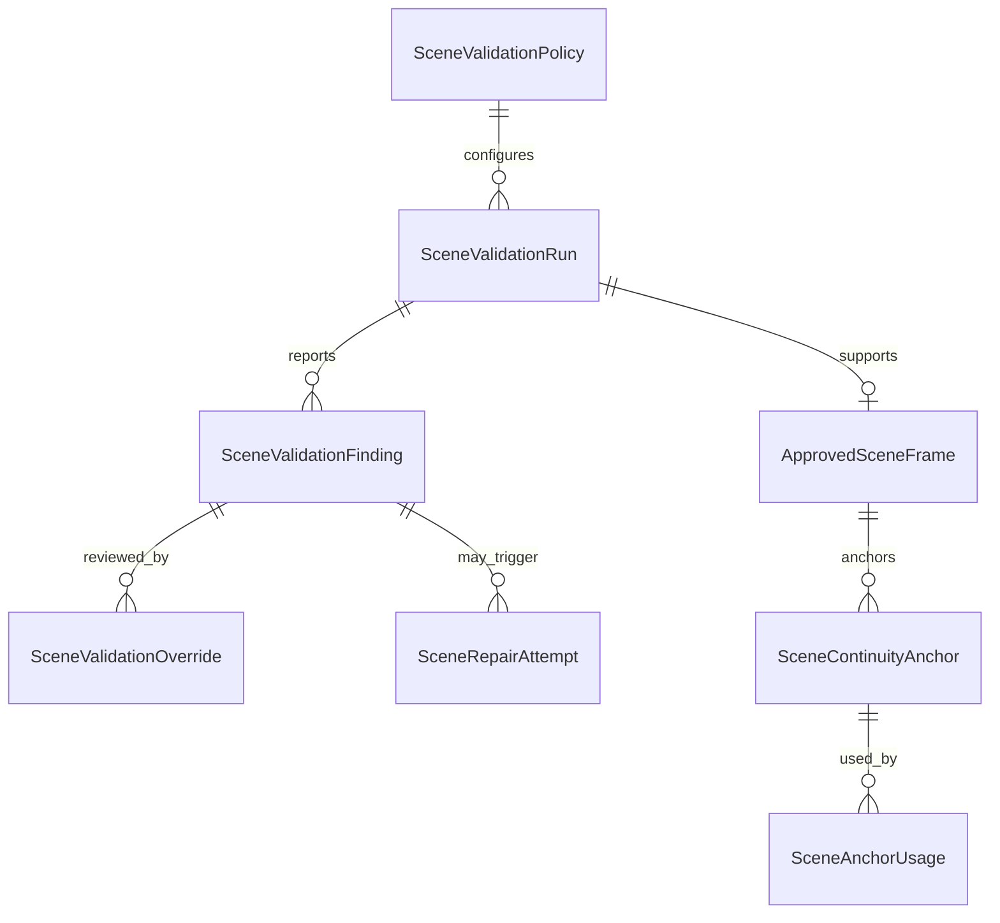

# Phase 4 Data Model - Validation, Repair, and Anchors

## `SceneValidationPolicy`

Versioned configuration: `Id`, `Name`, `Version`, `Status`, `ValidatorModelId`,
`PromptSchemaVersion`, `RulesJson`, `RepairPoliciesJson`, `CreatedUtc`, `ApprovedUtc`,
`SupersedesId`.

`RulesJson` contains each finding code's applicability, required confidence, review behavior, and
severity. `RepairPoliciesJson` contains eligible codes, action, maximum attempts, approval mode,
model/function, and escalation. Approval validates every required field; no runtime defaults.

## `SceneValidationRun`

Fields: `Id`, `RenderAttemptId`, `SceneVisualPlanId`, `SceneShotPlanId`, `ControlManifestId`,
`PolicyId`, `Status`, `ExpectedConstraintsJson`, `ResolvedModelSnapshotJson`,
`PromptSchemaVersion`, `RawResponse`, `Error`, timestamps.

States: `Pending -> Validating -> ReviewRequired|Passed|Failed`. `Passed` means validators found no
unsatisfied required constraints; it is not image approval.

## `SceneValidationFinding`

Fields: `Id`, `ValidationRunId`, `FindingCode`, `ConstraintKey`, `SubjectKey`, optional `ObjectKey`,
`Status` (`Pass`, `Fail`, `Unknown`, `Conflict`), `Severity`, `Confidence`, `EvidenceRegionsJson`,
`Rationale`, `SuggestedAction`, `ValidatorKind`, `ValidatorVersion`, timestamps.

Confidence is nullable for deterministic findings. Evidence regions use normalized image
coordinates and may identify the full image.

## `SceneValidationOverride`

Fields: `Id`, `FindingId`, `Decision`, `Reason`, `ReviewerId`, `CreatedUtc`. Overrides append; they
do not mutate the original finding. The latest valid override is materialized by repository query.

## `SceneRepairAttempt`

Fields: `Id`, `SourceRenderAttemptId`, `SourceValidationRunId`, `FindingId`, `PolicyId`,
`Action`, `Ordinal`, `Status`, `Instruction`, optional `MaskAssetId`,
`DerivedRenderAttemptId`, `Error`, timestamps.

Unique index: `(SourceRenderAttemptId, FindingId, PolicyId, Ordinal)`. The repository reserves the
next ordinal and checks the policy bound transactionally.

## `ApprovedSceneFrame`

Fields: `Id`, `RenderAttemptId`, `ValidationRunId`, `ApprovalDecision`, `ReviewerId`, `Notes`,
`ImageSha256`, `CreatedUtc`, optional `RevokedUtc`. Revocation does not delete the record.

## `SceneContinuityAnchor`

Fields: `Id`, `AnchorKey`, `Version`, `Scope` (`Character`, `Location`, `Wardrobe`, `Object`, `Shot`,
`Composite`), `ApprovedSceneFrameId`, `SourceEntityKeysJson`, `CropRegionsJson`, `UsageNotes`,
`Status`, `SupersedesId`, timestamps.

## `SceneAnchorUsage`

Fields: `Id`, `ContinuityAnchorId`, `TargetVisualPlanId` or `TargetValidationRunId`, `UsageKind`,
`ResolvedSnapshotJson`, `CreatedUtc`. This makes anchor influence explicit.

## Relationships

## Retention

Validation raw text and metadata remain in SQLite subject to existing debug/session retention.
Masks/crops remain in safe asset storage with checksums. Approved frames and referenced anchors
cannot be deleted while active; revocation/supersession is the supported history-preserving action.
