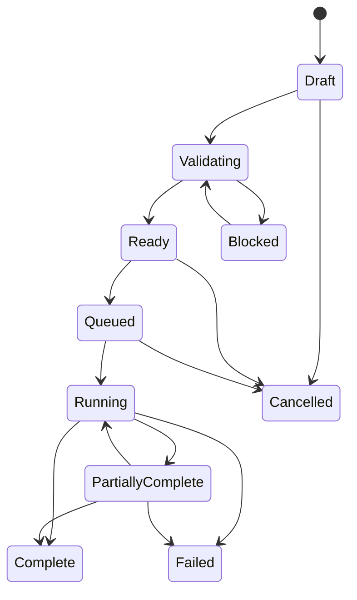

# B-032 Production Architecture

**Status:** Approved design; implementation not started for the cross-phase production system  
**Version:** 2026-09-02  
**Applies to:** B-032 Phase 2 Character Identity and Phase 3 Location and Multi-POV  
**Upstream producer:** B-100 Progressive Beat, Moment, and Multimodal Production Pipeline  
**Infrastructure owner:** B-102 Serverless Migration  
**Downstream consumer:** B-101 Story Presentation Timeline, Storyboard Studio, and Visual Novel Player

## 1. Purpose

Phase 2 and Phase 3 deliver one visual-production system. Phase 2 establishes approved character,
body, and wardrobe identities and proves how they survive composition. Phase 3 adds approved
locations, world-space blocking, shot families, spatial controls, and multi-POV continuity.

The system is built around five rules:

1. Users author production intent and select authoritative assets; they do not author model syntax.
2. B-032 consumes typed, frozen B-100 facts and never re-analyzes raw roleplay prose.
3. Versioned model-family compilers produce complete provider-native requests deterministically.
4. Work is prepared as a durable local workload before any provider submission.
5. Every output is an immutable attempt with enough lineage to inspect, reproduce, compare, and
   approve it.

## 2. Clean-Baseline Policy

Phase 2 and Phase 3 require sessions created after the new production schema is installed.
Compatibility with legacy sessions and scene-image rows is explicitly out of scope.

Implementation consequences:

- no data backfill or synthetic identity/location/workload records;
- no dual-read or dual-write repositories;
- no legacy-to-new request adapter;
- no requirement that pre-Phase-2 sessions open in Production Studio;
- no hidden fallback to the Phase 1 one-off job model;
- schema work may replace obsolete development tables rather than preserve their row shape;
- the live development database may be recreated from the approved sanitized snapshot or clean
  schema according to the repository database workflow;
- proof reports, frozen fixtures, approved reference files, and source-controlled workflow JSON
  remain evidence and are not discarded merely because runtime rows are reset.

The UI must identify an unsupported legacy session and direct the operator to create a new session.
It must not partially import or guess missing production state.

## 3. Epic Ownership

| Concern | Owner | Contract |
|---|---|---|
| Beat and Moment discovery | B-100 | Produces typed, versioned production facts. |
| Visible cast, action, wardrobe state, location key, continuity, dialogue/audio/video intent | B-100 | Frozen facts; changes require a new B-100 revision. |
| Character, body, wardrobe, and location asset curation | B-032 | Approved versioned assets with provenance and policy. |
| Still-image and image-edit compilation | B-032 | Deterministic model-family compiler. |
| Shot blocking, controls, attempts, review, and approval | B-032 | Production records defined here and in Phase 2/3. |
| Provider transport, worker deployment, endpoint lifecycle, and network volumes | B-102 | Executes a fully compiled request without changing semantics. |
| Timeline placement, timing, publication, and playback | B-101 | Consumes approved immutable derivatives only. |

B-032 entry points accept `CompiledMediaBrief`/Moment lineage and approved asset IDs. They must
reject a raw `RolePlaySession`, interaction transcript, or unversioned story fragment.

## 4. End-to-End Flow


1. The operator chooses a story range, Beat, Moment, or shot family.
2. B-032 imports exact B-100 fact/version references into a `ProductionIntentSnapshot`.
3. Readiness resolves approved character, body, wardrobe, location, pose, and control assets.
4. A capability selector evaluates qualified model/workflow profiles. Unsupported intent blocks
   preparation with an explicit reason.
5. The selected compiler creates an immutable `CompiledMediaRequest`.
6. The operator stages one or more compiled requests into a `ProductionWorkload`.
7. The dispatcher groups compatible items and submits bounded waves using provider-native APIs.
8. Provider IDs, request snapshots, status changes, responses, and downloaded bytes are persisted.
9. The operator compares attempts and approves or rejects derivatives.
10. B-101 references approved derivative IDs; it never takes ownership of attempts or approval.

## 5. Typed Production Intent

Provider-neutral intent is structured data, not a universal prompt string.

### 5.1 Still generation intent

Required fields:

- source B-100 Beat/Moment IDs and schema versions;
- visible actor keys and exact identity/body/wardrobe version IDs;
- arrested action and relationship intents;
- exact location profile/state version;
- camera framing, viewpoint, angle, lens intent, depth-of-field intent, and aspect ratio;
- composition, lighting, palette, style, mood, content policy, and output purpose;
- required, preferred, and excluded visual constraints;
- optional approved pose/depth/region/semantic control references.

### 5.2 Source-edit intent

Required fields:

- source image derivative ID and checksum;
- ordered reference bindings with role (`Identity`, `Wardrobe`, `Location`, `Style`, `Object`);
- exact requested changes;
- exact preservation constraints;
- optional mask/region binding;
- output dimensions and policy.

Generation and editing are separate compiler capabilities. An edit compiler cannot be selected as a
silent substitute for a failed generation compiler.

### 5.3 Future modality intents

The workload and asset architecture must admit TTS, sound-effect, music, and video items without
putting those provider grammars into the image compiler. Each modality receives a distinct typed
intent and compiler. Phase 2/3 implement image and image-edit items; audio/video contracts are
forward-compatible boundaries, not Phase 2/3 implementation scope.

## 6. Compiler Architecture

### 6.1 Contract

```csharp
public interface IMultimodalMediaCompiler
{
    MediaCompilerIdentity Identity { get; }
    MediaCapabilityProfile Capabilities { get; }

    CompilationReadiness Evaluate(
        ProductionIntentSnapshot intent,
        ApprovedAssetSet assets,
        ResolvedMediaModel model);

    CompiledMediaRequest Compile(
        ProductionIntentSnapshot intent,
        ApprovedAssetSet assets,
        ResolvedMediaModel model);
}
```

`Compile` is deterministic for identical input snapshots. It performs no network call and no
repository lookup. All inputs are resolved before invocation.

### 6.2 Compiler identity

Every compiler identity includes:

- compiler key and semantic version;
- modality and operation (`Generate`, `Edit`);
- exact model family and supported model/version selectors;
- request schema version;
- source evidence revision;
- implementation assembly version.

### 6.3 Family separation

At minimum, distinct compilers exist for:

- Pony V6 XL tag-based generation;
- SDXL/Juggernaut/BigLust natural-language generation;
- FLUX.2 generation and multi-reference editing;
- Qwen Image generation;
- Qwen Image Edit 2511 multi-reference editing;
- provider API families whose legal request fields differ.

A provider adapter may transport requests for several families, but it may not normalize away
family differences.

### 6.4 Forbidden compiler behavior

A compiler must not:

- read raw RP prose;
- call DeepSeek or another LLM to invent or polish the provider prompt;
- send a field unsupported by the exact selected model;
- generate a negative prompt for FLUX.2;
- insert hardcoded runtime defaults when required configuration is absent;
- change identity/reference ownership;
- swap providers or models;
- omit unsupported canonical intent silently;
- mutate an approved source asset or production intent.

Optional semantic inference is allowed only before compilation, through a separately configured,
schema-bound service. Its structured result is validated, versioned, reviewable, and persisted as
input. It is never hidden inside a compiler.

### 6.5 Compiled request snapshot

`CompiledMediaRequest` contains:

- compiler identity;
- intent and asset-set hashes;
- provider/model/endpoint/workflow identity;
- exact positive/negative/structured prompt payload as applicable;
- ordered reference bindings and checksums;
- masks and control bindings;
- sampler, scheduler, steps, guidance, dimensions, seed, and other legal configured fields;
- content-policy declaration;
- estimated unit count and cost basis;
- unsupported/warning list, which must be empty for `Ready`;
- canonical serialized provider request body.

## 7. Capability And Qualification

A `MediaCapabilityProfile` describes facts proven for one exact tuple:

`provider + model version + workflow revision + compiler version + operation + reference layout`.

Capabilities include:

- supported operation and modalities;
- reference count and reference roles;
- multi-person support and maximum qualified visible actors;
- qualified face angles, crops, shot distances, and composition classes;
- body and wardrobe preservation support;
- mask, region, pose, depth, semantic control, and LoRA support;
- legal request parameters and ranges;
- output dimensions and total megapixel constraints;
- policy and license restrictions;
- qualification status and evidence-run ID.

Qualification is cell-based. Passing a near-frontal single-person IP-Adapter test qualifies only
that cell. It does not qualify angled faces, full body, interacting actors, or another checkpoint.
The selector returns `Unsupported` when no qualified profile covers every required cell.

Statuses are `Candidate`, `Qualified`, `Rejected`, `Suspended`, and `Superseded`. Only `Qualified`
profiles may produce production workloads.

## 8. Durable Workloads

### 8.1 Aggregate

A `ProductionWorkload` is the operator-approved submission unit. It contains immutable intent and
compiled-request references plus mutable execution state.

Workload states:



A terminal workload is immutable except for operator notes and retention actions. Retrying failed
items creates new attempts under the same item or a new workload revision; it never overwrites an
attempt.

### 8.2 Workload item

Each item stores:

- workload and ordinal;
- Beat/Moment/visual-plan/shot lineage;
- compiled request ID;
- compatibility key;
- priority and dependency item IDs;
- state, retry count, and configured retry policy snapshot;
- estimated and realized cost;
- current attempt ID;
- timestamps and explicit failure code.

### 8.3 Compatibility grouping

Items may share a provider submission wave only when these values match:

- modality and operation;
- provider, endpoint, model/version, and workflow revision;
- compiler and request schema version;
- policy class;
- required artifact set and worker image;
- dimensions or provider-supported batching shape;
- reference accessibility and retention policy.

Grouping is an optimization, not a semantic rewrite. Every item remains independently traceable.

### 8.4 Provider dispatch

Dispatchers translate a prepared group into the provider’s documented transport:

- RunPod queue jobs for custom long-running workers;
- Together image requests, including `n` variations only where supported;
- direct BFL asynchronous request/polling where configured;
- future provider-native audio/video task APIs.

Together JSONL Batch is not an image dispatch mechanism unless Together documents image support in
the exact API version and the capability profile is requalified.

### 8.5 Recovery

Provider request ID and status URL are persisted before polling. Any signed or short-lived result
URL is downloaded immediately into application-owned storage. On restart, the reconciler resumes
from persisted provider IDs. It never resubmits an item merely because local polling stopped.

If provider state has expired and no owned result exists, the attempt becomes `Indeterminate` with
an explicit diagnostic. Operator-directed retry creates a new attempt.

## 9. Attempts, Assets, And Approval

### 9.1 Attempt invariants

Every `ProductionAttempt` stores:

- exact compiled request bytes and hash;
- provider submission and response snapshots with secrets removed;
- provider request/job ID;
- timestamps and state history;
- all source asset IDs/checksums;
- model, workflow, compiler, worker, and configuration revisions;
- seed and sampling/settings values;
- output file metadata and checksum;
- estimated/realized cost and duration;
- parent attempt and repair source IDs;
- failure category and diagnostic.

States are monotonic: `Pending -> Submitted -> Running -> Succeeded|Failed|Cancelled|Indeterminate`.
Late provider results cannot overwrite another attempt.

### 9.2 Unified production asset

The Asset Manager indexes images now and later audio/video through one metadata contract:

- media kind and purpose;
- owning scope and authoritative subject/location keys;
- source/import/generated status;
- checksum, media type, dimensions/duration, storage path;
- provenance, consent, license, and content policy;
- approval status and version lineage;
- reference roles and compatibility tags;
- attempt and derivative lineage.

Modality-specific tables may hold technical metadata, but browsing, selection, lineage, retention,
and approval use shared identifiers and components.

### 9.3 Approval

Approval creates an immutable `ApprovedMediaDerivative` reference to one successful attempt output.
It records reviewer, timestamp, use scope, qualification profile, and source lineage. Rejection
records a reason without deleting the attempt.

B-101 receives only approved derivative IDs. Revoking approval prevents new placement but does not
rewrite an already published immutable B-101 revision.

## 10. Production Studio

The primary experience is a persistent work surface, not a sequence of generation cards.

### 10.1 Stable regions

- **Context rail:** scenario, session, Beat, Moment, visual plan, and shot-family navigation.
- **Media pool:** approved identity/body/wardrobe/location assets and generated derivatives.
- **Canvas:** composition preview, blocking editor, source edit, or output comparison.
- **Inspector:** semantic intent, exact references, capability/readiness, and model-native request.
- **Attempt strip:** variations, revisions, repairs, scores, approval, and lineage.
- **Queue workspace:** staged workloads, grouping, cost/readiness, progress, failures, and retry.
- **Timeline strip:** local Moment/shot sequence and B-101 handoff status.

The selected context and working set persist across navigation and reload. Switching Moments or
shots restores the applicable assets, drafts, attempts, and queue selection.

### 10.2 User-visible controls

Users control semantic values: who is visible, authoritative references, wardrobe/location state,
shot framing, pose/blocking, preservation/change intent, policy, quality/cost target, variations,
and approval. Provider syntax is inspectable for diagnostics but is not required authoring input.

### 10.3 Readiness

Before workload creation, the UI lists:

- exact resolved assets and versions;
- qualified compiler/model/workflow;
- unsupported requirements;
- missing or stale inputs;
- item count and provider grouping;
- estimated cost and expected output count;
- endpoint readiness and artifact availability.

`Prepare workload` is disabled until all blocking issues are resolved. Warnings require explicit
acknowledgement and are snapshotted.

## 11. Configuration And No-Fallback Rules

All runtime behavior controls are UI-backed and persisted:

- provider/model/workflow/compiler selection policy;
- model-native sampling/settings fields;
- reference and control capabilities;
- queue concurrency and bounded retry policy;
- endpoint readiness/timeout policy;
- retention/download policy;
- content policy;
- qualification activation.

Missing or incompatible configuration fails with the field, model, and intended operation named.
There is exactly one selected path per workload item. No path may downgrade from scene-controlled
to identity-only, identity-controlled to prompt-only, multi-reference to single-reference, or one
provider/model to another.

## 12. Security, Policy, And Retention

- API keys remain encrypted and never enter snapshots, logs, or exported diagnostics.
- Local storage paths are relative, normalized, and root-confined.
- Reference ingest records source, consent, license, checksum, and policy.
- Adult-content eligibility is explicit for provider, model, workload, and asset.
- Provider safety controls are sent exactly as configured and recorded without secret material.
- Provider-hosted files are treated as transient; application-owned copies are authoritative.
- Deletion is blocked while an asset is referenced by an approved pack, frozen plan, workload,
  attempt, approved derivative, or publication.

## 13. Observability

Structured events cover:

- intent imported and readiness evaluated;
- compiler selected/rejected and request compiled;
- workload prepared, validated, queued, cancelled, completed;
- group dispatched and provider ID recorded;
- attempt status transition, result captured, and recovery reconciled;
- asset approved/rejected/superseded;
- derivative handed to B-101.

Events include correlation IDs and version/hash lineage. They exclude secrets and raw binary data.
The inspector exposes the same execution timeline, request snapshot, source lineage, and failure
code used by support diagnostics.

## 14. Implementation Boundaries

Likely ownership:

- `DreamGenClone.Domain/RolePlay`: intent snapshots, capability profiles, workloads, attempts,
  approvals, identity/location/plan/shot entities.
- `DreamGenClone.Application/RolePlay`: repositories, compiler registry, workload service,
  dispatcher/reconciler contracts, asset-index contracts.
- `DreamGenClone.Infrastructure/RolePlay` and `Models`: persistence, storage, provider adapters,
  ComfyUI clients, result capture.
- `DreamGenClone.Web/Application/RolePlay`: orchestration, readiness, compilation, jobs, approval.
- `DreamGenClone.Web/Components`: Asset Manager, Production Studio, queue, inspector, browser,
  picker, lineage, and blocking components.
- `DreamGenClone.Tests/RolePlay`: state, validation, compiler, grouping, recovery, provenance,
  no-fallback, Razor, and browser tests.

RP continuation, prompt slots, and adaptive narrative behavior remain untouched.

## 15. Cross-Phase Gates

Phase 2 exits only when:

- identity/body/wardrobe asset lifecycle is complete;
- each exposed production capability is backed by a qualified matrix cell;
- single- and multi-character supported cells pass ownership and continuity gates;
- unsupported cells are blocked explicitly;
- workload preparation, dispatch, attempt capture, review, and approval work end to end;
- LoRA decisions are evidence-backed and persisted;
- tests and current-session manual acceptance pass.

Phase 3 exits only when:

- approved location profiles and visual plans are versioned and reviewable;
- shot families compile from one frozen world state;
- controls are deterministic and qualified for the exact workflow;
- multi-POV application renders pass cast, identity, wardrobe, location, spatial, and prop checks;
- selective revision invalidates only affected plans/shots/manifests;
- approved outputs hand off to B-101;
- tests, browser checks, and current-session manual acceptance pass.

## 16. Superseded Assumptions

This architecture supersedes these planning assumptions:

- one provider-neutral prompt can serve every model family;
- one selected identity adapter is sufficient for every composition;
- fixed seeds establish cross-camera continuity;
- a generic JSONL batch API can dispatch every modality;
- users should repair model prompts manually as the primary workflow;
- DeepSeek should polish provider-native media prompts;
- legacy scene-image/session data must be migrated into the new production model.
