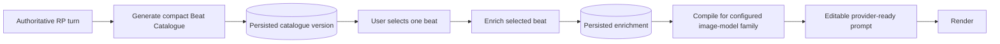

# B-100 - Progressive Scene Beat Catalogue and Enrichment Pipeline

**State:** Planned  
**Priority:** High  
**Scope:** Large  
**Created:** 2026-08-26  
**Parent feature:** [B-032 Scene Image Generator](../B-032-scene-image-generator/README.md)

## Purpose

Replace the slow, fragile one-shot Generate Beats operation with a progressive pipeline:

1. Generate a compact Beat Catalogue for the complete authoritative turn.
2. Let the user select a catalogue entry.
3. Enrich only the selected beat into the complete render-ready visual contract.
4. Compile that enriched beat for the explicitly configured image-model family.

The catalogue answers, "Which frozen moments are available?" The enrichment answers, "What exactly must be rendered for this selected moment?" These are separate model tasks with separate persisted records, schemas, configuration, jobs, and diagnostics.

## User Flow

Yes: the normal flow intentionally requires the user to choose a catalogue beat before the detailed enrichment runs. Selecting an unenriched beat queues enrichment and shows progress for that beat. Selecting an already enriched beat loads the persisted enrichment immediately. Prompt generation remains disabled until the selected catalogue entry has a current, completed enrichment.

The system does not eagerly enrich every catalogue entry. An explicit future batch-enrichment mode may be added, but it must be user-selected, separately bounded, and must not become a hidden default.

## Goals

- Reduce time to first useful choice from minutes toward an interactive target.
- Reduce malformed or truncated model responses by making the first response compact.
- Avoid paying to create detailed render geometry for beats the user never selects.
- Isolate beat discovery from cast, continuity, camera, and image-family compilation concerns.
- Make text-model and image-model capabilities explicit, persisted, and UI-configurable.
- Prevent stale jobs from overwriting newer catalogue or enrichment records.
- Preserve strict, fail-fast behavior without JSON repair or hidden model fallbacks.
- Make jobs durable, observable, retryable for transient failures, and independently schedulable.

## Non-Goals

- Replacing the authoritative `RolePlayV2Turn` or Narrative synthesis.
- Making the image model rediscover chronology from raw turn prose.
- Silently falling back from controlled generation to prompt-only generation.
- Automatically enriching all catalogue entries in the default workflow.
- Hiding unsupported model capabilities behind guessed provider behavior.
- Defining the Phase 2-4 identity, blocking, validation, or repair contracts already owned by B-032.

## Controlling Decisions

| ID | Decision |
|---|---|
| D-100-01 | Generate Beats becomes two explicit stages: catalogue, then selected-beat enrichment. |
| D-100-02 | Catalogue entries are deliberately compact and contain enough evidence for a human selection, not a complete render brief. |
| D-100-03 | Selection of an unenriched beat queues enrichment; selection does not block the UI thread. |
| D-100-04 | Enrichment is keyed by catalogue version and catalogue beat ID. A replacement catalogue makes older enrichments historical and ineligible for new prompts. |
| D-100-05 | The model returns compact interaction references; application code resolves authoritative interaction IDs. The model is not asked to reproduce UUIDs. |
| D-100-06 | Beat analysis gets its own `RolePlaySceneBeatAnalyzer` function configuration. A session prose-model override cannot silently replace it. |
| D-100-07 | Structured-output support, thinking control, context limits, and output limits are explicit registered-model capabilities. Unsupported configured combinations fail before enqueue. |
| D-100-08 | Catalogue and enrichment jobs use durable persisted state, compare-and-set completion, bounded transient retries, and separate concurrency from rendering. |
| D-100-09 | The enriched beat is image-family-neutral. Pony, SDXL/Juggernaut, FLUX, and future families are downstream compiler registrations, not beat schema branches. |
| D-100-10 | Existing completed schema-v3 analyses remain readable during migration, but new catalogue generation never writes the legacy one-shot record shape. |

## Artifacts

- [analysis.md](analysis.md) - Current implementation assessment, runtime evidence, risks, alternatives, and recommendation.
- [spec.md](spec.md) - User stories, functional requirements, acceptance criteria, and non-functional requirements.
- [plan.md](plan.md) - Implementation sequence, ownership boundaries, migration strategy, testing, and rollout.
- [tasks.md](tasks.md) - Dependency-ordered implementation checklist.
- [data-model.md](data-model.md) - Persisted entities, statuses, invariants, and relationships.
- [contracts/progressive-beat-pipeline-contract.md](contracts/progressive-beat-pipeline-contract.md) - Service, job, structured-output, concurrency, and failure contracts.

## Success Measures

- Beat Catalogue p50 <= 15 seconds and p95 <= 45 seconds on the configured acceptance model and frozen corpus.
- Selected-beat enrichment p50 <= 20 seconds and p95 <= 60 seconds.
- At least 99% schema-valid catalogue and enrichment responses on the frozen corpus.
- Zero stale-job overwrites in concurrency tests.
- Application restart does not strand accepted work without a recoverable persisted job state.
- Adding an image-model family does not require changing catalogue or enrichment schemas.

## Status

Planning artifacts are complete. No implementation changes are part of this planning item creation. Implementation requires explicit approval before modifying the scene-image or roleplay application paths.
