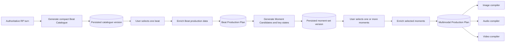

# B-100 - Progressive Scene Beat, Moment, and Multimodal Production Pipeline

**State:** Planned  
**Priority:** High  
**Scope:** Large  
**Created:** 2026-08-26  
**Parent feature:** [B-032 Scene Image Generator](../B-032-scene-image-generator/README.md)
**Downstream consumer:** [B-101 Story Presentation Timeline and Storyboard](../B-101-story-presentation-timeline/README.md)
**Program sequencing:** [Multimodal Production Program Roadmap](../multimodal-production-program-roadmap.md)

## Purpose

Replace the slow, fragile one-shot Generate Beats operation with a progressive pipeline:

1. Ground the canonical production ontology in documented image, speech, sound, music, video, and lip-sync model inputs.
2. Generate a compact Beat Catalogue for the complete authoritative turn.
3. Let the user select a catalogue entry.
4. Enrich the selected Beat into canonical, time-addressable production data for dialogue, narration, ambience, sound events, music, action, continuity, and video coverage.
5. Generate compact Moment candidates and key states inside the selected Beat.
6. Let the user select exact frozen Moments for still-image generation and video key states.
7. Enrich selected Moments into complete visual and instantaneous audio-event production data.
8. Compile the same Beat/Moment lineage independently for image, speech, sound, music, video, native-video audio, and lip-sync/performance generators.

A Beat answers, "What narrative development happens over this interval, what is said and heard, and how does state change?" A Moment answers, "What exact frozen state exists at this point inside that Beat?" Beat enrichment produces the canonical temporal source for audio and video. Moment enrichment produces the canonical frozen visual source for still images and video key states. Discovery and enrichment stages use separate persisted records, schemas, jobs, and diagnostics.

A Beat may contain movement through time and owns ordered story events, exact dialogue and narration spans, ambience state, discrete sound events, an action arc, and start/end continuity. A Moment represents exactly one frozen visual state and must not combine before-and-after actions. Still images, POV variants, and visual continuity controls bind to a Moment. Video may bind to one Moment, movement between ordered Moments, a Beat excerpt, or the whole Beat. Audio cues bind to exact dialogue/events and Beat-relative or Moment anchors.

B-101 consumes this production plan. It selects and sequences Beats/Moments, assigns presentation timing, places approved assets, publishes manifests, and plays the Visual Novel. It does not rediscover dialogue, soundscape, action arcs, video coverage, or visual facts from raw RP prose.

## User Flow

The normal flow first creates a compact Beat Catalogue. Selecting a Beat creates or loads its Beat Production Plan and Moment candidates. Selecting an unenriched Moment queues its frozen-state enrichment. Still-image generation requires an enriched selected Moment. Audio generation requires the Beat Production Plan and any referenced Moment anchors. Video generation requires the Beat Production Plan plus the Moments mandated by its explicit coverage kind.

For a faster default path, the moment-discovery model identifies one recommended moment. Studio may preselect it and offer **Generate from suggested moment**, while still exposing the alternatives. This convenience does not skip persistence or change the selected moment's identity.

The system does not eagerly generate moments for every beat or enrich every moment. Explicit future batch modes may be added, but they must be user-selected, separately bounded, and must not become hidden defaults.

## Goals

- Reduce time to first useful choice from minutes toward an interactive target.
- Reduce malformed or truncated model responses by making the first response compact.
- Avoid paying to enrich Beats the user never selects or detailed frozen geometry for Moments the user never selects.
- Separate narrative progression (beat) from a renderable frozen state (moment).
- Produce one canonical semantic source for still-image, speech, ambience/effects, and video generation.
- Keep identity, state, action order, dialogue, performance, timing, camera, ambience, effects, and music consistent across independently compiled requests.
- Isolate story analysis from provider-specific image, audio, and video compilation.
- Make text-model and image-model capabilities explicit, persisted, and UI-configurable.
- Prevent stale jobs from overwriting newer catalogue or enrichment records.
- Preserve strict, fail-fast behavior without JSON repair or hidden model fallbacks.
- Make jobs durable, observable, retryable for transient failures, and independently schedulable.

## Non-Goals

- Replacing the authoritative `RolePlayV2Turn` or Narrative synthesis.
- Making the image model rediscover chronology from raw turn prose.
- Silently falling back from controlled generation to prompt-only generation.
- Automatically generating moments for every beat or enriching every moment in the default workflow.
- Hiding unsupported model capabilities behind guessed provider behavior.
- Defining the Phase 2-4 identity, blocking, validation, or repair contracts already owned by B-032.
- Defining Storyboard sequencing, asset placement, publication, or Visual Novel playback contracts owned by B-101.
- Selecting or implementing image, audio, speech, music, lip-sync, or video providers.
- Treating provider documentation as proof that a configured production model works; production support requires captured request/response fixtures in its generator epic.

## Controlling Decisions

| ID | Decision |
|---|---|
| D-100-01 | Generate Beats becomes four analytical stages: Beat Catalogue, selected-Beat enrichment, Moment discovery/key-state planning, then selected-Moment enrichment. |
| D-100-02 | A beat is a short narrative development and may span movement through time; it is not an image-generation unit. |
| D-100-03 | A Beat Production Plan is the canonical source for ordered events, exact dialogue/narration, ambience, sound events, action arc, state transitions, and video coverage. |
| D-100-04 | A Moment is one exactly frozen state inside one Beat and is the canonical source for still images, POV variants, visual controls, and video key states. |
| D-100-05 | Catalogue entries and initial Moment entries are compact selection records; enriched Beat and Moment records form the provider-neutral Multimodal Production Plan. |
| D-100-06 | Selecting a Beat queues Beat enrichment and Moment discovery when needed; selecting a Moment queues Moment enrichment when needed. No selection blocks the UI thread. |
| D-100-07 | Beat plans are keyed by catalogue version and Beat ID. Moment sets are keyed by Beat-plan version. Moment enrichments are keyed by Moment-set version and Moment ID. Replacements make older descendants historical. |
| D-100-08 | Models return compact evidence/profile references; application code resolves authoritative IDs. Models are not asked to reproduce UUIDs. |
| D-100-09 | Analysis uses one canonical `RolePlaySceneBeatAnalyzer` function configuration with separate versioned contracts. A session prose-model override cannot silently replace it. |
| D-100-10 | Structured-output support, thinking control, context limits, and output limits are explicit registered-model capabilities. Unsupported combinations fail before enqueue. |
| D-100-11 | All analysis jobs use durable persisted state, compare-and-set completion, bounded transient retries, and separate concurrency from media generation. |
| D-100-12 | Production metadata is provider-neutral. Image, audio, and video families are downstream compiler registrations, not analysis-schema branches. |
| D-100-13 | Exact RP dialogue/narration remains immutable source evidence; production records add attribution, timing anchors, performance intent, and audiovisual interpretation without rewriting it. |
| D-100-14 | B-101 is a wrapper/editor over B-100 production data and approved media; it does not become a second story-analysis pipeline. |
| D-100-15 | Existing completed schema-v3 analyses remain readable during migration, but new catalogue generation never writes the legacy one-shot record shape. |
| D-100-16 | Canonical fields require documented semantic consumers. Provider request syntax, model IDs, sampling, codecs, seeds, and capability workarounds remain compiler/profile concerns. |
| D-100-17 | Beat-relative time windows and realized media alignment are first-class. Compilers and B-101 do not infer timing independently from prose or estimated text length. |
| D-100-18 | Every reference is typed by production role. A generic asset/reference list cannot substitute for identity, continuity, keyframe, voice, pose, style, or conditioning intent. |
| D-100-19 | One golden Beat/Moment lineage must compile consistently into every modality contract before the acceptance corpus or persistence schema is frozen. |

## Artifacts

- [analysis.md](analysis.md) - Current implementation assessment, runtime evidence, risks, alternatives, and recommendation.
- [spec.md](spec.md) - User stories, functional requirements, acceptance criteria, and non-functional requirements.
- [plan.md](plan.md) - Implementation sequence, ownership boundaries, migration strategy, testing, and rollout.
- [tasks.md](tasks.md) - Dependency-ordered implementation checklist.
- [data-model.md](data-model.md) - Persisted entities, statuses, invariants, and relationships.
- [provider-evidence-matrix.md](provider-evidence-matrix.md) - Official model-input evidence, canonical/compiler ownership, consistency invariants, and golden fixture requirements.
- [contracts/progressive-beat-pipeline-contract.md](contracts/progressive-beat-pipeline-contract.md) - Service, job, structured-output, concurrency, and failure contracts.

## Success Measures

- Beat Catalogue p50 <= 15 seconds and p95 <= 45 seconds on the configured acceptance model and frozen corpus.
- Selected-Beat production enrichment p50 <= 20 seconds and p95 <= 60 seconds.
- Selected-beat moment discovery p50 <= 10 seconds and p95 <= 30 seconds.
- Selected-moment enrichment p50 <= 20 seconds and p95 <= 60 seconds.
- At least 99% schema-valid catalogue, Beat-plan, Moment-discovery, and Moment-enrichment responses on the frozen corpus.
- Zero stale-job overwrites in concurrency tests.
- Application restart does not strand accepted work without a recoverable persisted job state.
- Adding an image, audio, or video model family does not require changing Beat/Moment production schemas.

## Status

Planning artifacts define the architecture; provider-evidence, canonical-schema, and golden-request gates must be completed before implementation contracts are frozen. No implementation changes are part of this planning update. Implementation requires explicit approval before modifying the scene-image or roleplay application paths.
