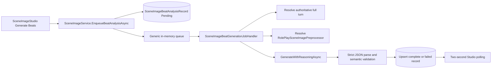

# B-100 Analysis - Generate Beats

**Analyzed:** 2026-08-25 to 2026-08-26  
**Scope:** Scene Image Studio Generate Beats path, text completion behavior, persistence, queueing, downstream image-family coupling, tests, and B-032 contracts.

## Executive Assessment

Generate Beats has the correct high-level boundary: it converts one authoritative roleplay turn into persisted visual moments before prompt compilation or rendering. Narrative-led chronology, strict schemas, and immutable downstream snapshots are sound decisions.

The current one-shot operation is nevertheless too slow and fragile for interactive use. It asks a reasoning model to discover up to twelve moments and fully describe every moment's cast, clothing, geometry, visibility, environment, and evidence in one strict free-form JSON response. The generic completion client may add force-answer and continuation calls. The job then shares one serial, in-memory worker with prompt generation and rendering.

The recommended correction is progressive disclosure of computation: create a compact Beat Catalogue, enrich the selected Beat into canonical temporal production data, discover frozen Moment key states inside it, and enrich only selected Moments. Together these records must support image, audio, and video generation without downstream semantic rediscovery.

## Current Call Path

Owning implementation surfaces:

- `DreamGenClone.Web/Components/Pages/SceneImageStudio.razor`
- `DreamGenClone.Web/Application/RolePlay/SceneImageService.cs`
- `DreamGenClone.Web/Application/RolePlay/SceneImageBeatGenerationJobHandler.cs`
- `DreamGenClone.Web/Application/RolePlay/SceneImageBeatAnalysisService.cs`
- `DreamGenClone.Infrastructure/Models/CompletionClient.cs`
- `DreamGenClone.Web/Application/BackgroundJobs/GenericBackgroundJobQueue.cs`
- `DreamGenClone.Web/Application/BackgroundJobs/GenericBackgroundJobWorker.cs`
- `DreamGenClone.Infrastructure/RolePlay/SceneImageRepository.cs`

## Runtime Evidence

Application-log start/completion pairs produced the following historical sample:

| Measure | Result |
|---|---:|
| Completed beat jobs | 19 |
| Average duration | 127.9 seconds |
| Median duration | 139.0 seconds |
| Maximum duration | 244.9 seconds |

A representative successful run on 2026-08-24 spent 89,468 ms in the reasoning-aware completion, produced 30,011 reasoning characters and 7,733 content characters, and completed the surrounding job in 89.6 seconds. The subsequent prompt projection took 7.6 seconds and image rendering took 18.8 seconds. SQLite and Studio polling are not the dominant cost.

A documented failed run produced 34,759 reasoning characters, invoked force-answer, emitted 12,450 characters of truncated content, and failed after 147,636 ms. Historical failures include:

- unescaped control characters inside JSON strings;
- unmatched or unclosed JSON after truncation;
- empty final content after the reasoning budget was exhausted;
- model-generated interaction IDs outside the authoritative turn;
- invalid spatial/location relationships;
- responses exceeding the configured token or provider timeout budget.

Existing debug records `specs/001-rp-prompt-redesign/debug/023-*`, `024-*`, `025-*`, and `031-*` document prior repairs and live validation. Raising the token ceiling improved completion rate but increased worst-case latency and timeout exposure; it did not remove the protocol mismatch.

## Findings

### F-100-01 - Stale completion can replace newer work (critical)

The handler verifies that its analysis ID is current before the long completion call. Completion later performs an upsert whose conflict target is `(SessionId, TurnId)` and replaces the row ID. If a second request replaces the row during the first model call, the older job can overwrite the newer record when it finishes. The newer job then sees itself as stale and fails.

The Studio exposes Generate Beats while an analysis is pending, making the race reachable. Dedupe by analysis-record ID does not prevent two generations for the same turn.

Required correction: compare-and-set completion against the current record ID and attempt/version. A stale attempt must persist as superseded history or stop without mutating the current catalogue.

### F-100-02 - Beat and renderable moment are different domain concepts (high)

A beat is a temporal narrative unit: it may include an entrance, reaction, exchange, or other development that moves through several instants. An image requires exactly one frozen visual state. The current schema overloads each beat's `FrozenMoment` and detailed geometry, forcing one model response to discover narrative structure, choose an instant, and fully compile every candidate.

Required correction: compact Beat Catalogue first; 2–4 Moment Candidates for only the selected beat; detailed enrichment for only the selected moment. Prompt and image provenance must bind to `MomentId` while retaining parent `BeatId`.

### F-100-03 - Image-only enrichment cannot support the product end state (high)

The first progressive redesign still treated selected-Moment enrichment as an image-family-neutral visual contract. That is insufficient for exact speech, environmental audio, active sound events, motion through a Beat, video start/end continuity, and synchronized video dialogue. Moving those interpretations into Storyboard would create a second analysis pipeline and allow image/audio/video facts to diverge.

Required correction: selected-Beat enrichment owns ordered events, exact dialogue/narration attribution, ambience, sound events, action arc, continuity boundaries, and video coverage. Moment discovery resolves frozen key states required by that plan. Moment enrichment supplies exact visual/instantaneous state. B-101 wraps, sequences, times, and publishes these facts.

### F-100-04 - Reasoning output dominates latency (high)

The current model can spend tens of thousands of characters reasoning before returning JSON. `GenerateWithReasoningAsync` can issue the original request, a force-answer request, and up to two continuation requests. One UI action can therefore require four serial network completions.

Required correction: dedicated beat-analyzer configuration with explicit thinking mode and structured-output capability. The acceptance configuration should use bounded or disabled thinking when the registered model supports control.

### F-100-05 - Free-form strict JSON is transport-fragile (high)

The prompt asks for exact JSON, but the standard completion request does not declare a provider-native JSON Schema. Strict parsing correctly rejects malformed output, but prompting alone cannot guarantee transport conformance.

Required correction: capability-negotiated structured output. A configured analyzer that cannot satisfy the required output contract must fail validation before enqueue. No regex repair, field guessing, or reasoning-as-content fallback is permitted.

### F-100-06 - Generic jobs are serial and volatile (high)

The generic queue is an unbounded in-memory channel with one reader. Beat analysis blocks unrelated prompt, render, and edit jobs. Accepted jobs disappear on process restart, and cancellation can leave a persisted record Pending without a recoverable queue item.

Required correction: persisted job/attempt records, leases, recovery on startup, separate text-analysis and image-render concurrency lanes, and bounded retry classification.

### F-100-07 - Dedicated preprocessor configuration is bypassable (medium)

Both beat analysis and prompt projection pass `session.SessionModelId` into `ResolveImagePromptModelAsync`. A roleplay session override can therefore silently replace the function-specific image preprocessor model.

Required correction: a new `RolePlaySceneBeatAnalyzer` function resolves from its canonical function default only. Any future per-session analyzer override must be an explicit scene-image setting, not reuse the prose-model override.

### F-100-08 - Model reproduces identifiers application code already knows (medium)

The response must echo full interaction UUIDs and is rejected if any are wrong. This increases output size and creates a failure mode without adding model intelligence.

Required correction: present stable compact evidence indexes in the request; resolve indexes to authoritative IDs in application code after parsing.

### F-100-09 - Current snapshot is not reproducible provenance (medium)

`InputSnapshotJson` stores only turn and interaction IDs and is never used to execute the job. The handler reloads mutable session/scenario state. Model/provider, parameters, prompt version, finish reason, attempts, durations, and exact source text are incomplete or spread across debug events.

Required correction: persist immutable request snapshots and resolved execution provenance for each catalogue, moment-discovery, and enrichment attempt.

### F-100-10 - Image-family routing is centralized but not extensible enough (medium)

Catalogue semantics are mostly image-family-neutral, which should be preserved. Downstream family routing currently uses checkpoint filename substrings and a closed enum. Adding FLUX or another family requires edits across classifiers, switches, builders, clients, and tests.

Required correction: persisted model-family/prompt-dialect metadata and registered compiler strategies. Unknown or incompatible configured combinations fail explicitly.

### F-100-11 - Coverage misses concurrency and recovery behavior (medium)

Current focused tests cover strict parsing, reasoning/content separation, persistence, schema rejection, and basic enqueue behavior. They do not prove stale-write prevention, restart recovery, transient retry classification, queue-lane isolation, frozen-moment invariants, or progressive catalogue-to-moment-to-enrichment behavior.

### F-100-12 - Multimodal readiness is not yet provider-grounded (critical)

The current plan names image, speech, ambience/effects, music, video, native-video audio, and lip-sync projections, but several canonical fields are still broad prose containers. Representative official model contracts require materially different shapes: TTS needs immutable versus normalized speech text and realized alignment; music needs ordered duration-bearing sections; video needs start/end/reference states and temporal action; and lip-sync needs an approved visual input, realized clean speech, exact segment/crop windows, target face, and explicit duration mismatch behavior.

Without shared time-addressable facts and typed references, each compiler would have to make independent decisions. That would allow an image to show one state, a video to animate another action, TTS to alter dialogue, and lip-sync to target or time a different speaker.

Required correction: complete the [provider evidence matrix](provider-evidence-matrix.md), define the canonical ontology and cross-modal invariants, and prove one golden lineage through every compiler request shape before freezing persistence contracts or the acceptance corpus.

## Options Considered

### Option A - Keep one-shot analysis and tune the model

Raise timeouts/tokens, disable thinking where possible, shorten prose, and add JSON Schema.

- Lowest implementation effort.
- May improve success rate.
- Still enriches all beats and keeps a large response.
- Does not solve queue durability, stale writes, or image-family evolution.

**Decision:** Useful as temporary configuration hygiene, not the target architecture.

### Option B - Compact Catalogue plus Beat and Moment Multimodal Production Plan

Generate compact Beats, enrich the selected Beat's temporal/audio/video facts, discover its exact key-state Moments, then enrich selected frozen states.

- Fastest useful feedback.
- Smaller structured outputs and lower failure probability.
- Avoids moment discovery for unused beats and enrichment for unused moments.
- Makes the image source unambiguously frozen while preserving the parent narrative unit.
- Supports one recommended moment for a fast path without hiding alternatives.
- Adds two explicit selection transitions and persisted moment entities.

**Decision:** Recommended and selected.

### Option C - Deterministic beat extraction only

Use rules, sentence segmentation, and interaction metadata without an LLM.

- Very fast and predictable.
- Weak at merging parallel viewpoints and understanding material visual transitions.

**Decision:** May be offered later as an explicit configured analysis mode for simple turns. It is not a hidden fallback.

### Option D - Generate and enrich every moment in parallel

Run moment discovery for every beat and enrichment for every candidate immediately after catalogue completion.

- Produces all details eventually.
- Multiplies cost, contention, and failure exposure.
- Defeats the main benefit of progressive computation.

**Decision:** Not the default. A future explicit bounded batch command may use this behavior.

## Recommendation

Implement Option B with these boundaries:

1. Catalogue model output contains a compact label, narrative beat synopsis, chronology order, primary location, participant names/roles, and compact evidence indexes.
2. The user selects a catalogue Beat.
3. Beat enrichment produces exact dialogue/narration, soundscape, events, action arc, continuity, and video coverage.
4. Moment discovery creates 2–4 exact frozen states and resolves still/video/audio-anchor roles requested by the Beat plan.
5. The user selects Moments; the recommended still path remains an ordinary persisted selection.
6. Moment enrichment produces exact frozen visual, instantaneous sound, and video key-state constraints.
7. Image, audio, and video compilers consume the same canonical Beat/Moment production lineage and cannot reinterpret raw RP prose.
8. B-101 sequences and times production data, places approved assets, publishes, and plays it as a Visual Novel.
9. Durable jobs and compare-and-set persistence protect every asynchronous transition.
10. Canonical fields are admitted only when provider evidence demonstrates shared production meaning; provider-only syntax and controls stay in compiler profiles.
11. Golden compilation tests assert that every modality preserves the same identity, frozen states, event order, dialogue, timing, performance, camera, soundscape, and music intent.

## Validation Performed During Analysis

- Editor diagnostics: no errors in the handler, analysis service, scene-image service, or Studio page.
- Focused beat/service tests: 29 passed, 0 failed from current binaries.
- Full scene-image test slice: 198 passed, 0 failed from current binaries.
- One existing xUnit warning reports a duplicate test-case ID in `SceneImageModelFamilyTests`.
- A fresh rebuild was blocked because the running web process held output DLLs; `--no-build` validation used the active compiled binaries.

No implementation code was changed during this analysis.
