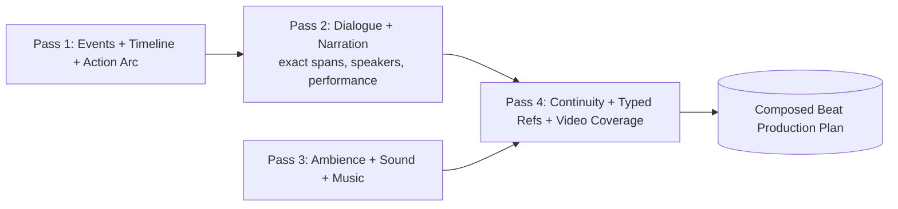

# B-100 — Beat Production Decomposition Design Note

**Created:** 2026-09-07
**State:** Proposal / needs review
**Feature:** [B-100 Progressive Scene Beat, Moment, and Multimodal Production Pipeline](README.md)
**Related spec:** [spec.md](spec.md) — FR-001, FR-008, FR-009, FR-010, FR-030, FR-032, FR-038, NFR-002, NFR-005
**Related analysis:** [analysis.md](analysis.md) — F-100-01/02 (historical one-shot fragility)
**Downstream consumer:** Moment Discovery → Moment Enrichment → Production Studio (B-032) → B-101

---

## 1. Problem Statement (User Report)

Beat Production ("Produce Beat" in Scene Image Studio) is failing at a very high rate in live use, and the
reason for failure is not visible in the UI or the persisted records.

- Reported symptom: "beat production is not working, 80% failure rate, i cant see what is happening."
- Live evidence confirms the failure rate and shows two different failure classes that look unrelated until the
  single-response design is understood.
- Design question raised by the user: the whole Beat Production request does too much in one large prompt;
  can it be split into several smaller parts and recombined in the app?

**This note records the live findings, the root-cause research, and the proposed decomposition so it can be
reviewed before any code changes.**

---

## 2. Live Evidence (2026-09-07 run)

Session `8bc36efb-b235-485b-8675-b98ad7754e59`, catalogue `e05f8158-3b8e-4510-9c2a-8a7cd2d64828`, beats
b1–b5, all enqueued between `2026-09-07 23:27Z` and `00:01Z` (`model = z-ai/glm-4.7` via OpenRouter).

| Beat | Ver | Status | ErrorCode | Meaning |
|---|---|---|---|---|
| b1 | 2 | Failed | `structured_text_timeout` | Provider exceeded timeout after ~754 s |
| b2 | 2 | Failed | `scene_beat_production_output_invalid` | Strict validation rejected output |
| b3 | 1 | Failed | `structured_text_http_400` | OpenRouter rejected the request |
| b4 | 1 | Failed | `scene_beat_production_output_invalid` | Strict validation rejected output |
| b5 | 1 | Failed | `structured_text_http_400` | OpenRouter rejected the request |

Earlier in the same run b1 v1 (`deepseek-v4-flash`) was superseded with the identical
`scene_beat_production_output_invalid` validation error — the same evidence check fails across both models.

Aggregate DB state (all history): 33 plans → 25 failed attempts (~76% failure rate).

### 2.1 Failure class A — HTTP 400 (b3, b5)

- Fails in < 1 s, `structured_text_http_400`.
- `OpenAiStructuredTextCompletionClient` throws on non-2xx **without reading or logging the provider response
  body**, so the actual OpenRouter rejection reason is not captured anywhere (not DB, not logs, not UI).
- Open question: is the 400 caused by request size, strict-schema incompatibility for GLM-4.7 on OpenRouter,
  content, or transient provider behavior? Not answerable until the body is captured (observability fix,
  Phase 0).

### 2.2 Failure class B — strict validation `output_invalid` (b2, b4)

- The model DID return a complete, well-formed plan; validation rejected it on source-offset fidelity.
- Concrete mismatch (plan `cd702a27-…`, beat b2):
  - Model declared dialogue `"Water's warm"` at evidence `c1` `[517, 529)` and `"Still deciding."` at `[531, 546)`.
  - Real evidence text at those offsets is `ne shoulder,` / `rinning like he`.
  - The quoted lines actually live ~930 chars later (near offset ~1440) in `c1` (Becky, 2,216 chars).
  - Cue **lengths are correct** (12 / 15 chars) but **start positions are fabricated**.
- `SceneBeatProductionSourceResolver.ResolveExactSpan` then fails: declared span text ≠ evidence at span →
  `Beat Production source span text does not match evidence 'c1'.`
- Persisted error detail is only that short message — no evidence key context, no `[start, end)`, no
  expected-vs-actual, no raw response in the panel.

### 2.3 Latency / token evidence

- b2 GLM call took ~196 s; b4 GLM call took ~213 s; b1 v2 exceeded the timeout at ~754 s.
- A complete Beat Production plan for one beat is ~15–28 K output chars; MaxTokens was raised to 32,000 then
  64,000 to fit it (analyzer is exempt from the 16,000 server-side clamp).
- Spec NFR-002 target is p50 ≤ 20 s / p95 ≤ 60 s for Beat Production — the live single-response path is far
  outside it.

---

## 3. Root-Cause Analysis

### 3.1 One response carries twelve coupled responsibilities

Per FR-009 a Beat Production Plan must include **all** of: ordered events, exact dialogue/narration, ambience,
sound events, action arc, start/end continuity, and video coverage — plus typed references and windows. The
current implementation asks one strict-JSON model response to produce the entire plan in one schema
(`SceneBeatProductionContract`, sections: `events`, `timeline`, `narration`, `dialogue`, `ambience`,
`soundEvents`, `music`, `actionArc`, `startContinuity`, `endContinuity`, `typedReferences`, `videoCoverage`).

Consequences:

- **One failure invalidates everything.** Any one section failing strict validation (offsets, video roles,
  wardrobe keys, spoken-text normalization, music lyrics, action-arc keys) fails the whole plan, so the whole
  response must be regenerated.
- **Cross-section coherence is forced into one generation.** Event keys, cue keys, references, and video
  coverage must all line up across a very large output with no intermediate checkpoints.
- **Hard sub-tasks are batched with easy ones.** Exact character-offset localization over ~2 K-char evidence
  (the recurring failure) is bundled with ambience/music/video planning that has nothing to do with offsets.
- **Long output → long latency and timeout exposure** (NFR-002 missed; b1 v2 timeout).

### 3.2 Historical pattern confirms it

The 09-01 session (`81e6397d`) needed **12 plan versions** for beat b1, each failing a different single
section:

- v1–v2 shape/finish (token budget) → v3/v6 exact-text offsets → v5 dialogue speaker rule → v7 wardrobe
  profile keys → v9 spoken-text normalization → v8 transport → v10 typed references inventing IDs → v11 video
  coverage roles → v12 GREEN.

Every fix re-ran the entire giant response and hit the next section's validator. This is the same disease as
the original one-shot "Generate Beats" the B-100 pipeline was built to replace (analysis.md F-100-02).

### 3.3 Observability is insufficient

- Provider error bodies are discarded on non-2xx (no way to see the OpenRouter 400 reason).
- Validation failures persist a single short message with no span/expected-vs-actual detail and no link to raw
  output in the panel.
- Per FR-032/F-038 the state and errors exist, but the reason is not surfaced to act on.

---

## 4. Proposed Design — Split Beat Production into Dependency-Ordered Passes

### 4.1 Principle

Do **not** ask one model call to author the entire multimodal plan. Instead run a small number of smaller,
dependency-ordered passes; validate and persist each; then **compose them app-side into the same persisted
Beat Production Plan record**. Downstream consumers (Moment Discovery, enrichment, compilers) continue to read
the composed plan — no downstream contract change.

This is consistent with the feature's own controlling decisions (D-100-01 progressive stages, D-100-08 models
return compact references the app resolves, FR-030 separate versioned contracts) — the progressiveness was
simply not applied *inside* the Beat Production stage.

### 4.2 Pass breakdown

| Pass | Emits | Consumes (validated) | Why separate |
|---|---|---|---|
| **P1** Events + Timeline + Action Arc | `events`, `timeline`, `actionArc` | Evidence, profiles, beat | Fixes ordering & event keys once; everything else references these |
| **P2** Spoken track | `narration`, `dialogue` (offsets, speakers, performance, lip-sync) | P1 event keys | Isolates the hard offset-localization task; smaller evidence window per cue |
| **P3** Soundscape | `ambience`, `soundEvents`, `music` | P1 event keys, P2 cue keys | Independent audio design; no offsets |
| **P4** State & assembly | `startContinuity`, `endContinuity`, `typedReferences`, `videoCoverage` | P1 event keys, P2/P3 cue keys | References validated cue keys; app supplies lineage placeholders |

Each pass is a separate versioned contract (FR-030), a separate durable job, and a separate diagnostics row
(FR-038), all resolving from the same `RolePlaySceneBeatAnalyzer` function default.

### 4.3 Why this addresses the failure classes

- **Offset failures (b2/b4):** confined to Pass 2, which is much smaller than the full plan → better
  reliability, and only Pass 2 needs re-running on offset failure. The app can also verify each cue's
  `exactSourceText` is a **unique** substring of its evidence and, when it is, derive/validate the offset
  app-side instead of trusting a model-computed number (see §6.1).
- **Timeout (b1):** each pass is a fraction of the 15–28 K-char monolith → far lower latency and timeout
  exposure; partial progress persists (P1–P3 stay valid if P4 fails).
- **HTTP 400 (b3/b5):** each request is far smaller; oversized/strict-schema rejection becomes far less
  likely. (Still requires the Phase 0 body-capture fix to confirm.)
- **Failure isolation:** a P3 music bug no longer discards P1/P2.

### 4.4 Tradeoffs

- **More calls per beat** (4 instead of 1), but each is small and fast; total successful-path wall-clock should
  drop, and partial progress persists on failure.
- **More contracts to version + test** — the real cost. Each pass needs schema, strict validator, and focused
  regression coverage; existing contract tests assert phrases that must be preserved/migrated per pass.
- **More persisted intermediate state** — each pass writes a partial record/attempt; composition logic must be
  transactional and compare-and-set (FR-026/027).
- **UI** must show per-pass state/errors (extend FR-038 to beat-production sub-stages) — improves the "can't
  see what's happening" problem at the same time.

---

## 5. Alternatives Considered

### 5.1 Keep one response, harden the prompt (status quo + tweaks)

Cheap, but does not fix the structural problems: any one section still fails the whole plan, latency stays
high, offsets stay hard. Rejected as insufficient for NFR-002/NFR-005.

### 5.2 App-side offset resolution (complement, not replacement)

Where a cue's `exactSourceText` is a unique substring of its evidence, resolve the offset by search app-side
rather than trusting the model's `startOffset`. This directly removes the observed `c1`/`c2` offset failures
and should be done regardless of whether the passes land. It does **not** fix latency, timeout, or failure
isolation.

### 5.3 Split into passes (§4) — recommended

Combines the offset fix (5.2) with latency/failure-isolation gains and aligns with the feature's own
progressive philosophy.

### 5.4 Model change only (e.g., back to deepseek-v4-flash)

Model selection is orthogonal and should stay a persisted UI decision. Evidence shows deepseek converged to
green only after the same v1→v12 churn and also failed the same `c1` offset check on this run — so model
choice alone does not fix the offset or the latency problem. Not a substitute for decomposition.

---

## 6. Open Decisions / Required Inputs

1. Pass granularity: 4 passes (§4.2) vs fewer (e.g., merge P3+P4) vs more granular.
2. Whether offset resolution becomes app-side search (5.2) — recommended yes, as a prerequisite or in parallel.
3. Persistence model for partial passes: new attempt rows per pass keyed to the plan version, composed at the
   end; composition must be compare-and-set.
4. UI: add per-pass status to the Beat Production panel (FR-038 extension).
5. Model to keep assigned to `RolePlaySceneBeatAnalyzer` during rollout (GLM-4.7 vs deepseek-v4-flash).
6. Whether the current in-progress run/session data should be preserved or superseded during migration.

---

## 7. Recommended Next Steps

1. **Phase 0 — Observability (small, prerequisite):**
   - Capture + persist provider error bodies on non-2xx in `OpenAiStructuredTextCompletionClient`.
   - Expand span-mismatch validation detail (evidence key, `[start,end)`, expected-vs-actual) in
     `SceneBeatProductionSourceResolver` / `Parser`.
   - Surface failed-attempt detail in `SceneImageStudio.razor` Beat Production panel.
   This confirms the b3/b5 HTTP 400 cause and makes every later failure visible.
2. **Offset fix:** app-side unique-substring offset resolution (§5.2) with regression coverage.
3. **Design approval:** review §4 pass boundaries + persistence/UI decisions above; create a backlog entry under
   B-100 and a detailed implementation plan + tasks before code.
4. **Implementation:** new per-pass contracts, parsers/validators, durable jobs, composition service, tests;
   build + full RolePlay test suite green before any live run.

---

## 8. Appendix — Key Evidence References

- Debug history for beat-production strict-validation churn: `specs/001-final-writing-instruction/debug/013`,
  `014`, `039` and the 09-01 v1→v12 sequence documented in repo memory (`prompt-size-overflow-rootcause.md`).
- Live run evidence (this note §2) from dev DB: `SceneBeatProductionPlans`,
  `SceneBeatProductionAttempts`, `DurableBackgroundJobs`, webapp log `dreamgenclone-20260907.log`.
- Source of truth for the single-response contract: `DreamGenClone.Web/Application/RolePlay/SceneBeatProductionContract.cs`,
  `SceneBeatProductionParser.cs`, `SceneBeatProductionSourceResolver.cs`, `SceneBeatProductionPlanJobHandler.cs`.
- Provider client discards error bodies: `DreamGenClone.Infrastructure/Models/OpenAiStructuredTextCompletionClient.cs`.

---

## 9. Latency Addendum & Corrected Decomposition Rationale (2026-09-07)

The §2.3 latency note has been extended with a per-attempt timing breakdown pulled from the live dev DB
(`SceneBeatProductionAttempts`, most recent 15 attempts). This changes *why* decomposition is justified, not
*whether* — but the correction matters, because the original "smaller passes ⇒ faster single run" framing is
not supported by the evidence.

### 9.1 The 6-minute runs are decode-bound, not reasoning-bound or context-bound

| Metric (per attempt) | Observed range | Interpretation |
|---|---|---|
| `ResponseBodyReadMs` (streamed decode) | **43,000–370,000 ms** | **98%+ of total wall-clock in every row** |
| `ProviderHeadersWaitMs` (prefill / time-to-first-byte) | 480–10,289 ms | Input context cost is small |
| `ReasoningLen` | **null on every row** | Thinking mode is OFF — **no chain-of-thought tokens** are spent |
| `ValidationDurationMs` | 0–75 ms | App-side validation is free |
| `OutputCharacters` | 10K–25K (tail cases 13K / 2K) | Output volume, not input, drives time |

Consequences that correct earlier assumptions:

- **The "huge context" is not the latency driver.** Prefill/time-to-first-byte is only 0.5–10 s; the cost is
  streaming the large JSON *out*.
- **There is no internal "reasoning/re-reasoning" token spend.** `ReasoningLen` is empty — the model is not
  emitting hidden chain-of-thought. Per-token decode speed does not change with task difficulty.
- **The two worst runs (328 s / 370 s) are provider throughput collapse** on a single large request
  (370 s produced only ~2K chars), i.e. tail latency, not more output.

### 9.2 Why decomposition is still the right call — corrected justification

Serial 4-pass decomposition does **not** speed up a single happy-path run: total output tokens across the
passes ≈ the monolith, and you add 4× prefill plus re-sent context. The real, evidence-backed wins are at the
**workflow** level, i.e. *time-to-a-working-plan* given the ~76% failure rate:

1. **Retry economics ("re-reasoning" = re-generation).** The felt "re-reasoning" cost is real, but it is
   **full re-generation of the entire 10–25K-char plan on every failure**, not internal CoT. The 09-01
   *12-versions-for-one-beat* history is twelve complete regenerations. Decomposition re-runs only the failing
   pass (~¼ of the output), so retries stop re-paying for already-correct sections.
2. **Lower per-pass failure rate.** A pass doing only offset localization (with a smaller schema and a focused
   instruction) is more accurate than one juggling offsets + music + video roles + wardrobe keys + continuity
   simultaneously. Fewer failures ⇒ fewer retries ⇒ less total generation. This compounds with (1).
3. **Tail-latency isolation.** Smaller requests have far less exposure to a single provider throughput
   collapse, and a stalled pass is retried cheaply.

Rough (unmeasured) estimate: monolith at ~76% fail needs ~3–4 full ~80 s regenerations to reach green
(~4–5+ min); an isolated hard pass plus first-try-passing easy passes (P2/P3 parallel) plausibly reaches green
in ~2 min — a 2–3× improvement measured as **time-to-green**, not single-shot wall-clock.

### 9.3 Corrected design constraints

- **Justify decomposition on retry economics + per-pass accuracy + p95 tail, not on single-run p50.**
- **Parallelize independent passes.** Only P2 and P3 are independent (both depend on P1); serial passes gain
  nothing on wall-clock. Best case ≈ `decode(P1) + max(decode(P2), decode(P3)) + decode(P4)`.
- **Slim the per-pass output.** Dropping model-supplied offsets (§5.2, strengthened to *remove offsets from the
  contract* and resolve app-side) and not echoing full `exactSourceText`/`displayText`/`normalizedSpokenText`
  per cue cuts output tokens on every pass — the one lever that improves p50 latency *and* the failure rate at
  once.
- **Start at 2 passes, not 4.** Split first into (A) spoken/offset track — where *all* observed validation
  failures live — and (B) everything else, to keep the contract/persistence/test surface controlled before
  going more granular.

Evidence source: `artifacts/tmp/prod_attempt_timings.sql` against `dreamgenclone.dev.db`,
`SceneBeatProductionAttempts` (2026-09-07).
