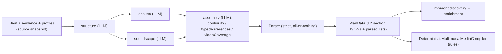
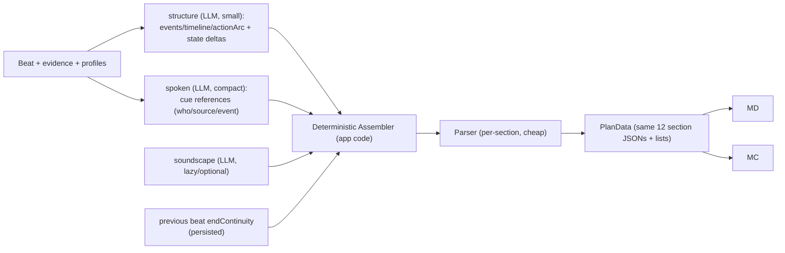

# Beat Production — Deterministic Assembly Design Proposal

- **Status**: Stage 1 implemented (2026-09-08, debug 049); remaining stages below are still design-only
- **Date**: 2026-09-08
- **Scope**: `SceneBeatProductionContract`, `SceneBeatProductionParser`, new app-side assembler,
  `SceneBeatProductionPlanData`, downstream consumers (moments / enrichment / `DeterministicMultimodalMediaCompiler`)
- **Follows debug records**: 045 (ordering), 047 (verbatim source text), 048 (assembly section omission)

## Implementation status (Stage 1, shipped)

- The LLM **assembly pass is removed**. `typedReferences` and a single `WholeBeat` `videoCoverage` are
  now computed deterministically by `SceneBeatProductionAssembler` (same 12-section output shape; parser
  and downstream consumers unchanged). Contract bumped to `scene-beat-production-v5`.
- Correction to §4.4/§5 below: `startContinuity`/`endContinuity` (character posture, lighting, wardrobe)
  are **semantic** and therefore remain a small dedicated `continuity` LLM pass — they are not folded
  deterministically in Stage 1.
- Not yet implemented (deferred): structure `stateChanges` deltas (§4.1), spoken anchor compaction
  (§4.2), lazy soundscape (§4.3), deterministic continuity chaining (§6).

## 1. Problem

Beat production currently asks one LLM (deepseek-v4-flash) to author a ~30–50k-char canonical JSON in
four passes (structure → spoken ∥ soundscape → assembly), then validates it in a single all-or-nothing
gate. Three distinct terminal validation failures in one day, each after ~9–12 min of active generation:

| Run | Failure | Root |
|---|---|---|
| b2 v3 | cue ordering | model-assigned order, parser forced narration-then-dialogue |
| b2 v4 | source text not verbatim | model re-emits long verbatim spans, drifts |
| b1 v5 | assembly omitted `startContinuity` | 19k-char assembly call dropped a required key |

The core issue is architectural: the model authors data the application already has (participant keys,
location, wardrobe defaults, cue-key unions) and re-emits prose verbatim, then a single validation gate
discards the whole run for any one defect.

## 2. Current data flow (summary)

## 3. Proposed data flow

## 4. What each pass emits — now vs proposed

### 4.1 structure (LLM) — keep, shrink, add state deltas
- **Keep**: `events` (eventKey/description/evidenceKeys/window), `timeline`, `actionArc` (subject/target/action).
- **Change**: replace free-text `actionArc[].resultingState` with structured
  `stateChanges: [{ key, kind: characterState|wardrobeState|objectState, value }]` per step, so the
  app can fold them deterministically into continuity. Keep a short human-readable action string.
- **Remove from model**: ordering (app assigns), eventKey uniqueness (app can normalize), key-state role
  prose (never belonged here).

### 4.2 spoken (LLM) — keep intent, drop re-emission
Today the model re-emits `exactSourceText`, `displayText`, `normalizedSpokenText`, normalization
method/version, and a full performance block per cue — the single biggest token cost and the 047 failure
source.

- **Model emits**: `sourceKey`, `eventKey`, `kind`, `speakerKey`/`addresseeKeys` (or ReviewRequired),
  a **short unique verbatim anchor** (a distinctive phrase from the evidence), `performance` intent
  (emotion/intensity/pace — genuinely creative), `lipSyncRelevant`.
- **App derives**: `exactSourceText`/span by locating the anchor and extending to sentence/quote
  boundaries (reuses existing `ResolveExactSpanBySearch`); `displayText` = span text; `normalizedSpokenText`
  = span text; `normalizationMethod/Version` = constants; `order` = app-assigned global sequence.

### 4.3 soundscape (LLM) — keep, but lazy and smaller
- **App sets**: `ambience.location` = beat `location` verbatim (parser already requires exact equality —
  the model never needs to write it).
- **Model emits**: `soundEvents` (anchored to events), `music` sections (only when music is actually
  requested). This pass should be **skipped entirely** until a sound/music request exists; the still-image
  path doesn't need it.

### 4.4 assembly (LLM) — **removed**, replaced by a deterministic `SceneBeatProductionAssembler`

The assembler computes, with no model call:

1. **startContinuity** — previous beat's `endContinuity` (persisted), else profile defaults
   (wardrobe/clothing + location) for the first beat.
2. **endContinuity** — `startContinuity` folded with `structure.actionArc[].stateChanges` in event order.
   `location`/`lighting`/`stateSummary` composed from the beat location + folded states.
3. **typedReferences** — rule-derived:
   - every participant → `CharacterIdentity` (and `VoiceIdentity` for speakers),
   - wardrobe used → `WardrobeContinuity`, location → `LocationContinuity`,
   - objects referenced by sound/action → `PropContinuity`, etc.
   - `sourceRecordId`/`assetId` stay null (already the contract rule).
4. **videoCoverage** — rule-derived:
   - one `WholeBeat` coverage + a `MomentAction`/`MomentHold`/`MomentTransition` per event/action cluster
     from `actionArc`,
   - `requiredMomentRoles` = fixed rule (`['start']` for MomentHold, `['start','end']` otherwise),
   - `sourceEventKeys` from the events in each window,
   - `audioOwnership` = the exact union of dialogue/sound/music keys (deterministic),
   - `referenceKeys` from the relevant typedReferences.

The only genuinely creative residue is **coverage prose** (`cameraIntent`, `lensIntent`, `motionIntent`,
`pacingIntent`, `performanceIntent`). Options: (a) deterministic templates keyed on coverage kind +
action pace, or (b) one tiny optional LLM pass over the compact core, only if quality demands it.

## 5. What still needs an LLM (and what doesn't)

| Concern | LLM? | Notes |
|---|---|---|
| events / timeline / action arc / state deltas | **yes (structure)** | the one essential semantic pass |
| who says what (spoken cues) | **yes (spoken, compact)** | short anchors, not verbatim re-emission |
| sound / music design | **yes (soundscape), lazy** | only when sound/music requested |
| continuity | **no** | fold previous beat + state deltas |
| typed references | **no** | rule-derived from known keys |
| video coverage / audio ownership | **no** | rule-derived + deterministic union |
| coverage prose (camera/lens/motion/pacing) | **maybe tiny** | templates first; tiny LLM only if needed |

## 6. Estimated reduction

| Metric | Now | Proposed |
|---|---|---|
| LLM passes per beat (image path) | 4 (incl. 19k assembly) | 2 small (structure + spoken); soundscape lazy |
| Total emitted tokens | ~30–50k chars | ~6–12k chars (no verbatim re-emission, no assembly) |
| Active time per beat | ~9–12 min | **~2–4 min** (structure dominates) |
| 045 (ordering) | possible | **structurally impossible** (app assigns order) |
| 047 (verbatim drift) | possible | **far less likely** (short anchor search, not full-span re-emission) |
| 048 (missing section) | possible | **structurally impossible** (assembler always emits all sections) |
| Validation | single all-or-nothing gate | per-section, cheap, no cross-section coupling |

## 7. Compatibility & risks

- **Keep `SceneBeatProductionPlanData`'s 12 section JSONs and parsed lists unchanged** so downstream
  (`moment discovery`, `moment enrichment`, `DeterministicMultimodalMediaCompiler`, `SceneImageService`
  typed-reference extraction) is untouched. The assembler *produces* the same section shapes the parser
  currently validates — so consumers don't move.
- **Contract version bump** (`scene-beat-production-v4` → `v5`) + updated plan snapshot/parser; old
  plans remain superseded (existing behavior).
- **Continuity chaining** requires the previous beat's plan to be complete; first-beat default =
  profile wardrobe/clothing + location. Ordering comes from catalogue beat order.
- **Anchor resolution** must stay strict but is now a *short* phrase search — the 047 class of error is
  bounded, not eliminated; keep `ReviewRequired` for ambiguous attribution.
- **State-delta fidelity** — if structure under-reports a wardrobe/object change, endContinuity is wrong.
  Mitigation: keep the structure pass small but require exhaustive state deltas; validate
  `stateChanges` keys against known profile/object keys.
- **Coverage prose quality** — deterministic templates may produce blander camera/lens language than the
  current model prose; acceptable tradeoff, or add the tiny optional LLM.

## 8. Rollout / test impact

1. New `SceneBeatProductionAssembler` (pure function: snapshot + structure + spoken + soundscape +
   previous endContinuity → 12 sections).
2. Reshape structure/spoken/soundscape schemas + prompts (v5); delete assembly pass + its prompt.
3. Parser: add per-section validation for assembler output; drop now-impossible checks (ordering,
   missing sections); keep verbatim-span search.
4. Tests: `SceneBeatProductionContractTests`, `SceneBeatProductionParserTests`, new
   `SceneBeatProductionAssemblerTests` (fold/chain/union/coverage rules), and pipeline/e2e tests.
5. Keep `DeterministicMultimodalMediaCompiler` and downstream consumers green (no API change).

## 9. Open decisions (need sign-off)

1. Coverage prose: deterministic templates vs one tiny LLM pass.
2. Whether soundscape becomes fully lazy (deferred until a sound/music request) or stays eagerly generated.
3. Whether continuity chains from the previous beat's plan (requires completion ordering) or always
   recomputes from profile defaults + deltas.
4. Whether the spoken pass keeps the full `performance` block or moves part of it to deterministic defaults.
