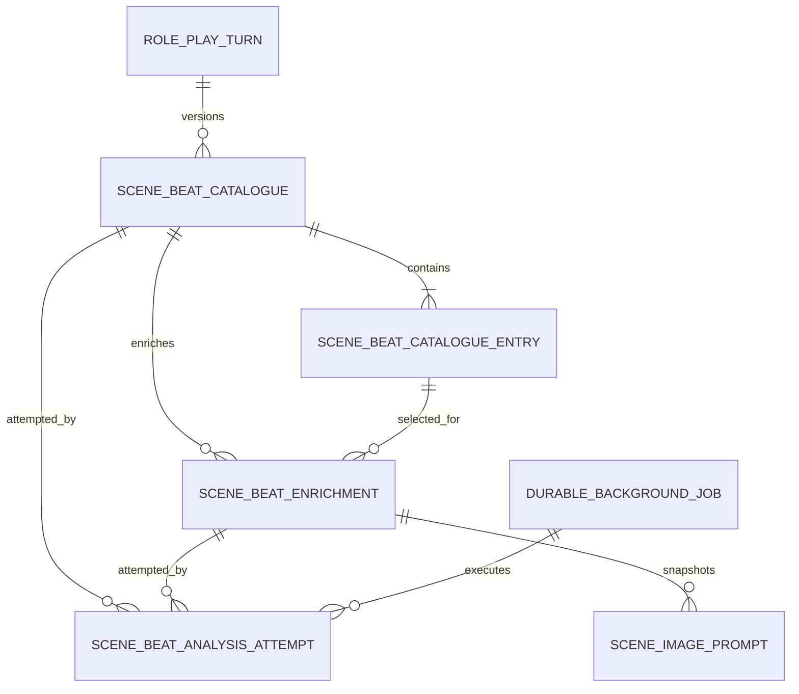

# B-100 Data Model

## Relationship Overview

## SceneBeatCatalogue

One immutable promoted catalogue version for one authoritative turn.

| Field | Type | Rules |
|---|---|---|
| `Id` | string | Stable GUID primary key. |
| `SessionId` | string | Required. |
| `TurnId` | string | Required authoritative `RolePlayV2Turn`. |
| `Version` | integer | Required, monotonically increasing within session/turn. |
| `Status` | enum | `Pending`, `Processing`, `Complete`, `Failed`, `Superseded`, `Cancelled`. |
| `CurrentAttemptId` | string? | Attempt permitted to promote this version. |
| `SchemaVersion` | integer | Catalogue contract version. |
| `PromptContractVersion` | string | Exact catalogue prompt/schema version. |
| `InputSnapshotJson` | JSON | Immutable turn text, interaction index map, relevant character-profile snapshot, and checksums. |
| `ModelIdentifier` | string? | Resolved before execution. |
| `ProviderName` | string? | Resolved before execution. |
| `ExecutionSettingsJson` | JSON | Temperature, top-p, output limit, thinking mode, timeout, structured-output mode. |
| `ErrorCode` | string? | Stable machine-readable category. |
| `ErrorMessage` | string? | User-readable detail. |
| `CreatedUtc` | datetime | Required. |
| `StartedUtc` | datetime? | Set on lease acquisition. |
| `CompletedUtc` | datetime? | Set on terminal transition. |
| `UpdatedUtc` | datetime | Required. |

Constraints:

- Unique `(SessionId, TurnId, Version)`.
- At most one non-superseded current version per `(SessionId, TurnId)`.
- Only `CurrentAttemptId` may promote `Pending`/`Processing` to `Complete` or `Failed`.
- Complete catalogues are immutable.

## SceneBeatCatalogueEntry

Compact selection metadata. This is not a render brief.

| Field | Type | Rules |
|---|---|---|
| `CatalogueId` | string | Required foreign key. |
| `BeatId` | string | Stable within catalogue; composite primary key with `CatalogueId`. |
| `Order` | integer | Positive; unique within catalogue. |
| `Label` | string | Short selector title. |
| `FrozenMoment` | string | One or two concise sentences. |
| `PrimaryLocation` | string | One physical event location. |
| `ParticipantSummaryJson` | JSON | Names plus compact `active`/`observer` roles only. |
| `EvidenceInteractionIdsJson` | JSON | Resolved authoritative IDs; never model-invented UUIDs. |
| `ContentTagsJson` | JSON | Optional neutral tags for filtering; not prompt-family syntax. |

The application gives the model evidence keys such as `n0`, `c1`, and `c2`. Parsed keys are resolved to interaction IDs before entries are persisted.

## SceneBeatEnrichment

Detailed, image-family-neutral contract for one catalogue entry.

| Field | Type | Rules |
|---|---|---|
| `Id` | string | Stable GUID primary key. |
| `CatalogueId` | string | Required foreign key. |
| `BeatId` | string | Must exist in catalogue. |
| `Revision` | integer | Supports explicit re-enrichment without mutating old results. |
| `Status` | enum | Same lifecycle as catalogue. |
| `CurrentAttemptId` | string? | Compare-and-set owner. |
| `SchemaVersion` | integer | Enrichment contract version. |
| `PromptContractVersion` | string | Exact enrichment prompt/schema version. |
| `BeatSnapshotJson` | JSON | Immutable compact catalogue entry used as input. |
| `TurnEvidenceSnapshotJson` | JSON | Only evidence required to enrich this beat, plus authoritative Narrative. |
| `VisualContractJson` | JSON | Cast, involvement, clothing, positions, actions, sightlines, visibility, location, time, lighting, environment, mood, and continuity facts. |
| `ModelIdentifier` | string? | Resolved execution model. |
| `ProviderName` | string? | Resolved provider. |
| `ExecutionSettingsJson` | JSON | Exact resolved settings. |
| `ErrorCode` | string? | Stable category. |
| `ErrorMessage` | string? | User-readable detail. |
| timestamps | datetime | Created/started/completed/updated. |

Constraints:

- Unique `(CatalogueId, BeatId, Revision)`.
- At most one current revision per catalogue beat.
- An enrichment from a superseded catalogue remains historical but is ineligible for new prompt records.

## SceneBeatAnalysisAttempt

Append-only execution history for catalogue or enrichment.

| Field | Type | Rules |
|---|---|---|
| `Id` | string | Primary key. |
| `Operation` | enum | `Catalogue` or `Enrichment`. |
| `OwnerRecordId` | string | Catalogue or enrichment ID. |
| `AttemptNumber` | integer | Starts at 1. |
| `JobId` | string | Durable job foreign key. |
| `Status` | enum | `Queued`, `Processing`, `Complete`, `Failed`, `Superseded`, `Cancelled`. |
| `SystemPrompt` | text | Exact request. |
| `UserPrompt` | text | Exact request. |
| `RawModelResponse` | text? | Exact content response. |
| `ReasoningContent` | text? | Optional, governed by retention policy. |
| `FinishReason` | string? | Provider result. |
| `ValidationCode` | string? | Parse/schema/semantic category. |
| `ValidationDetailsJson` | JSON | Paths, indexes, and structured diagnostics. |
| `DurationMs` | integer? | End-to-end model call duration. |
| `InputCharacters` | integer | Diagnostic. |
| `OutputCharacters` | integer? | Diagnostic. |
| timestamps | datetime | Required lifecycle timestamps. |

## DurableBackgroundJob

Shared durable execution primitive. It should be generic enough for later B-032 jobs but introduced with the smallest slice needed by catalogue/enrichment.

| Field | Type | Rules |
|---|---|---|
| `Id` | string | Primary key. |
| `JobType` | string | Registered handler type. |
| `Lane` | enum/string | `TextAnalysis`, `PromptCompilation`, `ImageRender`, `ImageEdit`. |
| `PayloadJson` | JSON | Stable IDs only. |
| `DedupeKey` | string | Unique while job is non-terminal. |
| `Status` | enum | `Queued`, `Processing`, `RetryScheduled`, `Complete`, `Failed`, `Cancelled`. |
| `AttemptCount` | integer | Persisted. |
| `MaxAttempts` | integer | Copied from required UI-backed policy at acceptance. |
| `NextAttemptUtc` | datetime? | Retry schedule. |
| `LeaseOwner` | string? | Worker instance. |
| `LeaseExpiresUtc` | datetime? | Enables recovery. |
| `ErrorCode` | string? | Stable category. |
| `ErrorMessage` | string? | Last failure. |
| timestamps | datetime | Required. |

## Registered Model Capability Additions

| Field | Purpose |
|---|---|
| `SupportsStructuredJsonSchema` | Provider/model can enforce the required JSON Schema transport. |
| `SupportsThinkingControl` | Existing capability retained. |
| `MaximumContextTokens` | Validation and observability. |
| `MaximumOutputTokens` | Prevent invalid function settings. |
| `SceneImageModelFamily` | Explicit renderer family metadata for image models. |
| `PromptDialect` | Explicit prompt compiler key, independent of checkpoint filename. |

## Function Configuration Additions

`AppFunction.RolePlaySceneBeatAnalyzer` owns catalogue and enrichment text-model resolution. Required UI-backed settings include model, sampling, max output, thinking mode, lane concurrency, transient retry count/delays, and diagnostics retention policy.

Catalogue and enrichment may initially share this function model while using separate prompt contracts. Splitting them into separate function defaults later requires an explicit design change; code must not infer a second source or silently select another model.

## Legacy Migration

- Keep `SceneImageBeatAnalyses` readable while legacy prompt/image records reference it.
- Do not rewrite completed legacy JSON in place.
- New Generate Beats actions create `SceneBeatCatalogue` records only after feature activation.
- A legacy completed analysis may be displayed with a Legacy badge and used only under the existing schema-v3 compatibility policy during the transition window.
- New prompt records after cutover require a current completed enrichment; there is no guessed legacy-to-enrichment conversion.
