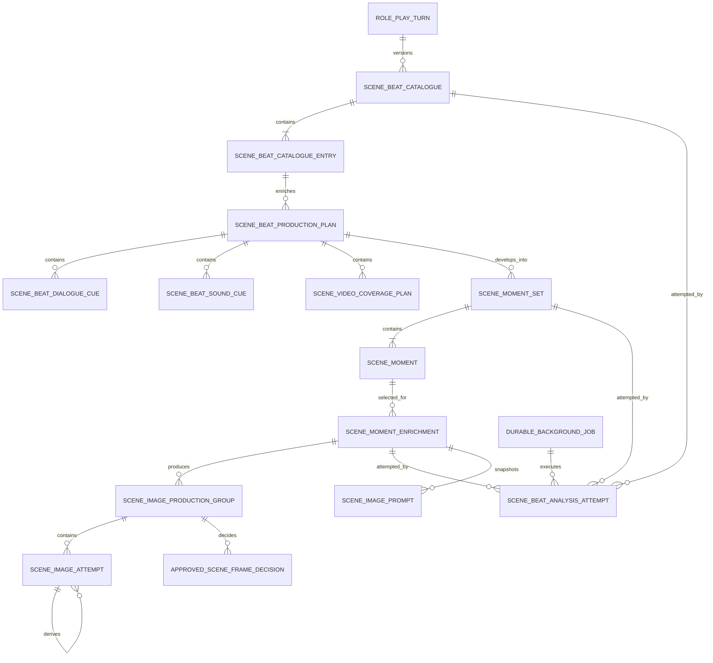

# B-100 Data Model

## Relationship Overview

## SceneBeatCatalogue

One immutable promoted catalogue version for one authoritative turn.

| Field | Type | Rules |
|---|---|---|
| `Id` | string | Stable GUID primary key. |
| `SessionId` | string | Required. |
| `TurnId` | string | Required authoritative `RolePlayV2Turn`. |
| `Version` | integer | Required, monotonically increasing within session/turn. |
| `Status` | enum | `Pending`, `Processing`, `Complete`, `Failed`, `Superseded`, `Cancelled`. |
| `CurrentAttemptId` | string? | Attempt permitted to promote this version. |
| `SchemaVersion` | integer | Catalogue contract version. |
| `PromptContractVersion` | string | Exact catalogue prompt/schema version. |
| `InputSnapshotJson` | JSON | Immutable turn text, interaction index map, relevant character-profile snapshot, and checksums. |
| `ModelIdentifier` | string? | Resolved before execution. |
| `ProviderName` | string? | Resolved before execution. |
| `ExecutionSettingsJson` | JSON | Temperature, top-p, output limit, thinking mode, timeout, structured-output mode. |
| `ErrorCode` | string? | Stable machine-readable category. |
| `ErrorMessage` | string? | User-readable detail. |
| `CreatedUtc` | datetime | Required. |
| `StartedUtc` | datetime? | Set on lease acquisition. |
| `CompletedUtc` | datetime? | Set on terminal transition. |
| `UpdatedUtc` | datetime | Required. |

Constraints:

- Unique `(SessionId, TurnId, Version)`.
- At most one non-superseded current version per `(SessionId, TurnId)`.
- Only `CurrentAttemptId` may promote `Pending`/`Processing` to `Complete` or `Failed`.
- Complete catalogues are immutable.

## SceneBeatCatalogueEntry

Compact selection metadata. This is not a render brief.

| Field | Type | Rules |
|---|---|---|
| `CatalogueId` | string | Required foreign key. |
| `BeatId` | string | Stable within catalogue; composite primary key with `CatalogueId`. |
| `Order` | integer | Positive; unique within catalogue. |
| `Label` | string | Short selector title. |
| `BeatSynopsis` | string | One or two concise sentences describing the narrative development; may span movement through time. |
| `PrimaryLocation` | string | One physical location, optionally a known canonical location plus a specific spot within it (e.g. `Husband and Wife Trailer — Shared Private Space - the trailer deck`); empty is allowed when no location applies (the user picks/enters one downstream). Canonical location names are supplied to the model as `KNOWN LOCATIONS`. |
| `ParticipantSummaryJson` | JSON | Names plus compact `active`/`observer` roles only. |
| `EvidenceInteractionIdsJson` | JSON | Resolved authoritative IDs; never model-invented UUIDs. |
| `ContentTagsJson` | JSON | Optional neutral tags for filtering; not prompt-family syntax. |

The application gives the model evidence keys such as `n0`, `c1`, and `c2`. Parsed keys are resolved to interaction IDs before entries are persisted.

## SceneBeatProductionPlan

Canonical provider-neutral temporal production data for one selected Beat. This is the source for audio and video generation and the parent context for Moment discovery.

| Field | Type | Rules |
|---|---|---|
| `Id` | string | Stable GUID primary key. |
| `CatalogueId`, `BeatId` | string | Required parent lineage. |
| `Version` | integer | Monotonically increasing for explicit re-analysis. |
| `Status`, `CurrentAttemptId` | mixed | Compare-and-set lifecycle ownership. |
| `SchemaVersion`, `PromptContractVersion` | mixed | Exact production-plan contract. |
| `SourceSnapshotJson` | JSON | Immutable Beat, Turn, interaction, character, location, and evidence input. |
| `NarrativeArcJson` | JSON | Ordered story events and Beat-relative temporal anchors. |
| `TimelineJson` | JSON | Canonical Beat-relative timebase, ordered typed windows, duration intent, and overlap policy. |
| `NarrationCuesJson` | JSON | Exact source/display text, normalized spoken text, narrator kind, language, delivery/performance intent, and typed windows. |
| `DialogueCuesJson` | JSON | Exact source/display text, normalized spoken text, speaker/addressee keys, language, delivery/performance intent, pronunciation, pause/overlap intent, and typed windows. |
| `AmbiencePlanJson` | JSON | Location/time soundscape, sources, intensity, continuity boundaries, and transitions. |
| `SoundEventCuesJson` | JSON | Discrete diegetic/non-diegetic events with subject/object and temporal anchors. |
| `MusicPlanJson` | JSON | Optional ordered duration-bearing music sections, mood, instrumentation, tempo/key when authored, transitions, lyric/instrumental state, and continuity. |
| `ActionArcJson` | JSON | Ordered subject/action/target state changes suitable for motion planning. |
| `StartContinuityJson`, `EndContinuityJson` | JSON | Cast, wardrobe, location, objects, lighting, and state boundaries. |
| `TypedReferencesJson` | JSON | Identity, voice, continuity, pose, style, location, keyframe, source-media, and conditioning references with role and lineage. |
| `VideoCoveragePlansJson` | JSON | Provider-neutral Moment/transition/Beat-excerpt/whole-Beat opportunities and requirements. |
| execution/error/timestamps | mixed | Full resolved model provenance and lifecycle. |

Constraints:

- Unique `(CatalogueId, BeatId, Version)` and at most one current version.
- Exact dialogue/narration text and source offsets must resolve to the immutable RP snapshot.
- Unknown or ambiguous speaker attribution is `ReviewRequired`, never guessed.
- Ordered events and state transitions cannot contradict source chronology.
- Complete plans include an explicit ambience state, including authored silence where appropriate.
- Video coverage identifies required key-state roles but does not invent unavailable Moment IDs; Moment discovery resolves them.
- Canonical time is Beat-relative seconds plus event anchors. Provider frame numbers are derived from time and selected FPS.
- Required typed windows are non-negative, ordered, and contained by their owning Beat/coverage range unless explicitly marked as a continuity lead-in/tail.
- Display/source dialogue is immutable. Spoken normalization is separately stored with method/version and cannot change semantic words.

## Shared Production Value Objects

### ProductionTimeWindow

`StartSeconds`, `EndSeconds`, `StartEventKey`, `EndEventKey`, `DurationIntent`, `Precision` (`Exact`, `Estimated`, `Relative`), and `OverlapPolicy`. Seconds are Beat-relative decimals. At least one resolvable anchor form is required.

### TypedMediaReference

`ReferenceId`, `Role`, `MediaKind`, `SourceRecordId`, `AssetId`, `SubjectCharacterId`, `Window`, and `Required`. Roles include `CharacterIdentity`, `VoiceIdentity`, `WardrobeContinuity`, `LocationContinuity`, `PropContinuity`, `Pose`, `Style`, `VideoFirstFrame`, `VideoLastFrame`, `VideoInternalKeyframe`, `SourceVideo`, `SourceSpeech`, `MusicConditioning`, and `LipSyncVisualSource`.

### VoicePerformanceIntent

`SpeakerCharacterId`, `LanguageCode`, `Locale`, `Emotion`, `Intensity`, `Pace`, `AccentIntent`, `PauseCues`, `OverlapOrInterruption`, `PronunciationLexemes`, and `NonVerbalVocalEvents`. It contains semantic intent, not provider tags or SSML.

### RealizedMediaAlignment

Immutable derivative metadata: actual duration, sample rate or FPS, original and normalized character/word intervals when available, provider request ID, and source cue IDs. Realized timing never mutates the Beat plan; downstream plans reference the approved derivative version.

## SceneBeatDialogueCue

Normalized queryable cue projected from the Beat plan: `Id`, `BeatProductionPlanId`, `Order`, `Kind` (`Dialogue`, `Narration`, `Thought`), `ExactSourceText`, `DisplayText`, `NormalizedSpokenText`, normalization provenance, source offsets, `SpeakerCharacterId`, addressees, `VoicePerformanceIntent`, `ProductionTimeWindow`, lip-sync relevance, and review status.

## SceneBeatSoundCue

Normalized audio source cue: `Id`, `BeatProductionPlanId`, `Kind` (`Ambience`, `SoundEffect`, `MusicSection`), event/location source, subject/object, description, intensity envelope, spatial/diegetic state, `ProductionTimeWindow`, loop/stem intent, continuity group, and review status.

## SceneVideoCoveragePlan

One provider-neutral video opportunity: `Id`, `BeatProductionPlanId`, `CoverageKind` (`MomentHold`, `MomentAction`, `MomentTransition`, `BeatExcerpt`, `WholeBeat`), `ProductionTimeWindow`, source event range, required start/end/internal Moment roles, permitted action phases, camera/lens/motion/pacing intent, typed references, dialogue/sound/music cue IDs, per-cue audio ownership, lip-sync/performance requirements, duration-fit policy, and review status.

## CompiledMediaBrief and ApprovedMediaDerivative

Every compiler produces an immutable `CompiledMediaBrief` containing compiler/profile version, target model capabilities, complete canonical lineage, semantic input snapshot, provider request snapshot, required-intent coverage report, and status. Successful generation creates an `ApprovedMediaDerivative` with asset lineage and `RealizedMediaAlignment` where applicable. Compilation does not mutate Beat or Moment records.

## SceneMomentSet

One immutable promoted set of compact frozen key-state candidates for a selected Beat Production Plan. Candidates support still images, exact audio-event anchors, and video start/end/internal key states.

| Field | Type | Rules |
|---|---|---|
| `Id` | string | Stable GUID primary key. |
| `CatalogueId` | string | Required foreign key. |
| `BeatId` | string | Must exist in catalogue. |
| `BeatProductionPlanId` | string | Required current parent plan. |
| `Version` | integer | Monotonically increasing for explicit regeneration. |
| `Status` | enum | Same lifecycle as catalogue. |
| `CurrentAttemptId` | string? | Compare-and-set owner. |
| `RecommendedMomentId` | string? | Required on completion and must identify exactly one child moment. |
| `SchemaVersion` | integer | Moment-discovery contract version. |
| `PromptContractVersion` | string | Exact moment-discovery prompt/schema version. |
| `BeatSnapshotJson` | JSON | Immutable compact Beat plus production-plan events and requested key-state roles. |
| `TurnEvidenceSnapshotJson` | JSON | Authoritative Narrative and cited evidence needed to locate moments. |
| execution/error/timestamps | mixed | Same provenance and lifecycle requirements as catalogue. |

Constraints:

- Unique `(CatalogueId, BeatId, Version)`.
- At most one current version per catalogue beat.
- Complete moment sets contain 2–4 moments and exactly one recommendation.
- Moment sets under superseded catalogues remain historical and are ineligible for new prompts.

## SceneMoment

Compact selection metadata for exactly one frozen visual state inside one beat. This is not a render brief.

| Field | Type | Rules |
|---|---|---|
| `MomentSetId` | string | Required foreign key. |
| `MomentId` | string | Stable within moment set; composite primary key with `MomentSetId`. |
| `Order` | integer | Positive and unique within moment set. |
| `Label` | string | Short selector title. |
| `TemporalAnchor` | string | Exact instant within the parent beat, not a time range. |
| `FrozenState` | string | Concise visible state containing no sequential before-and-after action. |
| `VisibleAction` | string | Action arrested at this instant. |
| `ParticipantSummaryJson` | JSON | Names plus compact visible roles. |
| `CompositionRationale` | string | Why this instant is useful for still composition or video continuity. |
| `ProductionRolesJson` | JSON | `StillCandidate`, `VideoStart`, `VideoEnd`, `VideoInternalKeyframe`, `SoundEventAnchor`, or combinations. |
| `EvidenceInteractionIdsJson` | JSON | Resolved authoritative IDs. |

## SceneMomentEnrichment

Detailed, provider-neutral exact-state contract for one selected Moment.

| Field | Type | Rules |
|---|---|---|
| `Id` | string | Stable GUID primary key. |
| `CatalogueId` | string | Required foreign key. |
| `BeatId` | string | Must exist in catalogue. |
| `MomentSetId` | string | Required current moment-set foreign key. |
| `MomentId` | string | Must exist in moment set. |
| `Revision` | integer | Supports explicit re-enrichment without mutating old results. |
| `Status` | enum | Same lifecycle as catalogue. |
| `CurrentAttemptId` | string? | Compare-and-set owner. |
| `SchemaVersion` | integer | Enrichment contract version. |
| `PromptContractVersion` | string | Exact enrichment prompt/schema version. |
| `MomentSnapshotJson` | JSON | Immutable selected moment plus parent beat used as input. |
| `TurnEvidenceSnapshotJson` | JSON | Only evidence required to enrich this moment, plus authoritative Narrative. |
| `FrozenStateContractJson` | JSON | Cast, involvement, clothing, positions, arrested actions, sightlines, visibility, location, time, lighting, environment, mood, objects, and continuity facts. |
| `InstantaneousSoundEventsJson` | JSON | Exact sound events occurring at this state, linked to Beat sound cues. |
| `VideoKeyStateJson` | JSON | Pose/state/camera-neutral constraints and start/end/internal keyframe roles. |
| `ModelIdentifier` | string? | Resolved execution model. |
| `ProviderName` | string? | Resolved provider. |
| `ExecutionSettingsJson` | JSON | Exact resolved settings. |
| `ErrorCode` | string? | Stable category. |
| `ErrorMessage` | string? | User-readable detail. |
| timestamps | datetime | Created/started/completed/updated. |

Constraints:

- Unique `(MomentSetId, MomentId, Revision)`.
- At most one current revision per moment-set moment.
- An enrichment from a superseded moment set or catalogue remains historical but is ineligible for new prompt records.

## SceneBeatAnalysisAttempt

Append-only execution history for catalogue, Beat production enrichment, Moment discovery, or Moment enrichment.

| Field | Type | Rules |
|---|---|---|
| `Id` | string | Primary key. |
| `Operation` | enum | `Catalogue`, `BeatProductionEnrichment`, `MomentDiscovery`, or `MomentEnrichment`. |
| `OwnerRecordId` | string | Catalogue, moment-set, or enrichment ID. |
| `AttemptNumber` | integer | Starts at 1. |
| `JobId` | string | Durable job foreign key. |
| `Status` | enum | `Queued`, `Processing`, `Complete`, `Failed`, `Superseded`, `Cancelled`. |
| `SystemPrompt` | text | Exact request. |
| `UserPrompt` | text | Exact request. |
| `RawModelResponse` | text? | Exact content response. |
| `ReasoningContent` | text? | Optional, governed by retention policy. |
| `FinishReason` | string? | Provider result. |
| `ValidationCode` | string? | Parse/schema/semantic category. |
| `ValidationDetailsJson` | JSON | Paths, indexes, and structured diagnostics. |
| `DurationMs` | integer? | End-to-end model call duration. |
| `InputCharacters` | integer | Diagnostic. |
| `OutputCharacters` | integer? | Diagnostic. |
| timestamps | datetime | Required lifecycle timestamps. |

## SceneImageProductionGroup

B-032-owned aggregate linking one intended approved frame to one exact B-100 Moment enrichment and POV.
It stores full Catalogue, Beat-plan, Moment-set, Moment, and enrichment lineage; status; identity policy;
optional persisted skip reason; current approval decision; and timestamps. Replacement analysis never
rebinds an existing group.

## SceneImageAttempt

`SceneImageRecord` remains the stored execution attempt. It gains `ProductionGroupId`, stage
(`Composition`, `Identity`, `Finish`), disposition (`Active`, `Shortlisted`, `Rejected`, `Archived`),
exact canonical lineage, and typed-reference snapshot. Existing `SourceImageId` remains the immutable
parent relation for edit-derived attempts. Execution status remains independent from disposition and
approval.

## ApprovedSceneFrameDecision

Append-only B-032 approval record containing production-group ID, decision version, exact scene-image
ID and checksum, full B-100 lineage, decision state (`Approved`, `Superseded`, `Revoked`), actor, note,
and timestamp. At most one decision is current and Approved per production group. B-101 and continuity
consumers reference this record, never an arbitrary completed `SceneImageRecord`.

## Scene Asset Promotion

An explicit promotion creates a reusable `SceneAsset` with source approval ID, source image ID,
checksum, typed asset role, stable name, association metadata, and provenance. Files may be safely
shared only while repository reference guards prevent premature deletion. Production attempts do not
automatically become library assets.

## DurableBackgroundJob

Shared durable execution primitive. It should be generic enough for later B-032 jobs but introduced with the smallest slice needed by catalogue, moment discovery, and enrichment.

| Field | Type | Rules |
|---|---|---|
| `Id` | string | Primary key. |
| `JobType` | string | Registered handler type. |
| `Lane` | enum/string | `TextAnalysis`, `PromptCompilation`, `ImageRender`, `ImageEdit`. |
| `PayloadJson` | JSON | Stable IDs only. |
| `DedupeKey` | string | Unique while job is non-terminal. |
| `Status` | enum | `Queued`, `Processing`, `RetryScheduled`, `Complete`, `Failed`, `Cancelled`. |
| `AttemptCount` | integer | Persisted. |
| `MaxAttempts` | integer | Copied from required UI-backed policy at acceptance. |
| `NextAttemptUtc` | datetime? | Retry schedule. |
| `LeaseOwner` | string? | Worker instance. |
| `LeaseExpiresUtc` | datetime? | Enables recovery. |
| `ErrorCode` | string? | Stable category. |
| `ErrorMessage` | string? | Last failure. |
| timestamps | datetime | Required. |

## Registered Model Capability Additions

| Field | Purpose |
|---|---|
| `StructuredOutputMode` | Explicit provider/model transport: `None`, `StrictJsonSchema`, or `JsonObject`. |
| `SupportsThinkingControl` | Existing capability retained. |
| `MaximumContextTokens` | Optional validation and observability capability. |
| `MaximumOutputTokens` | Optional upper bound for the required function max-output setting. |
| `SceneImageModelFamily` | Explicit renderer family metadata for image models. |
| `PromptDialect` | Explicit prompt compiler key, independent of checkpoint filename. |

## Function Configuration Additions

`AppFunction.RolePlaySceneBeatAnalyzer` owns catalogue, Beat-production, Moment-discovery, and Moment-enrichment text-model resolution. Required UI-backed settings include model, sampling, max output, thinking mode, lane concurrency, transient retry count/delays, and diagnostics retention policy.

All stages initially share this function model while using separate versioned prompt contracts. Splitting them into separate function defaults later requires an explicit design change; code must not infer another source or silently select another model.

## Legacy Migration

- Keep `SceneImageBeatAnalyses` readable while legacy prompt/image records reference it.
- Do not rewrite completed legacy JSON in place.
- New Generate Beats actions create `SceneBeatCatalogue` records only after feature activation.
- A legacy completed analysis may be displayed with a Legacy badge and used only under the existing schema-v3 compatibility policy during the transition window.
- New image requests require a current Moment enrichment. Audio requests require the current Beat Production Plan and referenced cue/Moment anchors. Video requests require the current Beat Production Plan and all Moments mandated by its coverage plan. Every derivative retains the complete lineage; there is no guessed legacy conversion.
