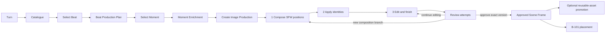

# Production Studio and Image Asset Workflow

**State:** Design approved 2026-08-31; implementation not started  
**Evidence boundary:** Current `001-scene-image-generator` branch and worktree only  
**Owners:** B-100 canonical Beat/Moment production; B-032 image execution, attempts, approval, and assets

## Purpose

Replace the current proof-of-concept card stack with one coherent path from an authoritative turn to
an approved scene frame. The workflow must support many generations and edits without polluting the
reusable Asset Library or losing provenance.

## Approved Product Decisions

1. Use one **Unified Production Studio** on the existing Scene Image Studio route.
2. Require approved identity packs for visible known characters, unless the user records an explicit
   skip decision for that production group.
3. Preserve attempt metadata and lineage after approval. Rejected image bytes may be purged through a
   configurable UI-backed retention policy when no protected reference depends on them.
4. Keep approved scene frames separate from reusable assets. Promotion to `SceneAsset` is explicit.

## Ownership Boundary

| Concern | Owner |
|---|---|
| Catalogue Beat, Beat Production Plan, Moment candidates, enriched frozen state | B-100 |
| Provider-neutral image production intent and required typed references | B-100 compiler projection |
| Image production group, stages, attempts, parent/child lineage, review state | B-032 |
| Image generation, identity application, source-image edits, stored bytes | B-032 |
| Approval of one exact scene-frame version | B-032 |
| Reusable character, location, wardrobe, prop, and style assets | Scene Asset subsystem under B-032 |
| Presentation placement of an approved frame | B-101 |

B-100 never owns provider execution or image cleanup. B-032 never re-analyzes RP prose to invent
Beat/Moment facts.

## User Workflow

### Stage 1 - Compose

- Generate a safe composition whose purpose is people count, body placement, pose, camera, clothing,
  location, and visible props.
- The prompt is compiled from the selected enriched Moment, not raw RP prose.
- Explicit anatomy or other finishing detail is withheld from this stage when it would interfere with
  reliable composition.
- Regeneration creates sibling attempts in the same production group. It never overwrites an image.

### Stage 2 - Identity

- Start from one selected completed composition attempt.
- Resolve approved identity packs for every known visible character in the Moment.
- Apply identity through a source-image reference edit capability. The current branch does not yet
  expose this capability in `IImageEditingClient`; identity-conditioned text-to-image is not an
  equivalent substitute.
- Missing packs fail explicitly and name the character. The only bypass is a persisted user skip with
  a reason; there is no silent omission.
- Re-running identity creates sibling children of the selected composition.

### Stage 3 - Edit and Finish

- Start from a selected identity-stage result, or from composition only when identity was explicitly
  skipped.
- Run one or more source-image edits for corrections and final modifications, including an adult
  content edit when the configured editor permits it.
- Each edit is immutable and points to its exact source. A user may branch from any completed attempt.
- Provider/model/settings, compiled prompt, source checksum, and identity references are snapshotted.

### Stage 4 - Review and Approve

- Review attempts as a lineage tree or branch-aware filmstrip, not one flat reverse-chronological list.
- Compare any two attempts side by side.
- Mark attempts as shortlisted or rejected without deleting them.
- Approve exactly one completed attempt for a production group. Approval records the exact attempt,
  checksum, B-100 lineage, decision time, and user.
- A later approval creates a new decision version and supersedes the prior decision; it does not mutate
  the previously approved record.

## Production Studio Layout

The existing route remains, but the page becomes a work surface with stable regions:

1. **Left rail - Story selection:** Catalogue status, compact Beat list, selected Beat, and 2-4 Moment
   choices. Dense rows replace the current detailed Beat buttons.
2. **Center - Production canvas:** large selected image, stage stepper, stage-specific controls, and
   before/after comparison. Only the active stage's controls are visible.
3. **Right inspector:** selected Moment facts, cast/identity readiness, model/settings, exact lineage,
   and diagnostics. Advanced prompts are collapsed by default.
4. **Bottom attempt strip:** branch-aware thumbnails grouped by Compose, Identity, and Finish, with
   status, shortlist/reject, branch, compare, and approve actions.

The primary command changes by state: Generate Catalogue, Prepare Beat, Prepare Moment, Generate
Composition, Apply Identity, Run Edit, or Approve. The UI does not present all commands at once.

## Persistence Model

### SceneImageProductionGroup

One intended approved frame for one exact B-100 Moment enrichment and POV.

- `Id`
- `SessionId`, `InteractionId`
- `CatalogueId`, `BeatProductionPlanId`, `MomentSetId`, `MomentId`, `MomentEnrichmentId`
- `Pov`, optional camera intent snapshot
- `Status`: `Draft`, `InProgress`, `Review`, `Approved`, `Archived`
- `IdentityPolicy`: `Required`, `SkippedByUser`
- `IdentitySkipReason`
- `CurrentApprovedDecisionId`
- timestamps

A group is never silently rebound to a replacement Catalogue, plan, Moment set, or enrichment.

### SceneImageAttempt additions

Continue using `SceneImageRecord` for generated files and edit lineage; add:

- `ProductionGroupId`
- `Stage`: `Composition`, `Identity`, `Finish`
- `ParentAttemptId` using the existing source-image relation where applicable
- `Disposition`: `Active`, `Shortlisted`, `Rejected`, `Archived`
- exact B-100 lineage snapshot or foreign keys
- typed reference snapshot used by the stage

`Complete` continues to mean execution succeeded. It does not mean approved.

### ApprovedSceneFrameDecision

Append-only approval record:

- `Id`, `ProductionGroupId`, `Version`
- `SceneImageId`, `Sha256`
- complete B-100 lineage
- `Decision`: `Approved`, `Superseded`, `Revoked`
- `DecidedBy`, `DecisionUtc`, optional note

Only the current `Approved` decision is eligible for B-101 placement or continuity anchoring.

### SceneAsset promotion

Promotion creates a `SceneAsset` record that references or safely shares the approved file and stores:

- source approval decision and scene-image ID
- asset role/type such as Location, Wardrobe, Prop, Style, Character Face, or Character Body
- user-provided stable name and subject/location association
- immutable source checksum and provenance

Scene attempts are not automatically copied into `SceneAssets`.

## Retention and Cleanup

- Approval never immediately destroys attempt metadata.
- Bulk actions: reject selected, archive rejected metadata, purge eligible rejected bytes, and keep
  approved lineage bytes.
- Byte purge is blocked for the approved attempt, its required ancestor chain, reusable-asset sources,
  identity-pack references, edit-session sources, or any other persisted reference.
- Purged attempts retain metadata, checksum, prompt/model provenance, disposition, and a `BytesPurgedUtc`
  marker; the UI shows a non-viewable historical thumbnail state.
- Retention age and automatic/manual mode are persisted UI-backed settings. No hardcoded cleanup age.

## First Implementation Boundary

The first implementation should establish the workflow backbone without pretending the entire media
pipeline is complete:

1. B-100 durable execution and Catalogue vertical slice.
2. Production-group, attempt-stage, disposition, and approval persistence.
3. Catalogue/Beat/Moment selection shell in Production Studio, with legacy images shown separately.
4. Existing prompt-only generation registered as a Composition attempt.
5. Review, shortlist/reject, approve, and guarded manual byte purge.

Identity-reference editing and automated stage progression follow as the next slice. Existing
identity-conditioned text-to-image remains available as a legacy/experimental action and is not
misrepresented as the required identity-after-composition stage.

## Acceptance

- One user action generates a compact persisted Catalogue, not fully enriched image prompts.
- The user selects one Beat and one exact Moment before creating a production group.
- Multiple composition/edit attempts remain grouped under that Moment and can branch without overwrite.
- `Complete`, `shortlisted`, `rejected`, and `approved` are visibly and persistently distinct.
- Exactly one immutable approval decision is current per production group.
- Rejected bytes can be purged safely while metadata and protected lineage remain.
- Only explicit promotion creates a reusable Scene Asset.
- B-101 can consume the exact approved decision without reinterpreting the story or selecting an
  arbitrary completed render.