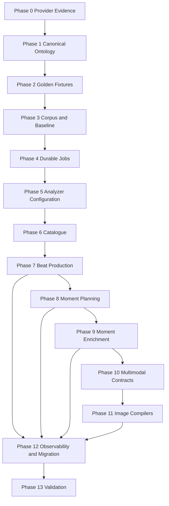

# B-100 Tasks - Progressive Scene Beat and Moment Pipeline

Task format: `[ID] [P?] [Story?] Description` where `[P]` indicates work that can proceed in parallel after its dependencies.

## Phase 0 - Provider Evidence Matrix

- [ ] T000 Record official representative request inputs for image, TTS, sound, music, video, native-video audio, and lip-sync/performance.
- [ ] T005 Classify every documented field as canonical, compiler/profile-only, realized derivative metadata, or unsupported.
- [ ] T006 Record model/version, required/optional/unsupported status, source URL, verification date, and confidence for every evidence row.
- [ ] T007 Reject untyped canonical prose fields where consumers require explicit time, identity, reference, performance, or ownership data.
- [ ] T008 Add an evidence-maintenance gate to each future generator epic.

## Phase 1 - Canonical Ontology and Invariants

- [ ] T021 Define canonical Beat-relative timebase and typed production windows.
- [ ] T022 Define stable subject, speaker, location, wardrobe, and prop identity contracts.
- [ ] T023 Define immutable display/source dialogue, normalized spoken text, and normalization provenance.
- [ ] T024 Define voice/facial/head performance intent and pronunciation/pause/overlap contracts.
- [ ] T025 Define typed media-reference roles and complete lineage rules.
- [ ] T026 Define ordered music-section, audio-ownership, and continuity contracts.
- [ ] T027 Define visual start/end/internal state and permitted action-phase contracts.
- [ ] T028 Define realized media duration/alignment contracts.
- [ ] T029 Define cross-modal consistency and unsupported-required-intent failure rules.

## Phase 2 - Golden Compiler Fixtures

- [ ] T041 Create one immutable representative Beat/Moment lineage fixture.
- [ ] T042 [P] Define expected Pony, SDXL/Juggernaut, and FLUX-like image requests.
- [ ] T043 [P] Define expected TTS plus realized-alignment import request/response shapes.
- [ ] T044 [P] Define expected ambience, ordered sound-effect, and music composition requests.
- [ ] T045 [P] Define expected requests for all five video coverage kinds and native-video audio.
- [ ] T046 [P] Define expected lip-sync/performance request with approved source assets and exact windows.
- [ ] T047 Add normalized semantic assertions across all compiled request snapshots.
- [ ] T048 Prove no fixture compiler reads RP prose or mutates canonical records.

## Phase 3 - Evidence Corpus and Benchmark

- [ ] T001 Create a sanitized frozen turn corpus under this feature folder or an approved fixture location.
- [ ] T002 Define expected beat boundaries, 2–4 moment candidates, recommendation, and evidence keys for every corpus case.
- [ ] T003 Capture current one-shot latency and validity baseline.
- [ ] T004 Add a repeatable catalogue/moment-discovery/enrichment benchmark runner and report format.

## Phase 4 - Durable Execution Foundation

- [ ] T010 Define durable job, lane, lease, status, and retry domain models.
- [ ] T011 Define durable job repository and queue application contracts.
- [ ] T012 Implement additive SQLite schema and transactional durable enqueue.
- [ ] T013 Implement lane-aware claim and expiring lease operations.
- [ ] T014 Implement terminal, cancellation, retry-scheduled, and recovery transitions.
- [ ] T015 Add worker startup recovery for expired processing leases.
- [ ] T016 Add required persisted/UI-backed lane concurrency and retry policies.
- [ ] T017 Implement a durable worker for the `TextAnalysis` lane.
- [ ] T018 [P] Add repository tests for enqueue, claim, lease, cancellation, and recovery.
- [ ] T019 [P] Add retry classification tests for transient and permanent failures.
- [ ] T020 Add reverse-order completion and stale-owner concurrency tests.

## Phase 5 - Analyzer Configuration and Structured Output

- [ ] T030 Add `AppFunction.RolePlaySceneBeatAnalyzer`.
- [ ] T031 Add registered-model capability fields for strict JSON Schema, context limit, and output limit.
- [ ] T032 Add analyzer function configuration for model, sampling, max output, thinking mode, lane concurrency, retry policy, and diagnostics retention.
- [ ] T033 Update Model Manager UI to edit and persist every required analyzer setting.
- [ ] T034 Implement one canonical analyzer resolver that never consumes `RolePlaySession.SessionModelId`.
- [ ] T035 Add strict structured text-completion request/response contracts.
- [ ] T036 Implement provider transport for configured strict JSON Schema support.
- [ ] T037 Fail before enqueue when capabilities or required settings are missing/incompatible.
- [ ] T038 [P] Add resolver source and missing-config tests.
- [ ] T039 [P] Add provider request-body contract tests proving the exact JSON Schema is sent.
- [ ] T040 [P] Add tests proving session prose-model overrides do not affect analyzer resolution.

## Phase 6 - Beat Catalogue

- [ ] T050 [US1] Add `SceneBeatCatalogue`, `SceneBeatCatalogueEntry`, and attempt domain models.
- [ ] T051 [US1] Add catalogue repository interface and SQLite implementation.
- [ ] T052 [US1] Add compare-and-set catalogue status/result operations.
- [ ] T053 [US1] Implement immutable authoritative turn snapshot creation.
- [ ] T054 [US1] Implement compact evidence/profile key assignment and resolution.
- [ ] T055 [US1] Define versioned catalogue JSON Schema and prompt contract.
- [ ] T056 [US1] Implement strict catalogue semantic validation.
- [ ] T057 [US1] Implement `SceneBeatCatalogueJobHandler` on the durable text lane.
- [ ] T058 [US1] Add catalogue enqueue/query/cancel/replace service operations.
- [ ] T059 [US3] Prevent Generate Again while current work is pending unless explicitly cancelled/superseded.
- [ ] T060 [US1] Add Studio catalogue state and compact beat-card rendering in Razor micro-edits.
- [ ] T061 [US1] Preserve explicit legacy schema-v3 display compatibility.
- [ ] T062 [P] Add catalogue parser and semantic validation tests.
- [ ] T063 [P] Add catalogue service/job/persistence tests.
- [ ] T064 Add stale catalogue completion integration test.
- [ ] T065 Validate catalogue validity and latency gates on the frozen corpus.

## Phase 7 - Selected-Beat Multimodal Production

- [ ] T070 [US2] Add `SceneBeatProductionPlan`, timeline, dialogue, sound, music, typed-reference, video-coverage, and attempt models.
- [ ] T071 [US2] Add Beat-plan repository and compare-and-set operations.
- [ ] T072 [US2] Define versioned Beat-production JSON Schema and prompt contract.
- [ ] T073 [US2] Snapshot selected Beat, Turn/interactions, characters, location, and evidence.
- [ ] T074 [US2] Resolve exact source spans and speaker/addressee/evidence keys authoritatively.
- [ ] T075 [US2] Validate windows, dual dialogue text, performance, ambience, effects, music, action arc, references, continuity, video scope, key-state roles, and audio ownership.
- [ ] T076 [US2] Implement durable `SceneBeatProductionPlanJobHandler`.
- [ ] T077 [US2] Add enqueue/query/retry with Catalogue/Beat version validation and dedupe.
- [ ] T078 [US2] Show production data and review-required issues in Studio.
- [ ] T079 [P] Add dialogue attribution/source-span corpus tests.
- [ ] T080 [P] Add ambience/effect/action/continuity contract tests.
- [ ] T081 [P] Add every video coverage-kind and video-with-audio contract test.
- [ ] T082 Validate Beat-production semantic and latency gates.

## Phase 8 - Moment Discovery and Key-State Planning

- [ ] T090 [US3] Add `SceneMomentSet`, `SceneMoment`, and production-role models.
- [ ] T091 [US3] Add Moment-set repository and compare-and-set operations.
- [ ] T092 [US3] Define compact Moment/key-state JSON Schema and prompt contract.
- [ ] T093 [US3] Build input from current Beat Production Plan and authoritative evidence.
- [ ] T094 [US3] Validate frozen-state, recommendation, temporal order, and required production roles.
- [ ] T095 [US3] Implement durable `SceneBeatMomentDiscoveryJobHandler`.
- [ ] T096 [US3] Add enqueue/query/retry/dedupe by Beat-plan version.
- [ ] T097 [US3] Render Moment choices and still/video/audio-anchor roles.
- [ ] T098 [P] Add key-state completeness and sequential-action rejection tests.
- [ ] T099 Validate Moment-discovery validity and latency gates.

## Phase 9 - Selected-Moment Enrichment

- [ ] T110 [US4] Add `SceneMomentEnrichment` frozen-state, sound-anchor, and video-key-state models.
- [ ] T111 [US4] Add enrichment repository and compare-and-set operations.
- [ ] T112 [US4] Define versioned provider-neutral Moment-enrichment schema.
- [ ] T113 [US4] Build snapshots from Moment, Beat plan, source evidence, and continuity state.
- [ ] T114 [US4] Implement semantic validation and durable handler.
- [ ] T115 [US4] Add enqueue/query/retry/dedupe and current-version reuse.
- [ ] T116 [US4] Implement suggested still selection through normal persisted enrichment.
- [ ] T117 [US4] Show enrichment state and gate dependent media actions.
- [ ] T118 [P] Add frozen visual, instantaneous sound, and video key-state tests.
- [ ] T119 Validate Moment-enrichment validity and latency gates.

## Phase 9A - Production Studio and Image Attempt Backbone

- [ ] T066 [US10] Add `SceneImageProductionGroup`, stage, disposition, identity-policy, and approval-decision domain contracts under B-032 ownership.
- [ ] T067 [US10] Add repository contracts and additive SQLite schema with exact Catalogue/Beat/Moment enrichment lineage.
- [ ] T068 [US10] Add transactional production-group creation that requires a current completed Moment enrichment and POV.
- [ ] T069 [US10] Extend `SceneImageRecord` with production-group, stage, disposition, lineage, typed-reference snapshot, and optional bytes-purged metadata.
- [ ] T083 [US10] Register existing prompt-only generation as an immutable `Composition` attempt.
- [ ] T084 [US10] Add branch-aware attempt queries using existing `SourceImageId` lineage.
- [ ] T085 [US10] Add shortlist, reject, archive, approve, supersede, and revoke operations with compare-and-set current approval.
- [ ] T086 [US10] Add guarded rejected-byte purge and persisted UI-backed retention configuration.
- [ ] T087 [US10] Add explicit approved-frame-to-`SceneAsset` promotion with source provenance and shared-file reference guards.
- [ ] T088 [US10] Build the Production Studio shell: compact Catalogue/Beat/Moment rail, active-stage canvas, inspector, and branch-aware attempt strip.
- [ ] T089 [US10] Separate legacy images and POC actions from the new production-group workflow during migration.
- [ ] T100 [P] Add production-group, branching, disposition, approval-version, protected-purge, and asset-promotion persistence tests.
- [ ] T101 [P] Add Razor diagnostics and focused UI state tests for progressive command visibility.
- [ ] T102 Validate one selected Moment through composition attempts, approval, cleanup, and optional reusable-asset promotion.

## Phase 10 - Multimodal Compiler Contracts

- [ ] T130 [US7] Implement proven semantic input projections for still, speech, ambience/effects, music, video, video-with-audio, and lip-sync/performance.
- [ ] T131 [US7] Add explicit media kind/family/capability/compiler metadata contracts.
- [ ] T132 [US7] Define exact-match compiler resolution and fail-fast compatibility.
- [ ] T133 [US7] Persist full Beat/Moment lineage on every media brief.
- [ ] T134 [US7] Prohibit raw-RP semantic reinterpretation in compiler interfaces/tests.
- [ ] T135 [P] Add complete image/audio/video fixture compilation tests.
- [ ] T136 [US7] Persist required-intent coverage reports and fail on unsupported required intent.
- [ ] T137 [P] Add realized speech alignment import and lip-sync window contract tests.
- [ ] T138 [P] Add native-video versus external-audio cue ownership consistency tests.

## Phase 11 - Existing Image-Family Compilation

- [ ] T140 [US7] Add explicit image family and prompt dialect metadata to registered image models.
- [ ] T141 [US7] Add Model Manager editing and validation for image family/dialect.
- [ ] T142 [US7] Migrate existing Pony and SDXL/Juggernaut rows explicitly.
- [ ] T143 [US7] Adapt existing builders behind exact-match compilers.
- [ ] T144 [US7] Remove checkpoint-name guessing after migration verification.
- [ ] T145 [P] Prove one Moment compiles through both families without production-data mutation.

## Phase 12 - Observability, Migration, and Cleanup

- [ ] T150 [US8] Persist exact provenance and expose per-stage metrics/diagnostics.
- [ ] T151 [US8] Implement configured raw-response/reasoning retention and pruning.
- [ ] T152 Implement dual-read/new-write activation and preserve legacy records.
- [ ] T153 Remove legacy one-shot paths after compatibility/reference audit.
- [ ] T154 Update B-032 and B-101 source-of-truth hierarchy and operator docs.
- [ ] T155 [P] Add diagnostics, pruning, migration, and compatibility tests.

## Phase 13 - Final Validation

- [ ] T170 Run all B-100, SceneImage, and RolePlay tests.
- [ ] T171 Build the full solution and run the full suite with zero failures.
- [ ] T172 Run all four corpus validity and latency gates.
- [ ] T173 Run Catalogue -> Beat Production -> Moment Planning -> Moment Enrichment end to end.
- [ ] T174 Compile image, speech, sound, music, every video coverage kind, native-audio video, and lip-sync/performance fixtures.
- [ ] T178 Prove cross-modal identity, state, action, dialogue, speaker, timing, camera, ambience, effects, and music invariants.
- [ ] T175 Prove B-101 imports production facts without semantic rediscovery.
- [ ] T176 Test cancellation, reverse completion, stale descendants, and restart recovery.
- [ ] T177 Record acceptance and advance backlog state only after validation.

## Dependency Order

