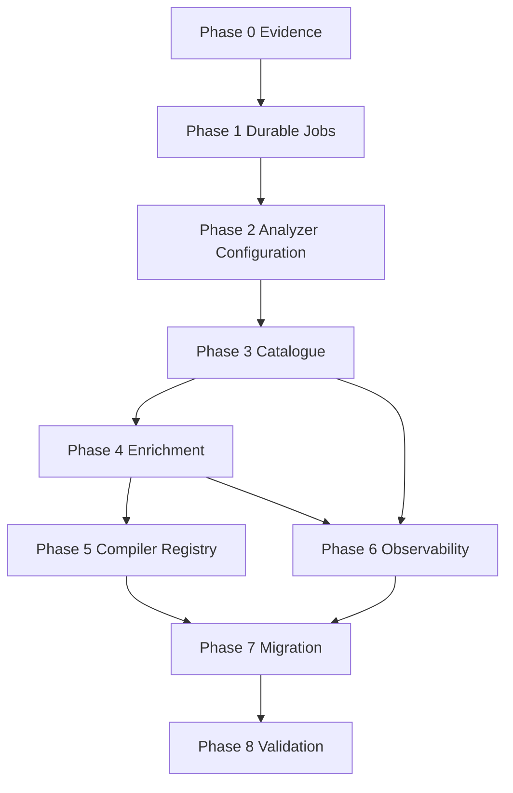

# B-100 Tasks - Progressive Scene Beat Pipeline

Task format: `[ID] [P?] [Story?] Description` where `[P]` indicates work that can proceed in parallel after its dependencies.

## Phase 0 - Evidence and Benchmark

- [ ] T001 Create a sanitized frozen turn corpus under this feature folder or an approved fixture location.
- [ ] T002 Define expected compact catalogue boundaries and evidence keys for every corpus case.
- [ ] T003 Capture current one-shot latency and validity baseline.
- [ ] T004 Add a repeatable catalogue/enrichment benchmark runner and report format.

## Phase 1 - Durable Execution Foundation

- [ ] T010 Define durable job, lane, lease, status, and retry domain models.
- [ ] T011 Define durable job repository and queue application contracts.
- [ ] T012 Implement additive SQLite schema and transactional durable enqueue.
- [ ] T013 Implement lane-aware claim and expiring lease operations.
- [ ] T014 Implement terminal, cancellation, retry-scheduled, and recovery transitions.
- [ ] T015 Add worker startup recovery for expired processing leases.
- [ ] T016 Add required persisted/UI-backed lane concurrency and retry policies.
- [ ] T017 Implement a durable worker for the `TextAnalysis` lane.
- [ ] T018 [P] Add repository tests for enqueue, claim, lease, cancellation, and recovery.
- [ ] T019 [P] Add retry classification tests for transient and permanent failures.
- [ ] T020 Add reverse-order completion and stale-owner concurrency tests.

## Phase 2 - Analyzer Configuration and Structured Output

- [ ] T030 Add `AppFunction.RolePlaySceneBeatAnalyzer`.
- [ ] T031 Add registered-model capability fields for strict JSON Schema, context limit, and output limit.
- [ ] T032 Add analyzer function configuration for model, sampling, max output, thinking mode, lane concurrency, retry policy, and diagnostics retention.
- [ ] T033 Update Model Manager UI to edit and persist every required analyzer setting.
- [ ] T034 Implement one canonical analyzer resolver that never consumes `RolePlaySession.SessionModelId`.
- [ ] T035 Add strict structured text-completion request/response contracts.
- [ ] T036 Implement provider transport for configured strict JSON Schema support.
- [ ] T037 Fail before enqueue when capabilities or required settings are missing/incompatible.
- [ ] T038 [P] Add resolver source and missing-config tests.
- [ ] T039 [P] Add provider request-body contract tests proving the exact JSON Schema is sent.
- [ ] T040 [P] Add tests proving session prose-model overrides do not affect analyzer resolution.

## Phase 3 - Beat Catalogue

- [ ] T050 [US1] Add `SceneBeatCatalogue`, `SceneBeatCatalogueEntry`, and attempt domain models.
- [ ] T051 [US1] Add catalogue repository interface and SQLite implementation.
- [ ] T052 [US1] Add compare-and-set catalogue status/result operations.
- [ ] T053 [US1] Implement immutable authoritative turn snapshot creation.
- [ ] T054 [US1] Implement compact evidence/profile key assignment and resolution.
- [ ] T055 [US1] Define versioned catalogue JSON Schema and prompt contract.
- [ ] T056 [US1] Implement strict catalogue semantic validation.
- [ ] T057 [US1] Implement `SceneBeatCatalogueJobHandler` on the durable text lane.
- [ ] T058 [US1] Add catalogue enqueue/query/cancel/replace service operations.
- [ ] T059 [US3] Prevent Generate Again while current work is pending unless explicitly cancelled/superseded.
- [ ] T060 [US1] Add Studio catalogue state and compact card rendering in Razor micro-edits.
- [ ] T061 [US1] Preserve explicit legacy schema-v3 display compatibility.
- [ ] T062 [P] Add catalogue parser and semantic validation tests.
- [ ] T063 [P] Add catalogue service/job/persistence tests.
- [ ] T064 Add stale catalogue completion integration test.
- [ ] T065 Validate catalogue validity and latency gates on the frozen corpus.

## Phase 4 - Selected-Beat Enrichment

- [ ] T070 [US2] Add `SceneBeatEnrichment` and neutral visual-contract domain models.
- [ ] T071 [US2] Add enrichment repository and compare-and-set operations.
- [ ] T072 [US2] Define versioned enrichment JSON Schema and prompt contract.
- [ ] T073 [US2] Build focused enrichment snapshots from catalogue entry plus cited authoritative evidence.
- [ ] T074 [US2] Implement strict enrichment semantic validation.
- [ ] T075 [US2] Implement durable `SceneBeatEnrichmentJobHandler`.
- [ ] T076 [US2] Add enrichment enqueue/query/retry operations with catalogue-version validation.
- [ ] T077 [US2] Dedupe enrichment by catalogue ID, beat ID, and revision.
- [ ] T078 [US2] Queue enrichment when an unenriched catalogue entry is selected.
- [ ] T079 [US2] Reuse a current completed enrichment without a model call.
- [ ] T080 [US2] Show selected-beat enrichment progress/failure and disable prompt actions until complete.
- [ ] T081 [US2] Change prompt enqueue to require and snapshot a current completed enrichment.
- [ ] T082 [P] Add enrichment parser and semantic validation tests.
- [ ] T083 [P] Add lazy-enrichment and reuse service/component tests.
- [ ] T084 Add replaced-catalogue/stale-enrichment rejection tests.
- [ ] T085 Validate enrichment validity and latency gates on the frozen corpus.

## Phase 5 - Extensible Image-Family Compilation

- [ ] T090 [US5] Add explicit image family and prompt dialect metadata to registered image models.
- [ ] T091 [US5] Add Model Manager editing and validation for image family/dialect.
- [ ] T092 [US5] Create reviewed migration assignments for existing Pony and SDXL/Juggernaut rows.
- [ ] T093 [US5] Define `ISceneImagePromptCompiler` and exact-match registry.
- [ ] T094 [US5] Adapt Pony prompt construction behind its compiler.
- [ ] T095 [US5] Adapt SDXL/Juggernaut prompt construction behind its compiler.
- [ ] T096 [US5] Resolve compiler from persisted metadata and fail on zero/multiple matches.
- [ ] T097 [US5] Remove checkpoint-name guessing from the active path after migration verification.
- [ ] T098 [P] Prove one enrichment compiles through both existing families unchanged.
- [ ] T099 [P] Add unknown/incompatible family fail-fast tests.

## Phase 6 - Observability and Retention

- [ ] T110 [US6] Persist exact prompt/schema/model/settings/finish/timing provenance on every attempt.
- [ ] T111 [US6] Add stable failure categories and structured validation details.
- [ ] T112 [US6] Expose separate catalogue/enrichment queue wait and execution metrics.
- [ ] T113 [US6] Surface useful attempt diagnostics in Studio without displaying secrets.
- [ ] T114 [US6] Implement configured raw-response/reasoning retention and pruning.
- [ ] T115 [P] Add diagnostics persistence and pruning tests.

## Phase 7 - Migration and Cleanup

- [ ] T120 Implement dual-read/new-write feature activation.
- [ ] T121 Verify existing scene-image prompt and render records remain readable.
- [ ] T122 Remove the legacy one-shot Generate Beats command after the compatibility gate.
- [ ] T123 Remove the legacy beat-generation handler and unused schema checks after reference audit.
- [ ] T124 Update B-032 implementation handoff, README, source-of-truth hierarchy, and diagrams.
- [ ] T125 Update operator/setup documentation for durable jobs and Model Manager fields.

## Phase 8 - Final Validation

- [ ] T130 Run all B-100 focused tests.
- [ ] T131 Run all SceneImage tests.
- [ ] T132 Run all RolePlay tests.
- [ ] T133 Build the full solution.
- [ ] T134 Run the full test suite with zero failures.
- [ ] T135 Run frozen-corpus validity and p50/p95 benchmark gates.
- [ ] T136 Run fresh Studio end-to-end validation through catalogue and selected-beat enrichment.
- [ ] T137 Run one Pony compile/render and one SDXL/Juggernaut compile/render from the same enrichment.
- [ ] T138 Test cancellation, replacement, reverse completion order, and application restart manually.
- [ ] T139 Record user acceptance and advance the backlog state only after validation.

## Dependency Order

