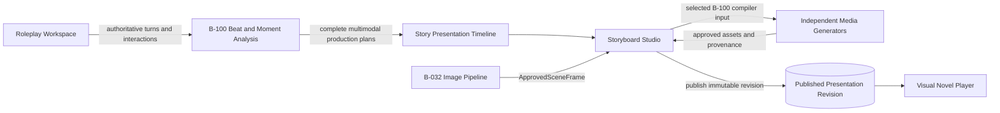

# B-101 - Story Presentation Timeline and Storyboard

**State:** Designed  
**Priority:** High  
**Scope:** Large epic  
**Created:** 2026-08-27  
**Prerequisites:** [B-100 Progressive Scene Beat and Image Moment Pipeline](../B-100-progressive-scene-beat-pipeline/README.md), [B-032 Scene Image Generator](../B-032-scene-image-generator/README.md)
**Program sequencing:** [Multimodal Production Program Roadmap](../multimodal-production-program-roadmap.md)

## Purpose

Wrap B-100's canonical multimodal production data in an editable presentation timeline, connect it to generated/approved assets, and publish it as a rich audiovisual Visual Novel. The design separates four stages/products:

1. **Roleplay Workspace:** creates authoritative story text from user guidance and inputs.
2. **Beat/Moment Production (B-100):** derives all provider-neutral story facts required for image, audio, and video generation.
3. **Storyboard Studio:** selects and arranges B-100 Beats, Moments, production cues, and generated assets into a reviewable presentation timeline.
4. **Visual Novel Player:** plays a published timeline with text, approved images or video, mixed audio, and deterministic Back/Forward navigation.

"Storyboard" is the authoring experience. The durable domain is a **Story Presentation Timeline**, because audio and video require duration, overlap, cue timing, and synchronization that cannot belong to a zero-duration frozen Moment.

This feature defines selection, sequencing, presentation timing, submission of already-compiled generation requests, approved-asset placement, publication, and playback contracts. It does not derive dialogue, soundscape, visual state, action arcs, or video coverage from RP prose; those are B-100 outputs. It does not own provider prompt compilation, generator clients, candidate validation, or asset approval, and it does not select image, speech, music, sound-effect, or video generation technology.

## Core Hierarchy

```text
RolePlaySession
  -> Authoritative Turn
      -> Beat Catalogue
          -> Beat
              -> Moment Set
                  -> Moment

StoryPresentation
  -> PresentationRevision
      -> Sequence
          -> PresentationSegment
              -> Text Cues
              -> Visual Placements
              -> Speech Cue Placements
              -> Ambience Cue Placements
              -> Sound Effect Cue Placements
              -> Music Intent Placements
              -> Video Coverage Placements
              -> Timeline Placements
```

A `PresentationSegment` is the smallest Back/Forward navigation unit in the Visual Novel Player. It has duration semantics and source lineage. It may:

- hold one approved image while several text cues advance;
- display one Moment as a panel;
- transition from a start Moment to an end Moment;
- cover part or all of a Beat as a video shot;
- contain dialogue, narration, ambience, effects, and music that overlap on explicit tracks;
- intentionally have no newly generated media.

## Architectural Boundary



The timeline references authoritative B-100 production records and approved media assets. It does not reinterpret raw RP prose, copy provider workflow logic into Beats/Moments, or let media generators decide story order.

## Required Semantic Tracks

| Track | Purpose | Minimum metadata |
|---|---|---|
| Text | Places B-100 narration/dialogue in VN display order | production cue ID, display selection, reveal/timing policy |
| Visual | Places still-image output | enriched Moment ID, approved-frame reference, fit/transition intent |
| Speech | Places generated speech | B-100 dialogue/narration cue ID, voice-version selection, timing/mix policy, approved asset |
| Ambience | Places generated soundscape | B-100 ambience cue ID, segment range, loop/fade/mix policy, approved asset |
| Sound effect | Places generated event audio | B-100 sound-event cue ID, timing/spatial mix policy, approved asset |
| Music | Places optional score | B-100 music intent ID, start/stop/fade/ducking policy, approved asset |
| Video | Places generated motion | B-100 video coverage-plan ID, required enriched Moment IDs, timing, approved asset |

The semantic content of these tracks comes from B-100. B-101 adds presentation choices only. Independent compiler/generator features translate B-100 production contracts into provider-specific requests and return candidates for B-101 approval/placement.

## Source and Timing Rules

1. The RP turn and interactions remain the story-text authority.
2. Beats partition or summarize temporal narrative developments; they do not become generated media.
3. Moments identify exact frozen states and can anchor still images, keyframes, effects, or segment boundaries.
4. Dialogue placements reference exact B-100 source text and attribution. Unresolved B-100 attribution blocks placement/generation.
5. Video placements select a B-100 coverage plan declaring `MomentHold`, `MomentAction`, `MomentTransition`, `BeatExcerpt`, or `WholeBeat`.
6. A transition requires ordered start and end Moments. A whole-Beat video retains source evidence and may declare internal key Moments.
7. Ambience spans segments until an authored boundary changes or ends it. Holding the prior visual or ambience is an explicit placement policy, not a runtime fallback.
8. Every cue and asset retains source `TurnId`; Beat/Moment-derived cues also retain `CatalogueId`, `BeatId`, `MomentSetId`, and `MomentId` where applicable.
9. Timing is authored in logical sequence and relative offsets before assets exist. A resolved playback manifest contains concrete durations and timecodes after approved assets are selected.

## Exact Import Contract

B-101 imports only the current approved chain:

`SceneBeatCatalogue -> SceneBeatProductionPlan -> SceneMomentSet -> SceneMomentEnrichment -> CompiledMediaBrief -> ApprovedMediaDerivative`

For still images, the approved derivative is selected through the current
`ApprovedSceneFrameDecision`; B-101 never selects an arbitrary completed `SceneImageRecord`.
For every modality, `ApprovedMediaDerivative` must be current for its compiled brief and approval
policy. Every imported placement retains the complete applicable `TurnId`, `CatalogueId`, `BeatId`,
`BeatProductionPlanId` and version, `MomentSetId` and version, `MomentId`, `MomentEnrichmentId` and
revision, `CompiledMediaBriefId`, approved derivative/decision ID, and immutable asset checksum.

B-101 may arrange, time, hold, omit, or replace approved derivatives. It must not reread RP prose,
legacy schema-v3 beat JSON, prompts, captions, or generated media to rediscover dialogue, cast,
visual state, soundscape, action, coverage, or continuity. Missing or stale canonical lineage blocks
import explicitly; semantic rediscovery and guessed conversion are prohibited.

## Authoring and Playback

### Storyboard Studio

- imports selected authoritative turns without mutating them;
- imports B-100 production plans and proposes presentation segments without re-analyzing source semantics;
- exposes unresolved B-100 speaker/continuity/coverage issues plus B-101 timing/placement issues;
- allows text projection edits while preserving the source snapshot;
- lets users request media, inspect generator-owned candidates, open the owning approval workflow,
  and select, replace, or omit approved assets;
- previews the exact Back/Forward sequence and synchronized timeline;
- publishes an immutable revision only when required validation passes.

### Visual Novel Player

- reads one immutable published revision;
- displays text with the selected still or video;
- mixes approved speech, ambience, effects, music, and video audio according to the resolved manifest;
- provides deterministic Back and Forward navigation between segments;
- restores the complete segment state when navigating backward;
- does not call analysis or generation models during playback;
- reports missing required assets as publication errors, not playback guesses.

## Media Coverage

More approved Moments and assets can improve presentation quality, but coverage is a deliberate editorial policy rather than a completeness assumption. Each segment declares one visual mode:

- `NewStill`
- `HoldPreviousStill`
- `Video`
- `TextOnly`

The same principle applies to audio. Silence, continued ambience, and a new cue are distinct authored states. Publication validation proves every segment has an allowed visual and audio state.

## Controlling Decisions

| ID | Decision |
|---|---|
| D-101-01 | Storyboard is the authoring UI; `StoryPresentation` and its versioned timeline are the durable domain. |
| D-101-02 | `PresentationSegment` is the Visual Novel Back/Forward unit and owns duration semantics. |
| D-101-03 | B-100 owns canonical Beat/Moment facts and complete image/audio/video production metadata; B-101 must not rediscover them. |
| D-101-04 | B-101 models timed placements of B-100 audio cues, not independent semantic audio descriptions or opaque Moment audio. |
| D-101-05 | B-101 selects and times B-100 video coverage plans; coverage semantics may target one Moment, a transition, a Beat excerpt, or a whole Beat. |
| D-101-06 | Media generation consumes B-100 provider-neutral production contracts; B-101 orchestrates requests and places approved results. |
| D-101-07 | B-100 persists exact dialogue source, speaker attribution, performance intent, and lip-sync relevance; B-101 adds voice selection and presentation timing. |
| D-101-08 | Ambiguous or contradictory source interpretation blocks publication or requires explicit review; there is no guessed fallback. |
| D-101-09 | Generated media candidates and approval are owned by each modality generator; B-101 selects exact approved derivatives for a presentation revision. |
| D-101-10 | The Visual Novel Player consumes only an immutable published manifest and performs no model inference. |
| D-101-11 | Holding prior media, continuing ambience, silence, and text-only presentation are explicit authored policies. |
| D-101-12 | Linear playback is the first contract; branching narrative graphs are a future extension, not implicit scope. |

## Artifacts

- [analysis.md](analysis.md) - Domain analysis, terminology, risks, options, and recommendation.
- [spec.md](spec.md) - User stories, requirements, and acceptance criteria.
- [data-model.md](data-model.md) - Timeline, cue, brief, asset, revision, and publication entities.
- [contracts.md](contracts.md) - Source, authoring, timing, media, publication, and playback contracts.
- [plan.md](plan.md) - Architecture and implementation phases.
- [tasks.md](tasks.md) - Dependency-ordered implementation checklist.

## Non-Goals

- Choosing or implementing image, TTS, sound-effect, music, lip-sync, or video models.
- Encoding provider prompts or workflow node graphs in timeline entities.
- Replacing RP text generation, B-100 analysis, or B-032 image validation.
- Deriving or repairing dialogue attribution, ambience, sound events, action arcs, visual facts, or video coverage from raw RP prose.
- Automatic publication without editorial review.
- Real-time generative media during Visual Novel playback.
- Branching choices, save-game logic, localization, or distribution packaging in the first version.

## Status

High-level architecture is designed. Detailed requirements, data model, contracts, and delivery plan live in this package. No runtime implementation is included.