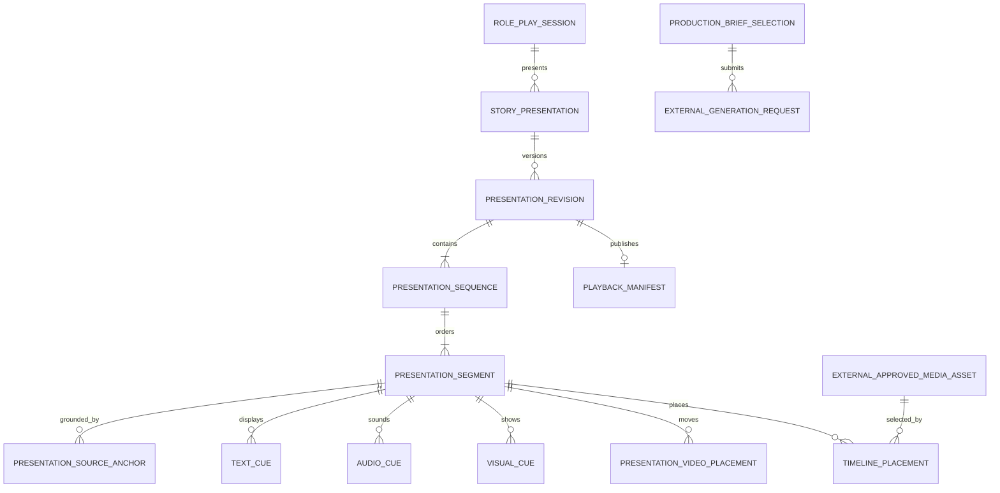

# B-101 Data Model

## Relationship Overview

## StoryPresentation

Root aggregate for one audiovisual adaptation of a roleplay session.

| Field | Rules |
|---|---|
| `Id`, `SessionId`, `Name` | Stable identity and required authoritative session. |
| `Status` | `Draft`, `Published`, `Archived`. |
| `CurrentDraftRevisionId` | Explicit editable revision. |
| `PublishedRevisionId` | Optional immutable revision consumed by players. |
| `DefaultPlaybackPolicyId` | Required configured navigation/timing policy. |
| timestamps | Created/updated/published. |

One session may have multiple adaptations, edits, languages, or presentation styles without changing RP records.

## PresentationRevision

Immutable after publication; draft edits use optimistic concurrency.

| Field | Rules |
|---|---|
| `Id`, `StoryPresentationId`, `Revision` | Unique version. |
| `State` | `Draft`, `Validating`, `Ready`, `Published`, `Superseded`. |
| `SourceSelectionSnapshotJson` | Ordered Turn IDs and exact source checksums. |
| `SourceContractVersionsJson` | B-100 catalogue/moment contract versions used. |
| `ConcurrencyToken` | Required for draft mutation. |
| `ValidationSummaryJson` | Unresolved and advisory findings. |
| `CreatedBy`, `CreatedUtc`, `PublishedUtc` | Audit. |

Publishing never mutates the revision. Further changes fork a new draft.

## PresentationSequence

An ordered chapter/scene grouping inside a revision.

Fields: `Id`, `RevisionId`, `Order`, `Label`, optional `SourceTurnRangeJson`, `ContinuityKey`, `DefaultLocationKey`, `DefaultTimeContext`, `TransitionIn`, `TransitionOut`.

V1 is linear. The model does not include choice edges until branching is explicitly designed.

## PresentationSegment

Smallest Back/Forward navigation unit and owner of relative timing.

| Field | Rules |
|---|---|
| `Id`, `SequenceId`, `Order` | Stable ordered identity. |
| `Label` | Author-facing short title. |
| `DurationMode` | `ReaderAdvanced`, `Fixed`, `MediaDriven`. |
| `RequestedDurationMs` | Required only when policy requires fixed duration. |
| `VisualMode` | `NewStill`, `HoldPreviousStill`, `Video`, `TextOnly`. |
| `AudioMode` | `Cues`, `ContinueAmbience`, `Silence`. |
| `AdvancePolicy` | Manual, after-media, or configured hybrid. |
| `ContinuitySnapshotJson` | Cast/location/wardrobe/environment state entering and leaving segment. |
| `Status` | `Draft`, `ReviewRequired`, `Ready`. |

Unique `(SequenceId, Order)`. Reordering changes the draft revision only.

## PresentationSourceAnchor

Typed lineage from a segment or cue to authoritative source.

Fields: `Id`, `OwnerType`, `OwnerId`, `TurnId`, optional `InteractionId`, optional source character offsets, `CatalogueId`, `BeatId`, `BeatProductionPlanId`, optional `BeatDialogueCueId`, `BeatSoundCueId`, `VideoCoveragePlanId`, `MomentSetId`, `MomentId`, `MomentEnrichmentId`, `SourceChecksum`, `AnchorRole`.

`AnchorRole`: `Primary`, `Context`, `Dialogue`, `StartState`, `EndState`, `Evidence`.

Application code resolves compact analysis keys to authoritative IDs before persistence. Unknown or stale references fail validation.

## TextCue

| Field | Rules |
|---|---|
| `Id`, `SegmentId`, `Order` | Stable display order. |
| `BeatDialogueCueId` | Required B-100 dialogue/narration/thought source cue. |
| `Kind` | `Narration`, `Dialogue`, `Thought`, `Caption`, `System`. |
| `SourceTextSnapshot` | Exact immutable source span. |
| `DisplayText` | Editable projection shown by the player. |
| `SpeakerCharacterId` | Required for Dialogue/Thought. |
| `AddresseeCharacterIdsJson` | Optional explicit targets. |
| `StartOffsetMs`, `EndOffsetMs` | Optional until timing resolution; must be valid when synchronized. |
| `RevealPolicy` | Instant, typewriter, speech-synchronized, or configured policy. |
| `AttributionStatus` | `Resolved`, `ReviewRequired`, `Approved`. |

Changing `DisplayText` never changes B-100 source/production data. Changing spoken meaning invalidates the placement and requires an explicit B-100 plan revision.

## VisualCue

Fields: `Id`, `SegmentId`, `MomentEnrichmentId`, optional `SceneVisualPlanId`, `ShotIntent`, `PovCharacterId`, `TransitionIn`, `TransitionOut`, `ProductionBriefId`, optional `ApprovedSceneFrameId`.

For `NewStill`, a source Moment is required. `HoldPreviousStill` has no new visual cue and is valid only when the publication resolver can identify the prior approved visual.

## AudioCue

Base fields: `Id`, `SegmentId`, `BeatProductionPlanId`, `BeatDialogueCueId` or `BeatSoundCueId`, `Kind`, `StartAnchor`, `StartOffsetMs`, optional `RequestedDurationMs`, `GainIntent`, `SpatialIntent`, `ContinuityGroupKey`, `ProductionBriefId`, `Status`.

Typed payloads:

### SpeechCue

`TextCueId`, `BeatDialogueCueId`, `VoiceIdentityVersionId`, presentation timing/mix overrides, optional `TargetVideoPlacementId`. Exact spoken text, speaker/addressee, delivery, emotion, pace, intensity, pronunciation hints, and lip-sync relevance come from B-100.

### AmbienceCue

`BeatSoundCueId`, `LoopIntent`, `ContinueUntilBoundary`, `FadeInMs`, `FadeOutMs`, and placement mix. Location, environment, time, sources, and intensity come from B-100.

### SoundEffectCue

`BeatSoundCueId`, resolved presentation offset, gain/spatial mix, and asset selection. Event, subject/object, temporal relation, Moment/Beat anchor, on-screen/diegetic state, and priority come from B-100.

### MusicCue

`NarrativeFunction`, `Mood`, `IntensityCurveJson`, `StartBoundary`, `EndBoundary`, `LoopIntent`, `DialogueDuckingIntent`.

Silence is represented by `PresentationSegment.AudioMode = Silence`, not a generated empty asset.

## PresentationVideoPlacement

Presentation selection and placement of one B-100 video coverage plan.

| Field | Rules |
|---|---|
| `Id`, `SegmentId`, `ProductionBriefId` | Stable identity and generation request. |
| `VideoCoveragePlanId` | Required current B-100 source plan. |
| `RequiredMomentEnrichmentIdsJson` | Exact enriched key states mandated by the source plan. |
| `RequestedDurationMs` | Presentation request within B-100/compiler bounds. |
| `SelectedSpeechPlacementIdsJson` | Placement mapping for B-100 dialogue cues required by the video plan. |
| `AudioPolicy` | Selected from compatible policies allowed by B-100 plan. |
| `ApprovedMediaAssetId` | Optional until a generated candidate is approved. |
| `StartOffsetMs`, `EndOffsetMs`, transitions | Presentation-only placement data. |

Coverage kind, Beat range, action arc, cast state, camera intent, continuity, dialogue mapping, and sound ownership are immutable imports from B-100. `GeneratedWithVideo` does not eliminate cue provenance.

## ProductionBriefSelection

Versioned selection of B-100 semantic production data for one generation request.

Fields: `Id`, `RevisionId`, `OwnerType`, `OwnerId`, `MediaKind`, `BeatProductionPlanId`, relevant B-100 cue/coverage/Moment enrichment IDs, source versions/checksums, presentation duration/mix/voice selections, required capabilities, content policy, `Status`, timestamps.

Media kinds: `StillImage`, `Speech`, `Ambience`, `SoundEffect`, `Music`, `Video`, `LipSync`, `AudioMix`.

The immutable semantic snapshot is supplied by referenced B-100 compiler inputs. Provider/model selection and compiled requests live in the owning generator, not this selection.

## ExternalGenerationRequest and ExternalApprovedMediaAsset

Generation request fields: `Id`, `ProductionBriefSelectionId`, `GeneratorKind`, `ExternalRequestId`, `SubmittedUtc`, `LastObservedStatus`, `LastObservedUtc`.

Approved-asset reference fields: `Id`, `GeneratorKind`, `ExternalApprovedAssetId`, `SemanticBriefSha256`, `CompiledRequestSha256`, `AssetSha256`, `MimeType`, `DurationMs`, `EligibilitySnapshotJson`, `ObservedUtc`.

B-101 does not persist candidate or approval decisions. It caches only external identity, checksums,
eligibility, and provenance needed for validation and publication. Revoked external assets make
dependent draft revisions invalid while published manifests remain historical and reproducible under
the owning generator's retention policy.

## TimelinePlacement

Selects an approved asset onto one track.

Fields: `Id`, `SegmentId`, `TrackKind`, `CueId`, `ExternalApprovedMediaAssetId`, `StartOffsetMs`, `EndOffsetMs`, `Layer`, `MixGroup`, `TransitionJson`, `ResolvedDurationSource`, `Status`.

Placements may overlap only where the track policy permits. Speech overlap, video-audio ownership, ambience continuation, and music ducking are validated explicitly.

## PlaybackManifest

Immutable compiled projection consumed by the Visual Novel Player.

Fields: `Id`, `PublishedRevisionId`, `ManifestSchemaVersion`, `ManifestJson`, `SourceRevisionSha256`, `AssetManifestJson`, `TotalDurationMs`, `CreatedUtc`.

The manifest includes ordered segment states, exact display text, concrete asset paths/checksums, concrete durations/timecodes, transitions, audio mix instructions, and Back/Forward restoration boundaries. It contains no unresolved references, generation briefs, provider credentials, or model prompts.

## VoiceIdentityVersion

Versioned character performance identity referenced by speech cues.

Fields: `Id`, `CharacterId`, `Version`, `DisplayName`, `Language`, `Accent`, `PerformanceNotes`, `ConsentAndProvenanceJson`, `RequiredCapabilitiesJson`, `Status`, timestamps.

Provider voice IDs belong in explicit compiler/configuration mappings, not in the character or cue domain record.