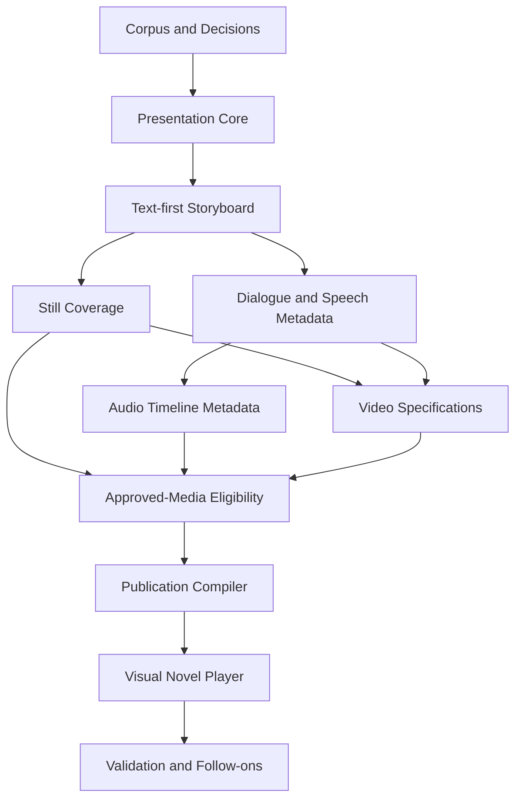

# B-101 Tasks - Story Presentation Timeline and Storyboard

Task format: `[ID] [P?] [Story?] Description` where `[P]` indicates parallel work after dependencies.

## Phase 0 - B-100 End-to-End Production Gate

- [ ] T001 Reuse B-100 reference stories for text, still, speech, ambience, effects, and video coverage.
- [ ] T002 Require completed expected Beat Production Plans, production cues, Moment roles, and enrichments.
- [ ] T003 Validate all one-Moment, transition, Beat-excerpt, and whole-Beat B-100 video contracts.
- [ ] T004 Decide and document Back/Forward media restart/resume behavior.
- [ ] T005 Define text-only, still-only, and full-media publication profiles.

## Phase 1 - Presentation Core

- [ ] T010 [US1] Add presentation, revision, sequence, segment, source-anchor, and Text Cue domain models.
- [ ] T011 [US1] Add additive SQLite schema and repositories.
- [ ] T012 [US1] Implement draft optimistic concurrency and published immutability.
- [ ] T013 [US1] Implement explicit Beat Production Plan import and exact snapshots/checksums.
- [ ] T014 [US1] Import current B-100 dialogue/sound/video cue and Moment lineage read-only.
- [ ] T015 [US1] Implement typed missing-analysis and stale-source results.
- [ ] T016 [US1] Implement reviewed source-refresh diff.
- [ ] T017 [US2] Implement segment split, merge, reorder, and policy editing services.
- [ ] T018 [P] Add domain invariant and repository tests.
- [ ] T019 Add stale draft-write and published-mutation rejection tests.

## Phase 2 - Text-First Storyboard Studio

- [ ] T030 [US2] Add dedicated Storyboard Studio route and shell.
- [ ] T031 [US2] Add sequence and segment navigation/editing UI.
- [ ] T032 [US2] Display source RP text, projected VN text, and source lineage together.
- [ ] T033 [US2] Add explicit duration, visual, audio, and advance policy controls.
- [ ] T034 [US2] Add text-only preview with Back/Forward behavior.
- [ ] T035 [US2] Surface source conflicts and validation findings.
- [ ] T036 [P] Add component tests for editing, conflicts, and preview order.
- [ ] T037 Run text-only authoring and persistence acceptance flow.

## Phase 3 - Still Visual Coverage

- [ ] T050 [US5] Add Visual Cue, Media Brief, approved-asset adapter, and Timeline Placement models.
- [ ] T051 [US5] Integrate source-Moment selection with B-032 generation entry point.
- [ ] T052 [US6] Reuse B-032 `ApprovedSceneFrame` eligibility and checksums.
- [ ] T053 [US5] Implement NewStill, HoldPreviousStill, and TextOnly validation.
- [ ] T054 [US5] Add Storyboard still placement and replacement UI.
- [ ] T055 [US5] Add visual-coverage metrics.
- [ ] T056 [P] Test that render completion without approval is ineligible.
- [ ] T057 [P] Test exact hold resolution and missing-prior-visual failure.
- [ ] T058 Publish and preview one still-image Visual Novel.

## Phase 4 - Dialogue Placement and Speech Requests

- [ ] T070 [US3] Import B-100 dialogue/narration cues and review status by exact IDs.
- [ ] T071 [US3] Verify source spans and character IDs against B-100 checksums without re-resolution.
- [ ] T072 [US3] Block unresolved attribution and link correction to B-100 revision workflow.
- [ ] T073 [US3] Add cue selection and display-projection editing UI.
- [ ] T074 [US3] Add `VoiceIdentityVersion` domain, persistence, and management UI.
- [ ] T075 [US3] Add Speech Cue Placement and B-100 production-brief selection models.
- [ ] T076 [US3] Add delivery, pronunciation, timing, and lip-sync metadata editing.
- [ ] T077 [P] Add ambiguous/multiple-speaker corpus tests.
- [ ] T078 [P] Add source-versus-display-versus-spoken text provenance tests.
- [ ] T079 Validate all reference dialogue as speech-ready or explicitly review-required.

## Phase 5 - Audio Placement and Timeline

- [ ] T090 [US4] Import typed B-100 Ambience, Sound Effect, and Music Intent cues.
- [ ] T091 [US4] Place imported ambience using continuity groups and boundaries.
- [ ] T092 [US4] Preserve imported event-to-Moment/Beat anchors while resolving presentation offsets.
- [ ] T093 [US4] Add explicit silence, continue, crossfade, replace, and stop states.
- [ ] T094 [US4] Add gain, spatial, fade, ducking, and mix-group intents.
- [ ] T095 [US4] Implement typed relative timing resolver and cycle detection.
- [ ] T096 [US4] Build multi-track Storyboard timeline preview.
- [ ] T097 [P] Add location/time ambience contradiction tests.
- [ ] T098 [P] Add cue overlap and timing resolution matrix.
- [ ] T099 Validate the reference audio storyboard without provider prompts.

## Phase 6 - Video Coverage Placement

- [ ] T110 [US5] Add Presentation Video Placement referencing B-100 coverage-plan IDs.
- [ ] T111 [US5] Import validated MomentHold and MomentAction plans.
- [ ] T112 [US5] Import validated ordered MomentTransition plans and key-state enrichments.
- [ ] T113 [US5] Import validated BeatExcerpt and WholeBeat plans.
- [ ] T114 [US5] Snapshot B-100 action, continuity, key-Moment, camera, duration, dialogue, and audio lineage.
- [ ] T115 [US5] Map required B-100 dialogue cues to speech placements and resolved line windows.
- [ ] T116 [US5] Validate ExternalMix, GeneratedWithVideo, and Hybrid audio ownership.
- [ ] T117 [US5] Add video storyboard authoring UI.
- [ ] T118 [P] Add complete B-100 coverage-kind import/placement tests.
- [ ] T119 [P] Add cross-Beat, reversed-Moment, and duplicate-audio rejection tests.

## Phase 7 - Approved-Media Eligibility Boundary

- [ ] T130 [US6] Define thin adapters over B-032 and modality-generator approved-asset eligibility contracts.
- [ ] T131 [US6] Import exact compiler key, semantic-brief checksum, compiled-request checksum, and derivative provenance read-only.
- [ ] T132 [US6] Reject assets whose owning generator reports missing, incompatible, unapproved, revoked, or stale lineage.
- [ ] T133 [US6] Implement exact approved-asset placement and revocation effects without duplicating candidate or approval state.
- [ ] T134 [US6] Link to the owning generator's candidate comparison and approval workflow.
- [ ] T135 [P] Add approved-version, checksum, revocation, and stale-lineage eligibility tests.
- [ ] T136 [P] Assert B-101 cannot compile prompts, invoke provider clients directly, or approve candidate assets.

## Phase 8 - Publication Compiler

- [ ] T150 [US7] Implement source, semantic, timing, asset, continuity, and policy validators.
- [ ] T151 [US7] Define versioned Playback Manifest JSON Schema.
- [ ] T152 [US7] Resolve concrete durations, placements, transitions, and mix state.
- [ ] T153 [US7] Verify exact asset checksums and retention eligibility.
- [ ] T154 [US7] Implement compare-and-set publication and immutable manifest storage.
- [ ] T155 [US7] Add new-draft-from-published workflow.
- [ ] T156 [P] Add one test per stable publication failure category.
- [ ] T157 Add stale publication and manifest reproducibility tests.

## Phase 9 - Visual Novel Player

- [ ] T170 [US8] Add separate player route and published-presentation library entry.
- [ ] T171 [US8] Implement manifest-only loader with schema compatibility checks.
- [ ] T172 [US8] Implement text, still, video, transition, and audio track playback.
- [ ] T173 [US8] Implement deterministic Back/Forward and restoration policies.
- [ ] T174 [US8] Add keyboard, touch, captions/transcripts, audio controls, and reduced motion.
- [ ] T175 [US8] Add responsive desktop/mobile layout and adjacent-asset preloading.
- [ ] T176 [US8] Report asset-read/manifest errors without generation or inference.
- [ ] T177 [P] Add full navigation restoration matrix tests.
- [ ] T178 [P] Assert no Model Manager or generation service is reachable from player flow.
- [ ] T179 Run text-only, still-only, and full-manifest end-to-end acceptance.

## Phase 10 - Final Validation and Follow-On Epics

- [ ] T190 Run all B-101 domain, repository, contract, component, and end-to-end tests.
- [ ] T191 Run affected B-100 and B-032 tests.
- [ ] T192 Build the full solution and run the full test suite with zero failures.
- [ ] T193 Validate published manifest reproducibility and checksums.
- [ ] T194 Validate desktop/mobile/accessibility Player flows.
- [ ] T195 Create separate generator backlog items consuming B-100 production contracts for TTS, sound, mixing, video, lip sync, validation/repair, export, and branching.
- [ ] T196 Record user acceptance and advance B-101 state only after validation.

## Dependency Order

