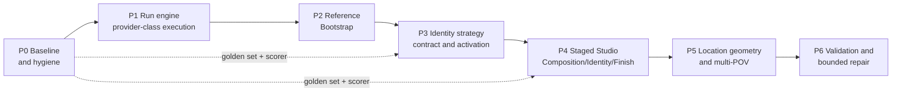

# B-111 — Consistent Visual Production Program: Phased Plan

**State:** designed — awaiting go-ahead to implement P0
**Created:** 2026-09-05
**Spec:** `spec.md` · **Evidence:** `research/external-research-findings.md` · **Mapping:** `superseded-map.md`

> **Binding governance (spec §6).** No phase closes on "code complete" (G1). No capability is built
> without its activation path in the same phase (G2). No phase starts before its prerequisite gate is
> recorded (G3). Every requirement traces to a finding or a recorded decision (G6).

**Confirmed order** (user decision 2026-09-05): the Run engine lands **before** Reference Bootstrap,
so Bootstrap becomes the Run engine's first real consumer and validates it, rather than being built
on the one-at-a-time path and then reworked.

---

## P0 — Baseline and program hygiene

**Delivers no new product capability.** It delivers the ability to *tell whether later phases
worked* — which is the thing every previous plan lacked.

### Scope

1. **Freeze the golden set.** Fixed, version-controlled definitions:
   - **3 characters** — one female, one male, one secondary
   - **2 locations** — one interior, one exterior
   - **2 outfits**
   - **1 two-character contact/occlusion scene** (the known-hard case, per F2)
   - **~12 fixed prompts × 3 fixed seeds**
   - **Every case is explicit.** Per spec P5 there is no SFW variant of any case and no SFW/explicit
     split. A model either supports the content or it is recorded as failing that cell.
2. **Build the consistency scorer** at `tools/consistency-scoring/` (git-tracked, pinned
   `requirements.txt`, README, git-ignored output), per this repo's `tools/` policy and alongside the
   existing `tools/eye-validation/`:
   - identity — face detection + alignment + embedding cosine similarity (ArcFace-class)
   - subject fidelity — DINO (authoritative) + CLIP-I
   - prompt adherence — CLIP-T
   - subject-presence check — expected subject count actually rendered and detectable
   - output: the **triple**, never identity alone (FR-C6-01)
3. **Record the baseline.** Run today's pipeline over the golden set and commit the scorecard. This
   is the number every later phase must beat.
4. **Calibrate initial thresholds** per `(model, strategy, strength)` as data, not constants
   (FR-C6-06).
5. **Reconcile the corpus.** Mark superseded packages, restate backlog rows, resolve the documented
   ownership conflicts (B-106 immutable-child vs B-110 iterate-loop; B-106 vs B-109 identity
   ownership) in favour of this spec.
6. **Document and freeze the SFW-clamp footprint** (do not remove it yet). The clamp is entangled
   across ~30 files — `SfwClampSuffix` on every compiler interface, the `SfwFiltered` clamp in
   `SceneImageRenderingJobHandler`, `ResolveRatingTag(phase, policy)` in the Pony/SDXL builders, the
   SDXL `BuildSystemPrompt` SFW branch, and content-policy plumbing through production workload /
   reconciliation / asset services. `ImageContentPolicy` also carries genuine provider capability.
   P0 produces a written **clamp-removal map** (every call site, what it does, keep-vs-remove) so P1
   can remove the clamp *behaviour* cleanly while retaining the capability signal. **Removal happens
   in P1**, coupled with its refusal-outcome replacement — removing a safety behaviour before its
   replacement exists would violate G2 in reverse.
7. **Audit the qualification matrix** and classify every `(strategy, model, endpoint)` cell as
   *qualified*, *unqualified*, or *structurally impossible* (FR-C3-04).
8. **Author the UI contract as buildable component specs.** `ui-contract.md` already defines the
   principles, the shared component library (§2) and the screen inventory (§3). P0 turns each shared
   component into a one-page component spec (typed input contract, states, empty/loading/error, data-
   volume behaviour) so P1+ builds from specs, not from scratch. No component code yet — specs only.

> **No baseline render in P0 (decided 2026-09-05).** A P0 "baseline" was dropped as premature and
> misframing. The golden set is a **fixed measuring stick usable across every cell**, not an endpoint
> choice — it exists so the same characters/prompts/seeds yield comparable identity/adherence/
> diversity numbers whenever you score whichever cell you are actually using. Its headline metric
> (identity) is **not measurable until P2**, because identity scoring needs the reference images that
> Reference Bootstrap produces. Rendering a mostly-`null` scorecard against one arbitrary endpoint now
> would waste cost and mislead. **The first real golden-set scoring happens at P2** (identity, once
> references exist) **and P4** (the full triple, which is P4's consistency + UI gate). The scorer is
> the instrument; the **UI and workflow are the product** (P9/C7/G8) — that, not a metric, is the
> real test of each phase.

### Exit gate

- [x] Golden set frozen and version-controlled
- [x] Scorer runs end-to-end and is validated by unit tests on a clean checkout (5 metrics +
      scorecard; full scorer suite green). **No baseline render** — real scoring deferred to P2/P4.
- [x] Every superseded package marked; every ownership conflict resolved in writing
- [x] **Clamp-removal map** written (all call sites classified keep-vs-remove); clamp still
      functioning — not yet removed
- [x] Scorer includes the **silent-sanitisation check** (FR-C6-08)
- [x] Qualification matrix classified (0 qualified / 29 unqualified / 13 structurally-impossible)
- [x] Shared-component specs written for every C7 §2 component (typed contract + states + data-volume
      behaviour) — no component code yet
- [ ] Full solution build + full test suite green (C# suite — run at P0 close; scorer is Python/
      isolated and already green)
- [ ] **Your P0 sign-off** recorded in `tasks/gate-log.md` (G1/P8)

---

## P1 — Run engine and provider-class execution

**Absorbs:** the B-102 remainder.
**Why first:** the Run is the unit of work for *both* cost and consistency (spec P1/P2), so every
later phase is built on it. Building it later means retrofitting every consumer.

### Scope

> **Decided 2026-09-05:** the Run is the **existing `ProductionWorkload` aggregate, extended** (fork
> Option A) — not a new aggregate. And there is **no warm-up**: the serverless worker cold-starts on
> the first request, absorbed by `ProviderTimeoutSeconds`. Details in `tasks/p1-run-design.md`.

1. **Run aggregate = extended `ProductionWorkload`** — lifecycle `Staged → (first request cold-starts)
   → Draining → Complete/Aborted`, durable across restart, stale-write protected. Reuses the existing
   `DurableBackgroundJob` lane/lease machinery and `ProductionWorkload` grouping; does not invent a
   second queue or a parallel aggregate.
2. **Provider-class execution policy as data** (FR-C4-03), three classes:
   - *self-built ComfyUI serverless* — cold-start on first request (no warm-up), drain, cost accounting
   - *hosted inference API* — concurrency ceiling, 429 backoff, per-image cost accounting
   - *dedicated ComfyUI pod* — liveness
3. **Grouping by (endpoint, provider class)** (FR-C4-02) so the first request warms the worker and the
   rest of the group ride it within its idle window.
4. **No warm-up mechanism** (user decision). Cold-start is absorbed by `ProviderTimeoutSeconds`; the
   transition/lifecycle `Provider` fields stay unwired (or display-only) in P1.
5. **Priority lane** — Run jobs carry the provider's low-priority flag so a one-off submitted mid-drain
   is not stuck behind the whole batch (FR-C4-05).
6. **Per-request `executionTimeout` and `ttl`**, with `ttl` covering expected **queue** time
   (FR-C4-06) — the current default would delete a long-queued Run tail.
7. **Real abort** — cancel in-flight, purge queue, respect documented rate limits (FR-C4-07).
8. **Honest endpoint state** read from the provider health surface (FR-C4-08), replacing guesswork.
9. **Completion via webhook where available**, replacing the fixed 5-second poll.
10. **`batch_size` > 1** as a first-class request parameter where the class supports it (FR-C4-09).
11. **Idle scale-down hazard surfaced** in the UI (FR-C4-11).
12. **Staging surfaces** (user-confirmed): Production Studio, Reference Bootstrap, Asset Manager, and
    a dedicated global **Runs** page showing staged / active / finished runs.
13. **UI — build `RunTray` + the Runs screen** (C7 §2/§3): summary-first, virtualized job list
    (FR-C7-04), live cold/warming/warm + staged/draining state in backend vocabulary (FR-C7-05),
    abort-with-confirm (FR-C7-09), and non-blocking behaviour so a one-off runs while a Run drains
    (FR-C7-08). `RunTray` is a reusable component embedded later in Studio/Bootstrap/Asset Manager,
    built once here.
14. **Cross-class stage targeting** (spec P4): a Run's stages may target different provider classes;
    the per-stage target is persisted and visible, never inferred.
15. **Refusal as a first-class outcome** (FR-C4-12 → FR-C4-14): detect the deterministic modes inline
    — policy/HTTP error and empty output; classify them as a **refusal** (distinct, user-legible
    failure) with the model, endpoint, and mode; record an audit signal against `(model, endpoint)`;
    and **surface it clearly so the user can pick a different model and retry.** The app does **NOT**
    auto-substitute, does **NOT** advance through any list, and never changes the strategy (user
    decision 2026-09-05). Silent sanitisation is caught later at the P4 scoring gate, not inline.
16. **Remove the SFW clamp**, using the P0 clamp-removal map. Delete the clamp *behaviour*
    (`SceneImageRenderingJobHandler` suffix append, `ResolveRatingTag(phase, policy)` safe path, SDXL
    `BuildSystemPrompt` SFW branch, `SfwClampSuffix` members) and every test asserting it; **retain**
    `ImageContentPolicy` as the provider-capability signal the refusal model reads. This lands in the
    same phase as its replacement (item 15), satisfying G2.

### Non-goals for P1
No new image techniques. No prompt-compiler changes. Transport, scheduling and economics only.

### Exit gate

- [ ] A staged Run of ≥8 images against a cold self-built endpoint pays **one** cold start (first
      request), and the rest ride the warm worker — no explicit warm-up; the cold-start wait is
      absorbed by `ProviderTimeoutSeconds`
- [ ] A one-off submitted mid-drain returns before the Run finishes (A4)
- [ ] Abort cancels in-flight and purges queued work with no orphans (A5)
- [ ] Endpoint cold/warming/warm state is read from the provider, and observed to be correct
- [ ] A Run survives an app restart and resumes
- [ ] Cost/timing evidence recorded: cold-start count, wall time, and cost vs the pre-P1 baseline
- [ ] Adding a new endpoint is proven to be a **data-only** change (A13)
- [ ] A refusing model records the failure and execution advances to the next configured model with
      the strategy unchanged (A15); a silently-sanitised render is caught and excluded (A16);
      exhausting the order fails fast (A17)
- [ ] SFW clamp behaviour removed per the P0 map; `ImageContentPolicy` capability signal retained;
      no test depends on the clamp
- [ ] **UI gate** (ui-contract §4): Runs screen passes the five-word job test; `RunTray` is a reused
      component; job list is virtualized; state uses backend vocabulary; `tools/e2e/` covers the flow
      LLM-free; your usability verdict recorded
- [ ] Full build + suite green

---

## P2 — Reference Bootstrap

**Absorbs:** B-108.
**Why here:** this is the floor everything else stands on (spec O1), and it is the Run engine's first
real consumer.

### Scope

1. **`ReferenceBootstrapBatch`** — standalone, decoupled from `CharacterLoraDataset` entirely
   (FR-C2-06, enforced by test).
2. **Candidate generation from description alone**, staged as a Run (FR-C2-01, FR-C2-05).
3. **Side-by-side curation** with persisted `Undecided` / `Accepted` / `Rejected` + notes
   (FR-C2-02).
4. **View expansion** from an accepted candidate — face angles, alternate location framings —
   derived from that exact image (FR-C2-03).
5. **Promotion** of exactly one candidate set to a canonical approved reference version (FR-C2-04),
   into the existing identity-pack and wardrobe mechanics where they already exist.
6. **Mandatory frozen text block** on every reference kind (FR-C1-02). A reference without one cannot
   be approved.
7. **Minimal location reference** — plate + text block (FR-C1-03). Control maps are deliberately
   deferred to P5; the type is named so P5 makes an explicit reconciliation decision rather than
   silently inheriting.
8. **Face reference is a view set**, each view angle-tagged (FR-C1-04) — because P3 will select
   between them, per G2 (no capability without its activation path).
9. **UI — the four Bootstrap screens + Reference Library** (C7 §3), each single-purpose and flowing
   via Back/Next with preserved state (FR-C7-07): **Describe** (`FrozenTextBlockEditor` draft),
   **Curate** (`CandidateGrid` + embedded `RunTray`), **Expand** (`CandidateGrid`), **Promote**
   (`ReferencePicker` preview + `FrozenTextBlockEditor`), and **Reference Library** (browse/version/
   approve). `CandidateGrid` is virtualized, thumbnails-first, full-res on open (FR-C7-04). These are
   separate small screens, not one bootstrap mega-form.

### Exit gate

- [ ] A wholly fictional character is created from text alone → candidates → curated → expanded →
      promoted to an approved reference, with **no** LoRA dataset and **no** uploaded photo (A1)
- [ ] One outfit and one location reach approved references, each with a frozen text block (A2)
- [ ] Scorer confirms the promoted face view set is the **same person** across all views
- [ ] **First real golden-set scoring** (deferred from P0): once references exist, render the
      golden-set identity prompts through the cell used here and record the **first identity
      scorecard** — this is the true starting baseline, produced where identity is finally measurable,
      not against an arbitrary P0 endpoint
- [ ] Grep proof: no bootstrap path references `CharacterLoraDataset`
- [ ] Bootstrap batches execute through the P1 Run engine
- [ ] **UI gate** (ui-contract §4): the four Bootstrap screens each pass the five-word job test and
      flow with preserved state; `CandidateGrid`/`RunTray`/`FrozenTextBlockEditor` are reused shared
      components; the grid is virtualized and thumbnails-first; `tools/e2e/` covers the flow; your
      usability verdict recorded
- [ ] Full build + suite green

---

## P3 — Identity strategy contract and activation

**Absorbs:** B-107, B-109; closes the open B-032 Phase 2 decisions.
**Governance note (G2):** this phase both *adds* the seam and *activates* everything already built
and dead. No enum value is added without qualification and exposure in this same phase.

### Scope

1. **`IIdentityStrategy` seam** shaped like the existing `ImageProtocol` dispatcher (FR-C3-01).
2. **Qualification cells as data** — `(strategy, model, endpoint, strength)` + scorecard (FR-C3-02).
3. **Fail-fast on unqualified cells**; explicit distinction between *unqualified* and *structurally
   impossible* (FR-C3-03, FR-C3-04, A6).
4. **Activate the dead capabilities:**
   - **Angle-aware view selection** (FR-C3-05) — restores the documented-but-absent resolver;
     `IdentityControlledRequestCompiler` currently always uses the single canonical face regardless
     of target pose, so four of five stored views are unused.
   - **PuLID** — coded in `ComfyUIIdentityConditionedClient`, never selectable. Its documented
     property (background, lighting, composition and style preserved across ID insertion) is
     precisely what a Composition→Identity pipeline needs.
5. **Combined identity worker image** (user decision: option 2). One serverless worker carrying
   **PuLID + IP-Adapter FaceID + InstantID**, so all identity strategies live behind **one endpoint
   and therefore one cold start**.
   > **Contingency, to be recorded not improvised:** if a single image is not feasible (custom-node
   > conflicts, VRAM ceiling, model-format incompatibility), fall back to **PuLID-first** in a
   > dedicated image and record the reason and the deferred strategies as an explicit decision.
   > Registry + provisioning must be updated per this repo's RunPod documentation rule.
6. **Multi-character spatial routing** with regions **derived from the composition** (FR-C3-06).
7. **Qualify each strategy** on the golden set using the scorer triple — never identity alone
   (FR-C3-07, FR-C6-01).
8. **LoRA** enters the seam as a strategy with **no qualified cells**, so selecting it fails
   explicitly as unqualified configuration. Activation stays deferred.
9. **UI — the Strategy Qualification screen + `StrategySelector`** (C7 §2/§3): a focused screen to
   qualify one `(strategy, model, endpoint, strength)` cell and record its scorecard
   (`ScorecardPanel` showing the triple, never identity alone). `StrategySelector` greys out
   **structurally-impossible** cells with the reason and blocks **unqualified** with a qualify link
   (FR-C7-05, FR-C3-04) — never a silent substitute. Reused later by Studio Identity.

### Exit gate

- [ ] ≥2 strategies qualified with committed scorecards showing the **triple**
- [ ] Selecting an unqualified cell fails fast; selecting a structurally-impossible one says so and
      offers the cross-class staged alternative (A6)
- [ ] Angle-aware selection **measurably** improves off-frontal identity vs the frontal-only baseline
      (A8) — a number, not an impression
- [ ] Two characters in contact/occlusion each pass their own identity threshold, no bleed (A9)
- [ ] Combined worker image built, smoke-tested, restart-proof, and recorded in the RunPod registry —
      or the contingency decision is recorded
- [ ] No unqualified strategy is exposed for production selection
- [ ] **UI gate** (ui-contract §4): Qualification screen is single-purpose; `StrategySelector`
      surfaces qualified/unqualified/structurally-impossible in backend vocabulary and never silently
      substitutes; `ScorecardPanel` shows the triple; your usability verdict recorded
- [ ] Full build + suite green

---

## P4 — Staged Studio: Composition → Identity → Finish

**Absorbs:** B-103, B-105, B-106, B-110.
**This is the phase that delivers your three first-phase outcomes** (O2, O3, O4).

### Scope

1. **One shared edit/iterate workbench**, extracted from the working `SceneImageEditor.razor` loop
   (describe → compile → editable prompt → run → before/after → iterate) and **reused** by the
   Identity stage, the Finish stage, and the Asset Manager. Three lesser reimplementations are
   deleted, not maintained. This is the `EditIterateWorkbench` shared component (C7 §2).
2. **Resolve the B-106 ↔ B-110 contradiction** in favour of iteration: a Finish *session* may produce
   multiple attempts; each attempt remains immutable. Both original intents are satisfied.
3. **Composition transparency** (B-103): exact prompt preview + edit with token count, submitted-
   payload view, resolved-render badge (model · provider · class · size · steps/CFG), protocol-aware
   render controls, and an explicit **model selector** — persisted per production group. Delivered as
   the `ResolvedRenderBadge` shared component + the mandatory "view what will be submitted" affordance
   (FR-C7-06).
3a. **Studio is separate small screens, not one mega-form** (C7 §3/§5): Composition, Identity, Finish
   and Lineage are distinct single-purpose screens that share state via the production group — **not**
   tabs cramming every workflow into one page. Each reuses shared components; none re-implements the
   edit loop, the badge, the picker or the run tray.
4. **Identity stage** as region-routed application over an **approved composition** (FR-C3-06),
   with explicit persisted skip + mandatory reason.
5. **Finish stage** with `Cosmetic` / `Geometry` change class; a geometry edit marks the child
   identity-stale and blocks approval while identity is required (spec P6, A12).
6. **Appearance in the brief** (B-105): per-character appearance is part of the compiled brief, so
   the brief is the complete source rather than being patched at prompt-build time.
7. **Wardrobe consistency** — frozen text block + reference conditioning, image *and* text (FR-C1-02).
8. **Branch-aware lineage** — tree grouped by stage, side-by-side compare, branch from any completed
   attempt.
9. **Multi-turn scoring** wired into the edit loop (FR-C6-05), so chain degradation is visible.
10. **Retire the legacy one-off generation path** after a reference/call-site audit.

### Exit gate — *the outcome gate for the program's first-phase targets*

- [ ] **Same face across multiple images** passes on the golden set (O2 / A7)
- [ ] **Same outfit within a scene** passes (O3)
- [ ] **Same location across moments** passes (O4)
- [ ] All three pass **with prompt-adherence and diversity within bounds** — not bought by cranking
      identity strength (FR-C6-01)
- [ ] A 5-step edit chain is scored at every step; degradation is visible (A11)
- [ ] Geometry edit marks identity-stale and blocks approval (A12)
- [ ] One workbench component; the three duplicates are gone
- [ ] Manual scorecard signed off alongside the automated one (G1)
- [ ] **UI gate** (ui-contract §4): Composition/Identity/Finish/Lineage are separate single-purpose
      screens sharing state via the production group (not one mega-form); every reused workflow uses
      a shared component (grep proof, U2); large data (lineage, payloads, galleries) is virtualized/
      on-demand; every generate/edit exposes its submitted inputs; `tools/e2e/` covers the staged
      flow; your usability verdict recorded
- [ ] Full build + suite green

---

## P5 — Location geometry and multi-POV

**Absorbs:** B-097, B-032 Phase 3.

### Scope

1. **Control maps derived from the canonical location plate** (FR-C5-01), versioned as artefacts.
2. **Explicit reconciliation decision** on the P2 minimal location type: extend it, or supersede it.
   Recorded, not accidental.
3. **Shared blocking across POVs** — all POVs of one moment derive control maps from one source
   (FR-C5-02).
4. **Multiple simultaneous conditions** supported (FR-C5-04).
5. **Geometry/identity separation enforced** in code and review (FR-C5-03).
6. **UI — the Location Geometry screen** (C7 §3): a single-purpose screen to derive/inspect a
   location's control maps, reusing `ReferencePicker` + a map preview; large map sets load on demand
   (FR-C7-04).

### Exit gate

- [ ] Three POVs of one moment share geometry and pass location + identity scoring (A10)
- [ ] Location reference reconciliation decision recorded
- [ ] No path attempts to fix blocking via identity strength or identity via prompt wording
- [ ] **UI gate** (ui-contract §4): Location Geometry screen is single-purpose and reuses shared
      components; map sets load on demand; your usability verdict recorded
- [ ] Full build + suite green

---

## P6 — Validation and bounded repair

**Absorbs:** B-032 Phase 4.
**Ordering is deliberate:** automated repair only after automated validation is demonstrably
trustworthy.

### Scope

1. **In-pipeline scoring** on generated candidates.
2. **Approved-frame concept** — only an exact approved version is eligible for continuity or for
   B-101 placement.
3. **Manual candidate review** and immutable accept/reject first.
4. **Bounded repair actions**, each finding/action pair gated behind its own frozen proof corpus.
5. **UI — the Validation Review screen** (C7 §3): a single-purpose accept/reject screen reusing
   `CandidateGrid` + `ScorecardPanel` (triple, never identity alone); virtualized candidate list.

### Exit gate

- [ ] Candidates are scored automatically and surfaced as findings
- [ ] Only exact approved frames are eligible downstream
- [ ] Each enabled repair action has a passing frozen-corpus proof
- [ ] **UI gate** (ui-contract §4): Validation Review is single-purpose, reuses `CandidateGrid`/
      `ScorecardPanel`, list virtualized; your usability verdict recorded
- [ ] Full build + suite green

---

## Risk register

| Risk | Why it is real here | Mitigation |
|---|---|---|
| **Scorer disagrees with your eye** | Metrics are proxies; DINO/CLIP/ArcFace were not built for this content domain | Both gates required (G1). Where they disagree, **your verdict is authoritative** (spec P8) and the threshold is recalibrated as data |
| **Silent sanitisation goes undetected** | A model returns a clothed/cropped/altered image *as success*. It looks like a pass, enters the scorecard, and corrupts every later comparison — and unlike an explicit refusal, nothing signals it | FR-C6-08 sanitisation check is a **P0 deliverable**, not a P1 one, because the baseline itself is worthless if sanitised renders are counted as passes |
| **Combined identity worker isn't buildable** | Custom-node conflicts, VRAM ceiling, model-format mismatch | Named contingency in P3: PuLID-first, decision recorded |
| **Cold-start cost worsens under scoring** | Every gate re-renders the golden set | Golden set is deliberately small; runs are batched through P1 — the gate uses the mechanism it validates |
| **P4 is large** | It absorbs four packages | Its three outcome gates are independent and can land incrementally: face → outfit → location |
| **Endpoint idle scale-down** | Documented: 3 days → max workers 2; 7 days → 0, stays there | Surfaced in UI (FR-C4-11); the golden-set runs themselves reset the timer |
| **Provider-class capability drift** | New endpoints may quietly lack a node | Qualification cells are per-endpoint; structurally-impossible is a first-class state (FR-C3-04) |
| **This program becomes another fix-plan chain** | The failure being fixed | G1–G7 are binding; every phase gate is an outcome, not a deliverable |
