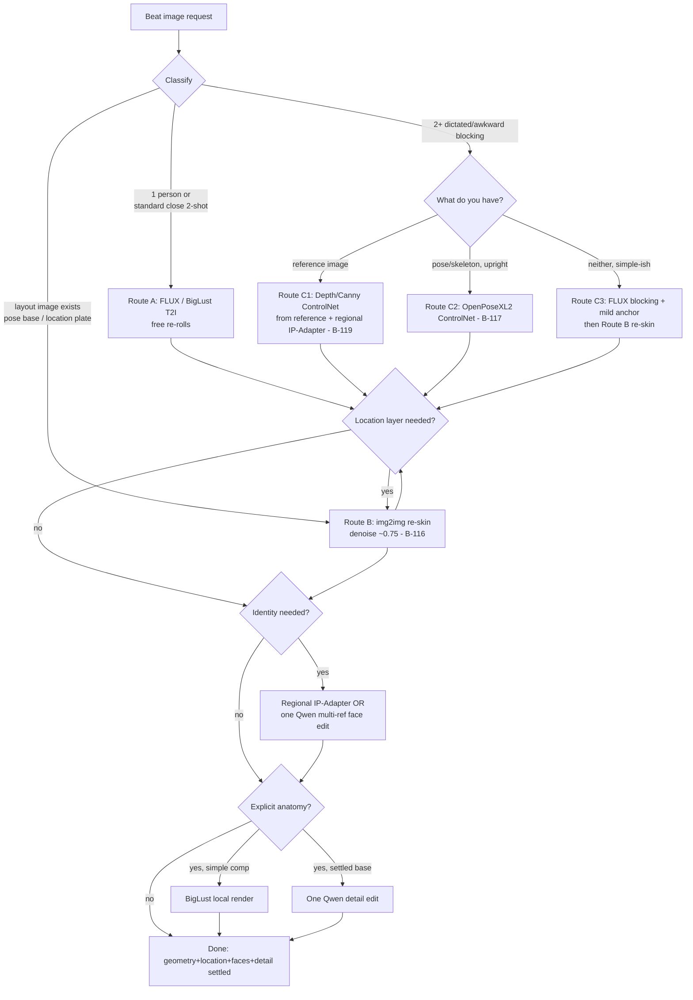

# B-119 — Production image workflow (NOT strict — a decision ladder)

Goal: for any beat/moment image request, pick the cheapest route that reliably gives usable geometry, then add identity/location/explicitness as later, layered steps. Classify the request first; **do not jump to the hardest tool**.

> Rules that always hold: geometry never comes from text alone for 2+ people; identity is applied LAST; the environment/location is layered (re-skin or structure) after a settled layout; explicit anatomy is a final layer (BigLust local or one Qwen edit), never a from-scratch SDXL request.

## Step 0 — Classify the request
1. **How many people are clearly in frame?** (1 / 2+ / 2+ with a dictated awkward blocking)
2. **Does a usable layout image already exist?** (an approved pose base, a location plate, or a reference photo with the arrangement you want)
3. **What layers are needed?** (identity faces? explicit anatomy? location consistent with prior beats?)

## Step 1 — Route A (single subject, OR multi-character standard/high-prior pose)
**When:** one clear person, or 2 people in a close, near-camera, natural pose (models hold these).
**Do:**
1. FLUX.1-dev (local) T2I for the composition — re-roll freely (~1536×1024; watch hands/feet).
2. If explicit/nude needed and the pose is simple → **BigLust** (local) instead of FLUX for the base.
3. If identity needed → apply faces **last**: single-char via IP-Adapter render, or **one** Qwen-edit (both faces in one edit, face-first instruction).
**Cost:** free except any Qwen face edit. **This covers most beats.**

## Step 2 — Route B (layout already exists as an image)
**When:** you have a pose base / location plate / reference render you like and need to put it in a scene (or re-use a location across beats). **img2img re-skin (B-116).**
**Do:** choose source image → denoise ~0.75 (pose holds; environment transplants). Lower denoise (≤0.6) to preserve a strong existing background; ~0.75 to move it.
**Cost:** free (local FLUX). If mood drifts (e.g. "unconscious/first-aid"), fix the *base* prompt with an awake/engaged cue and re-roll Step 1, then re-skin.

## Step 3 — Route C (multi-character, dictated/awkward blocking that text can't hold)
**Branch by what you have:**

- **C1 — you have a reference image with the layout** (a photo/crop of two people in the arrangement) →
  extract structure with a preprocessor: **Depth** (best for reclining/multi-body) or **Canny** → SDXL **ControlNet** render (BigLust/Juggernaut/Pony Realism) to re-render the layout into your scene/characters. Optionally add **regional IP-Adapter** masks so each character's identity lands in its own region in the same render. *(B-119 app work.)*
- **C2 — you have a pose/skeleton but no reference image** (or the pose is upright) →
  use the **OpenPose** path (canonical **B-117**): DWPose-extract or pose-library skeleton → `OpenPoseXL2` ControlNet render (`OpenPoseXL2.safetensors` installed). Do NOT use OpenPose for lying/reclining — prefer C1 depth.
- **C3 — neither structure nor a good reference, but the layout is simple-ish** →
  don't fight it: either (a) simplify to Route A framing, or (b) generate the blocking on FLUX with a *mild* anchor, confirm geometry, then re-skin to the location (Route B). Iterate geometry for free before any paid layer.

**Cost:** free (local), after B-117/B-119 wiring + depth/canny weights installed. Identity can ride via regional IP-Adapter in the same ControlNet render.

## Step 4 — Location reuse across beats
Keep one canonical **location plate** per setting. Each later beat of that location: render its geometry (A/C) then **re-skin onto the plate (B)**, or drive the same ControlNet structure from the plate's depth. Do not re-describe the room from text each beat.

## Step 5 — Layer order (applies to every route)
1. Geometry/layout (A/B/C) — free, iterate here.
2. Location (B re-skin or plate depth) — free.
3. **Identity faces LAST** — regional IP-Adapter (SDXL, free, single/near-frontal) or one Qwen multi-ref edit (paid).
4. **Explicit anatomy LAST** — BigLust local if the composition is simple enough for SDXL; otherwise Qwen detail edit on the settled base. Keep each paid edit single-purpose; never chain paid edits to fix quality.

## Flowchart

## Current vs future capability (what is executable now)
- **Executable today (local + existing app/hand workflows):** Route A fully; Route B by hand (B-116 in progress); Route C2 partial (OpenPoseXL2 weight present; app wiring is canonical B-117).
- **Needs B-116 build:** Route B as an app operation.
- **Needs B-117 build:** Route C2 (OpenPose composition render + pose picker; B-118 feeds poses).
- **Needs B-119 build:** Route C1 (depth/canny ControlNet from a layout-reference + regional identity) — this item's tasks.
- **Cloud only:** FLUX.2-pro (multi-subject refs), Qwen-Edit 2511 multi-ref, Seedream/gpt-image-2 — used where a paid native multi-reference result justifies the cost.
