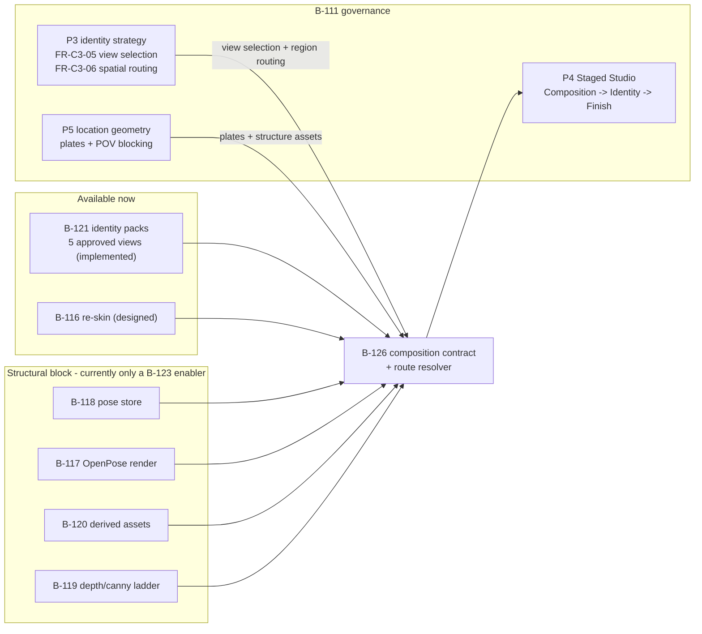
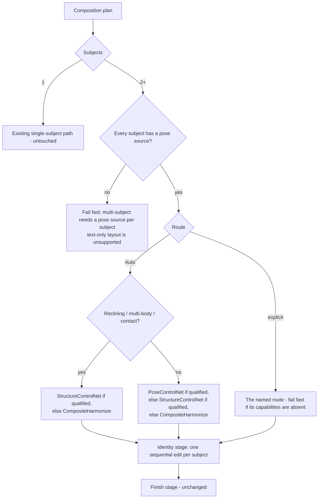

# B-126 — Multi-character scene composition: N subjects, each with its own pose, in one location

**Status:** proposed design artifact — **no code written under this item**. Drafted 2026-09-21 for owner
review and refinement.
**Priority:** high · **Scope:** large · **State:** `designed` (pending review)
**Owner of:** the multi-subject composition contract, its tool surfaces, and identity *sequencing*.
**Consumes (does not implement):** B-111 P3 (identity strategy seam, angle-aware view selection, spatial routing), B-111 P4 (staged Composition → Identity → Finish studio), B-111 P5 (location geometry, plates, POV blocking), B-117 (pose-conditioned render), B-118 (pose store + DWPose extract), B-119 (route ladder + depth/canny structure routes), B-120 (derived control assets), B-116 (img2img re-skin), B-121 (identity packs — implemented), B-124 (reference model + Asset Manager shell).

> **Program context:** this item is **not** part of the identity → body → LoRA spine
> (`specs/Planning/identity-lora-program-map.md`). It sits inside the **visual layer owned by B-111**, as the
> multi-subject completion of B-111 P4's Composition stage. It consumes the spine's reference machinery and
> needs nothing from B-122/B-123. See **§1b** for the full placement and sequencing.

---

## 1. Purpose

Make this request fully supported in the app, with no hand-run scripts and no direct database writes:

> *Two (or more) named characters, each in a specific pose, positioned deliberately, in one coherent
> location — with each character's own identity preserved.*

### 1a. What "fully supported" means (this is the acceptance bar)

1. The user can express the request **as data** (which characters, which pose each, where each sits, which
   location) in the UI, and that data persists.
2. Every stage is a **tool the user invokes**, and the user can stop after any stage and take over with a
   different tool. There is no "generate 30" and no single magic button
   (`identity-lora-program-map.md` §1b principles 1–2).
3. The **tools available** are capability-gated by what the configured provider/model can actually do, and
   results are **qualification-proved** per model. A missing capability fails fast with a named diagnostic;
   nothing silently substitutes a weaker path.
4. Adding a new tool or a new model is a **data action** (Model Manager capability declaration + a
   qualification proof), not new code in this feature.
5. The produced frame carries **provenance** for every applied stage.

### 1b. Where this fits in the program and roadmap

Two coordination documents govern this area. This item has to slot between them without claiming either
one's concerns.

| Level | Document | What it owns | This item's relationship |
|---|---|---|---|
| Visual layer | `B-111-consistent-visual-production/` | The whole image generation / editing / visual-consistency layer — it **supersedes** that layer of `multimodal-production-program-roadmap.md` | A **consumer and completer** of B-111's staged studio, not a new program |
| Identity spine | `identity-lora-program-map.md` | B-124 → B-121 → B-122 → B-123 (pack → body → LoRA) | **Outside** the spine. Consumes packs/views from B-121 (already implemented); needs nothing from B-122/B-123 |

**The four seams already exist — consume them, do not rebuild them:**

| Existing requirement | Owner | This item's relationship |
|---|---|---|
| **FR-C3-05 angle-aware view selection** — pick the stored view nearest the target head angle. B-111 records that this "restores the documented-but-absent resolver" and that four of five stored views are currently unused | **B-111 P3** | **Consume.** This is exactly the view auto-match this plan had listed as gap G4 / Phase 6. **Struck from this item's build scope** (§10 Phase 6) |
| **FR-C3-06 multi-character spatial routing** — regions **derived from the composition**; applied in P4 as "Identity stage as region-routed application over an approved composition" | **B-111 P3** (mechanism) / **P4** (application) | **Consume.** This item supplies the composition the regions are derived from (per-subject position + `VisibleLocator`); B-111 owns the routing |
| **Location geometry, canonical location plate, shared blocking across POVs** | **B-111 P5** (absorbs B-097 / B-032 P3) | **Consume** as route inputs: `LocationPlateAssetId` / `LayoutReferenceAssetId` point at P5-derived plates and B-120 structure assets |
| **Composition → Identity → Finish staged screens** | **B-111 P4** (absorbs B-103/B-105/B-106/B-110) | This item's composition contract and route resolver live **inside** this stage model; the Identity stage gains sequencing for multi-referenced edits |

**In one line:** this is the **multi-subject completion of B-111 P4's Composition stage**, plus the
**capability-gated route resolver** that finally exposes the structural block as *product* routes.

**Roadmap consequence worth deciding on.** The structural block — B-118 → B-117 → B-120 → B-119 — is
currently justified **only** as a producer of B-123's pose-controlled and forced-layout training cells.
`identity-lora-program-map.md` §2 states it is "**not** on the critical path" and becomes load-bearing "only
for *pose-controlled* and *forced-layout* training cells, which are a quality improvement to the training
set, not a prerequisite for it". B-119 is `designed`, medium/medium. This item gives that block a **second,
product-level consumer**, which means its priority is understated: multi-character posed composition is a
headline app feature, not merely a training-data enabler.

**Agreed and actioned 2026-09-22:** B-117, B-118, B-119 and B-120 raised to `high` in the backlog; an
amendment recorded in `identity-lora-program-map.md` (with a B-126 ownership row); and a back-reference plus
a multi-subject exit gate added to **B-111 P4** so that phase cannot close while a multi-subject frame is
unrepresentable.

**Sequencing** — this item needs B-121 (have it), B-111 P3 (view selection + region routing), a pose source
(B-118) and either a structure route (B-117 C2 / B-119 C1) or the composite route (C3, available today).
It does **not** block on B-122 or B-123.



---

## 2. Evidence base

This plan is grounded in a working, local, end-to-end proof completed 2026-09-21 — not speculation.
Four bases (bedroom/outdoors × pose A/B) were produced with two characters, each with its own pose and its
own identity.

| Finding | Status | Evidence |
|---|---|---|
| **The *editor* identity instruction mis-renders a second reference as an extra figure, while the face-only instruction does not** | **Isolated 2×2, 2026-09-21** | `artifacts/tmp/b126-repro-app-identity/` — see the trigger matrix below |
| **Sequential single-reference passes fix it** — one edit per character, chaining each output into the next pass's source; the first character's identity survives the later pass | **Proven** | `runs/dual-location-local-fast/07-identity/<base>/step1-Becky/` → `step2-Dean/` → `final.png`; tool `helpers/local-comfyui-host/run-sequential-identity.ps1` |
| **Matching the reference view to the head in frame works** — woman `ProfileLeft` in pose A / `ProfileRight` in pose B, man `ProfileRight` in both | **Proven visually** | per-character contact sheet `artifacts/tmp/identity-ab/face-check-v2.png`; the man's identity is an unambiguous match in all four |
| The runner and the app submit the **same** identity edit request | **Pinned by test** | `SceneImageServiceJobTests.BuildFaceOnlyIdentityInstructionIsPinnedForTwoCharacterIdentityPass` |
| A whole pipeline of this shape runs **locally** on the 5080 (XLabs FLUX + FLUX OpenPose ControlNet) | **Proven** | `specs/image-generator-tests/dual-base-location/LOCAL-RUN.md`; 28 steps in 29 s after the VRAM fix |
| A face-detector face *count* is not evidence of an added person | **Verified trap** | MediaPipe false-positived on a tattooed forearm; filter to boxes whose bottom edge is above the head line |

**Honest caveat that shapes this plan.** The proof's staging route was *render each figure separately →
cut out → composite → harmonize* — which is entry **#6** in `B-119`'s toolbox list, described there as
*"most labor, weakest fusion realism"* and explicitly **not recommended as an app route**. The spec's
preferred structural route is ControlNet over a whole-scene structure (#1). The composite route proved the
**identity handling** and is worth keeping as *a* route; it must not become *the* pipeline.

**Third-face trigger isolated — it is the INSTRUCTION, not the reference count or the reference view
(2026-09-21).** A controlled 2×2 on `outdoors-a`, **two references in ONE edit**:

| Instruction builder | References | Result | Artifact |
|---|---|---|---|
| `BuildFaceOnlyIdentityInstruction` — the **Studio** action | canonical Front ×2 | **clean** | `00592` / `00593` |
| `BuildFaceOnlyIdentityInstruction` | Profile ×2 | **clean** | `00595` |
| `BuildEditorIdentityInstruction` — the **editor** path | canonical Front ×2 | **extra face tiled into the frame** | `00594` |
| `BuildEditorIdentityInstruction` | Profile ×2 | **extra face** | `00578`–`00581` |

Conclusions, and the correction of two earlier claims in this document:

1. The **Studio** identity action is **not** affected. It has never been observed to add a figure, and its
   builder reproduced clean here.
2. The **editor** identity path **is** affected — `EnqueueEditorIdentityAsync` → `BuildEditorIdentityInstruction`,
   driven by the face picker in `ImageEditWorkspace`. This is a real app path, not a harness artifact: the
   harness runs the app's own builder verbatim.
3. The reference **view** (Front vs Profile) is **irrelevant** to the failure.

An earlier revision of this plan asserted "the app has this bug" (wrong — only one of its two paths does) and
then "it is only a harness finding" (wrong — the harness used the app's own editor builder). Neither claim
was supported because the variable had not been isolated. §12 records the lesson.

**The two instruction texts, side by side — this is the actionable difference.**

Unsafe, `BuildEditorIdentityInstruction` (editor path — produced the extra face):

> Apply the face of the person shown in Picture 2 to the woman at image right facing left. Keep that person's
> facial identity consistent with Picture 2 **for the entire image**; do not change anyone else. […] Keep the
> pose, bodies, position, clothing, lighting, and everything else in the image exactly unchanged **except the
> selected faces**.

Safe, `BuildFaceOnlyIdentityInstruction` (Studio path — clean):

> […] **The additional approved face images are identity references only, not replacement images or
> composition sources.** […] **Do not copy the reference image framing, background, body, pose, clothing, or
> lighting.** Do not add, remove, move, restyle, or otherwise alter anything outside the selected character
> face regions.

The unsafe text tells the model to apply the reference face *"for the entire image"* and never forbids
treating the reference as a composition source. The safe text carries both prohibitions. Phase 1c adds the
missing clauses to the editor text.

---

## 3. Current state

### 3a. Already built (reuse; do not duplicate)

| Capability | Where |
|---|---|
| Multi-angle identity packs: 5 approved face views per character | `SceneImageReferenceFaceView` (`Front`, `ThreeQuarterLeft/Right`, `ProfileLeft/Right`); pack approval requires **all five** approved (`CharacterImageIdentityRepository.ApproveAsync`) |
| Per-face reference **selection** (the caller may pick any approved view/asset) | `SceneImageProductionService.ResolveCharacterIdentitySelectionsAsync` (takes `ReferenceAssetId`), `ResolveIdentityReadinessAsync` (falls back to canonical only when no selection is supplied) |
| Identity edit with a per-face **area** (`VisibleLocator`) + N image references | `SceneImageService.EnqueueEditorIdentityAsync` → `BuildEditorIdentityInstruction`; refs wired `image(i+2)` via `LoadImage` node `20+i` (`ComfyUIImageEditingClient`) |
| Face-only identity edit (Studio path, canonical Front, no area) | `SceneImageService.EnqueueIdentityAsync` → `BuildFaceOnlyIdentityInstruction` |
| Capability-gated pose-conditioned render, with qualification proof + adapter ref + default strength | `PoseImageModelResolver` (strategy token `PoseControlNet`), `ResolvedPoseImageModel`, `SceneImageRenderingJobHandler.RenderPoseControlledAsync`, `ComfyUIPoseConditionedImageClient` |
| A single pose reference attached to a render | `SceneImageStudioSettings.PoseReference` (`StoragePath`, `Strength`) |
| Pose library model + store | `PosePreset` (COCO-18 keypoints, skeleton PNG, thumbnail, `KnownGood`, provenance) |
| Production group with `Composition` / `Identity` / `Finish` stages + approval decisions | `SceneImageProductionGroup`, `ApprovedSceneFrameDecision` |
| Attempt chain + provenance columns | `SceneImageRecord` (`SourceImageId`, `RegenerateOfId`, `ProductionStage`, `Disposition`, `IdentityReferenceBindingsJson`, `AppliedReferenceBindingsJson`) |

### 3b. Missing for the feature (the gaps this item closes)

| # | Gap | Today's reality |
|---|---|---|
| G1 | **The editor identity instruction is unsafe with 2+ references** — it tiles the extra reference into the frame as a new face. The Studio path's instruction is safe, so only the editor path needs sequencing | `EnqueueEditorIdentityAsync` + `BuildEditorIdentityInstruction` (face picker in `ImageEditWorkspace`). Isolated 2×2 in §2 |
| G2 | **No multi-subject composition data** | `PoseReference` is *one* image for the whole render; the production group has POV and camera intent but **no subject list, no poses, no positions** |
| G3 | **No route selection / capability-gated routing for layout** | one pose path exists; the depth/canny, re-skin and composite routes are absent |
| G4 | **No automatic reference-view matching** | the app *can* use any view, but nothing reads the head angle in the frame to choose it; `SceneImageHeadAngleResolver` exists only in specs |
| G5 | **The Studio cannot name a face area or pick a view** | only the advanced editor workspace (`ImageEditWorkspace.razor`) can |
| G6 | **No location reuse** | no location-plate concept (B-116/B-120 territory) |
| G7 | **No composite/harmonize operation** | the proven staging route has no app equivalent |

---

## 4. Design principles (binding on this item)

1. **Tools, not pipelines.** Each stage is separately invokable on the current image, with the composition
   plan as shared state. The user may leave the feature at any stage and continue by hand.
2. **Flexibility contract — routes are additive.** Every approach (structural ControlNet, composite,
   re-skin, native multi-reference, cloud) is a *route* selected by capability. New routes and new tools are
   added without repointing anything existing.
3. **Configured values only, no fallbacks.** Missing capability/qualification fails fast with an explicit
   diagnostic naming what to configure — mirroring `PoseImageModelResolver`'s existing contract.
4. **Additive.** Existing single-character and single-pose behaviour is untouched; the new behaviour
   activates only when a composition plan with 2+ subjects exists.
5. **Identity is applied LAST**, per subject, and is never fused into a geometry render when a follow-up
   stage exists (B-119 workflow step 5).
6. **Provenance per stage.** Each stage's record keeps its inputs (source image id, pose asset, reference
   bindings) so a frame can be explained and reproduced.
7. **UI-backed behaviour.** No behaviour is hidden in code-only defaults; every control that changes
   behaviour is persisted and editable (`copilot-instructions.md`).

---

## 5. Composition contract (the core of this item)

Proposed new persisted data, owned by this item. Names are proposals for review.

```csharp
/// <summary>How multiple subjects are composed into one frame. Required when SubjectCount > 1.</summary>
public enum SceneCompositionRoute
{
    Auto = 0,                  // resolver chooses the cheapest route whose capabilities are present
    PoseControlNet = 1,        // one render, per-subject skeletons (B-117) — preferred when poses are upright
    StructureControlNet = 2,   // depth/canny from a layout reference (B-119 C1) — preferred for reclining/multi-body
    Reskin = 3,                // layout already exists as an image (B-116)
    CompositeHarmonize = 4,    // stage each subject separately, composite, harmonize (the proven route)
    NativeMultiReference = 5   // one call to a model that natively places multiple references
}

/// <summary>Where a subject's pose comes from. Explicit — never inferred.</summary>
public enum SceneCompositionPoseSource
{
    TextOnly = 1,          // single-subject only; rejected for multi-subject (B-119 §6)
    PosePreset = 2,        // B-118 pose library / 472-pose pack
    DerivedStructure = 3   // B-120 derived control asset (OpenPose skeleton / depth / canny)
}

public sealed class SceneCompositionSubject
{
    public int Ordinal { get; set; }                       // 1..N, contiguous
    public string CharacterId { get; set; } = string.Empty;
    public string TargetKey { get; set; } = string.Empty;  // "man" | "woman" | free key (already used by identity bindings)
    public SceneCompositionPoseSource PoseSource { get; set; }
    public string? PoseAssetId { get; set; }               // PosePreset id or B-120 derived-asset id
    public string? BlockingKey { get; set; }               // left | centre | right | behind | foreground (free text allowed)
    public string? PositionNote { get; set; }              // user's own words, fed to the prompt
    /// <summary>Empty = auto-match the pack view to the head in frame (Phase 6).</summary>
    public SceneImageReferenceFaceView? IdentityFaceView { get; set; }
    /// <summary>Phrase used by the identity edit ("the woman on the right"). Required for the identity stage.</summary>
    public string VisibleLocator { get; set; } = string.Empty;
}

public sealed class SceneCompositionPlan
{
    public SceneCompositionRoute Route { get; set; } = SceneCompositionRoute.Auto;
    public string? RouteReason { get; set; }               // why the user overrode Auto
    public string? LocationPlateAssetId { get; set; }      // B-120/B-116 location reuse
    public string? LayoutReferenceAssetId { get; set; }     // B-119 C1 structure source
    public string? StructureType { get; set; }             // Depth | Canny (required by StructureControlNet)
    public double? StructureStrength { get; set; }
    public List<SceneCompositionSubject> Subjects { get; set; } = [];
}
```

**Persistence.** New nullable column on the production group (`SceneImageProductionGroup.CompositionPlanJson`,
presence-checked `ALTER TABLE` in `SqlitePersistence`, appended last — the repo's established additive
pattern). No new table, no private variant of an existing model (`identity-lora-program-map.md` §1b 6).

**Identity chain (G1).** The identity stage for N subjects becomes **N chained records**:

- step *k* is a `SceneImageRecord` with `Operation = Edit`, `ProductionStage = Identity`,
  `SourceImageId = step k-1's id` (step 1's source is the approved composition frame).
- each step's `IdentityReferenceBindingsJson` holds **exactly one** binding (ordinal 1) — the shape the
  proven runner submits.
- order and chain are recoverable from the `SourceImageId` links; no new ordinal column is required.
- *Open question D4:* whether to also add an explicit `IdentityStepIndex` for cheap querying.

---

## 6. Route model and capability gating

Resolution is a pure function of the plan + configured capabilities. Nothing is guessed.



Routes use the program's letter taxonomy. `A` and `C2` share one mechanism and differ only in *why* it was
chosen (natural vs dictated blocking), so two letters map to one enum value.

| Route | Mechanism | Enum | Required configured capability / gate |
|---|---|---|---|
| **A** | One render; the frame's 2+ people positioned by a 2+ person skeleton; identity via regional IP-Adapter or sequential Qwen | `PoseControlNet` | provider `ImageProtocol.ComfyUi`, model family qualified, `SupportedVisualStrategiesJson` contains `PoseControlNet`, plus a passing qualification with `AdapterRef` + `DefaultStrength` — `PoseImageModelResolver`, **already implemented**, reuse verbatim |
| **B** | Layout already exists as an image → re-skin | `Reskin` | `LocalImg2Img` strategy on a local ComfyUI model (B-116) |
| **C1** | Depth/canny ControlNet from a layout reference (+ regional identity) | `StructureControlNet` | as A, with a `StructureControlNet` strategy + depth/canny adapter qualification; weights installed on the host (B-119 T01) |
| **C2** | Multi-person OpenPose, selected when the blocking is **dictated/awkward** so the skeleton must carry it | `PoseControlNet` | same as A, plus a real multi-person `OpenPoseXL2` skeleton; **upright only** — reclining fails |
| **C3** | Composite + harmonize | `CompositeHarmonize` | local img2img (re-skin) **plus** a segmentation/masking path — *Phase 0 decides the mechanism, see D2*. Must be proven before it can be selected |
| **D** | Cloud native multi-reference (FLUX.2-pro / Qwen-Edit 2511) where a paid result is justified | `NativeMultiReference` | a registered native multi-reference model row |

**Auto's ordering is a preference, not a fallback.** Auto picks the *cheapest route whose capabilities are
configured*; it never degrades a route that was explicitly requested. An explicit route with a missing
capability fails fast naming the missing configuration (repo no-fallback rule).

---

## 7. Stage tools (what the user actually drives)

| # | Tool | Input | Output | Notes |
|---|---|---|---|---|
| 1 | **Compose** (structure) | plan: subjects + poses + blocking + location | a composition frame (`ProductionStage = Composition`) | one render via the resolved route |
| 2 | **Compose** (composite route) | same | a comparable composition frame | its sub-steps (stage each figure → cut → place → harmonize) are individually re-runnable |
| 3 | **Re-skin** | a source image + location + denoise | re-rendered frame | B-116, reused |
| 4 | **Identity** | a composition frame + per-subject locator + view | N chained frames, last = finished identity frame | sequential, one subject per edit |
| 5 | **Finish** | identity frame + intent | finished frame | existing stage, untouched |

Each tool returns a `SceneImageRecord` like every other operation, so attempts, disposition, approval and
the existing review surfaces all keep working.

---

## 8. Identity sub-plan

### 8a. Sequencing the editor path (G1 — confirmed; see the §2 matrix)

The **editor** path is affected and the **Studio** path is not, so sequencing applies to
`EnqueueEditorIdentityAsync` only. Its contract (validated selections, one reference per character) is kept
and only the **dispatch** changes from "one record, N references" to "one record per character, chained":

- record 1's source = the composition frame; record *k*'s source = record *k-1*.
- each record's bindings = one binding (the character's chosen/auto-matched view + its `VisibleLocator`).
- each record's `PromptSnapshot` = the existing `BuildEditorIdentityInstruction` output for that one subject —
  the builder is unchanged, so the pinned test keeps holding.
- the chain's final record is what the Finish stage consumes.

**Acceptance (if it lands):** a 2-character frame renders exactly 2 identity records, and the finished frame
contains exactly the 2 intended faces (no extra figure).

**Studio is left alone.** `EnqueueIdentityAsync` and `BuildFaceOnlyIdentityInstruction` are not changed — the
matrix above confirms their N-reference edit is clean.

*Note:* an earlier revision proposed sequencing the whole identity contract, then withdrew that. Both were
unsupported because the variable had not been isolated. The correction is §2's matrix; the lesson is in §12.

### 8b. Reference view matching (closes G4)

- Phase 6 adds a resolver that reads the head orientation of each subject region in the current frame and
  returns the matching `SceneImageReferenceFaceView` from the subject's **approved pack** (all five views are
  already required at approval).
- `IdentityFaceView` set explicitly on the subject **overrides** the resolver (configured data, not a
  fallback — compliant with the no-fallback rule).
- Auto-match failure fails fast naming the subject and the available views.
- *Open question D3:* auto-match source — the configured VL model (LM Studio is already wired for the
  compiler), landmark-based yaw estimation, or **explicit-only in v1** with auto-match deferred. The proof
  was completed with hand-chosen views, so explicit-only is a legitimate v1.

### 8c. Area (closes G5)

`VisibleLocator` and the editor identity instruction already exist. The work is **UI reach**, not new
machinery: the Studio composition panel must collect the locator per subject.

---

## 9. UI surfaces

| Surface | Change |
|---|---|
| Scene Image Studio | New **Composition** panel: subject rows (character picker, pose picker from the B-118 library / B-120 derived assets, blocking, position note), route control (`Auto` — recommended — or explicit, with the reason required on override), location plate picker, and a per-subject `VisibleLocator` field |
| Scene Image Studio | **Identity chain panel**: shows step 1..N with each step's input → output, lets the user re-run a single step, and shows which view was used per subject (auto or explicit) |
| Studio route display | When Auto resolves, **show the chosen route and why**; when it cannot resolve, show exactly which capability is missing and where to configure it |
| Asset Manager | Pose/derived-asset pickers consume B-118/B-120 stores (no new asset store here) |
| Editor workspace | Unchanged; it already supports per-face selection |

---

## 10. Phases

Each phase is independently shippable. **P1 carries a confirmed, isolated defect in the editor identity path**
(see the §2 matrix).

### Phase 0 — Verification (no code; must complete first)

- **B126-000a** Confirm the capability token + qualification field names for `StructureControlNet`
  (mirror `PoseImageModelResolver`'s `PoseControlNet` handling exactly).
- **B126-000b** Confirm whether a multi-person skeleton image can drive 2 subjects in **one** `PoseControlNet`
  render on the local host, and whether `OpenPoseXL2` holds two skeletons (probe + render).
- **B126-000c** Decide the `CompositeHarmonize` mechanism (**D2**): ComfyUI graph (segment → `ImageCompositeMasked`
  → img2img) versus an in-app deterministic compositor. Verify a segmentation node exists on the host, or plan
  the weight/custom-node install through the pod/host registry rules.
- **B126-000d** Confirm the exact `SceneImageRecord` columns available for chaining (`SourceImageId`,
  `RegenerateOfId`, `ProductionStage`) and whether any step-ordinal column already exists.
- **B126-000e** Confirm how `CompositionPlanJson` is added additively (presence-checked `ALTER`, appended last)
  and which repository reader is ordinal-based and therefore needs care.
- **B126-000f** Confirm the VL/landmark options for head-view matching (**D3**).

**Exit:** a written findings note; no code.

### Phase 1 — Editor identity dispatch: sequence it (G1, confirmed)

**Evidence:** the trigger is isolated (§2). `BuildEditorIdentityInstruction` with 2+ references tiles the
second reference into the frame as an extra face; `BuildFaceOnlyIdentityInstruction` does not. The **editor**
path runs the unsafe builder in the app; the **Studio** action runs the safe one.

**1a. Confirm in-app (before any change).** Run the editor's identity action with two faces selected on a
real 2-character frame and record the result. The harness ran the app's own builder verbatim, so this is
expected to reproduce; the in-app run is what makes it a product defect rather than a harness one.

**1b. Sequence the editor path.** Change the *dispatch* (not the contract): N selections → N chained records,
one reference each, `SourceImageId` linking step *k* to step *k-1*. Instruction builder unchanged, so the
pinned test keeps holding. The Studio path is **not touched**.

**1c. Harden the instruction.** The editor text lacks the explicit "not a replacement image or composition
source" clause that makes the face-only text safe. Adding it is additive wording, pinned by a test, and worth
doing even with sequencing in place (defence in depth for any future single-pass call).

- **Tests:** N=2 produces 2 chained records with one binding each; single-subject behaviour byte-identical to
  today; the pinned instruction test still passes; a fake-client test asserts the second dispatch's source is
  the first record's output.
- **Acceptance:** with two faces selected in the editor, the finished frame contains exactly the intended
  faces and no extra figure.

### Phase 2 — Composition contract + panel (closes G2)

- Domain contract (§5), persistence, repository/reader path, validation (contiguous ordinals, pose source
  required for 2+ subjects, structure fields required for `StructureControlNet`).
- Studio Composition panel; plan persists and round-trips.
- **Tests:** round-trip; every validation rule; single-subject plans unchanged.

### Phase 3 — Route resolution + capability gating (closes G3)

- `SceneCompositionRouteResolver`: Auto ordering per §6, explicit-route fail-fast with a named diagnostic.
- Route display in the UI (chosen route + reason; missing capability named when unresolved).
- **Tests:** each route's resolution given declared/undeclared capabilities; Auto ordering; explicit route
  never silently substituted.
- **Acceptance:** requesting `PoseControlNet` on a model without the qualification fails with the same class
  of message `PoseImageModelResolver` already produces.

### Phase 4 — Per-subject pose composition render (consumes B-117)

- Multi-subject → the `PoseControlNet` route, or the composite route, per Phase 0's findings.
- Per-subject skeleton/derived-asset resolution; provenance recorded (pose asset id per subject).
- **Acceptance:** a 2-subject plan renders a frame with both subjects in their requested poses, on the local
  host, with no manual steps.

### Phase 5 — Structure route (consumes B-119/B-120)

- `StructureControlNet` resolver + plan fields (`LayoutReferenceAssetId`, `StructureType`, `StructureStrength`).
- Depth preferred for reclining/multi-body; canny for edge-locked layouts (B-119 §2).
- **Acceptance:** a reclining 2-subject plan composes from a reference image's depth.

### Phase 6 — Reference-view matching: consume B-111 P3 FR-C3-05 (G4 — **not built here**)

B-111 P3 already owns angle-aware view selection and records that `IdentityControlledRequestCompiler`
currently uses only the canonical face, leaving four of five stored views unused. This item **does not build a
second resolver.** It exposes the per-subject override (`IdentityFaceView`) and consumes P3's selection.

- **Dependency first, verify:** check whether FR-C3-05 is actually delivered. P3's exit gate is unticked in
  `B-111/plan.md`, while the README claims production-surface completion with graph techniques retained as
  "unavailable activation seams". Record the finding either way before wiring.
- **Acceptance (integration, not implementation):** combined with the composition plan's per-subject views,
  the selection reproduces what we chose by hand on the four proved bases (`ProfileLeft` for the woman in
  pose A, `ProfileRight` in pose B, `ProfileRight` for the man in both) — see appendix A.

### Phase 7 — Composite/harmonize route (closes G7)

- Implements the proven staging route as a selectable route with individually re-runnable sub-steps.
- **Acceptance:** reproduces the four proved bases locally, stage by stage, in-app.

### Phase 8 — Location reuse (closes G6)

- Location plate picker + reuse across beats (B-116/B-120).

### Phase 9 — Qualification + docs

- Per-model qualification proofs for each enabled route (the existing `CapabilityQualificationsJson` contract).
- Runbook updates; the manual runner stays as the proof harness, not as the feature.
- **Acceptance:** for each enabled model family × route, a recorded proof id.

---

## 11. Ownership boundaries (explicitly NOT owned here)

| Concern | Owner |
|---|---|
| OpenPose pose-conditioned render + its graph builder + pose picker | **B-117** (this item consumes) |
| Pose authoring, DWPose extract, pose library/store | **B-118** |
| Depth/canny structure route definition + weight installs | **B-119** |
| Derived control-asset extraction + derived-asset store | **B-120** |
| img2img re-skin operation | **B-116** |
| Identity packs, 5 views, promotion, body packs | **B-121 / B-122** |
| Identity strategy seam, angle-aware view selection (FR-C3-05), multi-character spatial routing with composition-derived regions (FR-C3-06) | **B-111 P3** — this item supplies the composition the regions derive from |
| Staged Composition → Identity → Finish screens, composition transparency, shared edit/iterate workbench | **B-111 P4** (absorbs B-103/B-105/B-106/B-110) — this item's contract lives inside it |
| Location geometry, canonical location plate, shared blocking across POVs | **B-111 P5** (absorbs B-097/B-032 P3) — consumed as route inputs |
| LoRA training cells | **B-123** |

**Boundary question D1:** should this be a new item (B-126), or should it be absorbed into **B-119** as its
implementation? Recommendation: **new item**, because B-119 is deliberately a *decision ladder* and a
toolbox, whereas this is a persisted multi-subject contract + tool surfaces + an identity-sequencing fix. If
absorbed, B-119's priority/scope must change (it is currently medium/medium) or the work will be
under-resourced relative to "main feature".

---

## 12. Risks and unknowns

| Risk | Mitigation |
|---|---|
| **Duplicating B-119/B-117/B-120** | §11 boundaries + Phase 0 verification before any code |
| **Attributing a failure to the wrong layer** — made twice on this finding: first "the app has this bug" (wrong path), then "it is only a harness finding" (wrong cause) | Isolate the variable with a controlled matrix *before* attributing. §2 records the matrix; reproduce, don't infer |
| **The composite route's realism ceiling** — B-119 calls it the weakest fusion | Kept as *a* route; structural routes are preferred and Auto orders them first |
| **Two skeletons in one `PoseControlNet` render may not hold** | Phase 0 probes it; the composite route is the fallback *route*, chosen by capability, not a silent degradation |
| **Segmentation mechanism for the composite route is unproven in-app** | D2 + Phase 0c; do not assume rembg exists in the app |
| **Auto view-matching could pick a wrong view and silently degrade identity** | Explicit override + fail-fast; auto-match is opt-in per subject (`IdentityFaceView` null = auto) and only lands in Phase 6 |
| **Large scope** | Phases are independently shippable; P1 carries a confirmed defect and can ship on its own |
| **Detector-based QC can mislead** (the forearm false positive) | Any automated face-count check must filter to head-region boxes; documented in `LOCAL-RUN.md` |

---

## 13. Open questions for review

| # | Question | Recommendation |
|---|---|---|
| **D1** | New item B-126, or absorb into B-119? | New item (§11) |
| **D2** | Composite route implemented as a ComfyUI graph, or an in-app deterministic compositor? | Decide in Phase 0c on evidence |
| **D3** | Auto view-match in v1 (VL / landmarks), or explicit-only first? | Explicit-only in v1; auto-match Phase 6 |
| **D4** | Add an explicit `IdentityStepIndex`, or rely on `SourceImageId` chaining? | Chain only unless querying needs it |
| **D5** | Land the **editor-path** identity sequencing as a standalone fix ahead of the rest of the item? | **Yes** — the defect is isolated and the fix does not touch the Studio path |
| **D6** | Do 2+ subjects always require a pose source (reject text-only layout)? | Yes — B-119 §6 says text-only multi-character layout is unsupported |
| **D7** | Should the Studio expose route overrides at all, or only Auto + diagnostics? | Expose both; override requires a `RouteReason` |
| **D8** | Which model families must be supported first (SDXL only today)? | SDXL/BigLust first, then Pony/FLUX as their graphs are qualified |
| **D9** | Should this item be registered as the multi-subject slice of **B-111 P4**, with a cross-reference added from B-111's P4 scope? | **Agreed 2026-09-22** — kept as its own item (clean dispatch boundary); P4 scope item 11 + a multi-subject exit gate added |
| **D10** | Should the structural block (B-117/B-118/B-119/B-120) have its priority raised now that it has a **product** consumer rather than only B-123's training cells? | **Agreed 2026-09-22** — raised to `high`; `identity-lora-program-map.md` §2 amended (the spine's sequencing is unchanged) |

---

## 14. Validation plan

1. **Unit/contract tests** per phase (resolution, validation, chaining, plan round-trip).
2. **Local render proofs** for each route on the local ComfyUI host, compared against the four proved bases.
3. **Trigger matrix** (instruction × reference view) plus an in-app confirmation run for the editor path.
   Harness artifacts: `artifacts/tmp/b126-repro-app-identity/`.
4. **Qualification proofs** recorded per model family × route in `CapabilityQualificationsJson`.
5. **Full suite green** before any phase is declared complete (repo hard rule).

---

## Appendix A — Reference mapping used in the proof (Phase 6 acceptance baseline)

| Pose | Subject | View | In-frame locator |
|---|---|---|---|
| A (bedroom-a, outdoors-a) | woman | `ProfileLeft` | `image right facing left` |
| A | man | `ProfileRight` | `image left facing right` |
| B (bedroom-b, outdoors-b) | woman | `ProfileRight` | `image right facing right` |
| B | man | `ProfileRight` | `image left facing right` |

## Appendix B — Proof artifacts

| Artifact | Path |
|---|---|
| Local run guide (findings, perf trap, identity section) | `specs/image-generator-tests/dual-base-location/LOCAL-RUN.md` |
| Sequential identity tool | `helpers/local-comfyui-host/run-sequential-identity.ps1` |
| Single-edit runner (app parity) | `helpers/local-comfyui-host/run-local-aio-edit-proof.ps1` |
| Per-character face comparison sheet | `artifacts/tmp/identity-ab/face-check-v2.png` |
| Superseded two-reference results (preserved) | `artifacts/tmp/superseded-two-ref-third-face/` |
| Four proved bases | `specs/image-generator-tests/dual-base-location/runs/dual-location-local-fast/07-identity/<base>/final.png` |

## Appendix C — Prior art this plan must not re-decide

- `specs/Planning/B-119-multi-character-layout-workflow/{plan,workflow}.md` — the route ladder, the
  text-cannot-place-people finding, and the composite route's low ranking.
- `specs/001-rp-prompt-redesign/debug/043` §6 — "a second identity reference adds a person".
- `specs/Planning/B-111-consistent-visual-production/` — F2: multi-character identity bleed is solved by
  **routing**, not strength tuning; regions must be derived from the composition.
