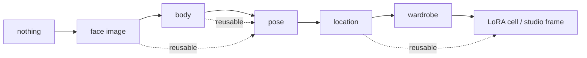

# B-130 — Unified Image Step Composer (spec)

**State:** `designed` — this spec + `plan.md` + `tasks.md` are the plan. Implementation starts at `tasks.md` B130-001.
**Created:** 2026-09-25
**Supersedes:** the UI half of `B-129-qwen-2-1-default-composer-editor.md` §5.1–§5.4 and `B-128-qwen-image-2-1-app-integration.md` §5.3 U2/U3 (they remain the engine/strategy record).
**Related:** B-032, B-100, B-103, B-106, B-110, B-111, B-121, B-122, B-123, B-124, B-126, B-127, B-128 (DWPose Studio), B-129.

---

## 1. The problem

Composing an image is implemented **seven times**, and the seven do not agree on anything:

| Surface | Prompt | Model source | References |
|---|---|---|---|
| `PoseLibraryPage.razor` (test a pose) | free textarea | `IPoseTestRenderService.ListModelsAsync` → `PoseTestModelChoice` | pose skeleton only, implicit; **persists nothing** |
| `LoraDatasetWorkspace.razor` (shoot a cell) | composed from a template, **read-only** | `ReferenceWorkflowSettings.LoraCellModelId` | face + body **auto-resolved**, shown as badges |
| `SceneImageStudio.razor` (production) | editable + negative | `_selectedProductionModelId` (**no UI selector exists**) | `ReferenceApplyPanel` — Finish stage only |
| `CompositionComposer.razor` | two style tabs (NL / Pony) | `_selectedModelId` | `ReferenceApplyPanel` + a separate pose block + identity-on-create |
| `SceneImageCompose.razor` | editable | `_selectedModelId` | **no reference panel at all**; identity checkbox only |
| `PromptAssetCreator.razor` | free textarea | `_modelId` | `ReferenceApplyPanel` |
| `ImageEditWorkspace.razor` | workbench revisions | editor model | `ReferenceApplyPanel`, hardcoded strategy list |

They diverge for five structural reasons:

1. **Four unrelated model-choice types** (`PoseTestModelChoice`, `SceneImageModelChoice`, editor choices, `_models`), so "the model" is not one concept.
2. **Three unrelated reference mechanisms** — auto-resolved (LoRA), implicit single skeleton (pose test), and `ReferenceApplyPanel` (everything else).
3. **Prompt ownership differs** — free text, LLM-drafted-then-edited, or composed-and-read-only. There is no shared notion of "the prompt for these bindings".
4. `ReferenceApplicationSelection` has **fixed element keys** (`Identity`/`Body`/`Wardrobe`/`Location`) and **no ordering**.
5. **2.1-specific behaviour is scattered** — the sampler-envelope hide lives in one page, the style tabs in another, and `MaxReferences`/`Resolution` appear nowhere in the UI.

Consequence: a capability added to one surface silently does not exist on the other six, and the operator sees "totally different compose images" depending on which page they are on.

---

## 2. The unit: a step

The thing that is common is **not a form**. It is a *step that produces one image*:

```
(optional SOURCE image) + (REFERENCE SLOTS) + (PROMPT) + (MODEL) → IMAGE
```

and that image is then one of: the **source** of the next step, a **reference** for a later step, or the
final artifact. Every one of the seven surfaces is that shape; they differ only in which source, which
references are pre-filled, and where the result goes.



The chain starts **empty**, then one face image, and every later artifact is built on the previous ones.
Artifacts are reusable: a pose render becomes a reference for a later step.

**The host supplies a blueprint** — pre-filled slots, the source, the persistence target, and whether the
step may batch. The component never assumes "face + body" or "pose only".

---

## 3. Locked design decisions

These were settled with the operator on 2026-09-25. Do not re-litigate them.

| # | Decision |
|---|---|
| D1 | **One component for every composing surface**, including the edit workspace. |
| D2 | The unit is a **step** (§2). Host-supplied blueprint; no surface-specific logic in the component. |
| D3 | **Qwen-Image-2.1 is the default model**, and the surface **re-forms by capability**. A model with no native-reference capability gets a **structurally different surface — the slot list is ABSENT, not disabled**. |
| D4 | **Prompt adaptation is authoritative removal.** A filled slot removes the corresponding payload elements through the proven `ScenePromptOverridesApplier` + `ScenePromptRemovalNotice` path. Both extremes must work: **fully text** and **fully referenced**. |
| D5 | Changing a binding **marks the prompt stale**; the operator regenerates. Structural removals are deterministic either way. |
| D6 | A slot may bind **any registered reference**: approved assets **and unapproved scratch renders from this chain**. |
| D7 | Reference **sources are host-declared**: pose-library skeleton, approved scene asset, scratch render from the chain, character pose asset. |
| D8 | **Character pose asset** is a first-class primitive: character × pose × wardrobe state, **built up over time**, selectable in the production studio **for any RP session**. Includes a generation flow that renders a whole pose library for one character (face + body, clothed and unclothed). |
| D9 | The **pose slot takes a skeleton**. A photoreal pose render is **not** a pose donor — measured, it is reproduced wholesale — it becomes a character pose asset or a step source. |
| D10 | **POV and lighting are text/camera controls**, not image slots. POV comes from the studio. |
| D11 | **Face and Body are separate slots**, both pre-filled when the host wants both, with visible ordering. |

---

## 4. Slot → prompt mapping (D4's contract)

A filled slot removes the elements the image already supplies, so the prompt never re-describes them.

| Slot | Binds | Payload scopes removed |
|---|---|---|
| **Character pose** | character pose asset | that character's appearance, build, clothing **and** position |
| Face | approved face / scratch face render | the character's appearance line |
| Body | body reference | build / proportions |
| Pose | **skeleton** (pose library) | stance / position wording |
| Location | approved location asset | location + environment prose |
| Wardrobe | wardrobe asset | clothing prose |
| POV / lighting | *text only* — no slot | n/a |

Existing scopes accepted by `ScenePromptOverridesApplier`: `scene.*`, `moment.*`, `frozenState.*`,
`continuity.<block>.*`, `character:{key}.*` (unknown scope throws — fail fast, do not widen silently).

---

## 5. Measured constraints this design must respect

Evidence packages are cited; do not design against them.

1. **Region-targeted editing works only through `VAEEncodeForInpaint`** — the 2.1 encoder has no mask input, and masking its latent destroys everything outside the mask. Contained: 0.319 mean diff outside the mask vs 19.86 for an unmasked control (62×). `CASE-21-region-masked-edit.md`. Also: an **unmasked** 2.1 edit regenerates the whole frame — masking is what pins everything else.
2. **≤ 6 references is the validated budget for a pose-carrying composition.** At 10 the pose reference is ignored whichever slot it holds, and anatomy breaks when the skeleton is last. The declared `MaxReferences: 16` is **unsupported**. `CASE-22-reference-count-ceiling.md`.
3. **`resolution: 0`** ("keep each reference at its own size") is supported and works; the app currently rejects it.
4. **A reference image copies its CLOTHING STATE** — a bare-shouldered reference made a clothed render come out nude. Character pose assets and body references must therefore be **state-matched**, which is why D8 carries a wardrobe-state dimension.
5. **An empty-room reference takes the composition** — with a wide frame the room became the subject and the second figure was dropped. Framing and reference count interact.
6. **A reference's head angle dominates the requested pose** — the picker must surface which pack view is bound.
7. **A photoreal full body in a slot is REPRODUCED, not a pose donor** (`CASE-03`).
8. A **skeleton in a slot is pose guidance**, decisive even against the prompt (`CASE-05`).
9. **Location reproduction is semantic, not pixel-faithful** (≈7.7 vs ≈2.4 mean abs diff on the composite-from-base path) — continuity-critical shots keep the composite route.

---

## 6. Non-negotiables

- **No silent strategy downgrade.** An unqualified strategy fails with an explicit message before submission.
- **No reference is ever dropped to make a render succeed.** (This is the defect B130-001 fixes.)
- **Ordering is user data**; the engine normalises but reports.
- **No fallback/default values** for model capability, budgets or thresholds — configured values only, fail fast when missing (`roleplay-engine-no-fallback`).
- Default model is **persisted config**, never hardcoded.
- `.razor` edits follow `.github/instructions/razor-editing.instructions.md` (full-context reads, micro-step diffs).

---

## 7. Dependencies and open questions

**Dependencies**

- **B-127 (identity keyed to the Character template)** — required for D8's "usable from any RP session". Identity is currently keyed to the *scenario instance*, so a pose library built in one session would be invisible in the next.
- **B-124** — the shared workspace owns the edit path (one-edit-path rule) and the asset shell.
- **B-121/B-122** — the identity/body pack assets the Face and Body slots bind.

**Open questions to close during B130-004/005**

1. ~~Where do character pose assets live — a new store, or `SceneAssets` with a new `SceneAssetType`?~~ **DECIDED (operator, 2026-09-25): `SceneAssets` with a new `SceneAssetType.CharacterPose`, appended to the enum.** The `Type` column persists the enum **name** (verified: `ProductionReconciliationService` parses it with `Enum.TryParse<SceneAssetType>`), so a new member cannot disturb existing rows. Significant simplification: a pose asset inherits the approval / production-version / sha256 validation, the asset tree, `ReferencePicker` and `ProductionApprovalForm`, and travels through the **same `ReferenceApplicationSelection` channel** the render already revalidates — so the Pose slot needs **no second reference mechanism**, which was the largest hidden cost of the new-store option. Column mapping in `plan.md` §2.3. *Sub-question this creates* (settle in B130-018): "which pose" has no typed column — `ViewDescriptorJson` is the user-defined-view pattern (B-129 §5.1) and `BodyState` already carries clothed/unclothed, but measured constraint 4 makes wardrobe state part of the lookup and a JSON descriptor filters poorly in SQL.
2. Does the batch library render honour `CASE-22`'s ≤6 ceiling, and what is the blocking gate before a generated pose asset becomes selectable?
3. Does the prompt-adaptation removal apply to *every* host, or is it opt-in per blueprint? (Recommendation: every host, because a removed element is data the operator can see.)
