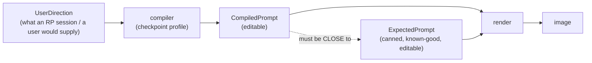

# B-135 — Image Playground (spec)

**State:** `designed` — this spec + `plan.md` + `tasks.md` are the plan. Implementation starts at `tasks.md` B135-001.
**Created:** 2026-09-29
**Route:** `/playground`
**Related:** B-032, B-100, B-103, B-111, B-116, B-117, B-119, B-120, B-121, B-122, B-123, B-124, B-126, B-127, B-128, B-129, B-130, B-131, B-132, B-133, B-134.

**Prerequisites**

- **B-130** — the unified step composer (`ImageStepComposer.razor`). **P1–P5 are DONE**: all seven composing surfaces migrated. This feature builds directly on it.
- **B-127** — identity keyed to the Character template. Required for per-character LoRA comparison: identity is currently keyed to the scenario *instance* (Dean's history is split 8 builds / 1 build across two instances), so a run keyed on instance ids fragments the proof history the same way.
- **B-130 P6** — character pose assets. Required for library renders (D8).

---

## 1. The problem

Six verified gaps, each with its own evidence:

1. **There is no place to run an experiment.** Composing an image is one component now, but there is no first-class object for a *suite*, a *run*, a *verdict* or a *comparison*. Every proof is a bespoke PowerShell/Python harness under `specs/image-generator-tests/**` or `helpers/runpod/**`, with evidence as committed PNGs + `manifest.json` + a hand-written `FINDINGS.md`. Nothing is repeatable from the app and nothing accumulates.

2. **Compilers are keyed by model FAMILY, so there is no per-checkpoint nuance.** `ISceneImagePromptCompilerRegistry.Resolve(SceneImageModelFamily family, SceneImagePromptDialect dialect)` — BigLust and Juggernaut share `SdxlSceneImagePromptCompiler` (one `SdxlSceneImagePromptBuilder`). Worse, **Qwen-Image-2.1 and FLUX both inject the SDXL builder**; the code says so itself: *"the shared natural-language system prompt is SDXL-branded; a FLUX-grounded system prompt is a documented follow-up."* So Qwen-2.1 — which needs long, detailed prompts — currently gets an SDXL-shaped brief, and BigLust/Juggernaut get no checkpoint-specific shaping at all.

3. **Compiler output cannot be proven.** Nothing pins *"this user direction compiles to this prompt"*. The only defence is a human reading the Studio draft. The bug this misses actually shipped on 2026-09-24: with Qwen-2.1 selected, the Studio's "Generate Prompt" returned `score_9, score_8_up, ... rating_explicit, 1girl, ...` into a natural-language draft, because the Qwen compiler had injected the SDXL builder.

4. **Negatives were purged as values, not as a capability** — so they keep coming back. SDXL/BigLust/Juggernaut/FLUX/FLUX.2/Qwen-2.1/API all resolve to empty today, but `SceneImageStudioSettings.NegativePrompt` is still a live field, the Studio still offers a negative textbox, `ISceneImagePromptCompiler` still exposes `CanonicalNegativePrompt`/`BuildNegativePrompt`, and the standards doc still sanctions negatives in §3.2/§3.3/§4.

5. **Pose text does not work on SDXL-family and Pony for complex or multi-person poses**, and nothing enforces that. The canon already says it (§2.6: plain-text multi-person attribute separation works *"only some of the time (~75%)"*, and *"the reliable structural fixes are regional prompting and ControlNet OpenPose/Depth for pose and composition — not a prompt-string tweak"*). Pony's file reports the same class of failure (`two female → one figure`). Today the compiler still tries.

6. **No comparison.** `/review-compare/{BatchId}` compares two images **inside one batch**. Baseline-vs-LoRA, checkpoint A-vs-B, workflow A-vs-B and settings sweeps have no surface.

---

## 2. The unit: a cell

A cell is one testable claim about the app. It carries **two prompts**, and **either can drive the render**:

That shape gives three things at once:

- **Compiler fidelity** — `CompiledPrompt` must satisfy the profile's rules *and* be close to `ExpectedPrompt`.
- **Compiler quality** — both prompts render the same cell at the same seed, so the real question ("does the compiled prompt perform as well as the hand-authored one?") is answerable instead of assumed.
- **A curated standard** — the `ExpectedPrompt` catalog *is* the researched target output shape per checkpoint. The external research (§6) produces canned prompts; the compiler is iterated until compiled ≈ canned; the renders prove it.

`UserDirection` is deliberately the **RP-session shape** (the moment/beat text the pipeline actually receives), so a cell can be captured from a real session or a past render — turning a production defect into a permanent regression cell.

---

## 3. Locked decisions

Settled with the operator on 2026-09-29. Do not re-litigate.

| # | Decision |
|---|---|
| D1 | This is **not a parallel proof harness**. It is first-class application code — composition, editor, common components. It **tests the application** *and* **runs proofs**. |
| D2 | Tests must be **repeatable**, with **longer-term visibility**. Run history is retained and can be **purged**. |
| D3 | Only the **general flows and prompts** are copied from the existing proofs and image-generator-tests: the prompt catalogs, the settings/negative/seed policies, and the multi-step flows. **Not** the images, **not** the findings prose. |
| D4 | Suites and cells are **persisted, versioned, authored in DB/UI**. |
| D5 | The Playground is the **lab alongside** the existing hosts — they keep their blueprints. |
| D6 | Comparisons required: **baseline ↔ character LoRA · checkpoint A/B · Comfy workflow A/B · model family · settings sweep**. |
| D7 | **Enforced gates:** region containment · pose agreement · subject/presence/sanitisation. **Advisory (visual):** eyes/head-angle · identity-consistency. A lopsided eye is judged visually. |
| D8 | The Playground may also drive **LoRA dataset cell shooting** and **whole-library pose renders**. |
| D9 | **Promote** = **copy + keep the link**, to: LoRA dataset member · asset library item image · identity pack view. |
| D10 | **Negatives: purged everywhere, with Pony as the one cited deviation.** The negative is **profile-scoped and citation-required**; a profile may declare a non-empty negative only with recorded external research. The Studio's free-text negative field and `SceneImageStudioSettings.NegativePrompt` are **removed**. |
| D11 | The **compiler LLM is pinned** (model + temperature + seed) and declared as a run variable, so compiler cells are repeatable. |
| D12 | **"Close to expected"** = mandatory **property checks** (dialect, budget, required components, forbidden tokens) **plus** similarity to `ExpectedPrompt` **≥ a per-cell configured tolerance**. Never a default, never a global constant. |
| D13 | `ImageCompilerProfiles` — **one row per checkpoint** (not per family; not per checkpoint × workflow — the workflow is a separate run variable). |
| D14 | Run scope: **a single cell or a batch**. Both. |
| D15 | Playground v1 = everything-exposed step · save-as-recipe · route switch · batch/sweep runner · chain view. |
| D16 | **Playground and Proof are the same surface.** A proof cell opens in the playground. One route: `/playground`. |
| D17 | **Every host binding axis is passable and explicit**, per axis as **text \| reference \| adapter**: identity (text / reference image / IP-Adapter / character LoRA) · pose (text / skeleton reference / ControlNet adapter) · location (text / reference image / depth-canny control) · wardrobe (text / reference) · POV and lighting (text/camera only). |
| D18 | **Pose-in-text capability is a profile rule.** A cell needing a complex or multi-person pose with no structural source is **REFUSED**, naming what is missing. No silent substitution. |
| D19 | The cell carries `UserDirection` **and** `ExpectedPrompt`; **each is user-modifiable** and **both can generate the image**. |
| D20 | **One cell kind, three assertion layers.** Prompt and Request assertions are **free** (they inspect what the app already built); the Image layer is the paid, optional one. |

---

## 4. Assertion layers

The cell type is not chosen. The free layers always run.

| Layer | Asserts | Cost |
|---|---|---|
| **Prompt** | `UserDirection` → compiler → the prompt obeys the profile (dialect, budget, required components, forbidden tokens, pose-in-text rule) and is close to `ExpectedPrompt` (D12) | free |
| **Request** | the step → the request the app actually built: every declared binding present, the resolved strategy honoured, LoRA resolved at the declared strength, no silent downgrade | free |
| **Image** | the render → enforced gates (D7) + the operator's visual verdict | GPU |

The Request layer is the one that catches the defects this repo has actually had: a dropped reference, a capability that is not real, a render mode derived from a stale checkbox.

---

## 5. Compiler profiles (D13)

One row per checkpoint. A profile declares:

| Field | Purpose |
|---|---|
| `Dialect` | natural language / Pony tags / edit instruction / ordered-subject structure |
| `PromptBudget` | min–max characters and tokens. **BigLust and Juggernaut: small, low-detail. Qwen: large, detailed.** |
| `RequiredComponents` | what must appear (subject, count, clothing when clothed, camera/view, lighting, quality tokens for Pony) |
| `ForbiddenTokens` | story names · relations · ownership · `no X` negations · POV character in frame |
| `PoseInText` | `Forbidden` \| `SimpleOnly` \| `Full` (D18) |
| `Negative` + `NegativeSource` | **empty by default**; a non-empty negative requires the citation (D10) |
| `SettingsEnvelope` | sampler / scheduler / steps / CFG / resolution / CLIP skip |
| `SystemPrompt` + `Examples` | the compiler's own grounding, with **externally sourced** examples (governance rule 9) |

Seed profiles: **BigLust v1.6 · Juggernaut XL Ragnarok · Pony Realism v2.3 ULTRA · Pony V6 XL · Qwen-Image-2.1 · FLUX.1-dev · FLUX.2 · API models**.

**BigLust has no author-written prompt guide** (already documented), so its profile can only come from our own measured A/B — which is this feature. The research gap and the Proof area are the same project.

`PoseInText` per the canon: **BigLust/Juggernaut `Forbidden`** for complex or multi-person poses · **Pony `SimpleOnly`** · **Qwen/FLUX/API `Full`**.

---

## 6. Non-negotiables

- **No "just get an image" compiler changes.** Governance rule 1. Every change implements a documented best practice for the target checkpoint and is explainable in one sentence beginning *"The model docs say…"*.
- **No silent strategy downgrade**, and **no reference is ever dropped to make a render succeed**. An unqualified route fails with an explicit message before submission.
- **No fallback or default values** for capability, budgets, tolerances or thresholds — configured values only, fail fast when missing.
- **The negative is profile-declared only** — no compiler, settings object or UI path may inject one (D10).
- **The compiler LLM is pinned** for any cell whose assertion depends on its output (D11).
- One canonical measurement per gate: the C# gate must reproduce the **same measurement** the approved tool defines, never a re-derived heuristic. `tools/eye-validation` exists precisely because Haar boxes, dark-region centroids and Hough circles are proven wrong on photoreal faces.
- `.razor` edits follow `.github/instructions/razor-editing.instructions.md`.

---

## 7. Open items to close during the build

1. **Similarity measure** for D12 — token-set overlap vs normalized edit distance vs both. Must be deterministic (no embedding model; identity/adherence embeddings are advisory only, D7).
2. **Sweep declaration shape** — does a cell declare a seed *list* and a settings *range*, or does the run declare the sweep and multiply the cell set? (Affects how a verdict is attributed: per cell, or per cell × point.)
3. **Specimen capture (B135-021)** — from an RP moment, the `UserDirection` comes from the beat/moment text. Confirm whether the *expected* prompt is authored fresh at capture time or derived from the render that actually succeeded.
4. **Suite versioning semantics** — a suite version is frozen once a run exists; editing a cell creates a new version. Confirm that a run may never be retargeted to a newer suite version.
