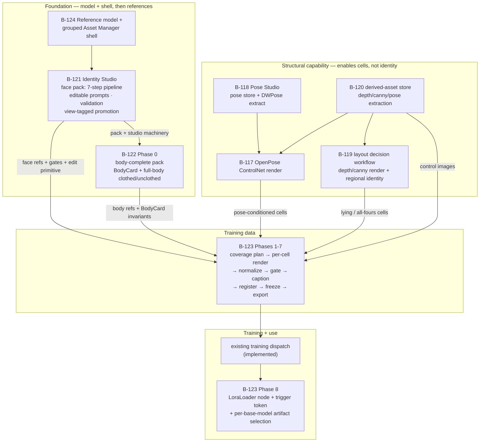

# Identity → Body → LoRA Program Map

**State:** Active coordination plan. **Created:** 2026-09-11.
**Purpose:** make B-117 / B-118 / B-119 / B-120 / B-121 / B-122 / B-123 flow together toward one
outcome. These items are **not merged** — each keeps its own plan and numbering. What they lacked was
the connective tissue: a single owner per concern, an explicit seam contract at each hand-off, and a
sequence.

**Governs:** cross-item ownership and sequencing for the character-identity workstream.
**Foundation:** `identity-and-reference-model.md` defines the reference model (view sets, body
views, grouping) and the component stack; it controls where any plan touches the reference data
model or the Asset Manager.
**Does not override:** B-111 (`consistent-visual-production`) for the general visual-production layer,
or an individual item's internal requirements. Where this map and a local plan disagree **on ownership
or sequencing**, this map controls until the local plan is reconciled.

---

## 1. The outcome

> A character has an **approved, body-complete identity** (face **and** body, clothed **and**
> unclothed) that produces an **in-app-trained LoRA, usable at inference, for one or more base
> models** — with no hand-run scripts and no direct database writes.

Two distinct products, and it matters that they are distinct:

| Product | What it is | Owner |
|---|---|---|
| **Identity references** | Curated images of the person: 5 face views + full-body multi-angle (clothed + unclothed). Drives IP-Adapter/identity-conditioned renders and *is* the training set. | B-121 → B-122 |
| **LoRA artifact** | A trained adapter per base model, plus the inference wiring that makes it usable. | B-123 |

A LoRA cannot be trained before the references exist, and it is worthless if it cannot be loaded.
That is the whole spine of the sequence below.

---

## 1b. Principles (binding on every item in this map)

1. **Tools, not pipelines.** Every capability is a UI tool the user drives. The user assembles each
   LoRA checkpoint image as an exercise (create / edit / pose / model / several attempts) — never a
   batch. A "generate 30" action must never exist.
2. **A tool is done only when it produces a visible image the user judged.** Persisting a row without
   a working artefact in the UI is the "wireframe form" failure mode this map exists to prevent. If a
   tool only writes to the database and shows nothing, it is not complete.
3. **Entry point is the front face profile (B-121 Step 1).** Everything else branches from it.
4. **One base model first, generic machinery always.** The first LoRA targets one model; every piece
   of infrastructure, UI, component and workflow is built base-model-agnostic so model #2 is a data
   action (new training profile → new artifact), not new code.
5. **NSFW in scope end-to-end.** Unclothed body refs and nude cells are first-class, not a special
   case bolted on later.
6. **Foundation first.** The reference data model and the Asset Manager shell (B-124) are built
   before any feature stage. Features consume the stable schema and shell; they never define a slice
   of either as a side effect. This is why B-124 is stage 1.

## 2. Stage flow

**Reading the graph:** the vertical spine (B-124 → B-121 → B-122 → B-123) delivers the stated
outcome. The structural block (B-118 → B-117 → B-120 → B-119) is **not** on the critical path for a
face/body identity pack — it becomes load-bearing only for *pose-controlled* and *forced-layout*
training cells, which are a quality improvement to the training set, not a prerequisite for it.

---

## 3. One concern, one owner  ← the core of this consolidation

Several concerns are claimed by more than one item. These are the resolutions.

| Concern | Owner | Others | Boundary rule |
|---|---|---|---|
| **Face/eye-landmark measurement capability** | **B-121** | B-122, B-123 consume | B-121 builds the subprocess wrapper for `tools/eye-validation/measure_iris.py` **once**, with the manual-override gate. B-122/B-123 call it; neither builds a second implementation nor a .NET port. |
| **Reference-asset quality gating** (sharpness bar, density, aspect, eye gate, yaw convention) | **B-121** | B-122 extends to body invariants | B-121 gates *references*. B-122 adds *body* invariants (marks present/placed, proportions consistent across views). No overlap. |
| **Training-cell quality gating** (face count, identity vs canonical, near-duplicate, pose adherence, diversity) | **B-123** | — | Different concern from reference gating; B-123 owns it entirely. Neither item builds the other's scorer. |
| **Same-image identity edit primitive** (Qwen edit: garment removal, crop-adjacent edits, face/body normalize) | **B-121** (the call path + prompt template store) | B-122, B-123 reuse | B-123's Phase 3 normalization **reuses** B-121's edit primitive and template store. It does not build a parallel edit path. |
| **Prompt template store** (editable, seeded, scope-resolved) | **B-121** | B-122, B-123 reuse | Keys are namespaced by target + step so body/cell prompts are additional seeded rows, not a second store. |
| **Pose store + DWPose extract** | **B-118** | B-120 stores derived skeletons; B-123 consumes | B-118 owns authoring/extraction/library. B-120 owns the *derived-asset* record that holds a produced control image. B-123 owns only the *picker UI* that reads the library. Three different things. |
| **OpenPose ControlNet render** | **B-117** | B-119, B-123 consume | B-119 explicitly does not duplicate it. B-123 does not build it either. |
| **depth/canny ControlNet render + layout decision workflow** | **B-119** | — | |
| **Derived-asset store + extraction jobs** | **B-120** | B-118 shares the pose store; B-119/B-116/B-117 consume | |
| **LoRA dataset, coverage plan, captions, freeze, training hand-off** | **B-123** | — | |
| **LoRA inference** (`LoraLoader` node, trigger-token injection, artifact selection) | **B-123** Phase 8 | — | Recorded because B-107 (the historical home) is **not registered in the backlog**; superseded-map shows B-107 absorbed into B-111 P3. Any remaining "B-107" reference must resolve to B-123 Phase 8. |
| **Reference model + Asset Manager shell (grouping + surfacing)** | **B-124** | — | B-124 owns the reference data model (`ViewDescriptorJson`, canonical body) **and** the grouped shell. It is stage 1 — the foundation every other stage stores into and navigates through. See `identity-and-reference-model.md` §2/§4. |

### Ownership corrections applied to the local plans

| Plan | Said | Corrected to |
|---|---|---|
| B-123 backlog row + plan | "**Owns** its missing prerequisites (B-117 ControlNet render, B-118 pose store/DW extract, B-120 derived assets)" | **Depends on and sequences** them. "Owns" meant "makes them necessary and schedules them" — building another item's scope inside B-123 would duplicate B-119/B-120, which explicitly claim those areas. B-117/B-118/B-120 remain separate items. |
| B-122 plan prerequisite table | "In-app face-landmark / eye check — B-121 (gap) **/ this plan**" | **B-121 only.** B-122 consumes it; it does not re-implement it. |
| B-122 plan prerequisite table | "Pose store + DW extract — B-118, `new`, none in-app — **What this plan builds**" | B-122 **depends on** B-118; it does not build the pose store. |

---

## 4. Seam contracts

Each hand-off is a concrete artifact list, so "flows together" is checkable rather than aspirational.

### 4.1 B-121 → B-122 (Phase 0) — the feed the user asked for

**B-121 must deliver, and B-122 must consume unchanged:**

| B-121 artifact | Why B-122 needs it |
|---|---|
| The resumable step pipeline (build record + per-step rows + per-step re-run) | Body refs are produced by the same kind of multi-step, ~11-minute-per-pass work; without the pipeline, B-122 re-implements it. |
| The prompt-template store (seeded, editable, scoped, reset-to-default) | Body prompts become **additional seeded rows keyed by target kind**, not a second store. |
| The eye/face-landmark subprocess capability + manual override | B-122 Phase 0.4 extends the *discipline* to body invariants; B-123 Phase 4 reuses the call. |
| The quality gate (`ReferenceImageQualityAnalyzer` thresholds) | Reference gating is shared. |
| **View-tagged promotion into identity packs** (`SceneImageReferenceFaceView` carried per artifact) | B-122's full-body views need the same tagging; today face promotion hardcodes `Front`. |
| The same-image edit primitive + editor-model resolution | B-123 Phase 3 normalization reuses it. |

**Design requirement this imposes on B-121 (add before implementation):** the pipeline must be
**target-extensible**. The target kind (character face → character body → wardrobe) selects the step
set and the template-key namespace. B-122 Phase 0 must be expressible as *a new target kind with new
seeded templates and new validation rules* — **not** as a second pipeline. If B-121 hardcodes the
five face views, B-122 is forced to fork the studio and the two will drift.

### 4.2 B-122 → B-123

**B-122 delivers:** the `BodyCard` (shape/build/skin/body-hair/tattoos/scars/grooming, all `[DECIDE]`
items resolved and recorded), full-body multi-angle references in **both** clothed and unclothed
states, and body-invariant validation results.

**B-123 consumes:** the BodyCard as the single source of truth pasted into every training-generation
prompt, and the body references as the conditioning/normalization source for body cells.

**Hard precondition:** no training cell may generate before the BodyCard `[DECIDE]` items are fixed —
otherwise the set trains an inconsistent body and the whole dataset is wasted.

### 4.3 B-118 / B-117 / B-120 / B-119 → B-123

| Producer | Delivers to B-123 |
|---|---|
| B-118 | Pose library + `PosePreset` store + DWPose extract client + head-keypoint validation rule (nose + neck + both shoulders present) |
| B-117 | OpenPose ControlNet render path + model capability declaration + strength |
| B-120 | Derived-asset store (versioned, approved, provenance-tracked) + extraction jobs |
| B-119 | The layout decision workflow for forced/awkward layouts (lying, all-fours, multi-body) + depth/canny render path |

B-123's coverage plan **consumes** these per cell; it does not own them.

---

## 5. Sequencing — component readiness

Ordered by **component readiness**: a stage starts only when the components its tools depend on
exist. **The reference data model and the Asset Manager shell come first** — features build on a
stable schema, they never define it as a side effect.

> **The backlog numbers are allocation order, not build order.** The first thing built is **B-124**
> (reference model + Asset Manager shell), then **B-121**. B-117/B-118/B-119/B-120 are built *after*
> the identity and body stages — they are the pose and structure tools used while generating LoRA
> cells (stage 8 below), not the starting point. Do not read the number as the sequence.

| # | Stage | Components the user gets | Blocks on |
|---|---|---|---|
| 1 | **B-124** | Reference model (view descriptors + canonical body) **and** the grouped Asset Manager shell | — |
| 2 | B-121 | Front source → Validate → De-clothe → Crop → Enhance → Angles → Promote | B-124 model |
| 3 | B-122 Phase 0 | BodyCard editor + body ref tools + body validation | B-124 model, B-121 machinery |
| 4 | B-118 | Pose Studio: search / extract / edit / **save new** / **apply** | — |
| 5 | B-117 | Pose-conditioned render + strength UI | B-118 |
| 6 | B-120 | Derived-asset extraction (depth / canny / segmentation) | — |
| 7 | B-119 | Layout render + decision workflow | B-120 |
| 8 | B-123 Ph1–7 | Coverage editor + cell workspace + normalize + gates + captions + freeze | B-124, B-121, B-122, B-118, B-117 (B-119/B-120 only for layout cells) |
| 9 | B-123 Ph8 | LoRA use (LoraLoader + trigger + per-model artifact picker) | a trained artifact |

**Rationale for the order:**

- **B-124 first** — the reference data model and the grouped shell are the foundation every later
  stage stores into and navigates through. Building features first would force each one to define a
  slice of the schema, and they would drift.
- **B-121 second** — the entry point (front face profile) and the producer of shared *pipeline*
  machinery, now consuming the already-stable model instead of defining it.
- **B-122 Phase 0 third** — the BodyCard is a hard precondition for any training cell.
- **B-118 → B-117 before B-123's cell workspace** — the user applies poses *during* cell creation.
- **B-120 → B-119** are needed only by layout-controlled cells (lying / all-fours); they can land
  during B-123.
- **B-123 Phase 8** is small and blocks nothing else.

**Parallelism that remains safe:** B-118 (stage 4) and B-120 (stage 6) depend on nothing and may
start in parallel with B-124; B-117 (stage 5) starts once B-118 lands.

---

## 6. Gaps that block clean execution

| # | Gap | Impact | Resolution needed |
|---|---|---|---|
| G1 | **B-117 and B-118 have no design artifacts anywhere on disk** — yet B-119, B-120 and B-123 all cite them as canonical ("do not duplicate"). B-117 is `designed`, B-118 is `new` in the backlog with no file. | A coding agent cannot implement or even size them; B-123's plan assumes they exist. | Either write both plans, or explicitly fold them into the items that own them and re-point the citations. **RESOLVED 2026-09-11:** keep them separate — B-118 is the Pose Studio, B-117 is the pose-conditioned render. Their plans now exist (`B-118-pose-studio/plan.md`, `B-117-pose-controlnet-render/plan.md`); B-123 depends on them. |
| G2 | **B-107 is not in the backlog**, but B-121/B-122/B-123 text references it for LoRA qualification/activation. | Dangling reference; the inference gap could be re-opened by someone "implementing B-107". | Treat LoraLoader/trigger-injection as **B-123 Phase 8**; record the B-107 → B-111 P3 absorption. |
| G3 | **Pose store claimed three times** (B-118 library, B-120 derived assets, B-123 T04). | Likely triple implementation or silent divergence. | Resolved by §3: B-118 owns the store, B-120 owns derived records, B-123 owns the picker only. |
| G4 | **Eye/face-landmark capability claimed by B-121 and B-123.** | Two implementations of a validator the repo forbids re-deriving. | Resolved by §3: B-121 only. |
| G5 | **"LoRA for one or more models" is structurally supported but not specified as a flow.** `CharacterLoraDataset`, `CharacterLoraTrainingProfile` and artifact records all carry `TargetModelFamily` / `BaseModelId` / `BaseModelVersion` / `BaseModelSha256` (verified in `CharacterLoraModels.cs`), so the machinery exists. | Without an explicit flow, "more than one model" will be treated as an afterthought: one dataset, N profiles, N artifacts, and inference that picks the artifact by base model. | Add to B-123: the dataset is base-model-agnostic (images + captions); a **training profile per base model** produces a **separate artifact**; inference must select the artifact whose `BaseModelId`/`Sha256` matches the render model, and fail fast when no artifact matches. |
| G6 | **B-122 and B-123 share one plan file** (`B-122-.../plan.md`, titled "B-122 / B-123"), but are two backlog items. | Task numbering and "done" state can blur between them. | Keep the shared file, but every task must declare which item it closes. |

---

## 7. Status (verified 2026-09-11)

| Item | Backlog state | Design artifact | Notes |
|---|---|---|---|
| B-117 | `designed` | plan | Stage 5; consumes B-118 |
| B-118 | `designed` | plan | Stage 4 |
| B-119 | `designed` | plan + workflow + tasks | Structurally independent of the identity spine |
| B-120 | `designed` | plan + tasks | Consumed by B-117/B-119/B-116 |
| B-121 | `planned` | README, spec, plan, tasks, ui-contract, seed-prompts | **Plan only — handoff ready; no code** |
| B-122 | `planned` | shared plan (Phase 0) | Phase 0 hard-blocks B-123 |
| B-123 | `planned` | shared plan (Phases 1–8) | Owns B-123 Phase 8 inference wiring |
| B-124 | `planned` | plan | **Stage 1 — the foundation (reference model + Asset Manager shell)** |
| B-111 P2 | — | tasks | Already absorbed B-108; much of the reference-bootstrap machinery is **implemented** (see B-121 `plan.md` "Verified current state") |

---

## 8. Decisions (answered 2026-09-11)

1. **B-117/B-118 — RESOLVED: keep them as separate items.** B-118 is the **Pose Studio** (search the
   library, extract from an image, edit the 2D skeleton, save new, apply) and B-117 is the
   **pose-conditioned render** (pick pose + model + strength → one render). These are exactly the
   interactive pose tools described; folding them into B-123 would bury the pose workflow inside the
   LoRA studio and duplicate B-119/B-120's claims. Both plans are now written and B-123 depends on
   them (§5, stages 4–5).
2. **Order — the component-readiness order above (§5).** B-118/B-117 move onto the path before
   B-123's cell workspace, because applying poses per cell is part of the user's exercise.
3. **Base models — one to start; generic machinery always.** Recorded as principle 4 and in B-123
   Phase 8. The second model is a data action, not new code.
4. **NSFW — confirmed in scope end-to-end.** Recorded as principle 5; unclothed body refs and nude
   cells are first-class throughout B-122/B-123.

**Foundation-model decisions (from `identity-and-reference-model.md` §7) — resolved 2026-09-11 with
the recommended approaches:** (1) view model = canonical-slot enum + `ViewDescriptorJson` for the
extended set (up/down pitch, intermediate yaw); (2) body = base+angle canonical minimum +
`BodyRotationDeg`/`BodyPositionKey` free data; (3) **B-124 grouping precedes B-123's cell
workspace**; (4) faceid/IP-Adapter render wiring stays B-111 P3, scoring-CLI wiring is B-123.
