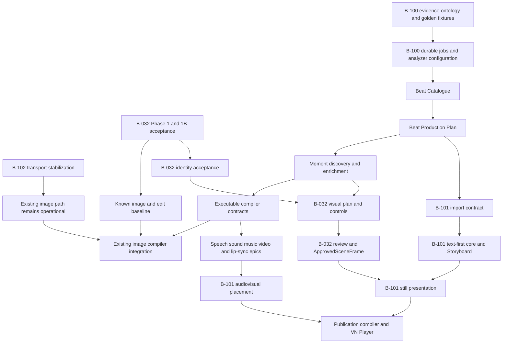

# Multimodal Production Program Roadmap

**State:** Active coordination plan  
**Updated:** 2026-08-31  
**Scope:** current `001-scene-image-generator` branch only; B-032, B-097, B-098, B-099, B-100, B-101, and B-102

> **Evidence boundary:** status and sequencing in this document use only commit `6fd483c` and the
> current dirty worktree. Other branches are intentionally excluded.

## Purpose

This is the sequencing and ownership source of truth for turning authoritative roleplay text into
consistent image, speech, sound, music, video, lip-sync, and Visual Novel output. The individual
epic and phase packages remain authoritative for their internal requirements and tasks. When a
local package appears to imply a different cross-epic dependency or ownership boundary, this
roadmap controls until the local package is reconciled.

The program has two products:

1. **Multimodal production:** B-100 derives one canonical Beat/Moment lineage and compiles complete,
   consistent provider requests. B-032 and separate audio/video generator epics execute those
   requests and return reviewable, versioned assets.
2. **Story presentation:** B-101 selects production records and approved assets, adds presentation
   timing and transitions, publishes an immutable manifest, and plays it without model calls.

## Verified Current State

| Capability | State | Evidence and remaining gate |
|---|---|---|
| B-032 Phase 1 prompt-to-image | Implemented; acceptance open | Image configuration, Beat analysis, Pony/SDXL prompt generation, rendering, persistence, and gallery exist. Manual acceptance task T068 remains. |
| B-098 Pony compiler path | Implemented | Pony-specific LLM prompt builder and workflow path exist. It becomes an adapter behind B-100's compiler contract rather than a second semantic source. |
| B-099 SDXL/Juggernaut compiler path | Implemented | Separate natural-language builder and strict model-family routing exist. The active Serverless work extends transport, not canonical semantics. |
| B-032 Phase 1B vision-aware editing | Implemented in application; acceptance open | Edit sessions, source-aware compilation, provenance, jobs, and workbench exist. Frozen corpus, deployment, and end-to-end exit tasks P1B-009/010 and P1B-036 through P1B-047 remain. |
| B-032 Phase 2 identity | Partially implemented before prerequisite exit | Identity packs, repositories, UI, model resolution, client, render jobs, multi-angle references, and proof work exist. The strict regional identity proof failed four angled cases; the guarded near-frontal path remains viable. P2-023, P2-027, and P2-028 through P2-032 remain. |
| Scene Asset subsystem | Implemented in branch history; workflow expansion open | Reusable assets, generation/edit/profile-pack jobs, Asset Studio UI, persistence, and tests exist. Its ownership must be reconciled with Phase 2 references, Phase 3 location/wardrobe assets, and Phase 4 approved frames before those contracts are frozen. |
| B-097 / B-032 Phase 3 continuity | Planned | Location profiles, canonical visual plans, blocking, shot plans, ControlNet-backed controls, and multi-POV application flow have no confirmed implementation in this branch. |
| B-032 Phase 4 approval/repair | Planned | There is no `ApprovedSceneFrame` implementation. Manual candidate review and accepted-only eligibility are the first useful slice; automated validation and repair remain behind proof gates. |
| B-102 RunPod Serverless migration | Active dirty worktree | Additive `RunPodServerless` image protocol/client, BigLust workflow/registry, DI, Model Manager UI, provider test, and tests are current uncommitted work. BigLust is technically qualified; full qualification and an application round trip remain open. |
| B-100 Beat/Moment production | Designed/planned | Provider evidence and Phases 0-13 are documented. No catalogue, production-plan, Moment, durable-job, analyzer-function, or compiler-registry runtime types exist. |
| Speech, sound, music, video, lip-sync execution | Evidence-backed design only | B-100 defines canonical inputs and compiler projections. Provider adapters, execution jobs, candidate stores, approval flows, and production acceptance need separate epics. |
| B-101 Story Presentation | Designed | No presentation domain, persistence, Storyboard Studio, publication compiler, playback manifest, or Visual Novel Player implementation exists. |

These labels distinguish **implemented** from **accepted**. Checked tasks or existing classes do not
override an unmet phase exit gate.

## Canonical Ownership

| Concern | Owner | Constraint |
|---|---|---|
| RP prose and character/session facts | Existing Roleplay domain | Remains authoritative; this program does not rewrite continuation behavior. |
| Beat boundaries and temporal story events | B-100 | One canonical source; no downstream prose re-analysis. |
| Dialogue, speaker, spoken normalization, performance, ambience, effects, music, action, and video coverage | B-100 Beat Production Plan | Provider-neutral, source-grounded, time-addressable, and versioned. |
| Frozen visual/keyframe state | B-100 Moment enrichment | One exact state, with stable identity, location, wardrobe, props, composition, and continuity references. |
| Provider request compilation | B-100 compiler contracts plus modality-specific compiler epics | Compilers project canonical records; they do not invent missing semantics. |
| Image execution, continuity controls, candidates, review, and approved frames | B-032/B-097 | Rendering completion is not approval. B-101 may place only exact approved versions. |
| Audio/video execution, candidates, review, and approved derivatives | Separate generator epics | Each consumes B-100 inputs and returns immutable derivatives with realized timing/alignment. |
| Sequence, segment, presentation timing, holds, transitions, mix choices, and asset placement | B-101 Story Presentation | Presentation choices only; no production-semantic repair or provider prompting. |
| Publication and playback | B-101 Story Presentation | Immutable manifest; Player has no generation/model dependency. |
| Provider transport and deployment | B-102 and modality infrastructure | Orthogonal to canonical semantics; transport changes cannot redefine prompts or story facts. |

## Program Dependency Graph

B-102 stabilization and B-100 contract work may proceed in parallel. B-032 acceptance and continuity
work may also proceed without waiting for every B-100 phase, but new visual-plan contracts must align
with B-100 Moment identity and lineage before they are frozen.

## Multiphase Delivery Plan

### Program Phase 0 - Planning Hygiene and Baselines

1. Reserve B-101 for Story Presentation and use B-102 for Serverless migration.
2. Keep the current `B-101-serverless-migration` folder temporarily as an active-work compatibility
   path; rename it to `B-102-serverless-migration` only in a clean, dedicated move after the in-flight
   changes are stabilized.
3. Record this capability matrix and link each epic back to it.
4. Treat B-032 Phase 1, Phase 1B, and Phase 2 as implemented-but-unaccepted where their exit evidence
   is incomplete.
5. Freeze the legacy Generate Beats and image-path baseline before B-100 runtime changes.

**Exit:** IDs are unique in the backlog, ownership conflicts are removed, and every active capability
has one stated acceptance gate.

### Program Phase 1 - Stabilize Current Infrastructure

Track A, B-102 Serverless and BigLust:

1. Finish the additive Serverless protocol/client and BigLust workflow without changing direct
   ComfyUI or OpenAI behavior.
2. Close request-shape, polling, cancellation, timeout, malformed-output, dispatcher, and provider
   health-test coverage.
3. Validate Model Manager persistence/UI and one normal plus one BigLust application round trip.
4. Record endpoint, artifact, cold/warm timing, rollback, and reproducibility evidence under the
   RunPod registry/manifest rules.

Track B, B-032 acceptance:

1. Complete Phase 1 manual task T068.
2. Complete Phase 1B corpus/deployment/application exit tasks without a raw-intent or model fallback.
3. Reconcile the already-started Phase 2 implementation with its Phase 1B prerequisite and strict
   regional identity result, then finish its compiler decision, matrix, application, LoRA-decision,
   and exit tasks.

**Exit:** current image generation, source-aware editing, identity conditioning, and Serverless
transport each have explicit passing evidence. None is described as accepted prematurely.

### Program Phase 2 - Freeze Canonical Multimodal Contracts

Execute B-100 Phases 0-3:

1. Complete and date the provider evidence matrix.
2. Freeze shared timing, typed references, identities, dialogue representations, performance intent,
   audio ownership, music structure, visual state, and realized alignment.
3. Build one golden lineage that compiles to Pony, SDXL, FLUX-like image, TTS, sound, music, all video
   coverage kinds, native-audio video, and lip-sync requests.
4. Freeze the sanitized analysis corpus and current latency/validity baseline only after the golden
   fixture exposes no ontology gaps.
5. Define B-100 read contracts that B-032 visual plans and B-101 imports will consume.

**Exit:** every canonical field has evidence and a consumer; every required provider request can be
compiled without rereading RP prose.

### Program Phase 3 - Build Reliable Progressive Analysis

Execute B-100 Phases 4-6:

1. Add durable SQLite jobs, lanes, leases, retry classification, cancellation, recovery, and
   compare-and-set promotion.
2. Add the explicit `RolePlaySceneBeatAnalyzer` function and UI-backed analyzer capabilities,
   assignment, limits, concurrency, retries, and diagnostics policy.
3. Deliver the Beat Catalogue as the first end-to-end vertical slice while retaining a clearly
   labeled legacy read path.

**Exit:** Generate Beats returns a compact persisted catalogue, survives restart, rejects stale
completion, and has one configured analyzer source.

### Program Phase 4 - Deliver Canonical Beat and Moment Production

Execute B-100 Phases 7-9:

1. Enrich one selected Beat into the complete time-addressable Beat Production Plan.
2. Discover only the Moments required for user choice and declared media coverage.
3. Enrich selected Moments into exact frozen-state production records.
4. Expose review-required attribution, continuity, timing, and unsupported-intent findings rather
   than guessing.

**Exit:** one selected Beat and its selected Moments contain all provider-neutral data needed by
image, audio, video, lip-sync, and presentation consumers.

### Program Phase 5 - Compile and Approve Still Images

Coordinate B-100 Phases 10-11 with B-032 Phases 3-4:

1. Implement executable compiler inputs and immutable compiled-request snapshots.
2. Put existing Pony and SDXL/Juggernaut builders behind exact compiler registration.
3. Add location profiles, canonical visual plans, blocking, shot plans, pose/depth controls, and
   multi-POV rendering against exact B-100 Moment versions.
4. Ship B-032 Phase 4's manual candidate set, immutable accept/reject decision, and
   `ApprovedSceneFrame` before automated visual validation.
5. Add automated validator/repair actions only after each configured finding/action pair passes its
   frozen proof corpus.

**Exit:** an enriched Moment produces consistent still candidates; only an exact accepted frame is
eligible for continuity or presentation.

### Program Phase 6 - Add Independent Audio and Video Generators

Create separate backlog epics, in this dependency order:

1. Speech/TTS plus voice identity, pronunciation, immutable spoken text, and realized alignment.
2. Ambience and sound effects with event windows, continuity, loops, and realized durations.
3. Music with ordered sections, duration, transitions, stems/loop intent, and approval.
4. Video generation for Moment hold/action/transition and Beat excerpt/whole-Beat coverage.
5. Lip-sync/performance using approved visual input and approved realized speech alignment.
6. Audio/video validation, bounded repair, and final derivative approval.

Each epic must update the provider evidence matrix, compile only from B-100 records, preserve the
semantic brief separately from provider syntax, and return candidates through its own review and
approval boundary.

**Exit:** each modality produces an approved derivative with complete lineage and realized timing;
cross-modal golden assertions still pass.

### Program Phase 7 - Deliver Story Presentation in Thin Slices

Implement B-101 without waiting for every generator to finish:

1. **Text-first:** presentation domain, import snapshots, authoring, persistence, source-refresh diff,
   text preview, and text-only publication profile.
2. **Still VN:** exact approved-frame placement, intentional hold/text-only policies, and still-only
   publication.
3. **Audio metadata and placement:** voice selection, speech/audio cue placement, timing, captions,
   continuity, mix, and deterministic preview using placeholders or approved assets.
4. **Video placement:** select exact B-100 coverage plans and approved derivatives; validate audio
   ownership to prevent duplicate dialogue/effects.
5. **Publication and Player:** compile one immutable manifest and play it with no model or authoring
   service access.

B-101 may submit generation requests through registered compiler/generator interfaces, but it does
not own canonical prompt construction, provider clients, candidate validation, or asset approval.

**Exit:** text-only, still-only, and full-media revisions publish through the same deterministic
manifest contract and play consistently on desktop/mobile.

### Program Phase 8 - Migration and Retirement

1. Keep legacy schema-v3 Beat analyses and existing image provenance readable.
2. Use dual-read/new-write during B-100 rollout; do not rewrite historical records.
3. Remove legacy one-shot enqueue and checkpoint-name inference only after reference and call-site
   audits pass.
4. Preserve old published B-101 manifests when drafts, production records, or assets change.
5. Retire dedicated RunPod resources only after B-102 cutover and rollback evidence passes.

**Exit:** no active producer depends on superseded paths, while historical records remain readable
and reproducible.

### Program Phase 9 - End-to-End Acceptance

1. Run focused contract, concurrency, persistence, compiler, and UI suites for each completed slice.
2. Run full solution build and full tests with zero failures after implementation changes.
3. Execute one authoritative turn through Catalogue -> Beat Production Plan -> Moment enrichment ->
   image/audio/video compilation -> candidate approval -> Storyboard -> published VN playback.
4. Verify identity, wardrobe, location, props, action order, dialogue, speaker, emotion, timing,
   camera, ambience, effects, and music across all generated requests and approved derivatives.
5. Verify Player navigation/restoration and prove no model call occurs during playback.

**Exit:** the complete lineage is reproducible, stale-write safe, cross-modally consistent, and
usable through the final presentation experience.

## Exact Next-Work Queue

Execute in this order using only the current branch state:

1. **Finish the active B-102 worktree slice.** Complete the Serverless client/dispatcher/provider
   integration and BigLust qualification without changing the established direct-provider paths.
2. **Validate the implementation.** Run focused Serverless client tests, then the full solution build
   and test suite. Complete one ordinary image and one BigLust application round trip and record the
   endpoint/model/provenance evidence.
3. **Close B-032 Phase 1B acceptance.** Finish P1B-009/010, P1B-036 through P1B-042, and P1B-043
   through P1B-047. T068 is a parallel Phase 1 manual acceptance task, not a Phase 1B blocker.
4. **Reconcile Scene Asset ownership.** Map the implemented Scene Asset records/jobs/UI to Phase 2
   identity references, Phase 3 locations/wardrobe, and Phase 4 approval. Reuse the shared asset model
   instead of creating overlapping location or approved-frame stores.
5. **Close the Phase 2 decision and evidence gaps.** Resolve P2-023 in light of the failed angled
   identity cases, add P2-027 handler/provenance coverage, and complete P2-028 through P2-032. Do not
   claim strict identity acceptance unless the frozen matrix passes.
6. **Parallel: freeze B-100 contracts.** Complete B-100 Phases 0-2 and executable golden fixtures
   across image, speech, sound, music, video, native-video audio, and lip-sync. Only then start its
   durable job and Catalogue runtime implementation.
7. **Add manual approval before broad continuity automation.** Implement bounded candidate review
   and immutable `ApprovedSceneFrame`, aligned with Scene Asset, before automated repair or B-101
   still placement.
8. **Then implement Phase 3 and modality generators.** Build location/blocking/multi-POV controls
   against exact B-100 Moment versions, followed by independent audio/video/lip-sync generators.
9. **Implement B-101 last as presentation.** It remains the wrapper/editor/player over exact B-100
   production records and approved assets; it does not become another semantic generation pipeline.

## Change-Control Rules

- A local epic may elaborate this roadmap but may not silently move a concern to another owner.
- New provider adapters require evidence, a registered compiler/capability, request fixtures, and a
  captured production proof; provider documentation alone is not acceptance.
- New behavior controls are persisted and UI-backed. Missing required configuration fails explicitly.
- A phase state advances only when its exit evidence is recorded, not when most code exists.
- Active dirty work is preserved and integrated forward; coordination changes do not overwrite it.
- RP engine continuation, prompt-slot, gate, and pacing changes remain separate and require their own
  analysis, plan, and confirmation.
